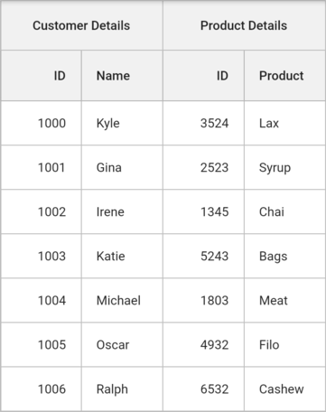
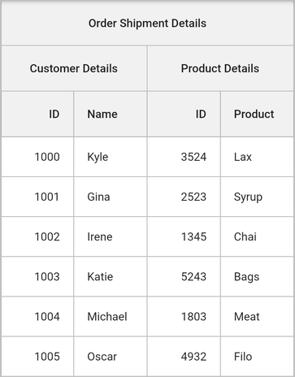
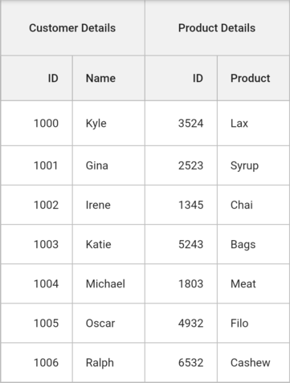

# Stacked headers in Flutter Datagrid (SfDataGrid)

The Datagrid provides support to display additional unbound header rows known as [StackedHeaderRows](https://pub.dev/documentation/syncfusion_flutter_datagrid/latest/datagrid/SfDataGrid/stackedHeaderRows.html) that span across multiple DataGrid columns. This feature allows you to group one or more columns under each stacked header, creating a hierarchical header structure.

Each [StackedHeaderRow](https://pub.dev/documentation/syncfusion_flutter_datagrid/latest/datagrid/StackedHeaderRow-class.html) contains [cells](https://pub.dev/documentation/syncfusion_flutter_datagrid/latest/datagrid/StackedHeaderRow/cells.html) that hold a list of [StackedHeaderCell](https://pub.dev/documentation/syncfusion_flutter_datagrid/latest/datagrid/StackedHeaderCell-class.html) where each `StackedHeaderCell` contains a number of child columns. The [StackedHeaderCell.columnNames](https://pub.dev/documentation/syncfusion_flutter_datagrid/latest/datagrid/StackedHeaderCell/columnNames.html) property returns the columns grouped under the stacked header row. The [GridColumn.columnName](https://pub.dev/documentation/syncfusion_flutter_datagrid/latest/datagrid/GridColumn/columnName.html) is a unique name used for mapping specific child columns grouped under the same stacked header row. The [StackedHeaderCell.child](https://pub.dev/documentation/syncfusion_flutter_datagrid/latest/datagrid/StackedHeaderCell/child.html) property is used to load any type of widget to the corresponding stacked header cell.

> **Note:** Ensure that you have created a [DataGridSource](https://pub.dev/documentation/syncfusion_flutter_datagrid/latest/datagrid/DataGridSource-class.html) (e.g., `_productDataSource`) and configured your data before implementing stacked headers. For more information, refer to the [DataGridSource documentation](https://pub.dev/documentation/syncfusion_flutter_datagrid/latest/datagrid/DataGridSource-class.html) and [getting started guide](../datagrid/getting-started.md).


 

import 'package:flutter/material.dart';
import 'package:syncfusion_flutter_datagrid/datagrid.dart';

  @override
  Widget build(BuildContext context) {
    return Scaffold(
      body: SfDataGrid(
        gridLinesVisibility: GridLinesVisibility.both,
        headerGridLinesVisibility: GridLinesVisibility.both,
        source: _productDataSource,
        columns: <GridColumn>[
          GridColumn(
            columnName: 'orderId',
            label: Container(
              padding: EdgeInsets.symmetric(horizontal: 16.0),
              alignment: Alignment.centerRight,
              child: Text('ID', overflow: TextOverflow.ellipsis),
            ),
          ),
          GridColumn(
            columnName: 'customerName',
            label: Container(
              padding: EdgeInsets.symmetric(horizontal: 16.0),
              alignment: Alignment.centerLeft,
              child: Text('Name', overflow: TextOverflow.ellipsis),
            ),
          ),
          GridColumn(
            columnName: 'productId',
            label: Container(
              padding: EdgeInsets.symmetric(horizontal: 16.0),
              alignment: Alignment.centerRight,
              child: Text('ID', overflow: TextOverflow.ellipsis),
            ),
          ),
          GridColumn(
            columnName: 'product',
            label: Container(
              padding: EdgeInsets.symmetric(horizontal: 16.0),
              alignment: Alignment.centerLeft,
              child: Text('Product', overflow: TextOverflow.ellipsis),
            ),
          ),
        ],
        stackedHeaderRows: <StackedHeaderRow>[
          StackedHeaderRow(
            cells: [
              StackedHeaderCell(
                columnNames: ['orderId', 'customerName'],
                child: Container(
                  color: const Color(0xFFF1F1F1),
                  child: Center(
                    child: Text(
                      'Customer Details',
                      overflow: TextOverflow.ellipsis,
                    ),
                  ),
                ),
              ),
              StackedHeaderCell(
                columnNames: ['productId', 'product'],
                child: Container(
                  color: const Color(0xFFF1F1F1),
                  child: Center(
                    child: Text(
                      'Product Details',
                      overflow: TextOverflow.ellipsis,
                    ),
                  ),
                ),
              ),
            ],
          ),
        ],
      ),
    );
  }




> **Note:** The `columnNames` property must contain valid column names that exactly match the `columnName` properties defined in your grid columns. Column names are case-sensitive, and specifying non-existent column names will result in those columns not being grouped under the stacked header.

## Multi stacked headers

You can create multiple levels of stacked headers by adding multiple `StackedHeaderRow` objects to the `SfDataGrid.stackedHeaderRows` collection. This allows for a more complex hierarchical structure of headers.


 

import 'package:syncfusion_flutter_core/theme.dart';
import 'package:syncfusion_flutter_datagrid/datagrid.dart';

  @override
  Widget build(BuildContext context) {
    return Scaffold(
      body: SfDataGrid(
        gridLinesVisibility: GridLinesVisibility.both,
        headerGridLinesVisibility: GridLinesVisibility.both,
        source: _productDataSource,
        columns: <GridColumn>[
          GridColumn(
            columnName: 'orderId',
            label: Container(
              padding: EdgeInsets.symmetric(horizontal: 16.0),
              alignment: Alignment.centerRight,
              child: Text('ID', overflow: TextOverflow.ellipsis),
            ),
          ),
          GridColumn(
            columnName: 'customerName',
            label: Container(
              padding: EdgeInsets.symmetric(horizontal: 16.0),
              alignment: Alignment.centerLeft,
              child: Text('Name', overflow: TextOverflow.ellipsis),
            ),
          ),
          GridColumn(
            columnName: 'productId',
            label: Container(
              padding: EdgeInsets.symmetric(horizontal: 16.0),
              alignment: Alignment.centerRight,
              child: Text('ID', overflow: TextOverflow.ellipsis),
            ),
          ),
          GridColumn(
            columnName: 'product',
            label: Container(
              padding: EdgeInsets.symmetric(horizontal: 16.0),
              alignment: Alignment.centerLeft,
              child: Text('Product', overflow: TextOverflow.ellipsis),
            ),
          ),
        ],
        stackedHeaderRows: <StackedHeaderRow>[
          StackedHeaderRow(
            cells: [
              StackedHeaderCell(
                columnNames: [
                  'orderId',
                  'customerName',
                  'productId',
                  'product',
                ],
                child: Container(
                  color: const Color(0xFFF1F1F1),
                  child: Center(
                    child: Text(
                      'Order Shipment Details',
                      overflow: TextOverflow.ellipsis,
                    ),
                  ),
                ),
              ),
            ],
          ),
          StackedHeaderRow(
            cells: [
              StackedHeaderCell(
                columnNames: ['orderId', 'customerName'],
                child: Container(
                  color: const Color(0xFFF1F1F1),
                  child: Center(
                    child: Text(
                      'Customer Details',
                      overflow: TextOverflow.ellipsis,
                    ),
                  ),
                ),
              ),
              StackedHeaderCell(
                columnNames: ['productId', 'product'],
                child: Container(
                  color: const Color(0xFFF1F1F1),
                  child: Center(
                    child: Text(
                      'Product Details',
                      overflow: TextOverflow.ellipsis,
                    ),
                  ),
                ),
              ),
            ],
          ),
        ],
      ),
    );
  }




## Changing the row height of stacked headers

You can change the height of stacked header rows using the [SfDataGrid.onQueryRowHeight](https://pub.dev/documentation/syncfusion_flutter_datagrid/latest/datagrid/SfDataGrid/onQueryRowHeight.html) callback. This approach allows you to apply custom heights to specific stacked header rows based on their row index.

Alternatively, you can set a uniform height for all stacked header rows and the column header row by using the [SfDataGrid.headerRowHeight](https://pub.dev/documentation/syncfusion_flutter_datagrid/latest/datagrid/SfDataGrid/headerRowHeight.html) property.

### Using onQueryRowHeight callback

Use the `onQueryRowHeight` callback to apply custom heights to specific stacked header rows. When multiple stacked header rows are present, row indices are numbered sequentially starting from 0 for the first stacked header row.

> **Note:** In the `onQueryRowHeight` callback, stacked header rows are indexed starting from 0. If you have multiple stacked header rows, use the appropriate row index to target each level. For example, if you have two stacked header rows, they will be at indices 0 and 1.


 

import 'package:flutter/material.dart';
import 'package:syncfusion_flutter_datagrid/datagrid.dart';

  @override
  Widget build(BuildContext context) {
    return Scaffold(
      body: SfDataGrid(
        gridLinesVisibility: GridLinesVisibility.both,
        headerGridLinesVisibility: GridLinesVisibility.both,
        source: _productDataSource,
        onQueryRowHeight: (RowHeightDetails details) {
          if (details.rowIndex == 0) {
            return 70.0;
          }
          return details.rowHeight;
        },
        columns: <GridColumn>[
          GridColumn(
            columnName: 'orderId',
            label: Container(
              padding: EdgeInsets.symmetric(horizontal: 16.0),
              alignment: Alignment.centerRight,
              child: Text('ID', overflow: TextOverflow.ellipsis),
            ),
          ),
          GridColumn(
            columnName: 'customerName',
            label: Container(
              padding: EdgeInsets.symmetric(horizontal: 16.0),
              alignment: Alignment.centerLeft,
              child: Text('Name', overflow: TextOverflow.ellipsis),
            ),
          ),
          GridColumn(
            columnName: 'productId',
            label: Container(
              padding: EdgeInsets.symmetric(horizontal: 16.0),
              alignment: Alignment.centerRight,
              child: Text('ID', overflow: TextOverflow.ellipsis),
            ),
          ),
          GridColumn(
            columnName: 'product',
            label: Container(
              padding: EdgeInsets.symmetric(horizontal: 16.0),
              alignment: Alignment.centerLeft,
              child: Text('Product', overflow: TextOverflow.ellipsis),
            ),
          ),
        ],
        stackedHeaderRows: <StackedHeaderRow>[
          StackedHeaderRow(
            cells: [
              StackedHeaderCell(
                columnNames: ['orderId', 'customerName'],
                child: Container(
                  color: const Color(0xFFF1F1F1),
                  child: Center(
                    child: Text(
                      'Customer Details',
                      overflow: TextOverflow.ellipsis,
                    ),
                  ),
                ),
              ),
              StackedHeaderCell(
                columnNames: ['productId', 'product'],
                child: Container(
                  color: const Color(0xFFF1F1F1),
                  child: Center(
                    child: Text(
                      'Product Details',
                      overflow: TextOverflow.ellipsis,
                    ),
                  ),
                ),
              ),
            ],
          ),
        ],
      ),
    );
  }




### Using headerRowHeight property

You can set a uniform height for all stacked header rows and the column header row by using the `headerRowHeight` property. This approach is useful when you want consistent heights across all header levels.


 

import 'package:flutter/material.dart';
import 'package:syncfusion_flutter_datagrid/datagrid.dart';

  @override
  Widget build(BuildContext context) {
    return Scaffold(
      body: SfDataGrid(
        gridLinesVisibility: GridLinesVisibility.both,
        headerGridLinesVisibility: GridLinesVisibility.both,
        headerRowHeight: 60.0,
        source: _productDataSource,
        columns: <GridColumn>[
          GridColumn(
            columnName: 'orderId',
            label: Container(
              padding: EdgeInsets.symmetric(horizontal: 16.0),
              alignment: Alignment.centerRight,
              child: Text('ID', overflow: TextOverflow.ellipsis),
            ),
          ),
          GridColumn(
            columnName: 'customerName',
            label: Container(
              padding: EdgeInsets.symmetric(horizontal: 16.0),
              alignment: Alignment.centerLeft,
              child: Text('Name', overflow: TextOverflow.ellipsis),
            ),
          ),
          GridColumn(
            columnName: 'productId',
            label: Container(
              padding: EdgeInsets.symmetric(horizontal: 16.0),
              alignment: Alignment.centerRight,
              child: Text('ID', overflow: TextOverflow.ellipsis),
            ),
          ),
          GridColumn(
            columnName: 'product',
            label: Container(
              padding: EdgeInsets.symmetric(horizontal: 16.0),
              alignment: Alignment.centerLeft,
              child: Text('Product', overflow: TextOverflow.ellipsis),
            ),
          ),
        ],
        stackedHeaderRows: <StackedHeaderRow>[
          StackedHeaderRow(
            cells: [
              StackedHeaderCell(
                columnNames: ['orderId', 'customerName'],
                child: Container(
                  color: const Color(0xFFF1F1F1),
                  child: Center(
                    child: Text(
                      'Customer Details',
                      overflow: TextOverflow.ellipsis,
                    ),
                  ),
                ),
              ),
              StackedHeaderCell(
                columnNames: ['productId', 'product'],
                child: Container(
                  color: const Color(0xFFF1F1F1),
                  child: Center(
                    child: Text(
                      'Product Details',
                      overflow: TextOverflow.ellipsis,
                    ),
                  ),
                ),
              ),
            ],
          ),
        ],
      ),
    );
  }




> **Note:** When using `headerRowHeight`, the same height is applied to all header rows (both stacked header rows and the column header row). To set different heights for specific header rows, use the `onQueryRowHeight` callback instead.
