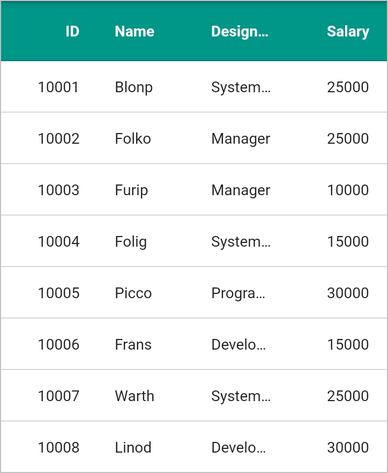
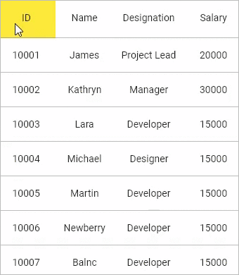
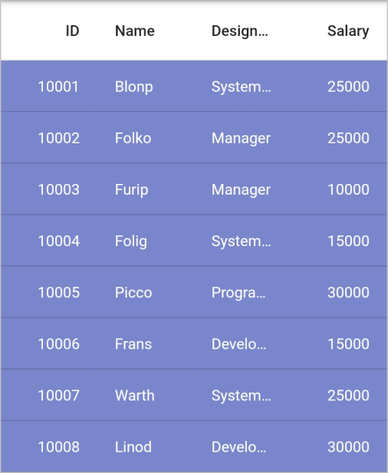
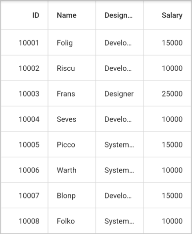
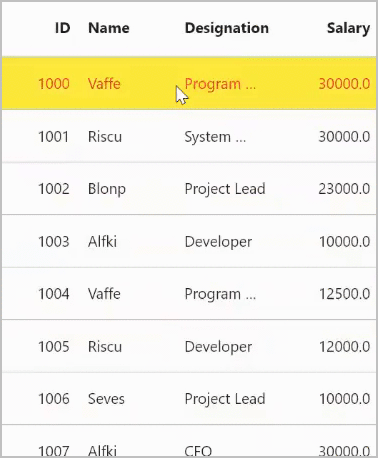
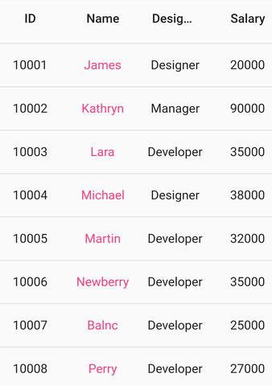

# Styling in Flutter DataGrid (SfDataGrid)

The DataGrid supports to change the appearance of the grid by using the [SfDataGridThemeData](https://pub.dev/documentation/syncfusion_flutter_core/latest/theme/SfDataGridThemeData-class.html) in [SfDataGridTheme](https://pub.dev/documentation/syncfusion_flutter_core/latest/theme/SfDataGridTheme-class.html). The DataGrid should be wrapped inside the `SfDataGridTheme`.

The `SfDataGridThemeData` and `SfDataGridTheme` classes are available in [syncfusion_flutter_core](https://pub.dev/packages/syncfusion_flutter_core) package. So, import the below file,




import 'package:syncfusion_flutter_core/theme.dart';




## Change the header background color

Change the header background color by using [SfDataGridThemeData.headerColor](https://pub.dev/documentation/syncfusion_flutter_core/latest/theme/SfDataGridThemeData/headerColor.html) property.


 

@override
Widget build(BuildContext context) {
  return Scaffold(
      appBar: AppBar(
        title: const Text('Syncfusion Flutter DataGrid'),
      ),
      body: SfDataGridTheme(
          data: SfDataGridThemeData(headerColor: const Color(0xff009889)),
          child: SfDataGrid(
              source: _employeeDataSource,
              columnWidthMode: ColumnWidthMode.fill,
              columns: <GridColumn>[
                GridColumn(
                    columnName: 'id',
                    label: Container(
                        padding: EdgeInsets.all(16.0),
                        alignment: Alignment.center,
                        child: Text(
                          'ID',
                        ))),
                GridColumn(
                    columnName: 'name',
                    label: Container(
                        padding: EdgeInsets.all(8.0),
                        alignment: Alignment.center,
                        child: Text('Name'))),
                GridColumn(
                    columnName: 'designation',
                    label: Container(
                        padding: EdgeInsets.all(8.0),
                        alignment: Alignment.center,
                        child: Text(
                          'Designation',
                          overflow: TextOverflow.ellipsis,
                        ))),
                GridColumn(
                    columnName: 'salary',
                    label: Container(
                        padding: EdgeInsets.all(8.0),
                        alignment: Alignment.center,
                        child: Text('Salary'))),
              ])));
}



## Change the header hover color

Change the color of the header on hovering by using the [headerHoverColor]( https://pub.dev/documentation/syncfusion_flutter_core/latest/theme/SfDataGridThemeData/headerHoverColor.html) property.

N> This is applicable for web and desktop platforms.




@override
Widget build(BuildContext context) {
  return Scaffold(
      appBar: AppBar(
        title: const Text('Syncfusion Flutter DataGrid'),
      ),
      body: SfDataGridTheme(
          data: SfDataGridThemeData(headerHoverColor: Colors.yellow),
          child: SfDataGrid(
              source: _employeeDataSource,
              columnWidthMode: ColumnWidthMode.fill,
              columns: <GridColumn>[
                GridColumn(
                    columnName: 'id',
                    label: Container(
                        padding: EdgeInsets.all(16.0),
                        alignment: Alignment.center,
                        child: Text(
                          'ID',
                        ))),
                GridColumn(
                    columnName: 'name',
                    label: Container(
                        padding: EdgeInsets.all(8.0),
                        alignment: Alignment.center,
                        child: Text('Name'))),
                GridColumn(
                    columnName: 'designation',
                    label: Container(
                        padding: EdgeInsets.all(8.0),
                        alignment: Alignment.center,
                        child: Text(
                          'Designation',
                          overflow: TextOverflow.ellipsis,
                        ))),
                GridColumn(
                    columnName: 'salary',
                    label: Container(
                        padding: EdgeInsets.all(8.0),
                        alignment: Alignment.center,
                        child: Text('Salary'))),
              ])));
}



## Change the row background color

The DataGrid supports to change the row background color by using [DataGridRowAdapter.color](https://pub.dev/documentation/syncfusion_flutter_datagrid/latest/datagrid/DataGridRowAdapter/color.html) property.



import 'package:syncfusion_flutter_datagrid/datagrid.dart';

class EmployeeDataSource extends DataGridSource {
  EmployeeDataSource({required List<Employee> employees}) {
    dataGridRows = employees
        .map<DataGridRow>((dataGridRow) => DataGridRow(cells: [
              DataGridCell<int>(columnName: 'id', value: dataGridRow.id),
              DataGridCell<String>(columnName: 'name', value: dataGridRow.name),
              DataGridCell<String>(
                  columnName: 'designation', value: dataGridRow.designation),
              DataGridCell<int>(
                  columnName: 'salary', value: dataGridRow.salary),
            ]))
        .toList();
  }

  List<DataGridRow> dataGridRows = [];

  @override
  List<DataGridRow> get rows => dataGridRows;

  @override
  DataGridRowAdapter? buildRow(DataGridRow row) {
    return DataGridRowAdapter(
      color: Colors.indigo[300],
        cells: row.getCells().map<Widget>((dataGridCell) {
      return Container(
          alignment: (dataGridCell.columnName == 'id' ||
                  dataGridCell.columnName == 'salary')
              ? Alignment.centerRight
              : Alignment.centerLeft,
          padding: const EdgeInsets.symmetric(horizontal: 16.0),
          child: Text(
            dataGridCell.value.toString(),
            style: const TextStyle(color: Colors.white),
            overflow: TextOverflow.ellipsis,
          ));
    }).toList());
  }
}



## Styling grid lines

The color and thickness of the grid lines can be changed by using the [SfDataGridThemeData.gridLineColor](https://pub.dev/documentation/syncfusion_flutter_core/latest/theme/SfDataGridThemeData/gridLineColor.html) and [SfDataGridThemeData.gridLineStrokeWidth](https://pub.dev/documentation/syncfusion_flutter_core/latest/theme/SfDataGridThemeData/gridLineStrokeWidth.html) properties.


 

@override
Widget build(BuildContext context) {
  return Scaffold(
      body: SfDataGridTheme(
          data: SfDataGridThemeData(
              gridLineColor: Colors.amber, gridLineStrokeWidth: 3.0),
          child: SfDataGrid(source: _employeeDataSource, columns: <GridColumn>[
            GridColumn(
                columnName: 'id',
                label: Container(
                    padding: EdgeInsets.symmetric(horizontal: 16.0),
                    alignment: Alignment.centerRight,
                    child: Text(
                      'ID',
                      overflow: TextOverflow.ellipsis,
                    ))),
            GridColumn(
                columnName: 'name',
                label: Container(
                    padding: EdgeInsets.symmetric(horizontal: 16.0),
                    alignment: Alignment.centerLeft,
                    child: Text(
                      'Name',
                      overflow: TextOverflow.ellipsis,
                    ))),
            GridColumn(
                columnName: 'designation',
                label: Container(
                    padding: EdgeInsets.symmetric(horizontal: 16.0),
                    alignment: Alignment.centerLeft,
                    child: Text(
                      'Designation',
                      overflow: TextOverflow.ellipsis,
                    ))),
            GridColumn(
                columnName: 'salary',
                label: Container(
                    padding: EdgeInsets.symmetric(horizontal: 16.0),
                    alignment: Alignment.centerRight,
                    child: Text(
                      'Salary',
                      overflow: TextOverflow.ellipsis,
                    ))),
          ])));
}
    



## Show vertical and horizontal grid lines

To show the vertical and horizontal gridlines, use the following properties. 

* [SfDataGrid.gridLinesVisibility](https://pub.dev/documentation/syncfusion_flutter_datagrid/latest/datagrid/SfDataGrid/gridLinesVisibility.html): To set the border lines for the cells other than a header and stacked header cells. 
* [SfDataGrid.headerGridLinesVisibility](https://pub.dev/documentation/syncfusion_flutter_datagrid/latest/datagrid/SfDataGrid/headerGridLinesVisibility.html): To set the border lines only for header and stacked header cells.

The following is the list of options available to customize gridlines.

* Vertical
* Horizontal
* Both
* None

The following code describes how to show vertical and horizontal grid lines for the `SfDataGrid`.


 

@override
Widget build(BuildContext context) {
  return Scaffold(
    body: SfDataGrid(
        source: _employeeDataSource,
        columns: <GridColumn>[
          GridColumn(
              columnName: 'id',
              label: Container(
                  padding: EdgeInsets.symmetric(horizontal: 16.0),
                  alignment: Alignment.centerRight,
                  child: Text(
                    'ID',
                    overflow: TextOverflow.ellipsis,
                  ))),
          GridColumn(
              columnName: 'name',
              label: Container(
                  padding: EdgeInsets.symmetric(horizontal: 16.0),
                  alignment: Alignment.centerLeft,
                  child: Text(
                    'Name',
                    overflow: TextOverflow.ellipsis,
                  ))),
          GridColumn(
              columnName: 'designation',
              label: Container(
                  padding: EdgeInsets.symmetric(horizontal: 16.0),
                  alignment: Alignment.centerLeft,
                  child: Text(
                    'Designation',
                    overflow: TextOverflow.ellipsis,
                  ))),
          GridColumn(
              columnName: 'salary',
              label: Container(
                  padding: EdgeInsets.symmetric(horizontal: 16.0),
                  alignment: Alignment.centerRight,
                  child: Text(
                    'Salary',
                    overflow: TextOverflow.ellipsis,
                  ))),
        ],
        gridLinesVisibility: GridLinesVisibility.both,
        headerGridLinesVisibility: GridLinesVisibility.both),
  );
}
    



## Disable the row highlighting

By default, the row highlighting on hovering support is enabled for the web and desktop platforms. Disable the row highlighting by setting the [SfDataGrid.highlightRowOnHover](https://pub.dev/documentation/syncfusion_flutter_datagrid/latest/datagrid/SfDataGrid/highlightRowOnHover.html) property to `false`.

N> This is applicable for web and desktop platforms.


 

@override
Widget build(BuildContext context) {
  return Scaffold(
      body: SfDataGrid(
          highlightRowOnHover: false,
          source: _employeeDataSource,
          columns: <GridColumn>[
        GridColumn(
            columnName: 'id',
            label: Container(
              padding: EdgeInsets.symmetric(horizontal: 16.0),
              alignment: Alignment.centerRight,
              child: Text('ID'),
            )),
        GridColumn(
            columnName: 'name',
            label: Container(
              padding: EdgeInsets.symmetric(horizontal: 16.0),
              alignment: Alignment.centerLeft,
              child: Text('Name'),
            )),
        GridColumn(
            columnName: 'designation',
            label: Container(
              padding: EdgeInsets.symmetric(horizontal: 16.0),
              alignment: Alignment.centerLeft,
              child: Text('Designation'),
            )),
        GridColumn(
            columnName: 'salary',
            label: Container(
              padding: EdgeInsets.symmetric(horizontal: 16.0),
              alignment: Alignment.centerRight,
              child: Text('Salary'),
            )),
      ]));
}
    



## Change the row highlighting background color and text style

Change the row highlighting color and text style by using the [SfDataGridThemeData.rowHoverColor](https://pub.dev/documentation/syncfusion_flutter_core/latest/theme/SfDataGridThemeData/rowHoverColor.html) and the [SfDataGridThemeData.rowHoverTextStyle](https://pub.dev/documentation/syncfusion_flutter_core/latest/theme/SfDataGridThemeData/rowHoverTextStyle.html) properties.


 

@override
Widget build(BuildContext context) {
  return Scaffold(
      body: SfDataGridTheme(
          data: SfDataGridThemeData(
              rowHoverColor: Colors.yellow,
              rowHoverTextStyle: TextStyle(
                color: Colors.red,
                fontSize: 14,
              )),
          child: SfDataGrid(source: _employeeDataSource, columns: <GridColumn>[
            GridColumn(
                columnName: 'id',
                label: Container(
                  padding: EdgeInsets.symmetric(horizontal: 16.0),
                  alignment: Alignment.centerRight,
                  child: Text('ID'),
                )),
            GridColumn(
                columnName: 'name',
                label: Container(
                  padding: EdgeInsets.symmetric(horizontal: 16.0),
                  alignment: Alignment.centerLeft,
                  child: Text('Name'),
                )),
            GridColumn(
                columnName: 'designation',
                label: Container(
                  padding: EdgeInsets.symmetric(horizontal: 16.0),
                  alignment: Alignment.centerLeft,
                  child: Text('Designation'),
                )),
            GridColumn(
                columnName: 'salary',
                label: Container(
                  padding: EdgeInsets.symmetric(horizontal: 16.0),
                  alignment: Alignment.centerRight,
                  child: Text('Salary'),
                )),
          ])));
}



## Change the cell value color

The DataGrid requires a widget for each cell from the user end. Typically, users load the [Text](https://api.flutter.dev/flutter/widgets/Text-class.html) widget to display the cell values. So that, text color can be changed by setting the [TextStyle](https://api.flutter.dev/flutter/painting/TextStyle-class.html) to the style property of the `Text` widget.




import 'package:syncfusion_flutter_datagrid/datagrid.dart';

class EmployeeDataSource extends DataGridSource {
  EmployeeDataSource({required List<Employee> employees}) {
    dataGridRows = employees
        .map<DataGridRow>((dataGridRow) => DataGridRow(cells: [
              DataGridCell<int>(columnName: 'id', value: dataGridRow.id),
              DataGridCell<String>(columnName: 'name', value: dataGridRow.name),
              DataGridCell<String>(
                  columnName: 'designation', value: dataGridRow.designation),
              DataGridCell<int>(
                  columnName: 'salary', value: dataGridRow.salary),
            ]))
        .toList();
  }

  List<DataGridRow> dataGridRows = [];

  @override
  List<DataGridRow> get rows => dataGridRows;

 @override
  DataGridRowAdapter? buildRow(DataGridRow row) {
    return DataGridRowAdapter(
        cells: row.getCells().map<Widget>((dataGridCell) {
      TextStyle? getTextStyle() {
        if (dataGridCell.columnName == 'name') {
          return const TextStyle(color: Colors.pinkAccent);
        } else {
          return null;
        }
      }
      return Container(
          alignment: Alignment.center,
          padding: const EdgeInsets.symmetric(horizontal: 8.0),
          child: Text(
            dataGridCell.value.toString(),
            style: getTextStyle(),
            overflow: TextOverflow.ellipsis,
          ));
    }).toList());
  }
}




