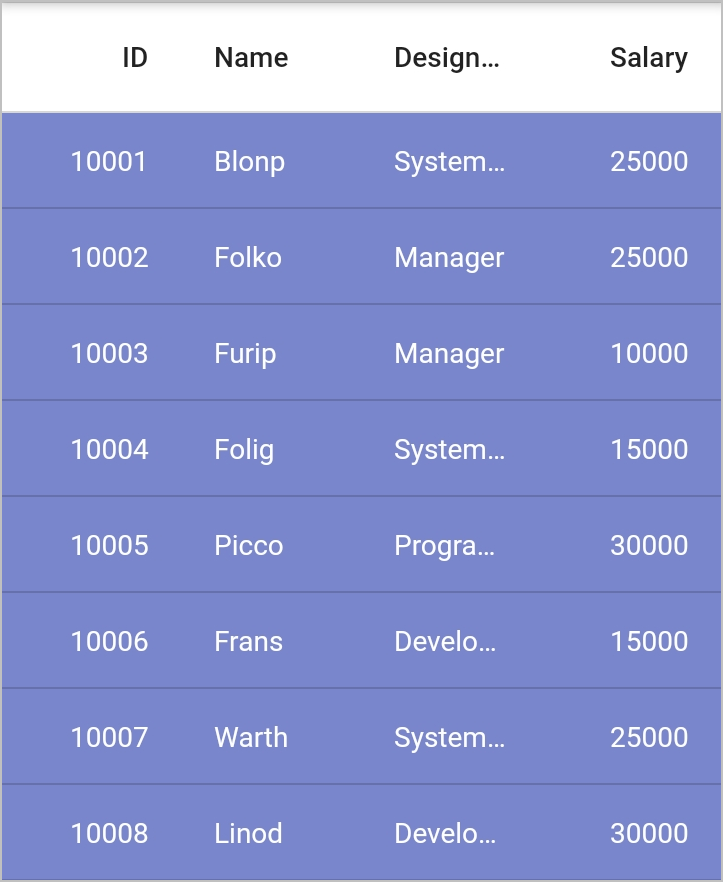
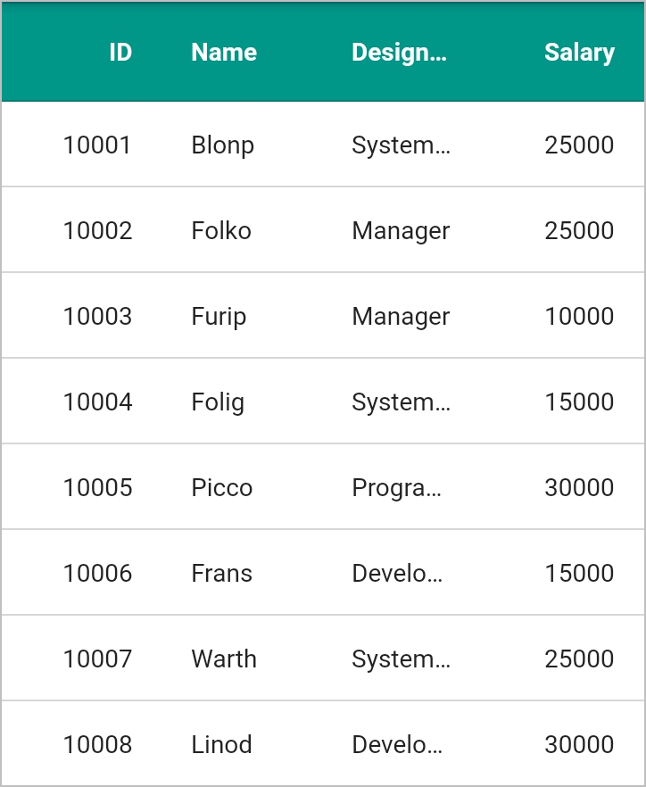
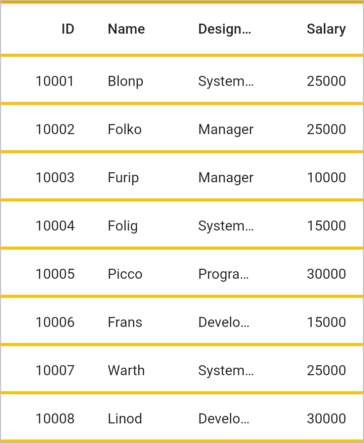
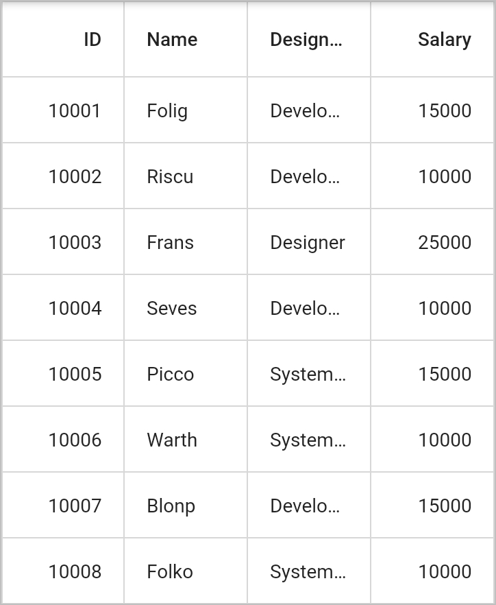

# Styling in Flutter DataGrid

The data grid applies style for all its elements by writing a Style class overriding from `DataGridCellStyle`. The styling can be applied to DataGrid by using the `sfDataGridThemeData` in `SfDataGridTheme`. The DataGrid should be wrapped inside the `SfDataGridTheme`.

## Styling row

The appearance of cell can be customized by using the `SfDataGridThemeData.cellStyle`. It is applicable for all the record cells except column header.


 

    final EmployeeDataSource _employeeDataSource = EmployeeDataSource();

    @override
    Widget build(BuildContext context) {
      return Scaffold(
        body: SfDataGridTheme(
          data: SfDataGridThemeData(
              cellStyle: DataGridCellStyle(
                  textStyle: TextStyle(color: Colors.white),
                  backgroundColor: Colors.indigo[300])),
          child: SfDataGrid(
            source: _employeeDataSource,
            columns: <GridColumn>[
              GridNumericColumn(mappingName: 'id')..headerText = 'Order ID',
              GridTextColumn(mappingName: 'name')..headerText = 'Name',
              GridTextColumn(mappingName: 'designation')
                ..headerText = 'Designation',
              GridNumericColumn(mappingName: 'salary')..headerText = 'Salary',
            ],
          ),
        ),
      );
    }
    



## Styling column header

The appearance of cell can be customized by using the `SfDataGridThemeData.cellStyle`. It is applicable for all the record cells except column header.


 

    final EmployeeDataSource _employeeDataSource = EmployeeDataSource();

    @override
    Widget build(BuildContext context) {
      return Scaffold(
        body: SfDataGridTheme(
          data: SfDataGridThemeData(
              headerStyle: DataGridHeaderCellStyle(
                  textStyle:
                      TextStyle(fontWeight: FontWeight.bold, color: Colors.white),
                  backgroundColor: Colors.teal)),
          child: SfDataGrid(
            source: _employeeDataSource,
            columns: <GridColumn>[
              GridNumericColumn(mappingName: 'id')..headerText = 'Order ID',
              GridTextColumn(mappingName: 'name')..headerText = 'Name',
              GridNumericColumn(mappingName: 'salary')..headerText = 'Salary',
              GridTextColumn(mappingName: 'designation')
                ..headerText = 'Designation'
            ],
          ),
        ),
      );
    }
    



## Styling grid lines

Color and thickness of the grid lines can be changed by using the `SfDataGridThemeData.gridLineColor` and `SfDataGridThemeData.gridLineStrokeWidth` properties.


 

    final EmployeeDataSource _employeeDataSource = EmployeeDataSource();

    @override
      Widget build(BuildContext context) {
        return Scaffold(
           body: SfDataGridTheme(
            data: SfDataGridThemeData(
                gridLineColor: Colors.amber, gridLineStrokeWidth: 3.0),
              child: SfDataGrid(
              source: _employeeDataSource,
              columns: <GridColumn>[
                GridNumericColumn(mappingName: 'id')..headerText = 'Order ID',
                GridTextColumn(mappingName: 'name')..headerText = 'Name',
                GridNumericColumn(mappingName: 'salary')..headerText = 'Salary',
                GridTextColumn(mappingName: 'designation')
                  ..headerText = 'Designation'
              ],
            ),
          ),
        );
      }
    



## Show vertical and horizontal grid lines

To show the vertical and horizontal gridlines, use the `SfDataGrid.gridLinesVisibility` property. The following are the list of options available to customize gridline,

* Vertical
* Horizontal
* Both
* None

The following code describes how to draw both vertical and horizontal grid lines for the SfDataGrid.


 

    final EmployeeDataSource _employeeDataSource = EmployeeDataSource();

    @override
    Widget build(BuildContext context) {
      return Scaffold(
        body: SfDataGrid(
            source: _employeeDataSource,
            columns: <GridColumn>[
              GridNumericColumn(mappingName: 'id')..headerText = 'Order ID',
              GridTextColumn(mappingName: 'name')..headerText = 'Name',
              GridNumericColumn(mappingName: 'salary')..headerText = 'Salary',
              GridTextColumn(mappingName: 'designation')
                ..headerText = 'Designation',
            ],
            gridLinesVisibility: GridLinesVisibility.both),
      );
    }
    



