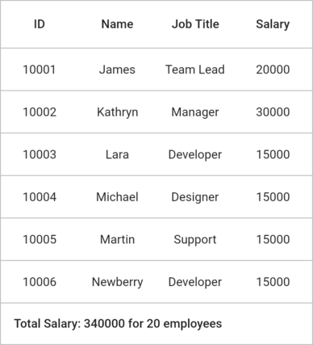
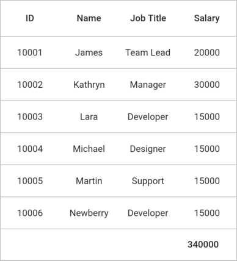
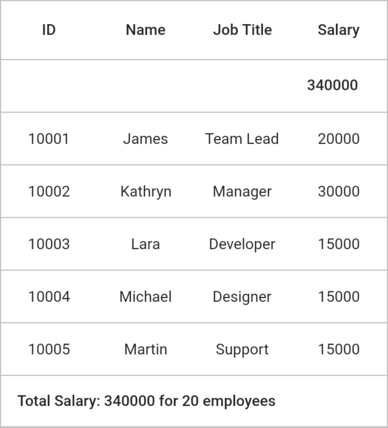
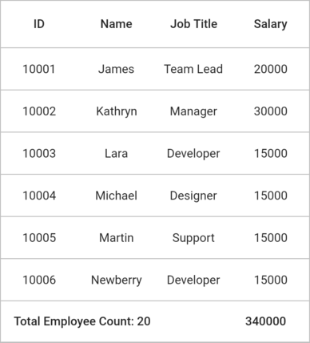
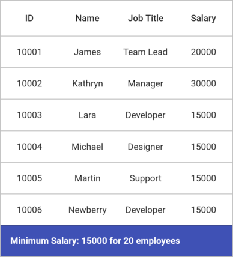
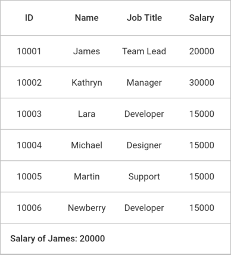

# Summaries in Flutter DataGrid (SfDataGrid)

## Table summary

The `SfDataGrid` provides built-in support to display concise information about the rows by using the table summary rows. The table summary value is calculated based on all the rows in the `DataGridSource.rows` property. You can add a table summary row to the DataGrid by adding the `GridTableSummaryRow` to the `SfDataGrid.tableSummaryRows` collection.

DataGrid does not automatically display the summary values. To display the summary value, you need to override the `buildTableSummaryCellWidget` method in the `DataGridSource` class. The calculated summary value is passed as a parameter to the `DataGridSource.buildTableSummaryCellWidget` method. So, you need to return the required widget with the summary value.

### Display table summary for row

The summary information can be displayed in a row by setting the `GridTableSummaryRow.showSummaryInRow` property to `true` and defining the summary columns. The `GridTableSummaryRow.title` content will be displayed in the corresponding row. You must define the `GridTableSummaryRow.title` based on the `GridSummaryColumn.name` property to customize the summary value.




@override
Widget build(BuildContext context) {
  return Scaffold(
    appBar: AppBar(
      title: const Text('Syncfusion Flutter DataGrid'),
    ),
    body: SfDataGrid(
      source: employeeDataSource,
      tableSummaryRows: [
        GridTableSummaryRow(
            showSummaryInRow: true,
            title: 'Total Salary: {Sum} for 20 employees',
            columns: [
              GridSummaryColumn(
                  name: 'Sum',
                  columnName: 'salary',
                  summaryType: GridSummaryType.sum)
            ],
            position: GridTableSummaryRowPosition.bottom)
      ],
      columns: <GridColumn>[
        GridColumn(
            columnName: 'id',
            label: Container(
                padding: EdgeInsets.all(16.0),
                alignment: Alignment.center,
                child: Text(
                  'ID',
                ))),
        GridColumn(
            columnName: 'name',
            label: Container(
                padding: EdgeInsets.all(8.0),
                alignment: Alignment.center,
                child: Text('Name'))),
        GridColumn(
            columnName: 'designation',
            label: Container(
                padding: EdgeInsets.all(8.0),
                alignment: Alignment.center,
                child: Text(
                  'Job Title',
                  overflow: TextOverflow.ellipsis,
                ))),
        GridColumn(
            columnName: 'salary',
            label: Container(
                padding: EdgeInsets.all(8.0),
                alignment: Alignment.center,
                child: Text('Salary'))),
      ],
    ),
  );
}

class EmployeeDataSource extends DataGridSource {
  EmployeeDataSource({required List<Employee> employeeData}) {
    _employeeData = employeeData
        .map<DataGridRow>((e) => DataGridRow(cells: [
              DataGridCell<int>(columnName: 'id', value: e.id),
              DataGridCell<String>(columnName: 'name', value: e.name),
              DataGridCell<String>(
                  columnName: 'designation', value: e.designation),
              DataGridCell<int>(columnName: 'salary', value: e.salary),
            ]))
        .toList();
  }

  List<DataGridRow> _employeeData = [];

  @override
  List<DataGridRow> get rows => _employeeData;

  @override
  Widget? buildTableSummaryCellWidget(
      GridTableSummaryRow summaryRow,
      GridSummaryColumn? summaryColumn,
      RowColumnIndex rowColumnIndex,
      String summaryValue) {
    return Container(
      padding: EdgeInsets.all(15.0),
      child: Text(summaryValue),
    );
  }

  @override
  DataGridRowAdapter buildRow(DataGridRow row) {
    return DataGridRowAdapter(
        cells: row.getCells().map<Widget>((e) {
      return Container(
        alignment: Alignment.center,
        padding: EdgeInsets.all(8.0),
        child: Text(e.value.toString()),
      );
    }).toList());
  }
}




### Display table summary for column

The summary information can be displayed in a column by setting the `GridTableSummaryRow.showSummaryInRow` property to `false`. You can define summary columns to the `GridTableSummaryRow` by adding the `GridSummaryColumn` to the `GridTableSummaryRow.summaryColumns` collection. The `GridSummaryColumn` contains the following required properties:

* **`name`**: Defines the corresponding column name for the summary calculation. This should be the same value as the `GridColumn.columnName` property.
* **`columnName`**: Defines the corresponding column name for the summary calculation.
* **`summaryType`**: Defines the summary calculation type.




@override
Widget build(BuildContext context) {
  return Scaffold(
    appBar: AppBar(
      title: const Text('Syncfusion Flutter DataGrid'),
    ),
    body: SfDataGrid(
      source: employeeDataSource,
      tableSummaryRows: [
        GridTableSummaryRow(
            showSummaryInRow: false,
            columns: [
              GridSummaryColumn(
                  name: 'Sum',
                  columnName: 'salary',
                  summaryType: GridSummaryType.sum)
            ],
            position: GridTableSummaryRowPosition.bottom)
      ],
      columns: <GridColumn>[
        GridColumn(
            columnName: 'id',
            label: Container(
                padding: EdgeInsets.all(16.0),
                alignment: Alignment.center,
                child: Text(
                  'ID',
                ))),
        GridColumn(
            columnName: 'name',
            label: Container(
                padding: EdgeInsets.all(8.0),
                alignment: Alignment.center,
                child: Text('Name'))),
        GridColumn(
            columnName: 'designation',
            label: Container(
                padding: EdgeInsets.all(8.0),
                alignment: Alignment.center,
                child: Text(
                  'Job Title',
                  overflow: TextOverflow.ellipsis,
                ))),
        GridColumn(
            columnName: 'salary',
            label: Container(
                padding: EdgeInsets.all(8.0),
                alignment: Alignment.center,
                child: Text('Salary'))),
      ],
    ),
  );
}

class EmployeeDataSource extends DataGridSource {
  EmployeeDataSource({required List<Employee> employeeData}) {
    _employeeData = employeeData
        .map<DataGridRow>((e) => DataGridRow(cells: [
              DataGridCell<int>(columnName: 'id', value: e.id),
              DataGridCell<String>(columnName: 'name', value: e.name),
              DataGridCell<String>(
                  columnName: 'designation', value: e.designation),
              DataGridCell<int>(columnName: 'salary', value: e.salary),
            ]))
        .toList();
  }

  List<DataGridRow> _employeeData = [];

  @override
  List<DataGridRow> get rows => _employeeData;

  @override
  Widget? buildTableSummaryCellWidget(
      GridTableSummaryRow summaryRow,
      GridSummaryColumn? summaryColumn,
      RowColumnIndex rowColumnIndex,
      String summaryValue) {
    return Container(
      padding: EdgeInsets.all(15.0),
      child: Text(summaryValue),
    );
  }

  @override
  DataGridRowAdapter buildRow(DataGridRow row) {
    return DataGridRowAdapter(
        cells: row.getCells().map<Widget>((e) {
      return Container(
        alignment: Alignment.center,
        padding: EdgeInsets.all(8.0),
        child: Text(e.value.toString()),
      );
    }).toList());
  }
} 




### Positioning table summary row

The table summary row can be shown at either top or bottom position by using the `GridTableSummaryRow.position` property.




@override
Widget build(BuildContext context) {
  return Scaffold(
    appBar: AppBar(
      title: const Text('Syncfusion Flutter DataGrid'),
    ),
    body: SfDataGrid(
      source: employeeDataSource,
      tableSummaryRows: [
        GridTableSummaryRow(
            showSummaryInRow: false,
            columns: [
              GridSummaryColumn(
                  name: 'Sum',
                  columnName: 'salary',
                  summaryType: GridSummaryType.sum)
            ],
            position: GridTableSummaryRowPosition.top),
        GridTableSummaryRow(
            showSummaryInRow: true,
            title: 'Total Salary: {Sum} for 20 employees',
            columns: [
              GridSummaryColumn(
                  name: 'Sum',
                  columnName: 'salary',
                  summaryType: GridSummaryType.sum)
            ],
            position: GridTableSummaryRowPosition.bottom)
      ],
      columns: <GridColumn>[
        GridColumn(
            columnName: 'id',
            label: Container(
                padding: EdgeInsets.all(16.0),
                alignment: Alignment.center,
                child: Text(
                  'ID',
                ))),
        GridColumn(
            columnName: 'name',
            label: Container(
                padding: EdgeInsets.all(8.0),
                alignment: Alignment.center,
                child: Text('Name'))),
        GridColumn(
            columnName: 'designation',
            label: Container(
                padding: EdgeInsets.all(8.0),
                alignment: Alignment.center,
                child: Text(
                  'Job Title',
                  overflow: TextOverflow.ellipsis,
                ))),
        GridColumn(
            columnName: 'salary',
            label: Container(
                padding: EdgeInsets.all(8.0),
                alignment: Alignment.center,
                child: Text('Salary'))),
      ],
    ),
  );
}

class EmployeeDataSource extends DataGridSource {
  EmployeeDataSource({required List<Employee> employeeData}) {
    _employeeData = employeeData
        .map<DataGridRow>((e) => DataGridRow(cells: [
              DataGridCell<int>(columnName: 'id', value: e.id),
              DataGridCell<String>(columnName: 'name', value: e.name),
              DataGridCell<String>(
                  columnName: 'designation', value: e.designation),
              DataGridCell<int>(columnName: 'salary', value: e.salary),
            ]))
        .toList();
  }

  List<DataGridRow> _employeeData = [];

  @override
  List<DataGridRow> get rows => _employeeData;

  @override
  Widget? buildTableSummaryCellWidget(
      GridTableSummaryRow summaryRow,
      GridSummaryColumn? summaryColumn,
      RowColumnIndex rowColumnIndex,
      String summaryValue) {
    return Container(
      padding: EdgeInsets.all(15.0),
      child: Text(summaryValue),
    );
  }

  @override
  DataGridRowAdapter buildRow(DataGridRow row) {
    return DataGridRowAdapter(
        cells: row.getCells().map<Widget>((e) {
      return Container(
        alignment: Alignment.center,
        padding: EdgeInsets.all(8.0),
        child: Text(e.value.toString()),
      );
    }).toList());
  }
}




### Summary calculation types

The following calculation types are supported for the summary calculation:

* **`Sum`**: Calculate the sum of a column
* **`Average`**: Calculate the average of a column.
* **`Count`**: Calculate the total of rows in `SfDataGrid`.
* **`Maximum`**: Calculate the maximum value in a column.
* **`Minimum`**: Calculate the minimum value in a column.

### Display table summary row with title

The SfDataGrid supports to display columns’ summary value along with the title by defining the `GridTableSummaryRow.title` and `GridTableSummaryRow.titleColumnCount` properties along with the summary columns. Showing a column summary with the title can be supported, only if the `GridSummaryRow.showSummaryInRow` is `false`. The `GridTableSummaryRow.titleColumnCount` property defines that how long the title should be spanned in the corresponding summary row.




@override
Widget build(BuildContext context) {
  return Scaffold(
    appBar: AppBar(
      title: const Text('Syncfusion Flutter DataGrid'),
    ),
    body: SfDataGrid(
      source: employeeDataSource,
      tableSummaryRows: [
        GridTableSummaryRow(
            showSummaryInRow: false,
            title: 'Total Employee Count: {Count}',
            titleColumnSpan: 3,
            columns: [
              GridSummaryColumn(
                  name: 'Count',
                  columnName: 'id',
                  summaryType: GridSummaryType.count),
              GridSummaryColumn(
                  name: 'Sum',
                  columnName: 'salary',
                  summaryType: GridSummaryType.sum)
            ],
            position: GridTableSummaryRowPosition.bottom),
      ],
      columns: <GridColumn>[
        GridColumn(
            columnName: 'id',
            label: Container(
                padding: EdgeInsets.all(16.0),
                alignment: Alignment.center,
                child: Text(
                  'ID',
                ))),
        GridColumn(
            columnName: 'name',
            label: Container(
                padding: EdgeInsets.all(8.0),
                alignment: Alignment.center,
                child: Text('Name'))),
        GridColumn(
            columnName: 'designation',
            label: Container(
                padding: EdgeInsets.all(8.0),
                alignment: Alignment.center,
                child: Text(
                  'Job Title',
                  overflow: TextOverflow.ellipsis,
                ))),
        GridColumn(
            columnName: 'salary',
            label: Container(
                padding: EdgeInsets.all(8.0),
                alignment: Alignment.center,
                child: Text('Salary'))),
      ],
    ),
  );
}

class EmployeeDataSource extends DataGridSource {
  EmployeeDataSource({required List<Employee> employeeData}) {
    _employeeData = employeeData
        .map<DataGridRow>((e) => DataGridRow(cells: [
              DataGridCell<int>(columnName: 'id', value: e.id),
              DataGridCell<String>(columnName: 'name', value: e.name),
              DataGridCell<String>(
                  columnName: 'designation', value: e.designation),
              DataGridCell<int>(columnName: 'salary', value: e.salary),
            ]))
        .toList();
  }

  List<DataGridRow> _employeeData = [];

  @override
  List<DataGridRow> get rows => _employeeData;

  @override
  Widget? buildTableSummaryCellWidget(
      GridTableSummaryRow summaryRow,
      GridSummaryColumn? summaryColumn,
      RowColumnIndex rowColumnIndex,
      String summaryValue) {
    return Container(
      padding: EdgeInsets.all(15.0),
      child: Text(summaryValue),
    );
  }

  @override
  DataGridRowAdapter buildRow(DataGridRow row) {
    return DataGridRowAdapter(
        cells: row.getCells().map<Widget>((e) {
      return Container(
        alignment: Alignment.center,
        padding: EdgeInsets.all(8.0),
        child: Text(e.value.toString()),
      );
    }).toList());
  }
}




### Set background color for the table summary row

The background color of the table summary row can be customized by using the `GridTableSummaryRow.color` property.




@override
Widget build(BuildContext context) {
  return Scaffold(
    appBar: AppBar(
      title: const Text('Syncfusion Flutter DataGrid'),
    ),
    body: SfDataGrid(
      source: employeeDataSource,
      tableSummaryRows: [
        GridTableSummaryRow(
            color: Colors.indigo,
            showSummaryInRow: true,
            title: 'Minimum Salary: {Minimum} for 20 employees',
            columns: [
              GridSummaryColumn(
                  name: 'Minimum',
                  columnName: 'salary',
                  summaryType: GridSummaryType.minimum)
            ],
            position: GridTableSummaryRowPosition.bottom),
      ],
      columns: <GridColumn>[
        GridColumn(
            columnName: 'id',
            label: Container(
                padding: EdgeInsets.all(16.0),
                alignment: Alignment.center,
                child: Text(
                  'ID',
                ))),
        GridColumn(
            columnName: 'name',
            label: Container(
                padding: EdgeInsets.all(8.0),
                alignment: Alignment.center,
                child: Text('Name'))),
        GridColumn(
            columnName: 'designation',
            label: Container(
                padding: EdgeInsets.all(8.0),
                alignment: Alignment.center,
                child: Text(
                  'Job Title',
                  overflow: TextOverflow.ellipsis,
                ))),
        GridColumn(
            columnName: 'salary',
            label: Container(
                padding: EdgeInsets.all(8.0),
                alignment: Alignment.center,
                child: Text('Salary'))),
      ],
    ),
  );
}

class EmployeeDataSource extends DataGridSource {
  EmployeeDataSource({required List<Employee> employeeData}) {
    _employeeData = employeeData
        .map<DataGridRow>((e) => DataGridRow(cells: [
              DataGridCell<int>(columnName: 'id', value: e.id),
              DataGridCell<String>(columnName: 'name', value: e.name),
              DataGridCell<String>(
                  columnName: 'designation', value: e.designation),
              DataGridCell<int>(columnName: 'salary', value: e.salary),
            ]))
        .toList();
  }

  List<DataGridRow> _employeeData = [];

  @override
  List<DataGridRow> get rows => _employeeData;

  @override
  Widget? buildTableSummaryCellWidget(
      GridTableSummaryRow summaryRow,
      GridSummaryColumn? summaryColumn,
      RowColumnIndex rowColumnIndex,
      String summaryValue) {
    return Container(
      padding: EdgeInsets.all(15.0),
      child: Text(
        summaryValue,
        style: TextStyle(fontWeight: FontWeight.bold, color: Colors.white),
      ),
    );
  }

  @override
  DataGridRowAdapter buildRow(DataGridRow row) {
    return DataGridRowAdapter(
        cells: row.getCells().map<Widget>((e) {
      return Container(
        alignment: Alignment.center,
        padding: EdgeInsets.all(8.0),
        child: Text(e.value.toString()),
      );
    }).toList());
  }
}




### Customize table summary calculation

You can write the custom logic for the summary calculation by overriding the `calculateSummaryValue` method from the `DataGridSource` class. The `summaryColumn` parameter will be null for the summary cells in the spanned summary columns.

The following example demonstrates how to customize the summary calculation to find the standard deviation for all employees' salaries.




@override
Widget build(BuildContext context) {
  return Scaffold(
    appBar: AppBar(
      title: const Text('Syncfusion Flutter DataGrid'),
    ),
    body: SfDataGrid(
      source: employeeDataSource,
      tableSummaryRows: [
        GridTableSummaryRow(
            showSummaryInRow: true,
            title: 'Standard Deviation: {Deviation}',
            columns: [
              GridSummaryColumn(
                  name: 'Deviation',
                  columnName: 'salary',
                  summaryType: GridSummaryType.sum)
            ],
            position: GridTableSummaryRowPosition.bottom),
      ],
      columns: <GridColumn>[
        GridColumn(
            columnName: 'id',
            label: Container(
                padding: EdgeInsets.all(16.0),
                alignment: Alignment.center,
                child: Text(
                  'ID',
                ))),
        GridColumn(
            columnName: 'name',
            label: Container(
                padding: EdgeInsets.all(8.0),
                alignment: Alignment.center,
                child: Text('Name'))),
        GridColumn(
            columnName: 'designation',
            label: Container(
                padding: EdgeInsets.all(8.0),
                alignment: Alignment.center,
                child: Text(
                  'Job Title',
                  overflow: TextOverflow.ellipsis,
                ))),
        GridColumn(
            columnName: 'salary',
            label: Container(
                padding: EdgeInsets.all(8.0),
                alignment: Alignment.center,
                child: Text('Salary'))),
      ],
    ),
  );
}

class EmployeeDataSource extends DataGridSource {
  EmployeeDataSource({required List<Employee> employeeData}) {
    _employeeData = employeeData
        .map<DataGridRow>((e) => DataGridRow(cells: [
              DataGridCell<int>(columnName: 'id', value: e.id),
              DataGridCell<String>(columnName: 'name', value: e.name),
              DataGridCell<String>(
                  columnName: 'designation', value: e.designation),
              DataGridCell<int>(columnName: 'salary', value: e.salary),
            ]))
        .toList();
  }

  List<DataGridRow> _employeeData = [];

  @override
  List<DataGridRow> get rows => _employeeData;

  @override
  String calculateSummaryValue(GridTableSummaryRow summaryRow,
      GridSummaryColumn? summaryColumn, RowColumnIndex rowColumnIndex) {
    List<int> getCellValues(GridSummaryColumn summaryColumn) {
      final List<int> values = <int>[];
      for (final DataGridRow row in rows) {
        final DataGridCell? cell = row.getCells().firstWhereOrNull(
            (DataGridCell element) =>
                element.columnName == summaryColumn.columnName);
        if (cell != null && cell.value != null) {
          values.add(cell.value);
        }
      }
      return values;
    }

    String? title = summaryRow.title;
    if (title != null) {
      if (summaryRow.showSummaryInRow && summaryRow.columns.isNotEmpty) {
        for (final GridSummaryColumn summaryColumn in summaryRow.columns) {
          if (title!.contains(summaryColumn.name)) {
            double deviation = 0;
            final List<int> values = getCellValues(summaryColumn);
            if (values.isNotEmpty) {
              int sum = values.reduce((value, element) =>
                  value + pow(element - values.average, 2).toInt());
              deviation = sqrt((sum) / (values.length - 1));
            }
            title = title.replaceAll(
                '{${summaryColumn.name}}', deviation.toString());
          }
        }
      }
    }
    return title ?? '';
  }

  @override
  Widget? buildTableSummaryCellWidget(
      GridTableSummaryRow summaryRow,
      GridSummaryColumn? summaryColumn,
      RowColumnIndex rowColumnIndex,
      String summaryValue) {
    return Container(
      padding: EdgeInsets.all(15.0),
      child: Text(summaryValue),
    );
  }

  @override
  DataGridRowAdapter buildRow(DataGridRow row) {
    return DataGridRowAdapter(
        cells: row.getCells().map<Widget>((e) {
      return Container(
        alignment: Alignment.center,
        padding: EdgeInsets.all(8.0),
        child: Text(e.value.toString()),
      );
    }).toList());
  }
}




