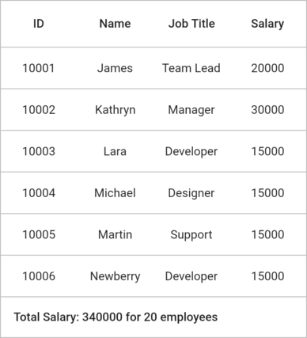
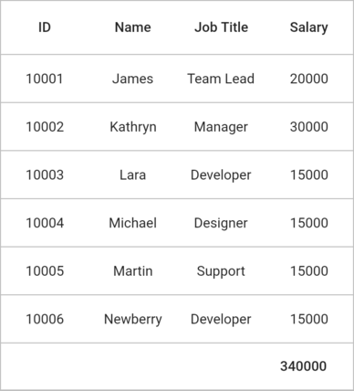
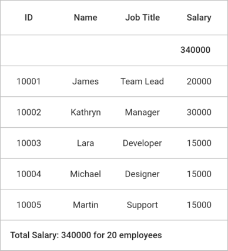
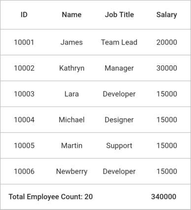
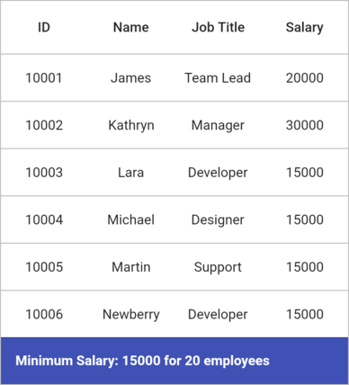
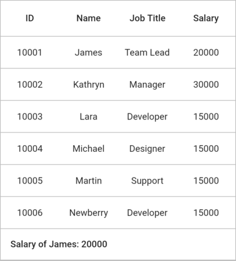

# Summaries in Flutter DataGrid (SfDataGrid)

> **NOTE**: Ensure you have added `syncfusion_flutter_datagrid` package to your `pubspec.yaml` file and imported the necessary packages in your Dart file.

## Table summary

The [SfDataGrid](https://pub.dev/documentation/syncfusion_flutter_datagrid/latest/datagrid/SfDataGrid-class.html) provides built-in support to display concise information about the rows by using the table summary rows. The table summary value is calculated based on all the rows in the [DataGridSource.rows](https://pub.dev/documentation/syncfusion_flutter_datagrid/latest/datagrid/DataGridSource/rows.html) property. You can add a table summary row to the DataGrid by adding the [GridTableSummaryRow](https://pub.dev/documentation/syncfusion_flutter_datagrid/latest/datagrid/GridTableSummaryRow-class.html) to the [SfDataGrid.tableSummaryRows](https://pub.dev/documentation/syncfusion_flutter_datagrid/latest/datagrid/SfDataGrid/tableSummaryRows.html) collection.

DataGrid does not automatically display the summary values. To display the summary value, you need to override the [buildTableSummaryCellWidget](https://pub.dev/documentation/syncfusion_flutter_datagrid/latest/datagrid/DataGridSource/buildTableSummaryCellWidget.html) method in the [DataGridSource](https://pub.dev/documentation/syncfusion_flutter_datagrid/latest/datagrid/DataGridSource-class.html) class. The calculated summary value is passed as a parameter to the `buildTableSummaryCellWidget` method. You must return the required widget with the summary value to render the summary in the grid.

### Display table summary for row

The summary information can be displayed in a row by setting the [GridTableSummaryRow.showSummaryInRow](https://pub.dev/documentation/syncfusion_flutter_datagrid/latest/datagrid/GridTableSummaryRow/showSummaryInRow.html) property to `true` and defining the summary columns. The [GridTableSummaryRow.title](https://pub.dev/documentation/syncfusion_flutter_datagrid/latest/datagrid/GridTableSummaryRow/title.html) content will be displayed in the corresponding row. You must define the `GridTableSummaryRow.title` based on the [GridSummaryColumn.name](https://pub.dev/documentation/syncfusion_flutter_datagrid/latest/datagrid/GridSummaryColumn/name.html) property to customize the summary value.




import 'package:syncfusion_flutter_datagrid/datagrid.dart';
import 'package:flutter/material.dart';

class Employee {
  Employee({
    required this.id,
    required this.name,
    required this.designation,
    required this.salary,
  });
  
  final int id;
  final String name;
  final String designation;
  final int salary;
}

class EmployeeDataSource extends DataGridSource {
  EmployeeDataSource({required List<Employee> employeeData}) {
    _employeeData = employeeData
        .map<DataGridRow>((e) => DataGridRow(cells: [
              DataGridCell<int>(columnName: 'id', value: e.id),
              DataGridCell<String>(columnName: 'name', value: e.name),
              DataGridCell<String>(
                  columnName: 'designation', value: e.designation),
              DataGridCell<int>(columnName: 'salary', value: e.salary),
            ]))
        .toList();
  }

  List<DataGridRow> _employeeData = [];

  @override
  List<DataGridRow> get rows => _employeeData;

  @override
  Widget? buildTableSummaryCellWidget(
      GridTableSummaryRow summaryRow,
      GridSummaryColumn? summaryColumn,
      RowColumnIndex rowColumnIndex,
      String summaryValue) {
    return Container(
      padding: EdgeInsets.all(15.0),
      child: Text(summaryValue),
    );
  }

  @override
  DataGridRowAdapter buildRow(DataGridRow row) {
    return DataGridRowAdapter(
        cells: row.getCells().map<Widget>((e) {
      return Container(
        alignment: Alignment.center,
        padding: EdgeInsets.all(8.0),
        child: Text(e.value.toString()),
      );
    }).toList());
  }
}

@override
Widget build(BuildContext context) {
  final List<Employee> employees = [
    Employee(id: 1, name: 'John', designation: 'Developer', salary: 50000),
    Employee(id: 2, name: 'Jane', designation: 'Manager', salary: 60000),
    // Add more employees
  ];
  
  return Scaffold(
    appBar: AppBar(
      title: const Text('Syncfusion Flutter DataGrid'),
    ),
    body: SfDataGrid(
      source: EmployeeDataSource(employeeData: employees),
      tableSummaryRows: [
        GridTableSummaryRow(
            showSummaryInRow: true,
            title: 'Total Salary: {Sum} for 20 employees',
            columns: [
              GridSummaryColumn(
                  name: 'Sum',
                  columnName: 'salary',
                  summaryType: GridSummaryType.sum)
            ],
            position: GridTableSummaryRowPosition.bottom)
      ],
      columns: <GridColumn>[
        GridColumn(
            columnName: 'id',
            label: Container(
                padding: EdgeInsets.all(16.0),
                alignment: Alignment.center,
                child: Text('ID'))),
        GridColumn(
            columnName: 'name',
            label: Container(
                padding: EdgeInsets.all(8.0),
                alignment: Alignment.center,
                child: Text('Name'))),
        GridColumn(
            columnName: 'designation',
            label: Container(
                padding: EdgeInsets.all(8.0),
                alignment: Alignment.center,
                child: Text('Job Title', overflow: TextOverflow.ellipsis))),
        GridColumn(
            columnName: 'salary',
            label: Container(
                padding: EdgeInsets.all(8.0),
                alignment: Alignment.center,
                child: Text('Salary'))),
      ],
    ),
  );
}




### Display table summary for column

The summary information can be displayed in a column by setting the `GridTableSummaryRow.showSummaryInRow` property to `false`. You can define summary columns to the `GridTableSummaryRow` by adding the [GridSummaryColumn](https://pub.dev/documentation/syncfusion_flutter_datagrid/latest/datagrid/GridSummaryColumn-class.html) to the [GridTableSummaryRow.columns](https://pub.dev/documentation/syncfusion_flutter_datagrid/latest/datagrid/GridTableSummaryRow/columns.html) collection. The `GridSummaryColumn` contains the following required properties:

* [name](https://pub.dev/documentation/syncfusion_flutter_datagrid/latest/datagrid/GridSummaryColumn/name.html): Defines the summary identifier. This should be a unique name used in the `GridTableSummaryRow.title` template.
* [columnName](https://pub.dev/documentation/syncfusion_flutter_datagrid/latest/datagrid/GridSummaryColumn/columnName.html): Defines the data column name for the summary calculation.
* [summaryType](https://pub.dev/documentation/syncfusion_flutter_datagrid/latest/datagrid/GridSummaryColumn/summaryType.html): Defines the summary calculation type.




@override
Widget build(BuildContext context) {
  return Scaffold(
    appBar: AppBar(
      title: const Text('Syncfusion Flutter DataGrid'),
    ),
    body: SfDataGrid(
      source: EmployeeDataSource(employeeData: employees),
      tableSummaryRows: [
        GridTableSummaryRow(
            showSummaryInRow: false,
            columns: [
              GridSummaryColumn(
                  name: 'Sum',
                  columnName: 'salary',
                  summaryType: GridSummaryType.sum),
            ],
            position: GridTableSummaryRowPosition.bottom)
      ],
      columns: <GridColumn>[
        GridColumn(
            columnName: 'id',
            label: Container(
                padding: EdgeInsets.all(16.0),
                alignment: Alignment.center,
                child: Text('ID'))),
        GridColumn(
            columnName: 'name',
            label: Container(
                padding: EdgeInsets.all(8.0),
                alignment: Alignment.center,
                child: Text('Name'))),
        GridColumn(
            columnName: 'designation',
            label: Container(
                padding: EdgeInsets.all(8.0),
                alignment: Alignment.center,
                child: Text('Job Title', overflow: TextOverflow.ellipsis))),
        GridColumn(
            columnName: 'salary',
            label: Container(
                padding: EdgeInsets.all(8.0),
                alignment: Alignment.center,
                child: Text('Salary'))),
      ],
    ),
  );
}




### Positioning table summary row

The table summary row can be shown at either the top or bottom position by using the [GridTableSummaryRow.position](https://pub.dev/documentation/syncfusion_flutter_datagrid/latest/datagrid/GridTableSummaryRow/position.html) property.




@override
Widget build(BuildContext context) {
  return Scaffold(
    appBar: AppBar(
      title: const Text('Syncfusion Flutter DataGrid'),
    ),
    body: SfDataGrid(
      source: EmployeeDataSource(employeeData: employees),
      tableSummaryRows: [
        GridTableSummaryRow(
            showSummaryInRow: false,
            columns: [
              GridSummaryColumn(
                  name: 'Sum',
                  columnName: 'salary',
                  summaryType: GridSummaryType.sum)
            ],
            position: GridTableSummaryRowPosition.top),
        GridTableSummaryRow(
            showSummaryInRow: true,
            title: 'Total Salary: {Sum} for 20 employees',
            columns: [
              GridSummaryColumn(
                  name: 'Sum',
                  columnName: 'salary',
                  summaryType: GridSummaryType.sum)
            ],
            position: GridTableSummaryRowPosition.bottom)
      ],
      columns: <GridColumn>[
        GridColumn(
            columnName: 'id',
            label: Container(
                padding: EdgeInsets.all(16.0),
                alignment: Alignment.center,
                child: Text('ID'))),
        GridColumn(
            columnName: 'name',
            label: Container(
                padding: EdgeInsets.all(8.0),
                alignment: Alignment.center,
                child: Text('Name'))),
        GridColumn(
            columnName: 'designation',
            label: Container(
                padding: EdgeInsets.all(8.0),
                alignment: Alignment.center,
                child: Text('Job Title', overflow: TextOverflow.ellipsis))),
        GridColumn(
            columnName: 'salary',
            label: Container(
                padding: EdgeInsets.all(8.0),
                alignment: Alignment.center,
                child: Text('Salary'))),
      ],
    ),
  );
}




### Summary calculation types

The [GridSummaryType](https://pub.dev/documentation/syncfusion_flutter_datagrid/latest/datagrid/GridSummaryType.html) enum defines the following calculation types for summary rows:

* **Sum**: Calculates the total sum of all numeric values in the specified column.
* **Average**: Calculates the arithmetic mean of all numeric values in the specified column.
* **Count**: Calculates the total number of rows in the DataGrid, including the data rows but excluding the header and summary rows.
* **Maximum**: Calculates the maximum (largest) value in the specified column.
* **Minimum**: Calculates the minimum (smallest) value in the specified column.

### Display table summary row with title

The SfDataGrid supports displaying a summary title along with column summary values by using the `GridTableSummaryRow.title` and [GridTableSummaryRow.titleColumnSpan](https://pub.dev/documentation/syncfusion_flutter_datagrid/latest/datagrid/GridTableSummaryRow/titleColumnSpan.html) properties. Column summary with title is only supported when `GridTableSummaryRow.showSummaryInRow` is `false`. The `titleColumnSpan` property specifies how many columns the title should span from the left side of the summary row.




@override
Widget build(BuildContext context) {
  return Scaffold(
    appBar: AppBar(
      title: const Text('Syncfusion Flutter DataGrid'),
    ),
    body: SfDataGrid(
      source: EmployeeDataSource(employeeData: employees),
      tableSummaryRows: [
        GridTableSummaryRow(
            showSummaryInRow: false,
            title: 'Total Employee Count: {Count}',
            titleColumnSpan: 3,
            columns: [
              GridSummaryColumn(
                  name: 'Count',
                  columnName: 'id',
                  summaryType: GridSummaryType.count),
              GridSummaryColumn(
                  name: 'Sum',
                  columnName: 'salary',
                  summaryType: GridSummaryType.sum)
            ],
            position: GridTableSummaryRowPosition.bottom),
      ],
      columns: <GridColumn>[
        GridColumn(
            columnName: 'id',
            label: Container(
                padding: EdgeInsets.all(16.0),
                alignment: Alignment.center,
                child: Text('ID'))),
        GridColumn(
            columnName: 'name',
            label: Container(
                padding: EdgeInsets.all(8.0),
                alignment: Alignment.center,
                child: Text('Name'))),
        GridColumn(
            columnName: 'designation',
            label: Container(
                padding: EdgeInsets.all(8.0),
                alignment: Alignment.center,
                child: Text('Job Title', overflow: TextOverflow.ellipsis))),
        GridColumn(
            columnName: 'salary',
            label: Container(
                padding: EdgeInsets.all(8.0),
                alignment: Alignment.center,
                child: Text('Salary'))),
      ],
    ),
  );
}




### Set the background color for the table summary row

The background color of the table summary row can be customized by using the [GridTableSummaryRow.color](https://pub.dev/documentation/syncfusion_flutter_datagrid/latest/datagrid/GridTableSummaryRow/color.html) property.




@override
Widget build(BuildContext context) {
  return Scaffold(
    appBar: AppBar(
      title: const Text('Syncfusion Flutter DataGrid'),
    ),
    body: SfDataGrid(
      source: EmployeeDataSource(employeeData: employees),
      tableSummaryRows: [
        GridTableSummaryRow(
            color: Colors.indigo,
            showSummaryInRow: true,
            title: 'Minimum Salary: {Minimum} for 20 employees',
            columns: [
              GridSummaryColumn(
                  name: 'Minimum',
                  columnName: 'salary',
                  summaryType: GridSummaryType.minimum)
            ],
            position: GridTableSummaryRowPosition.bottom),
      ],
      columns: <GridColumn>[
        GridColumn(
            columnName: 'id',
            label: Container(
                padding: EdgeInsets.all(16.0),
                alignment: Alignment.center,
                child: Text('ID'))),
        GridColumn(
            columnName: 'name',
            label: Container(
                padding: EdgeInsets.all(8.0),
                alignment: Alignment.center,
                child: Text('Name'))),
        GridColumn(
            columnName: 'designation',
            label: Container(
                padding: EdgeInsets.all(8.0),
                alignment: Alignment.center,
                child: Text('Job Title', overflow: TextOverflow.ellipsis))),
        GridColumn(
            columnName: 'salary',
            label: Container(
                padding: EdgeInsets.all(8.0),
                alignment: Alignment.center,
                child: Text('Salary'))),
      ],
    ),
  );
}




### Customize table summary calculation

You can write custom logic for the summary calculation by overriding the [calculateSummaryValue](https://pub.dev/documentation/syncfusion_flutter_datagrid/latest/datagrid/DataGridSource/calculateSummaryValue.html) method from the `DataGridSource` class. The `summaryColumn` parameter will be null for the summary cells in spanned summary columns.

The following example demonstrates how to customize the summary calculation to find the standard deviation for all employees' salaries.




import 'dart:math';
import 'package:collection/collection.dart';
import 'package:syncfusion_flutter_datagrid/datagrid.dart';
import 'package:flutter/material.dart';

class EmployeeDataSource extends DataGridSource {
  EmployeeDataSource({required List<Employee> employeeData}) {
    _employeeData = employeeData
        .map<DataGridRow>((e) => DataGridRow(cells: [
              DataGridCell<int>(columnName: 'id', value: e.id),
              DataGridCell<String>(columnName: 'name', value: e.name),
              DataGridCell<String>(
                  columnName: 'designation', value: e.designation),
              DataGridCell<int>(columnName: 'salary', value: e.salary),
            ]))
        .toList();
  }

  List<DataGridRow> _employeeData = [];

  @override
  List<DataGridRow> get rows => _employeeData;

  @override
  String calculateSummaryValue(GridTableSummaryRow summaryRow,
      GridSummaryColumn? summaryColumn, RowColumnIndex rowColumnIndex) {
    List<int> getCellValues(GridSummaryColumn summaryColumn) {
      final List<int> values = <int>[];
      for (final DataGridRow row in rows) {
        final DataGridCell? cell = row.getCells().firstWhereOrNull(
            (DataGridCell element) =>
                element.columnName == summaryColumn.columnName);
        if (cell != null && cell.value != null) {
          values.add(cell.value as int);
        }
      }
      return values;
    }

    String? title = summaryRow.title;
    if (title != null) {
      if (summaryRow.showSummaryInRow && summaryRow.columns.isNotEmpty) {
        for (final GridSummaryColumn summaryColumn in summaryRow.columns) {
          if (title.contains(summaryColumn.name)) {
            double deviation = 0;
            final List<int> values = getCellValues(summaryColumn);
            if (values.isNotEmpty) {
              final double average = values.average;
              double variance = 0;
              for (final int value in values) {
                variance += pow(value - average, 2) as double;
              }
              deviation = sqrt(variance / (values.length - 1));
            }
            title = title.replaceAll(
                '{${summaryColumn.name}}', deviation.toStringAsFixed(2));
          }
        }
      }
    }
    return title ?? '';
  }

  @override
  Widget? buildTableSummaryCellWidget(
      GridTableSummaryRow summaryRow,
      GridSummaryColumn? summaryColumn,
      RowColumnIndex rowColumnIndex,
      String summaryValue) {
    return Container(
      padding: EdgeInsets.all(15.0),
      child: Text(summaryValue),
    );
  }

  @override
  DataGridRowAdapter buildRow(DataGridRow row) {
    return DataGridRowAdapter(
        cells: row.getCells().map<Widget>((e) {
      return Container(
        alignment: Alignment.center,
        padding: EdgeInsets.all(8.0),
        child: Text(e.value.toString()),
      );
    }).toList());
  }
}

@override
Widget build(BuildContext context) {
  return Scaffold(
    appBar: AppBar(
      title: const Text('Syncfusion Flutter DataGrid'),
    ),
    body: SfDataGrid(
      source: EmployeeDataSource(employeeData: employees),
      tableSummaryRows: [
        GridTableSummaryRow(
            showSummaryInRow: true,
            title: 'Standard Deviation: {Deviation}',
            columns: [
              GridSummaryColumn(
                  name: 'Deviation',
                  columnName: 'salary',
                  summaryType: GridSummaryType.sum)
            ],
            position: GridTableSummaryRowPosition.bottom),
      ],
      columns: <GridColumn>[
        GridColumn(
            columnName: 'id',
            label: Container(
                padding: EdgeInsets.all(16.0),
                alignment: Alignment.center,
                child: Text('ID'))),
        GridColumn(
            columnName: 'name',
            label: Container(
                padding: EdgeInsets.all(8.0),
                alignment: Alignment.center,
                child: Text('Name'))),
        GridColumn(
            columnName: 'designation',
            label: Container(
                padding: EdgeInsets.all(8.0),
                alignment: Alignment.center,
                child: Text('Job Title', overflow: TextOverflow.ellipsis))),
        GridColumn(
            columnName: 'salary',
            label: Container(
                padding: EdgeInsets.all(8.0),
                alignment: Alignment.center,
                child: Text('Salary'))),
      ],
    ),
  );
}




## See also

* [Syncfusion Flutter DataGrid Documentation](https://pub.dev/documentation/syncfusion_flutter_datagrid/latest/datagrid/SfDataGrid-class.html)
* [GridTableSummaryRow API](https://pub.dev/documentation/syncfusion_flutter_datagrid/latest/datagrid/GridTableSummaryRow-class.html)
* [GridSummaryColumn API](https://pub.dev/documentation/syncfusion_flutter_datagrid/latest/datagrid/GridSummaryColumn-class.html)
* [GridSummaryType Enum](https://pub.dev/documentation/syncfusion_flutter_datagrid/latest/datagrid/GridSummaryType.html)
* [DataGridSource API](https://pub.dev/documentation/syncfusion_flutter_datagrid/latest/datagrid/DataGridSource-class.html)
