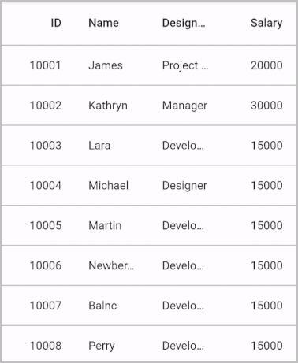
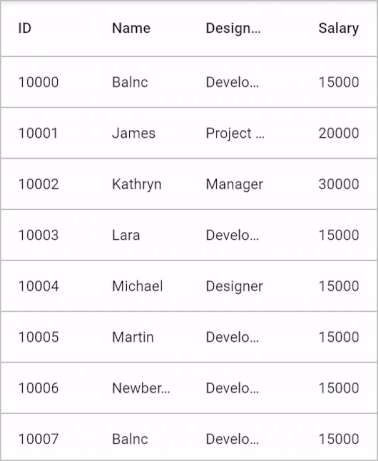
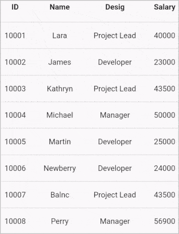

# Swiping in Flutter DataGrid (SfDataGrid)

The Flutter DataTable provides support to swipe a row by setting the [SfDataGrid.allowSwiping](https://pub.dev/documentation/syncfusion_flutter_datagrid/latest/datagrid/SfDataGrid/allowSwiping.html) property to true. Swipe actions will be displayed when swiping a row from `left to right` or `right to left` direction. The swipe dragging gesture can be restricted to a certain point on the row by setting the [SfDataGrid.swipeMaxOffset](https://pub.dev/documentation/syncfusion_flutter_datagrid/latest/datagrid/SfDataGrid/swipeMaxOffset.html) property.

## Swipe action builders

The Flutter DataTable enables you to load the desired widget behind the swiped row by using [SfDataGrid.startSwipeActionsBuilder](https://pub.dev/documentation/syncfusion_flutter_datagrid/latest/datagrid/SfDataGrid/startSwipeActionsBuilder.html) and [SfDataGrid.endSwipeActionsBuilder](https://pub.dev/documentation/syncfusion_flutter_datagrid/latest/datagrid/SfDataGrid/endSwipeActionsBuilder.html) properties. The swipe widget's width that loads from the actions builder is arranged based on the `SfDataGrid.swipeMaxOffset` property and it takes height based on the current swiping row height.


 

import 'package:syncfusion_flutter_datagrid/datagrid.dart';

late EmployeeDataSource _employeeDataSource;
List<Employee> _employees = <Employee>[];

@override
void initState() {
  super.initState();
  _employees = getEmployeeData();
  _employeeDataSource = EmployeeDataSource(employees: _employees);
}

@override
Widget build(BuildContext context) {
  return SfDataGrid(
    allowSwiping: true,
    swipeMaxOffset: 100.0,
    source: _employeeDataSource,
    startSwipeActionsBuilder:
        (BuildContext context, DataGridRow row, int rowIndex) {
      return GestureDetector(
          onTap: () {
            _employeeDataSource.dataGridRows.insert(
                rowIndex,
                DataGridRow(cells: [
                  DataGridCell(value: 1011, columnName: 'id'),
                  DataGridCell(value: 'Tom Bass', columnName: 'name'),
                  DataGridCell(value: 'Developer', columnName: 'designation'),
                  DataGridCell(value: 20000, columnName: 'salary')
                ]));
            _employeeDataSource.updateDataGridSource();
          },
          child: Container(
              color: Colors.greenAccent,
              child: Center(
                child: Icon(Icons.add),
              )));
    },
    endSwipeActionsBuilder:
        (BuildContext context, DataGridRow row, int rowIndex) {
      return GestureDetector(
          onTap: () {
            _employeeDataSource.dataGridRows.removeAt(rowIndex);
            _employeeDataSource.updateDataGridSource();
          },
          child: Container(
              color: Colors.redAccent,
              child: Center(
                child: Icon(Icons.delete),
              )));
    },
    columns: <GridColumn>[
      GridColumn(
          columnName: 'id',
          label: Container(
              padding: EdgeInsets.symmetric(horizontal: 16.0),
              alignment: Alignment.centerRight,
              child: Text(
                'ID',
                overflow: TextOverflow.ellipsis,
              ))),
      GridColumn(
          columnName: 'name',
          label: Container(
              padding: EdgeInsets.symmetric(horizontal: 16.0),
              alignment: Alignment.centerLeft,
              child: Text(
                'Name',
                overflow: TextOverflow.ellipsis,
              ))),
      GridColumn(
          columnName: 'designation',
          label: Container(
              padding: EdgeInsets.symmetric(horizontal: 16.0),
              alignment: Alignment.centerLeft,
              child: Text(
                'Designation',
                overflow: TextOverflow.ellipsis,
              ))),
      GridColumn(
          columnName: 'salary',
          label: Container(
              padding: EdgeInsets.symmetric(horizontal: 16.0),
              alignment: Alignment.centerRight,
              child: Text(
                'Salary',
                overflow: TextOverflow.ellipsis,
              ))),
    ],
  );
}

class EmployeeDataSource extends DataGridSource {
  EmployeeDataSource({required List<Employee> employees}) {
    dataGridRows = employees
        .map<DataGridRow>((dataGridRow) => DataGridRow(cells: [
              DataGridCell<int>(columnName: 'id', value: dataGridRow.id),
              DataGridCell<String>(columnName: 'name', value: dataGridRow.name),
              DataGridCell<String>(
                  columnName: 'designation', value: dataGridRow.designation),
              DataGridCell<int>(
                  columnName: 'salary', value: dataGridRow.salary),
            ]))
        .toList();
  }

  List<DataGridRow> dataGridRows = [];

  @override
  List<DataGridRow> get rows => dataGridRows;

  @override
  DataGridRowAdapter? buildRow(DataGridRow row) {
    return DataGridRowAdapter(
        cells: row.getCells().map<Widget>((dataGridCell) {
      return Container(
          alignment: (dataGridCell.columnName == 'id' ||
                  dataGridCell.columnName == 'salary')
              ? Alignment.centerRight
              : Alignment.centerLeft,
          padding: EdgeInsets.symmetric(horizontal: 16.0),
          child: Text(
            dataGridCell.value.toString(),
            overflow: TextOverflow.ellipsis,
          ));
    }).toList());
  }

  void updateDataGridSource() {
    notifyListeners();
  }
}




## Swipe callbacks

The data grid provides the following callbacks to notify the swiping stages:  

* [onSwipeStart](https://pub.dev/documentation/syncfusion_flutter_datagrid/latest/datagrid/SfDataGrid/onSwipeStart.html): Called when the swipe offset changes from its initial value. The swipe action can be canceled by returning `false.`
* [onSwipeUpdate](https://pub.dev/documentation/syncfusion_flutter_datagrid/latest/datagrid/SfDataGrid/onSwipeUpdate.html): Called while swiping a row is in progress. The swipe action can be canceled by returning `false.`
* [onSwipeEnd](https://pub.dev/documentation/syncfusion_flutter_datagrid/latest/datagrid/SfDataGrid/onSwipeEnd.html): Called when the swipe offset value reaches the `SfDataGrid.maxSwipeOffset` indicates that the swipe action is completed.

The swipe callbacks provide the following properties in their arguments:

* [RowIndex](https://pub.dev/documentation/syncfusion_flutter_datagrid/latest/datagrid/DataGridSwipeUpdateDetails/rowIndex.html): Defines the swiping row index.
* [SwipeDirection](https://pub.dev/documentation/syncfusion_flutter_datagrid/latest/datagrid/DataGridSwipeUpdateDetails/swipeDirection.html): Defines the swipe direction of the swiped row.
* [SwipeOffset](https://pub.dev/documentation/syncfusion_flutter_datagrid/latest/datagrid/DataGridSwipeUpdateDetails/swipeOffset.html): Defines the current swipe offset of the row being swiped.

By handling the swipe callbacks, you can use these property values from the arguments to perform any desired action, such as deleting the row, editing the data, and more.

## Customized swipes delete functionality

You can perform customized swipe functionality using the swiping callbacks. The below example shows how to delete a row when swiping a data row from one to another end.


 

import 'package:syncfusion_flutter_datagrid/datagrid.dart';

late EmployeeDataSource _employeeDataSource;

@override
Widget build(BuildContext context) {
  return LayoutBuilder(builder: (context, constraints) {
    return SfDataGrid(
      allowSwiping: true,
      swipeMaxOffset: constraints.maxWidth,
      source: _employeeDataSource,
      startSwipeActionsBuilder:
          (BuildContext context, DataGridRow row, int rowIndex) {
        return GestureDetector(
            onTap: () {
              _employeeDataSource.dataGridRows.removeAt(rowIndex);
              _employeeDataSource.updateDataGridSource();
            },
            child: Container(
                color: Colors.green,
                padding: EdgeInsets.only(left: 30.0),
                alignment: Alignment.centerLeft,
                child: Text('Delete', style: TextStyle(color: Colors.white))));
      },
      onSwipeUpdate: (details) {
        isReachedCenter =
            (details.swipeOffset >= constraints.maxWidth / 2) ? true : false;
        return true;
      },
      onSwipeEnd: (details) async {
        if (isReachedCenter && _employeeDataSource.dataGridRows.isNotEmpty) {
          _employeeDataSource.dataGridRows.removeAt(details.rowIndex);
          _employeeDataSource.updateDataGridSource();
          isReachedCenter = false;
        }
      },
      columns: <GridColumn>[
        GridColumn(
            columnName: 'id',
            label: Container(
                padding: EdgeInsets.symmetric(horizontal: 16.0),
                alignment: Alignment.centerRight,
                child: Text(
                  'ID',
                  overflow: TextOverflow.ellipsis,
                ))),
        GridColumn(
            columnName: 'name',
            label: Container(
                padding: EdgeInsets.symmetric(horizontal: 16.0),
                alignment: Alignment.centerLeft,
                child: Text(
                  'Name',
                  overflow: TextOverflow.ellipsis,
                ))),
        GridColumn(
            columnName: 'designation',
            label: Container(
                padding: EdgeInsets.symmetric(horizontal: 16.0),
                alignment: Alignment.centerLeft,
                child: Text(
                  'Designation',
                  overflow: TextOverflow.ellipsis,
                ))),
        GridColumn(
            columnName: 'salary',
            label: Container(
                padding: EdgeInsets.symmetric(horizontal: 16.0),
                alignment: Alignment.centerRight,
                child: Text(
                  'Salary',
                  overflow: TextOverflow.ellipsis,
                ))),
      ],
    );
  });
}




## Set different swipe offsets for right and left swiping 

Set the different swipe offsets based on swipe direction by using the `onSwipeStart` callback and passing the required swipe offset to the [setSwipeMaxOffset](https://pub.dev/documentation/syncfusion_flutter_datagrid/latest/datagrid/DataGridSwipeStartDetails/setSwipeMaxOffset.html) method from the `onSwipeStart` callback argument. 


 

import 'package:syncfusion_flutter_datagrid/datagrid.dart';

late EmployeeDataSource employeeDataSource;

@override
  Widget build(BuildContext context) {
    return LayoutBuilder(builder: (context, constraints) {
      return SfDataGrid(
        allowSwiping: true,
        source: employeeDataSource,
        onSwipeStart: (details) {
          if (details.swipeDirection == DataGridRowSwipeDirection.startToEnd) {
            details.setSwipeMaxOffset(200);
          } else if (details.swipeDirection == DataGridRowSwipeDirection.endToStart) {
            details.setSwipeMaxOffset(100);
          }
          return true;
        },
        startSwipeActionsBuilder:
            (BuildContext context, DataGridRow row, int rowIndex) {
          return GestureDetector(
              onTap: () {
                employeeDataSource.dataGridRow.insert(
                    rowIndex,
                    DataGridRow(cells: [
                      DataGridCell(value: 1011, columnName: 'id'),
                      DataGridCell(value: 'Tom Bass', columnName: 'name'),
                      DataGridCell(
                          value: 'Developer', columnName: 'designation'),
                      DataGridCell(value: 20000, columnName: 'salary')
                    ]));
                employeeDataSource.updateDataGridSource();
              },
              child: Container(
                  color: Colors.greenAccent,
                  child: Center(
                    child: Icon(Icons.add),
                  )));
        },
        endSwipeActionsBuilder:
            (BuildContext context, DataGridRow row, int rowIndex) {
          return GestureDetector(
              onTap: () {
                employeeDataSource.dataGridRow.removeAt(rowIndex);
                employeeDataSource.updateDataGridSource();
              },
              child: Container(
                  color: Colors.redAccent,
                  child: Center(
                    child: Icon(Icons.delete),
                  )));
        },
        columns: <GridColumn>[
          GridColumn(
              columnName: 'id',
              label: Container(
                  padding: EdgeInsets.symmetric(horizontal: 16.0),
                  alignment: Alignment.centerRight,
                  child: Text(
                    'ID',
                    overflow: TextOverflow.ellipsis,
                  ))),
          GridColumn(
              columnName: 'name',
              label: Container(
                  padding: EdgeInsets.symmetric(horizontal: 16.0),
                  alignment: Alignment.centerLeft,
                  child: Text(
                    'Name',
                    overflow: TextOverflow.ellipsis,
                  ))),
          GridColumn(
              columnName: 'designation',
              label: Container(
                  padding: EdgeInsets.symmetric(horizontal: 16.0),
                  alignment: Alignment.centerLeft,
                  child: Text(
                    'Designation',
                    overflow: TextOverflow.ellipsis,
                  ))),
          GridColumn(
              columnName: 'salary',
              label: Container(
                  padding: EdgeInsets.symmetric(horizontal: 16.0),
                  alignment: Alignment.centerRight,
                  child: Text(
                    'Salary',
                    overflow: TextOverflow.ellipsis,
                  ))),
        ],
      );
    });
  }


 

