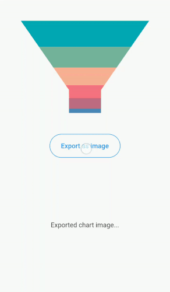

# Exporting in Flutter Funnel Chart (SfFunnelChart)

[`SfFunnelChart`](https://pub.dev/documentation/syncfusion_flutter_charts/latest/charts/SfFunnelChart-class.html) provides support to export the funnel chart as a PNG image or as PDF document.

## Export image

To export the funnel chart as a PNG image, we can get the image by calling [`toImage`](https://api.flutter.dev/flutter/rendering/RenderRepaintBoundary/toImage.html) method in repaint boundary.


 

    import 'dart:typed_data';
    import 'dart:ui' as ui;
    import 'package:flutter/material.dart';
    import 'package:syncfusion_flutter_charts/charts.dart';

    void main() {
      runApp(const MyApp());
    }

    class MyApp extends StatelessWidget {
      const MyApp({super.key});

      @override
      Widget build(BuildContext context) {
        return const MaterialApp(
            home: ExportFunnel(),
        );
      }
    }
    
    class ExportFunnel extends StatefulWidget {
      
      const ExportFunnel({Key? key}) : super(key: key);

      @override
      _ExportState createState() => _ExportState();
    }

    class _ExportState extends State<ExportFunnel> {
      _ExportState();

      late GlobalKey<SfFunnelChartState> _funnelChartKey;
      late List<ChartSampleData> _chartData;

      @override
      void initState() {
        _funnelChartKey = GlobalKey();
        _chartData = <ChartSampleData>[
          ChartSampleData(x: 'Jan', y: 12),
          ChartSampleData(x: 'Feb', y: 28),
          ChartSampleData(x: 'Mar', y: 35),
          ChartSampleData(x: 'Apr', y: 47),
          ChartSampleData(x: 'May', y: 56),
          ChartSampleData(x: 'Jun', y: 70),
        ];
        super.initState();
      }

      @override
      Widget build(BuildContext context) {
        return Scaffold(
          body: Column(
            mainAxisAlignment: MainAxisAlignment.spaceEvenly,
            children: <Widget>[
              SfFunnelChart(
                key: _funnelChartKey,
                series: FunnelSeries<ChartSampleData, String>(
                    dataSource: _chartData,
                    xValueMapper: (ChartSampleData data, _) => data.x,
                    yValueMapper: (ChartSampleData data, _) => data.y,
                  )
              ),
              TextButton(
                child: const Text('Export as image'),
                onPressed: () {
                  _renderFunnelImage();
                },
              )
            ]
          ),
        );
      }

      Future<void> _renderFunnelImage() async {
        final ui.Image data =
          await _funnelChartKey.currentState!.toImage(pixelRatio: 3.0);
        final ByteData? bytes =
          await data.toByteData(format: ui.ImageByteFormat.png);
        final Uint8List imageBytes =
          bytes!.buffer.asUint8List(bytes.offsetInBytes, bytes.lengthInBytes);
        if (!mounted) return;
        await Navigator.of(context).push<dynamic>(
          MaterialPageRoute<dynamic>(
            builder: (BuildContext context) {
              return Scaffold(
                appBar: AppBar(),
                body: Image.memory(imageBytes));
            },
          ),
        );
      }
    }

    class ChartSampleData {
      ChartSampleData({this.x, this.y});
        final String? x;
        final num? y;
    }




## Export PDF

Similar to the above way, we can also export the rendered Funnel chart as a PDF document. We create the pdf document using pdf component. This can be done in the application level itself and please find the code snippet below.

**Add dependency**

Add the following additional packages to the dependencies in your pubspec.yaml file.

 

    path_provider: ^2.0.11
    open_file: ^3.2.1
    syncfusion_flutter_pdf: ^latest_version



Include the following code snippet in the main.dart file of your flutter application to export the rendered Funnel chart as a PDF document.


 

    import 'dart:io';
    import 'dart:typed_data';
    import 'dart:ui' as ui;
    import 'dart:async';
    import 'package:flutter/material.dart';
    import 'package:open_file/open_file.dart';
    import 'package:path_provider/path_provider.dart';

    /// Chart import.
    import 'package:syncfusion_flutter_charts/charts.dart';

    /// Pdf import.
    import 'package:syncfusion_flutter_pdf/pdf.dart';

    void main() {
        runApp(const MyApp());
    }

    class MyApp extends StatelessWidget {
      const MyApp({super.key});

      @override
      Widget build(BuildContext context) {
          return const MaterialApp(
          home: ExportChartToPdf(),
        );
      }
    }

    class ExportChartToPdf extends StatefulWidget {
      const ExportChartToPdf({Key? key}) : super(key: key);

      @override
      ExportChartToPdfState createState() => ExportChartToPdfState();
    }

    class ExportChartToPdfState extends State<ExportChartToPdf> {
      ExportChartToPdfState();
      late GlobalKey<SfFunnelChartState> _funnelChartKey;
      late List<ChartSampleData> _chartData;

      @override
      void initState() {
        _funnelChartKey = GlobalKey();
        _chartData = <ChartSampleData>[
        ChartSampleData(x: 'Jan', y: 35),
        ChartSampleData(x: 'Feb', y: 28),
        ChartSampleData(x: 'Mar', y: 33),
        ChartSampleData(x: 'Apr', y: 32),
        ChartSampleData(x: 'May', y: 40),];
        super.initState();
      }

      @override
      Widget build(BuildContext context) {
        return Scaffold(
          appBar: AppBar(title: const Text('Syncfusion Flutter Charts'),),
          body: SfFunnelChart(
                key: _funnelChartKey,
                series: FunnelSeries<ChartSampleData, String>(
                    dataSource: _chartData,
                    xValueMapper: (ChartSampleData data, _) => data.x,
                    yValueMapper: (ChartSampleData data, _) => data.y,
                )
          ),
          floatingActionButton: FloatingActionButton(
              onPressed: () {
                _renderPDF();
              },
              child: const Icon(Icons.picture_as_pdf),
          ),
        );
      }

      Future<void> _renderPDF() async {
          final List<int> imageBytes = await _readImageData();
          final PdfBitmap bitmap = PdfBitmap(imageBytes);
          final PdfDocument document = PdfDocument();
          document.pageSettings.size =
          Size(bitmap.width.toDouble(), bitmap.height.toDouble());
          final PdfPage page = document.pages.add();
          final Size pageSize = page.getClientSize();
          page.graphics.drawImage(
              bitmap, Rect.fromLTWH(0, 0, pageSize.width, pageSize.height));
          final List<int> bytes = document.saveSync();
          document.dispose();
          //Get external storage directory
          final Directory directory = await getApplicationSupportDirectory();
          //Get directory path
          final String path = directory.path;
          //Create an empty file to write PDF data
          File file = File('$path/Output.pdf');
          //Write PDF bytes data
          await file.writeAsBytes(bytes, flush: true);
          //Open the PDF document in mobile
          OpenFile.open('$path/Output.pdf');
      }

      Future<List<int>> _readImageData() async {
          final ui.Image data =
              await _funnelChartKey.currentState!.toImage(pixelRatio: 3.0);
          final ByteData? bytes =
              await data.toByteData(format: ui.ImageByteFormat.png);
          return bytes!.buffer.asUint8List(bytes.offsetInBytes, bytes.lengthInBytes);
      }
    }

    class ChartSampleData {
        ChartSampleData({this.x, this.y});
        final String? x;
        final num? y;
    } 



  
  