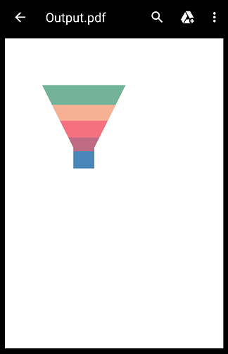

# Export Image or PDF for chart
To export the funnel chart as a PNG image or as PDF document.

## Export image
To export the funnel chart as a PNG image, we can get the image by calling [`toImage`]() method in repaint boundary.

 

    Future<void> _renderFunnelImage() async {
    dart_ui.Image data = await _funnelChartKey.currentState.toImage(pixelRatio: 3.0);
    final bytes = await data.toByteData(format: dart_ui.ImageByteFormat.png);
    if (data != null) {
      await Navigator.of(context).push(
        MaterialPageRoute(
          builder: (BuildContext context) {
            return Scaffold(
              appBar: AppBar(),
              body: Center(
                child: Container(
                  color: Colors.white,
                  child: Image.memory(bytes.buffer.asUint8List()),
                ),
              ),
            );
          },
        ),
      );
    }
    }

  

## Export PDF

 

    Future<void> _renderFunnelPDF() async {
    var document = PdfDocument();
    PdfPage page = document.pages.add();
    dart_ui.Image data = await _funnelChartKey.currentState.toImage(pixelRatio: 3.0);
    final bytes = await data.toByteData(format: dart_ui.ImageByteFormat.png);
    final Uint8List imageBytes =
        bytes.buffer.asUint8List(bytes.offsetInBytes, bytes.lengthInBytes);
    page.graphics
        .drawImage(PdfBitmap(imageBytes), Rect.fromLTWH(25, 50, 300, 300));
    var byteData = document.save();
    document.dispose();
    Directory directory = await getExternalStorageDirectory();
    String path = directory.path;
    File file = File('$path/Output.pdf');
    await file.writeAsBytes(byteData, flush: true);
    OpenFile.open('$path/Output.pdf');
    } 

  
  
  )