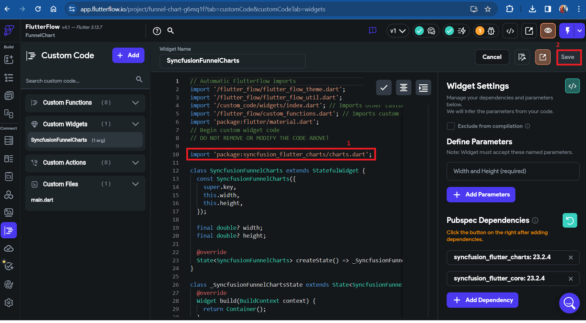

# How to add Syncfusion Funnel Chart widget in FlutterFlow?

## Overview

[FlutterFlow](https://app.flutterflow.io/dashboard) enables you to create native applications using its graphical interface, reducing the need to write extensive amounts of code. Additionally, it offers the capability to include custom widgets that are not included in the default [FlutterFlow](https://app.flutterflow.io/dashboard) widget collection. This article explains how to incorporate our SfFunnelChart widget as a custom widget in [FlutterFlow](https://app.flutterflow.io/dashboard).

### Create a new project

Navigate to the [FlutterFlow dashboard](https://app.flutterflow.io/dashboard) and click the `+ Create New` button to create a new project.

### Creating the custom widget

1. Navigate to the `Custom Code` section in the left side navigation menu.
2. Click on the `+ Add` button to open a dropdown menu, then select `Widget`.
3. Update the widget name as desired.
4. Click the `View Boilerplate Code` button on the right side, represented by this icon `[</>]`.
5. A popup will appear with startup code; locate the button labeled `</> Copy to Editor` and click on it.
6. Save the widget.

### Add Funnel Chart widget as a dependency

1. Click on `+ Add Dependency`, a text editor will appear.
2. Navigate to [Syncfusion Flutter Charts](https://pub.dev/packages/syncfusion_flutter_charts) in [pub.dev](https://pub.dev/) and copy the dependency name and version using the `Copy to Clipboard` option.

3. Paste the copied dependency into the text editor, then click `Refresh` and `Save` it.

>**Note**: The live version of [Syncfusion Flutter Charts](https://pub.dev/packages/syncfusion_flutter_charts) has been migrated to the latest version of Flutter SDK. To ensure compatibility, check [FlutterFlow](https://app.flutterflow.io/dashboard)'s current Flutter version and obtain the corresponding version of [Syncfusion Flutter Charts](https://pub.dev/packages/syncfusion_flutter_charts) by referring to the [SDK compatibility](https://help.syncfusion.com/flutter/system-requirements#sdk-version-compatibility).

>**Note**: If you are using an older version of a dependency instead of the latest one, remove the caret symbol (^) prefix in the version number after pasting the dependency. For example, change `^21.3.0` to `21.3.0`.

>**Note**: Since [Syncfusion Flutter Charts](https://pub.dev/packages/syncfusion_flutter_charts) depends on the [Syncfusion Flutter Core](https://pub.dev/packages/syncfusion_flutter_core) package, make sure to add it as a dependency following the same steps mentioned above.

### Import the package

1. Navigate to the `Installing` tab on the [Syncfusion Flutter Charts](https://pub.dev/packages/syncfusion_flutter_charts) page. Under the `Import it` section, copy the package import statement.

2. Paste the copied import statement into the code editor and then `Save` it.

### Add widget code snippet in code editor

1. Navigate to the [Example](https://pub.dev/packages/syncfusion_flutter_charts/example) tab in [Syncfusion Flutter Charts](https://pub.dev/packages/syncfusion_flutter_charts) and copy the widget specific codes.

2. Paste the copied code sample into the code editor, click `Format Code`, and `Save` it.

### Compiling the codes

1. Click the 'Compile Code' button located in the top right corner.
2. If there are no errors, save the process. If errors are present, fix them and compile the code again. Once the code has been successfully compiled, save the process.

>**Note**: The compilation progress takes 2 to 3 minutes to complete.

### Utilizing the custom widget

1. Navigate to `Widget Palette` located in the left side navigation menu.
2. Click on the `Components` tab.
3. Your custom widget will be under `Custom Code Widgets`. Drag and drop the custom widget to your page.

