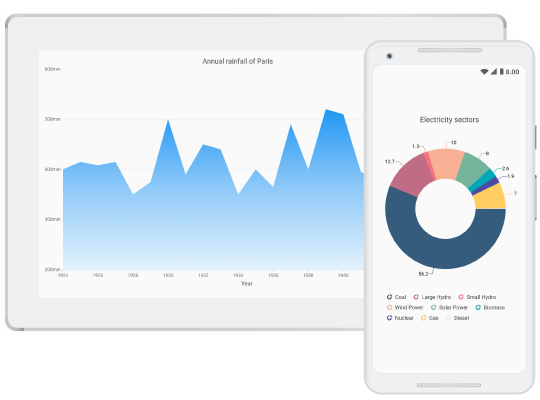

# Flutter Funnel Chart (SfFunnelChart) Overview

Syncfusion&reg; Flutter Funnel Chart (SfFunnelChart) widget is written natively in Dart for creating beautiful and high-performance Funnel chart, which are used to craft high-quality applications using Flutter.

  

## Key Features

* It supports [`Funnel`](https://www.syncfusion.com/flutter-widgets/flutter-charts/chart-types/funnel-chart) chart series and it is more user friendly and has greater UI visualization.

* The end-user experience is greatly enhanced by including the user interaction features such as callbacks, selection, tooltip, and explode in chart. 

* Legends display additional information about the chart series. The chart legend can also be used to collapse the series. The legends can be wrapped or scrolled if an item exceeds the available bounds. 

* Provides various options to customize the chart features, labels, legends, series, etc. and visualize them accordingly.
