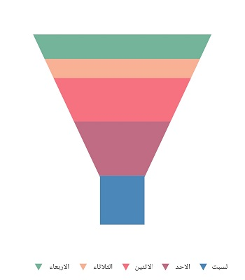
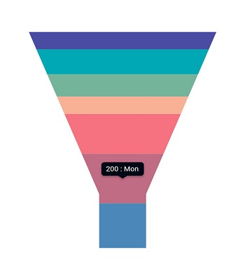

# Right to Left (RTL) support in Flutter Funnel Chart

The funnel chart supports right-to-left rendering. However, series and other chart elements render the same for both LTR and RTL, except for the legend and tooltip.

## RTL rendering ways

Right to left rendering can be switched in the following ways:

### Wrapping the SfFunnelChart with the Directionality widget

To change the rendering direction from right to left, you can wrap the [`SfFunnelChart`](https://pub.dev/documentation/syncfusion_flutter_charts/latest/charts/SfFunnelChart-class.html) widget inside the [`Directionality`](https://api.flutter.dev/flutter/widgets/Directionality-class.html) widget and set the [`textDirection`](https://api.flutter.dev/flutter/widgets/Directionality/textDirection.html) property to [`TextDirection.rtl`](https://api.flutter.dev/flutter/dart-ui/TextDirection.html#rtl).




    @override
    Widget build(BuildContext context) {
      return Scaffold(
        body: Directionality(
          textDirection: TextDirection.rtl,
          child: SfFunnelChart(
              //...
          ),
        ),
      );
    }




### Changing the locale to RTL languages

To change the chart rendering direction from right to left, you can change the [`locale`](https://api.flutter.dev/flutter/material/MaterialApp/locale.html) to any RTL language such as Arabic, Persian, Hebrew, Pashto, or Urdu.




    /// Package import
    import 'package:flutter_localizations/flutter_localizations.dart';
    import 'package:syncfusion_localizations/syncfusion_localizations.dart';

    // ...

    @override
    Widget build(BuildContext context) {
      return MaterialApp(
        localizationsDelegates: [
          GlobalMaterialLocalizations.delegate,
          GlobalWidgetsLocalizations.delegate,
        ],
        supportedLocales: <Locale>[
          Locale('en'),
          Locale('ar'),
          // ... other locales the app supports
        ],
        locale: Locale('ar'),
        home: Scaffold(
          body: SfFunnelChart(
            //...
          ),
        )
      );
    }




## RTL-supported chart elements

### Legend

Right-to-left rendering affects the legend in the chart. Legend items are rendered from right to left; that is, the legend text appears on the left first, followed by the legend icon on the right.




    @override
    Widget build(BuildContext context) {
      final List<ChartData> chartData = <ChartData>[
        ChartData('Jan', 24),
        ChartData('Feb', 20),
        ChartData('Mar', 35),
        ChartData('Apr', 27),
        ChartData('May', 30),
      ];
      return Scaffold(
        body: Directionality(
          textDirection: TextDirection.rtl,
          child: SfFunnelChart(
            legend: Legend(isVisible: true),
            series: FunnelSeries<ChartData, String>(
                dataSource: chartData,
                xValueMapper: (ChartData data, _) => data.x,
                yValueMapper: (ChartData data, _) => data.y,
            )
          )
        )
      );
    }  

    class ChartData {
      ChartData(this.x, this.y);
        final String x;
        final int y;
    }




### Tooltip

Right-to-left rendering is applicable to [`tooltip`](https://pub.dev/documentation/syncfusion_flutter_charts/latest/charts/TooltipBehavior-class.html) elements. By default, the tooltip content is `point.x : point.y`; in RTL rendering, the tooltip content becomes `point.y : point.x`. If you want the format to remain unchanged despite RTL rendering, you can use the [`onTooltipRender`](https://pub.dev/documentation/syncfusion_flutter_charts/latest/charts/SfFunnelChart/onTooltipRender.html) callback.




    late TooltipBehavior _tooltipBehavior;

    @override
    void initState(){
      _tooltipBehavior = TooltipBehavior(enable: true);
      super.initState(); 
    }

    @override
    Widget build(BuildContext context) {
      final List<ChartData> chartData = <ChartData>[
        ChartData('Jan', 24),
        ChartData('Feb', 20),
        ChartData('Mar', 35),
        ChartData('Apr', 27),
        ChartData('May', 30),
      ];
      return Scaffold(
        body: Directionality(
          textDirection: TextDirection.rtl,
          child: SfFunnelChart(
            tooltipBehavior: _tooltipBehavior,
            series: FunnelSeries<ChartData, String>(
                dataSource: chartData,
                xValueMapper: (ChartData data, _) => data.x,
                yValueMapper: (ChartData data, _) => data.y,
            )
          )
        )
      );
    }  

    class ChartData {
      ChartData(this.x, this.y);
        final String x;
        final int y;
    }




