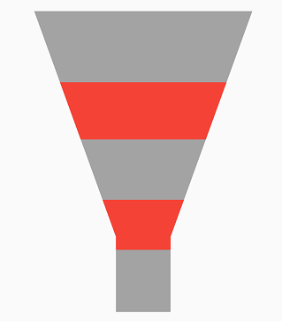

# Selection in Flutter Funnel Chart (SfFunnelChart)

The selection feature in chart let you to select a segment in a series or the series itself. This features allows you to select either individual or cluster of segments in the chart series.

 

    late SelectionBehavior _selectionBehavior;

    @override
    void initState(){
      _selectionBehavior = SelectionBehavio(
             // Enables the selection
             enable: true
      );
      super.initState();
    }

    @override
    Widget build(BuildContext context) {
      return Scaffold(
        body: Center(
          child: Container(
            child: SfFunnelChart(
              series: FunnelSeries<SalesData, String>(
                  dataSource: chartData,
                  xValueMapper: (SalesData sales, _) =>   sales.year,
                  yValueMapper: (SalesData sales, _) => sales.sales,
                  selectionBehavior: _selectionBehavior
                )
            )
          )
        )
      );
    }



## Customizing the segments

You can customize the segments using the below properties.

* [`selectedColor`](https://pub.dev/documentation/syncfusion_flutter_charts/latest/charts/SelectionBehavior/selectedColor.html) - used to change the background color of selected segment.
* [`unselectedColor`](https://pub.dev/documentation/syncfusion_flutter_charts/latest/charts/SelectionBehavior/unselectedColor.html) - used to change the background color of unselected segment.
* [`selectedBorderColor`](https://pub.dev/documentation/syncfusion_flutter_charts/latest/charts/SelectionBehavior/selectedBorderColor.html) - used to change the stroke color of the selected segment.
* [`selectedBorderWidth`](https://pub.dev/documentation/syncfusion_flutter_charts/latest/charts/SelectionBehavior/selectedBorderWidth.html) - used to change the stroke width of the selected segment.
* [`unselectedBorderColor`](https://pub.dev/documentation/syncfusion_flutter_charts/latest/charts/SelectionBehavior/unselectedBorderColor.html) - used to change the stroke color of the unselected segment.
* [`unselectedBorderWidth`](https://pub.dev/documentation/syncfusion_flutter_charts/latest/charts/SelectionBehavior/unselectedBorderWidth.html) - used to change the stroke width of the unselected segment.
* [`selectedOpacity`](https://pub.dev/documentation/syncfusion_flutter_charts/latest/charts/SelectionBehavior/selectedOpacity.html) - used to control the transparency of the selected segment.
* [`unselectedOpacity`](https://pub.dev/documentation/syncfusion_flutter_charts/latest/charts/SelectionBehavior/unselectedOpacity.html) - used to control the transparency of the unselected segment.

 
    
    late SelectionBehavior _selectionBehavior;

    @override
    void initState(){
      _selectionBehavior = SelectionBehavior(
                    // Enables the selection
                    enable: true,
                    selectedColor: Colors.red,
                    unselectedColor: Colors.grey,
                    );
      super.initState();
    }

    @override
    Widget build(BuildContext context) {
      return Scaffold(
        body: Center(
          child: Container(
            child: SfFunnelChart(
              series: FunnelSeries<SalesData, String>(
                  dataSource: chartData,
                  xValueMapper: (SalesData sales, _) =>   sales.year,
                  yValueMapper: (SalesData sales, _) => sales.sales,
                  selectionBehavior: _selectionBehavior
                )
            )
          )
        )
      );
    }



## Multi-selection

Multiple selection can be enabled using the [`enableMultiSelection`](https://pub.dev/documentation/syncfusion_flutter_charts/latest/charts/SfFunnelChart/enableMultiSelection.html) property of chart.

 

    @override
    Widget build(BuildContext context) {
        return Scaffold(
            body: Center(
                child: Container(
                    child: SfFunnelChart(
                        // Enables multiple selection
                        enableMultiSelection: true
                    )
                )
            )
        );
    }



## Selection on initial rendering

You can select a point or series programmatically on a chart using [`initialSelectedDataIndexes`](https://pub.dev/documentation/syncfusion_flutter_charts/latest/charts/FunnelSeries/initialSelectedDataIndexes.html) property of chart.

 

    @override
    Widget build(BuildContext context) {
        return Scaffold(
            body: Center(
                child: Container(
                    child: SfFunnelChart(
                        initialSelectedDataIndexes: [1, 0]
                    )
                )
            )
        );
    }



## Toggle selection

You can decide, whether to deselect the selected data point/series or remain selected when interacted with it again by setting the [`toggleSelection`](https://pub.dev/documentation/syncfusion_flutter_charts/latest/charts/SelectionBehavior/toggleSelection.html) property true or false. If set to true, deselection will be performed else the point will not get deselected.
This works even while calling public methods, in various selection modes, with multi-selection, and also on dynamic changes.
Defaults to true.

 
   
    late SelectionBehavior _selectionBehavior;

    @override
    void initState(){
      _selectionBehavior =   SelectionBehavior(
                enable: true,
                toggleSelection: false,
              );
      super.initState(); 
    }

    @override
    Widget build(BuildContext context) {
      return Scaffold(
        body: Center(
          child: Container(
            child: SfFunnelChart(
              series: FunnelSeries<SalesData, String>(
              dataSource: chartData1,
              xValueMapper: (ChartData data, _) => data.x,
              yValueMapper: (ChartData data, _) => data.y,
              selectionBehavior: _selectionBehavior)
        ))));
    }



Also refer [selection event](./events#onselectionchanged) for customizing the selection further.

## Methods in SelectionBehavior

### SelectDataPoints method in SelectionBehavior

The [`selectDataPoints`](https://pub.dev/documentation/syncfusion_flutter_charts/latest/charts/SelectionBehavior/selectDataPoints.html) method is used to select the data point programmatically. The required arguments are listed below.

* [`pointIndex`](https://pub.dev/documentation/syncfusion_flutter_charts/latest/charts/SelectionArgs/pointIndex.html) - index of the point which needs to be selected.
* [`seriesIndex`](https://pub.dev/documentation/syncfusion_flutter_charts/latest/charts/SelectionArgs/pointIndex.html) - index of the series for which the pointIndex is specified and this is an optional parameter. By default it will be considered as 0.

N>: The [`enableMultiSelection`](https://pub.dev/documentation/syncfusion_flutter_charts/latest/charts/SfCartesianChart/enableMultiSelection.html) is also applicable for this but, it is based on the API values specified in the chart.



    late SfFunnelChart chart;
    late SelectionBehavior _selectionBehavior;

    @override
    void initState(){
      _selectionBehavior = SelectionBehavior(enable: true);
      super.initState();
    }

    @override
    Widget build(BuildContext context) {
    
    final List<ChartData> chartData = [
      ChartData(10, 17),
      ChartData(20, 34)
      // Add the required data
    ];
    chart = SfFunnelChart(
      series: FunnelSeries<ChartData, double>(
            dataSource: chartData,
            xValueMapper: (ChartData data, _) => data.x,
            yValueMapper: (ChartData data, _) => data.y,
            selectionBehavior: _selectionBehavior
        )
    );
    
    return Scaffold(
      body: Center(
        child: Column(
          children: <Widget>[
            FlatButton(
              child: Text('Select'),
              onPressed: select
            ),
            Container(child: chart)
          ]
        )
      )
    );
    }
    void select() {
        _selectionBehavior.selectDataPoints(1, 0);
    }

