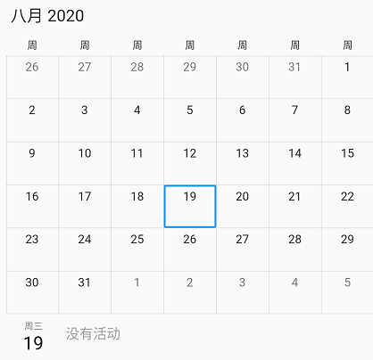
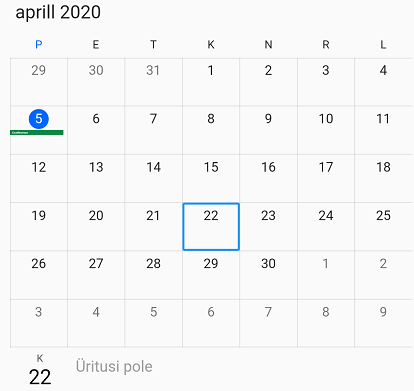

# Globalization for Syncfusion widgets

## Date and number formats

Our Syncfusion Flutter widgets will format the culturally based date, currency and numbers.

* [`chart`](https://pub.dev/packages/syncfusion_flutter_charts) - Supports formats with number, date, and currency.
* [`calendar`](https://pub.dev/packages/syncfusion_flutter_calendar) - Supports with date format.
* [`sliders`](https://pub.dev/packages/syncfusion_flutter_sliders) - Supports formats with number and date.

## Localizations

By default, the Syncfusion widgets are implemented with English localization (en-US) alone. You can add support for other languages by including our another package named [`syncfusion_localizations`](https://pub.dev/packages/syncfusion_localizations). As of now, this package supports 74 languages which are listed below.

*  af - Afrikaans 
*  am - Amharic 
*  ar - Arabic 
*  az - Azerbaijani 
*  be - Belarusian 
*  bg - Bulgarian 
*  bn - Bengali Bangla 
*  bs - Bosnian 
*  ca - Catalan Valencian 
*  cs - Czech 
*  da - Danish 
*  de - German 
*  el - Modern Greek 
*  en - English 
*  es - Spanish Castilian 
*  et - Estonian 
*  eu - Basque 
*  fa - Persian 
*  fi - Finnish 
*  fil - Filipino Pilipino 
*  fr - French 
*  gl - Galician 
*  gu - Gujarati 
*  he - Hebrew 
*  hi - Hindi 
*  hr - Croatian 
*  hu - Hungarian 
*  hy - Armenian 
*  id - Indonesian 
*  is - Icelandic 
*  it - Italian 
*  ja - Japanese 
*  ka - Georgian 
*  kk - Kazakh 
*  km - Khmer Central Khmer 
*  kn - Kannada 
*  ko - Korean 
*  ky - Kirghiz Kyrgyz 
*  lo - Lao 
*  lt - Lithuanian
*  lv - Latvian 
*  mk - Macedonian 
*  ml - Malayalam 
*  mn - Mongolian 
*  mr - Marathi 
*  ms - Malay 
*  my - Burmese 
*  nb - Norwegian Bokmål 
*  ne - Nepali 
*  nl - Dutch Flemish 
*  pa - Panjabi Punjabi 
*  pl - Polish 
*  ps - Pushto Pashto 
*  pt - Portuguese (+ one country variation) 
*  ro - Romanian Moldavian Moldovan 
*  ru - Russian 
*  si - Sinhala Sinhalese 
*  sk - Slovak 
*  sl - Slovenian 
*  sq - Albanian 
*  sr - Serbian 
*  sv - Swedish 
*  sw - Swahili 
*  ta - Tamil 
*  te - Telugu 
*  th - Thai 
*  tl - Tagalog 
*  tr - Turkish 
*  uk - Ukrainian 
*  ur - Urdu 
*  uz - Uzbek 
*  vi - Vietnamese 
*  zh - Chinese (+ 2 country variations) 
*  zu - Zulu

### How to use syncfusion_localizations package

Here we have depicted the working layout of the [`localization`](https://pub.dev/packages/syncfusion_localizations) widget using the [`calendar`](https://pub.dev/packages/syncfusion_flutter_calendar) widget.

To accomplish this add to your pub spec file the [`syncfusion_localizations`](https://pub.dev/packages/syncfusion_localizations) and the [`syncfusion_flutter_calendar`](https://pub.dev/packages/syncfusion_flutter_calendar) packages as dependency.

 

    dependencies:

    syncfusion_flutter_calendar: ^xx.x.xx
    syncfusion_localizations: ^xx.x.xx



N> Here **xx.x.xx** denotes the current version of [`Syncfusion Flutter`](https://pub.dev/publishers/syncfusion.com/packages ) widgets.

**Get packages**

Run the following command to get the required packages.

 

    $ flutter pub get



**Import package**

To use the [`Syncfusion Localization`](https://pub.dev/packages/syncfusion_localizations) and [`Syncfusion Flutter Calendar`](https://pub.dev/packages/syncfusion_flutter_calendar) widgets, import the following libraries in your Dart code.

 

    import 'package:syncfusion_flutter_calendar/calendar.dart';
    import 'package:syncfusion_localizations/syncfusion_localizations.dart';



**Initialize calendar**

After importing the required packages, initialize the [`calendar`](https://pub.dev/packages/syncfusion_flutter_calendar) widget as a child of any widget and specify `localizationsDelegates` and `supportedLocales` for the MaterialApp.

 

    // Localizations configurations
    @override
    Widget build(BuildContext context) {
        return MaterialApp(
            localizationsDelegates: [
                // ... app-specific localization delegate[s] here
                SfGlobalLocalizations.delegate
            ],
            supportedLocales: [
                const Locale('en'),
                const Locale('fr'),
                // ... other locales the app supports
            ],
            locale: const Locale('fr'),
            home: MyHomePage(),
        );
    }

    // Calendar configurations
    @override
    Widget build(BuildContext context) {
        return Scaffold(
            body: SfCalendar(
                view: CalendarView.month,
                // Other configurations
            )
        );
    }



The example for reference can be found [`here`](https://pub.dev/packages/syncfusion_localizations#-example-tab-).

And some languages may require more than language code to differentiate properly. Consider the Chinese language for example, here we can specify the language code, script code, and country code. This is because of the existence of simplified and traditional script, as well as regional differences in the way characters are written within the same script type.

 

    supportedLocales: [
        const Locale.fromSubtags(languageCode: 'zh'), // generic Chinese 'zh'
        const Locale.fromSubtags(languageCode: 'zh', scriptCode: 'Hant'), // generic traditional Chinese 'zh_Hant'
        const Locale.fromSubtags(languageCode: 'zh', scriptCode: 'Hant', countryCode: 'TW'), // 'zh_Hant_TW'
    ],



### Custom culture support

If you wish to add your own custom culture apart from the supported 74 languages, you can use the extendability options to achieve this in the application level. Here, we have depicted using the Estonian(et) language.

**Step 1**

Create a dart file in your application and import the required packages.

 
    import 'package:flutter/foundation.dart';
    import 'package:flutter/material.dart';
    import 'package:syncfusion_flutter_core/localizations.dart';


**Step 2**

 Create a class for `Estonian` which extends from [`SfLocalizations`](https://pub.dev/documentation/syncfusion_flutter_core/latest/localizations/SfLocalizations-class.html)

  

    /// The translations for Estonian (`et`).
    class SfLocalizationsEt extends SfLocalizations{
        SfLocalizationsEt();

        @override
        String get noEventsCalendarLabel => 'Pole valitud kuupäeva';

        @override
        String get noSelectedDateCalendarLabel => 'Üritusi pole';
    }



**Step 3**

Create a delegate for the `Estonian` language.

 

    class SfLocalizationsEtDelegate extends LocalizationsDelegate<SfLocalizations> {
        const SfLocalizationsEtDelegate();

        @override
        bool isSupported(Locale locale) => locale.languageCode == 'et';

        @override
        Future<SfLocalizations> load(Locale locale) {
            return SynchronousFuture<SfLocalizations>(SfLocalizationsEt());
        }

        @override
        bool shouldReload(LocalizationsDelegate<SfLocalizations> old) => false;
    }



**Step 4**

Import the created dart file in your application and specify the `localizationsDelegates`, `supportedLocales` and `locale`. Then run your application.

 

    //import your dart file here
    import './localization_extendability.dart';

    @override
    Widget build(BuildContext context) {
        return MaterialApp(

            localizationsDelegates: [
                GlobalMaterialLocalizations.delegate,
                SfGlobalLocalizations.delegate,
                
                //Specify the delegate directly
                SfLocalizationsEtDelegate()
            ],

            supportedLocales: [
                const Locale('en'),

                //Specify the suported locales here
                const Locale('et'),
            ],

            //Specify the locale here
            locale: const Locale('et'),

            // Other configurations
        );
    }



The sample for reference can be found below.

[`Localization extendability sample`](https://www.syncfusion.com/downloads/support/directtrac/general/ze/sync_localizations275997229)