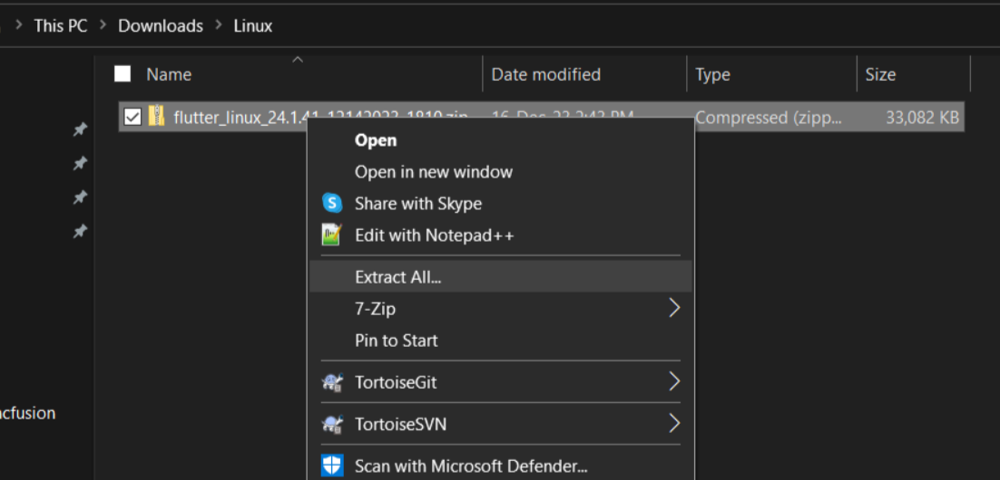
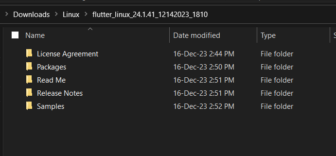

# Installing Syncfusion<sup>&reg;</sup> Flutter Linux installer

## Prerequisites

* You must have a Syncfusion account. If you do not have one, sign up at [Syncfusion Account](https://www.syncfusion.com/account/register).
* You must have already downloaded the Syncfusion<sup>&reg;</sup> Flutter Linux installer (ZIP) from the [Linux installer download page](https://help.syncfusion.com/flutter/installation/linux-installer/how-to-download).
* Flutter SDK 3.0 or later must be installed on the development machine.

## Step-by-Step Installation

The steps below show how to install the Flutter Linux installer.

1. Extract the Syncfusion<sup>&reg;</sup> Flutter Linux installer (`.zip`) file. The files are extracted to your machine.

   

2. The Linux ZIP file contains the following folders:

   * `samples` – Sample applications demonstrating Syncfusion<sup>&reg;</sup> Flutter widgets.
   * `packages` – Syncfusion<sup>&reg;</sup> Flutter packages required to run the samples.

   
   
   > N> An unlock key is not required to install the Linux installer.

3. Open a terminal and navigate to the extracted `samples` folder:

   ```bash
   cd <extracted_path>/samples
   ```

4. Install the sample dependencies and run the demo:

   ```bash
   flutter pub get
   flutter run
   ```

## License key registration in samples

After installation, the license key is required to register the demo source that is included in the Linux installer. To learn about the steps for license registration for the Flutter Linux installer, refer to the [licensing overview](https://help.syncfusion.com/flutter/licensing/overview).

Register the license key in the `main` method of your application by importing the license package and calling `SyncfusionLicenseProvider.registerLicense`:

```dart
import 'package:syncfusion_flutter_core/core.dart';

void main() {
  SyncfusionLicenseProvider.registerLicense('YOUR_LICENSE_KEY');
  runApp(const MyApp());
}
```

> N> If you are using Syncfusion<sup>&reg;</sup> controls prior to version 18.3.0.x, refer to the [legacy licensing guide](https://help.syncfusion.com/flutter/licensing/overview) for older registration steps.