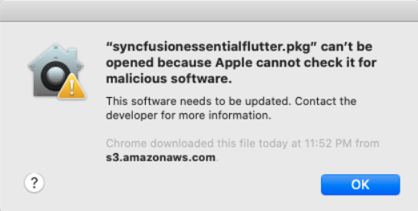
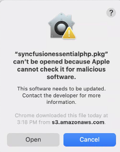
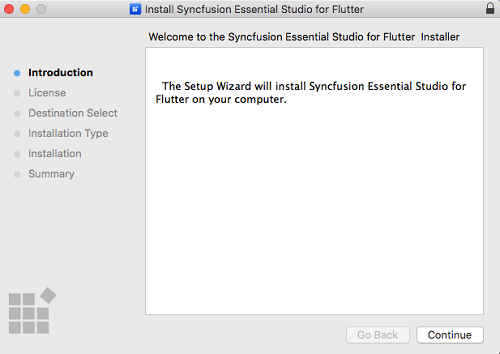
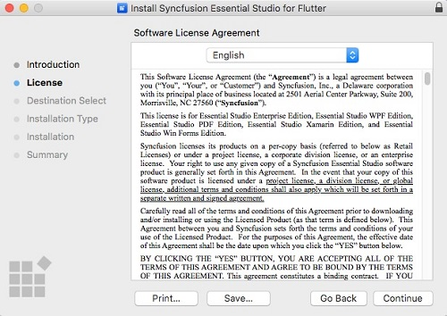
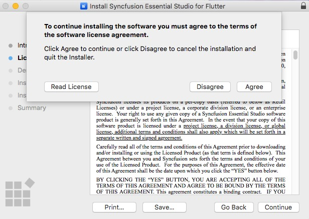
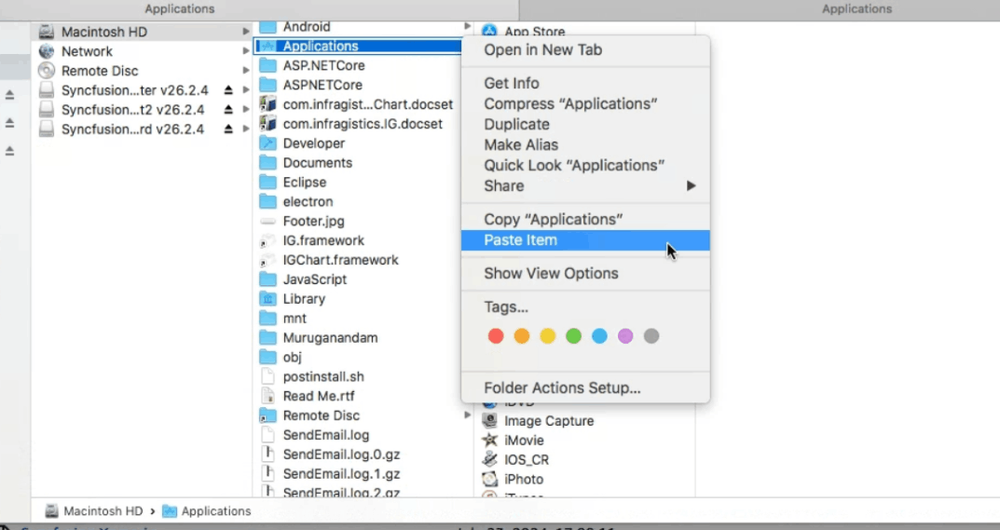
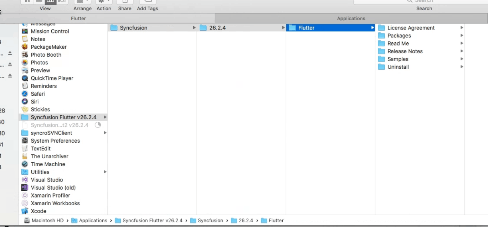
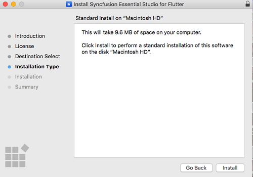

# Installing Syncfusion<sup>&reg;</sup> Flutter Mac Installer

The Essential Studio<sup>&reg;</sup> Flutter Mac installer allows you to develop Flutter applications with the Syncfusion<sup>&reg;</sup> Flutter components using your preferred IDE (such as Visual Studio Code or Android Studio).


## Steps to resolve the warning message in Catalina OS or later

   While running Essential Studio<sup>&reg;</sup> Flutter Mac Installer on Catalina MacOS or later, the below alert will be displayed.

     
     
   If you receive this alert, follow the below steps for the easiest solution.   

   1.	Right-click the downloaded DMG file.
   2.	Select the "Open With" option and choose "DiskImageMounter (Default)". The following pop-up appears.

	    

   3.	When you click "Open", the installer window will open. Continue with the Step-by-step Installation below.

## Step-by-Step Installation

The steps below show how to install the Essential Studio<sup>&reg;</sup> Flutter Mac installer.

1. Locate the downloaded DMG file and open the file by double-click on it.

   
   

2. This action will automatically mount the disk image and create a virtual drive on your desktop or in the Finder sidebar.

      
   

3. Copy the Syncfusion icon from the mounted disk.

   
   
   N> The Unlock key is not required to install the Mac installer. The Syncfusion Essential Studio<sup>&reg;</sup> Flutter Mac installer can be used for development purposes without registering the Unlock key.


4. Paste it into the "Applications" folder shortcut.

   


5. Now you can open the folder to explore the Syncfusion Essential Studio<sup>&reg;</sup> Mac installer.

   


6. To remove the DMG file, right-click on the virtual drive on your desktop or in the Finder sidebar and select "Eject." Then delete the folder from the Applications.

   

   
## License key registration in samples

After the installation, if you are using Syncfusion<sup>&reg;</sup> controls prior to version 18.3.0.x, you must register the license key. To learn about the steps for license registration, please refer to the [licensing overview](https://help.syncfusion.com/flutter/licensing/overview).

Register the license key in the **main method** of your application and import the `syncfusion_flutter_core/core.dart` library:

```dart
import 'package:syncfusion_flutter_core/core.dart';

void main() {
  // Register Syncfusion license
  SyncfusionLicense.registerLicense('YOUR LICENSE KEY');
  runApp(const MyApp());
}
```