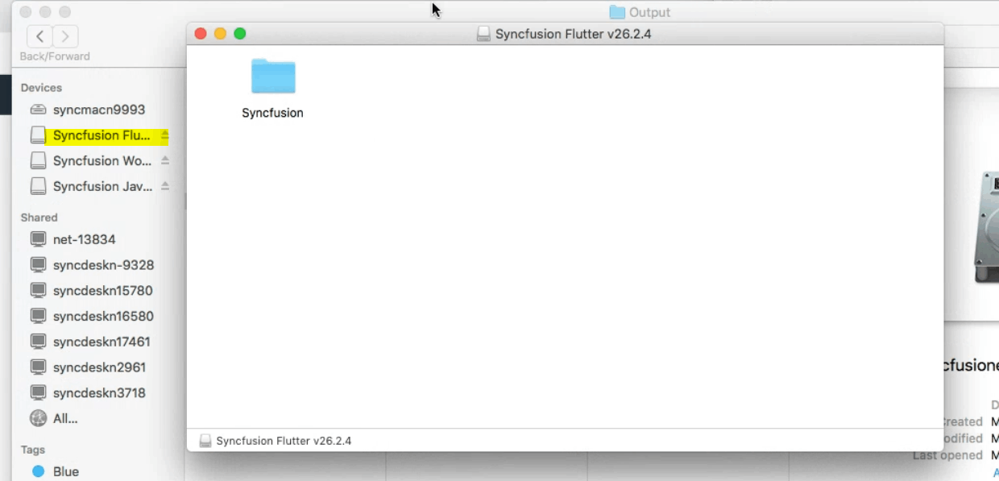
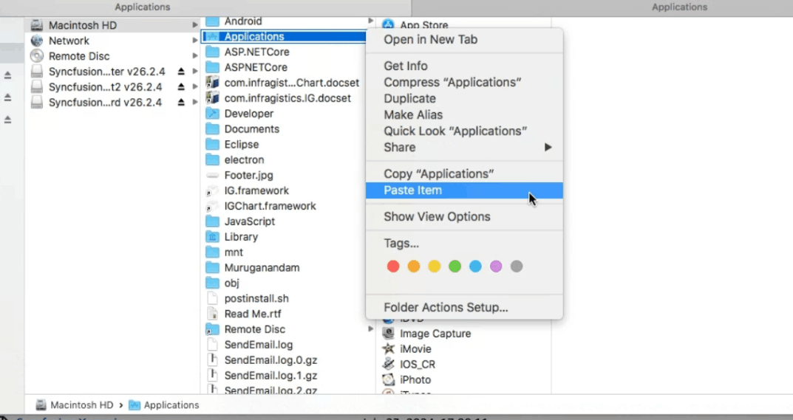
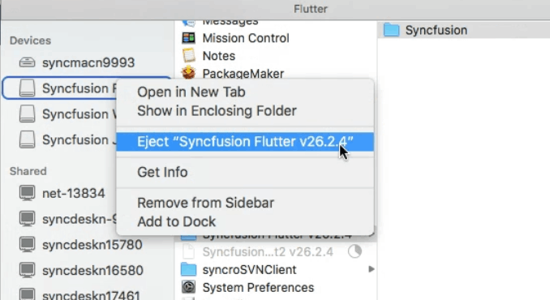

# Installing Syncfusion&reg; Flutter Mac Installer

The Essential Studio&reg; Flutter Mac installer allows you to create the Flutter application in Visual Studio for Mac with the Syncfusion&reg; Flutter components.

## Steps to resolve the warning message in Catalina OS or later

   While running Essential Studio&reg; Flutter Mac Installer on Catalina MacOS or later, the below alert will be displayed.

     
     
   If you receive this alert, follow the below steps for the easiest solution.   

   1.	Right-click the downloaded DMG file.
   2.	Select the "Open With" option and choose "DiskImageMounter (Default)". The following pop-up appears.

	    

   3.	When you click "Open" the installer window will be opened.

## Step-by-Step Installation

The steps below show how to install the Essential Studio&reg; Flutter Mac installer.

1. Locate the downloaded DMG file and open the file by double-click on it.

   
   

2. This action will automatically mount the disk image and create a virtual drive on your desktop or in the Finder sidebar.

      
   

3. Copy the mounted disk file.

   
   
   N> The Unlock key is not required to install the Mac installer. The Syncfusion Essential Studio&reg; Flutter Mac installer can be used for development purposes without registering the Unlock key..

4. And paste it in “Applications” folder shortcut.

   

5. Now you can open the folder to explore the Syncfusion Essential Studio&reg; Mac installer.

   

6. To remove the DMG file, right-click on the virtual drive on your desktop or in the Finder sidebar and select “Eject.” Also delete the folder from the Applications

   

   
## License key registration in samples

After the installation, the license key is required to register the demo source that is included in the Mac installer. To learn about the steps for license registration for the Flutter Mac installer, please refer to this.

If you are using Syncfusion&reg; controls prior to version 18.3.0.x, please follow the following steps to register your license key.

Register the license key in the [main method](https://help.syncfusion.com/flutter/licensing/overview) of your example and import the ‘syncfusion_flutter_core/core.dart’ library.