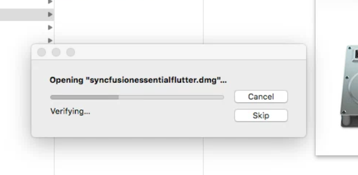
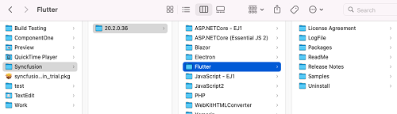

# Installing Syncfusion Flutter Mac Installer

The Essential Studio Flutter Mac installer allows you to create the Flutter application in Visual Studio for Mac with the Syncfusion Flutter components.

## Steps to resolve the warning message in Catalina OS or later

   While running Essential Studio Flutter Mac Installer on Catalina MacOS or later, the below alert will be displayed.

     
     
   If you receive this alert, follow the below steps for the easiest solution.   

   1.	Right-click the downloaded pkg file.
   2.	Select the "Open With" option and choose "Installer (Default)". The following pop-up appears.

	

   3.	When you click "Open" the installer window will be opened.

## Step-by-Step Installation

The steps below show how to install the Essential Studio Flutter Mac installer. 

1. Open the Syncfusion Flutter Mac Installer(.pkg) file from downloaded location by double-clicking it. The Syncfusion Essential Studio Flutter Mac Installer's welcome wizard will be displayed. Click the Continue button.

   
   

2. The Software License Agreement wizard will appear. Click the Continue button.

      
   

3. The License Agreement's Confirmation window will appear. If you have read the Software License Agreement, click **Agree**.

   
   
   N> The Unlock key is not required to install the Mac installer. The Syncfusion Essential Studio Flutter Mac installer can be used for development purposes without registering the Unlock key..

4. The Destination select wizard will appear. You can choose which disc to install the Syncfusion Essential Studio for Flutter installer on here.

   

5. The Installation Type wizard will appear. Click Install to begin the standard installation of the Syncfusion Essential Studio Flutter Mac installer.

   

6. The Authentication window will appear. To begin the installation, enter the Mac machine's password and click **Install Software**.

   

7. The installation process will begin on your machine. 
   
   
   
8. Once the installation is complete, the completed screen will be displayed. To exit the installation wizard, click Close. 

   
    
   The files will be installed in the following location by default in the Mac installer.

   **Location:** {Documents}\Syncfusion\ {version}\ {platform}
   
   
   
   
