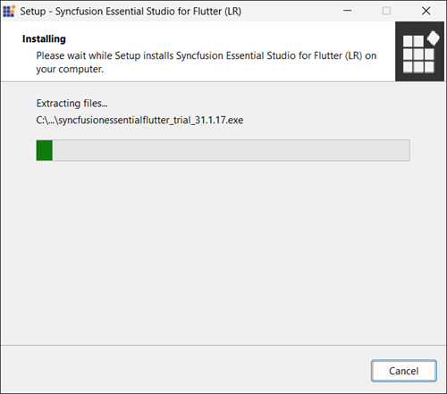
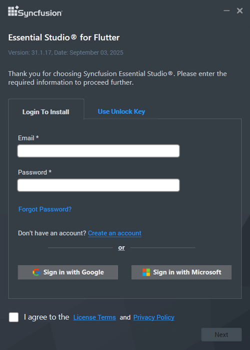
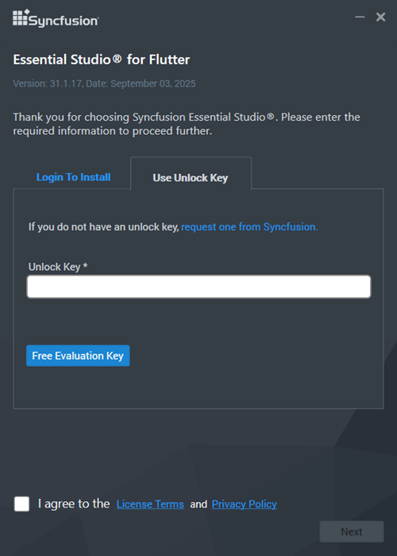
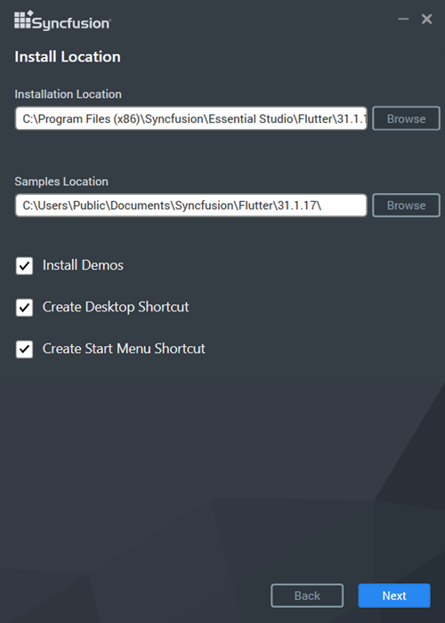
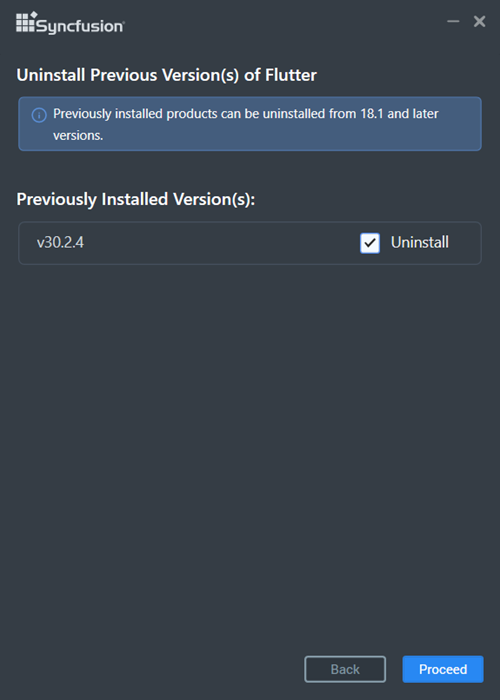
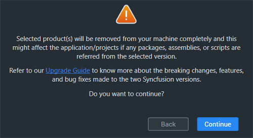
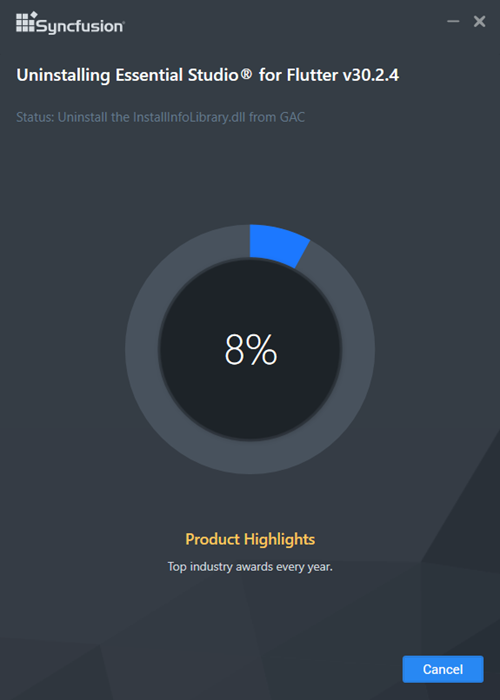
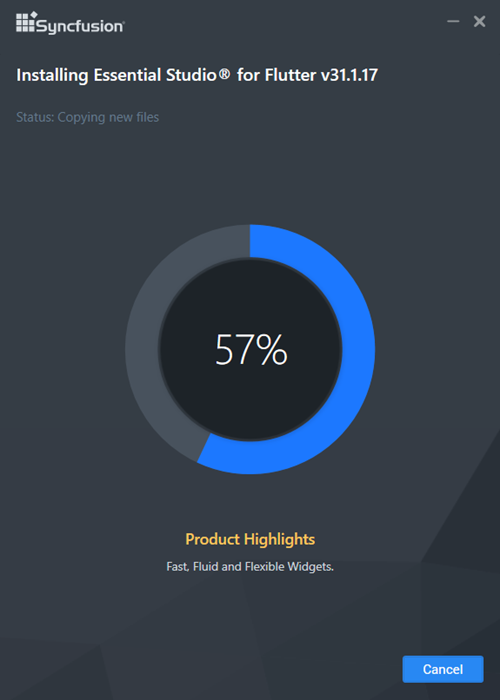
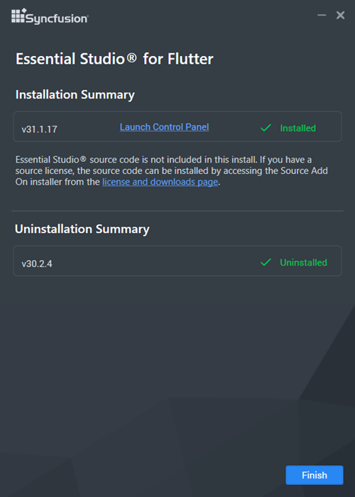

# Installing Syncfusion&reg;  Flutter Offline Installer

## Installing with UI   

The steps below show how to install the Essential Studio&reg; Flutter product.

1.	Open the Syncfusion&reg;  Flutter offline installer file from downloaded location by double-clicking it. The Installer Wizard automatically opens and extracts the package.

    

    N> The Installer wizard extracts the syncfusionessentialflutter_(version).exe dialog, which displays the package's unzip operation.

2.	To unlock the Syncfusion&reg;  offline installer, you have two options:

   
    * *Login To Install*
   
    * *Use Unlock Key*
   
   
   
    **Login To Install**
   
    You must enter your Syncfusion&reg;  email address and password. If you don't already have a Syncfusion&reg;  account, you can sign up for one by clicking **"Create an account"**. If you have forgotten your password, click on **"Forgot Password"** to create a new one. Once you've entered your Syncfusion&reg;  email and password, click Next.

       

    **Use Unlock Key**
   
    Unlock keys are used to unlock the Syncfusion&reg;  offline installer, and they are platform and version specific. You should use either Syncfusion&reg;  licensed or trial Unlock key to unlock Syncfusion&reg;  Flutter installer.
   
    The trial unlock key is only valid for 30 days, and the installer will not accept an expired trial key. 
   
    To learn how to generate an unlock key for both trial and licensed products, see [this](https://support.syncfusion.com/kb/article/2757/how-to-generate-syncfusion-setup-unlock-key-from-syncfusion-support-account) Knowledge Base article.

       

3.	After reading the License Terms and Privacy Policy, check the **“I agree to the License Terms and Privacy Policy”** check box. Click the Next button.

4.	Change the install and sample locations here. You can also change the Additional settings. Click Next\Install to install with the default settings.

    

    **Additional Settings**
    
	* Select the **Install Demos** check box to install Syncfusion&reg;  samples, or leave the check box unchecked, if you do not want to install Syncfusion&reg;  samples.
    * Check the **Create Desktop Shortcut** checkbox to add a desktop shortcut for Syncfusion&reg;  Control Panel.
    * Check the **Create Start Menu Shortcut** checkbox to add a shortcut to the start menu for Syncfusion&reg;  Control Panel.

5.	If any previous versions of the current product is installed, the Uninstall Previous Version(s) wizard will be opened. Select **Uninstall** checkbox to uninstall the previous versions and then click the Proceed button.

    
	
	
	N> From the 2021 Volume 1 release, Syncfusion&reg;  has added the option to uninstall previous versions from 18.1 while installing the new version.
	
	
	N> If any version is selected to uninstall, a confirmation screen will appear; if continue is selected, the Progress screen will display the uninstall and install progress, respectively. If none of the versions are chosen to be uninstalled, only the installation progress will be displayed.
	
	**Confirmation Alert**
	
	
	
	**Uninstall Progress:**
	
	
	
	**Install Progress**
	
	

    N> The Completed screen is displayed once the Flutter product is installed. If any version is selected to uninstall, The completed screen will display both install and uninstall status.
	
	
	
7.  After installing, click the **Launch Control Panel** link to open the Syncfusion&reg;  Control Panel.

8.  Click the Finish button. Your system has been installed with the Syncfusion Essential Studio&reg; Flutter platform.

## Installing in silent mode

The Syncfusion Essential Studio&reg; Flutter Installer supports installation and uninstallation via the command line.

### Command Line Installation

To install through the Command Line in Silent mode, follow the steps below.

1.	Run the Syncfusion&reg;  Flutter installer by double-clicking it. The Installer Wizard automatically opens and extracts the package.
2.	The file syncfusionessentialflutter_(version).exe file will be extracted into the Temp directory.
3.	Run %temp%. The Temp folder will be opened. The syncfusionessentialflutter_(version).exe file will be located in one of the folders.
4.	Copy the extracted syncfusionessentialflutter_(version).exe file in local drive.
5.	Exit the Wizard.
6.	Run Command Prompt in administrator mode and enter the following arguments.

    **Arguments:** “installer file path\SyncfusionEssentialStudio(product)_(version).exe” /Install silent /PIDKEY:“(product unlock key)” [/log “{Log file path}”] [/InstallPath:{Location to install}] [/InstallSamples:{true/false}] [/CreateShortcut:{true/false}] [/CreateStartMenuShortcut:{true/false}]

    N> [..] – Arguments inside the square brackets are optional.

    **Example:** “D:\Temp\syncfusionessentialflutter_x.x.x.x.exe” /Install silent /PIDKEY:“product unlock key” /log “C:\Temp\EssentialStudio_Platform.log” /InstallPath:C:\Syncfusion\x.x.x.x /InstallSamples:true /CreateShortcut:true /CreateStartMenuShortcut:true

	
7.  Essential Studio&reg; for Flutter is installed.

    N> x.x.x.x should be replaced with the Essential Studio&reg; version and the Product Unlock Key needs to be replaced with the Unlock Key for that version.
   

### Command Line Uninstallation

Syncfusion Essential&reg;  Flutter can be uninstalled silently using the Command Line.

1.	Run the Syncfusion&reg;  Flutter installer by double-clicking it. The Installer Wizard automatically opens and extracts the package.
2.	The file syncfusionessentialflutter_(version).exe file will be extracted into the Temp directory.
3.	Run %temp%. The Temp folder will be opened. The syncfusionessentialflutter_(version).exe file will be located in one of the folders.
4.	Copy the extracted syncfusionessentialflutter_(version).exe file in local drive.
5.	Exit the Wizard.
6.	Run Command Prompt in administrator mode and enter the following arguments.

   
    **Arguments:** “Copied installer file path\syncfusionessentialflutter_(version).exe” /uninstall silent 

    **Example:** “D:\Temp\syncfusionessentialflutter_x.x.x.x.exe" /uninstall silent

7.  Essential Studio&reg; for Flutter is uninstalled.