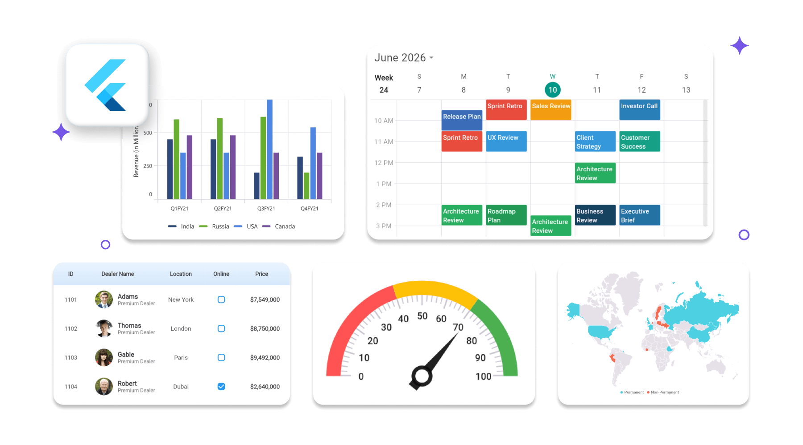

# Welcome to Syncfusion® Essential Studio® for Flutter

Syncfusion® Essential Studio® for Flutter is a comprehensive suite of Flutter widgets for building modern, cross-platform mobile, web, and desktop applications. It provides high-performance, feature-rich widgets like Charts, DataGrid, Calendar, and more to help developers create visually appealing and responsive applications with ease.

{:width="900" height="500" loading="lazy" class="right-section-image" }

## Supported Platforms

<table class="platform-table">
  <thead>
    <tr>
      <th>Target Platform</th>
      <th>Supported Version</th>
    </tr>
  </thead>
  <tbody>
    <tr>
      <td>Android</td>
      <td>5.0 (API 21) or higher</td>
    </tr>
    <tr>
      <td>iOS</td>
      <td>11.0 or higher</td>
    </tr>
    <tr>
      <td>Web</td>
      <td>Latest Chrome, Firefox, Safari, Edge</td>
    </tr>
    <tr>
      <td>Windows</td>
      <td>Windows 10 (v1809+) or higher</td>
    </tr>
    <tr>
      <td>macOS</td>
      <td>macOS 10.14 or higher</td>
    </tr>
    <tr>
      <td>Linux</td>
      <td>Latest stable distributions</td>
    </tr>
  </tbody>
</table>

## Controls List

<table id="table">
<tbody>
<colgroup>
<col style="width: 33%">
<col style="width: 33%">
<col style="width: 34%">
</colgroup>
<tr>
<td>
<!-- Data Visualization -->

    
DATA VISUALIZATION

    <a href="https://help.syncfusion.com/flutter/cartesian-charts/overview">
        Cartesian Charts
    </a>

    <a href="https://help.syncfusion.com/flutter/circular-charts/overview">
        Circular Charts
    </a>

    <a href="https://help.syncfusion.com/flutter/funnel-chart/overview">
        Funnel Chart
    </a>

    <a href="https://help.syncfusion.com/flutter/pyramid-chart/overview">
        Pyramid Chart
    </a>

    <a href="https://help.syncfusion.com/flutter/sparkcharts/overview">
        Spark Charts
    </a>

    <a href="https://help.syncfusion.com/flutter/maps/overview">
        Maps
    </a>

    <a href="https://help.syncfusion.com/flutter/barcode/overview">
        Barcode Generator
    </a>

    <a href="https://help.syncfusion.com/flutter/treemap/overview">
        Treemap
    </a>

    <a href="https://help.syncfusion.com/flutter/radial-gauge/overview">
        Radial Gauge
    </a>

    <a href="https://help.syncfusion.com/flutter/linear-gauge/overview">
        Linear Gauge
    </a>

SLIDERS

<a target="_self" href="https://help.syncfusion.com/flutter/slider/overview">Slider</a>

<a target="_self" href="https://help.syncfusion.com/flutter/range-slider/overview">Range Slider</a>

<a target="_self" href="https://help.syncfusion.com/flutter/range-selector/overview">Range Selector</a>

</td>
<td>
<!-- Data Management -->

    
DATA MANAGEMENT

    <a href="https://help.syncfusion.com/flutter/datagrid/overview">
        DataGrid
    </a>

    <a href="https://help.syncfusion.com/flutter/calendar/overview">
        Calendar
    </a>

    <a href="https://help.syncfusion.com/flutter/daterangepicker/overview">
        Date Range Picker
    </a>

<!-- Editors -->

    
EDITORS

    <a target="_self" href="https://help.syncfusion.com/flutter/signaturepad/overview">
        Signature Pad
    </a>

<!-- Conversational UI -->

    
CONVERSATIONAL UI

    <a target="_self" href="https://help.syncfusion.com/flutter/chat/overview">
        Chat
    </a>

    <a target="_self" href="https://help.syncfusion.com/flutter/ai-assistview/overview">
        AI AssistView
    </a>

</td>
</tr>
</tbody>
</table>

 

## Resources

<!-- Card 1 -->

  

    

        
    

    <h3 class="form-title">Feature Tour</h3>

Get a quick overview of key features and capabilities to kick start your journey.

<a href="https://www.syncfusion.com/flutter-widgets" class="explore-link">
Explore Features
  
</a>
  

<!-- Card 2 -->

  

  

    

    
  

    <h3 class="form-title">Showcase Samples</h3>

    
 Explore real-world sample apps to see components in action and learn by example.

    <a href="https://github.com/syncfusion/flutter-examples" class="explore-link">
    View Samples
  
</a>
  

<!-- Card 3 -->

  

  

    

    
    

    <h3 class="form-title">Tutorial Videos</h3>

    

      Watch step‑by‑step video guides to quickly understand concepts and implementation.
    

    <a href="https://www.syncfusion.com/tutorial-videos/flutter" class="explore-link">
    Watch now
  
</a>
  

<!-- Card 4 -->

  

   

    

    
    

    <h3 class="form-title">Knowledge Base</h3>

    

       Find practical solutions, troubleshooting tips and how‑to guides for common scenarios.
    

    <a href="https://support.syncfusion.com/kb/cross-platforms/section/1236" class="explore-link">
Search KB's
  
</a>
  

<!-- Card 5 -->

  

   

    

    
    

    <h3 class="form-title">Blogs</h3>

    

      Discover in‑depth articles, use cases and expert insights from our developers.
    

    <a href="https://www.syncfusion.com/blogs/category/flutter" class="explore-link">
Read Blogs
  
</a>
  

## Support and feedback

    

        

            

                
            

            <h3 class="form-title">Support Ticket</h3>
        

        

            Need assistance? Submit a support ticket and our team will help you resolve your issue quickly.
        

        <a href="https://support.syncfusion.com/support/tickets/create" class="explore-link">Open ticket
            
        </a>
    

    

        

            

                
            

            <h3 class="form-title">Feedback Portal</h3>
        

        

            Have a suggestion or feature request? Share your ideas in our Feedback Portal to help us improve.
        

        <a href="https://www.syncfusion.com/feedback/flutter" class="explore-link">Share Feedback
            
        </a>
    

## See Also

- [Getting Started with Syncfusion® Flutter DataGrid](../datagrid/getting-started.md)
- [Getting Started with Syncfusion® Flutter Cartesian Chart](../cartesian-charts/getting-started.md)
- [Getting Started with Syncfusion® Flutter Calendar](../calendar/getting-started.md)
- [Getting Started with Syncfusion® Flutter Maps](../maps/getting-started.md)
