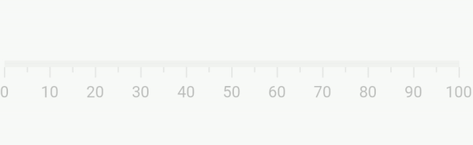
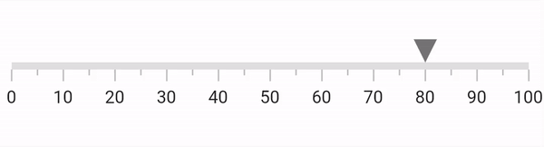

# Animation in Flutter Linear Gauge (SfLinearGauge)

All Linear Gauge elements such as axis (along with ticks and labels), range, bar pointer, shape marker pointer, and widget marker pointer can be animated separately.

## Animate axis

The [`animateAxis`](https://pub.dev/documentation/syncfusion_flutter_gauges/latest/gauges/SfLinearGauge/animateAxis.html) and [`animationDuration`](https://pub.dev/documentation/syncfusion_flutter_gauges/latest/gauges/SfLinearGauge/animationDuration.html) properties in [`SfLinearGauge`](https://pub.dev/documentation/syncfusion_flutter_gauges/latest/gauges/SfLinearGauge-class.html) are used to animate the axis track along with the ticks and labels. The axis will have a fade-in with opacity animation when [`animateAxis`](https://pub.dev/documentation/syncfusion_flutter_gauges/latest/gauges/SfLinearGauge/animateAxis.html) is set to true. By default, the [`animateAxis`](https://pub.dev/documentation/syncfusion_flutter_gauges/latest/gauges/SfLinearGauge/animateAxis.html) is set to false. 




import 'package:flutter/material.dart';
import 'package:syncfusion_flutter_gauges/gauges.dart';

void main() => runApp(const LinearGaugeDemo());

class LinearGaugeDemo extends StatelessWidget {
  const LinearGaugeDemo({Key? key}) : super(key: key);

  @override
  Widget build(BuildContext context) {
    return MaterialApp(
      home: Scaffold(
        body: Center(
          child: SfLinearGauge(
            animateAxis: true,
            animationDuration: 3000
          ),
        ),
      ),
    );
  }
}




## Animate range

The [`animateRange`](https://pub.dev/documentation/syncfusion_flutter_gauges/latest/gauges/SfLinearGauge/animateRange.html) and [`animationDuration`](https://pub.dev/documentation/syncfusion_flutter_gauges/latest/gauges/SfLinearGauge/animationDuration.html) properties in [`SfLinearGauge`](https://pub.dev/documentation/syncfusion_flutter_gauges/latest/gauges/SfLinearGauge-class.html) are used to animate ranges. The range will have a fade-in with opacity animation when [`animateRange`](https://pub.dev/documentation/syncfusion_flutter_gauges/latest/gauges/SfLinearGauge/animateRange.html) is set to true. By default, the [`animateRange`](https://pub.dev/documentation/syncfusion_flutter_gauges/latest/gauges/SfLinearGauge/animateRange.html) is set to false. 




import 'package:flutter/material.dart';
import 'package:syncfusion_flutter_gauges/gauges.dart';

void main() => runApp(const LinearGaugeDemo());

class LinearGaugeDemo extends StatelessWidget {
  const LinearGaugeDemo({Key? key}) : super(key: key);

  @override
  Widget build(BuildContext context) {
    return MaterialApp(
      home: Scaffold(
        body: Center(
          child: SfLinearGauge(
            animateRange: true,
            animationDuration: 3000
          ),
        ),
      ),
    );
  }
}




## Pointer animation

The animation behavior is common for all three pointers in Linear Gauge - shape pointer, widget pointer, and bar pointer.

All three pointers have the following properties for animation:

*  [`enableAnimation`](https://pub.dev/documentation/syncfusion_flutter_gauges/latest/gauges/LinearShapePointer/enableAnimation.html) - Enable or disable the animation for bar pointer. The default value is `true`
*  [`animationDuration`](https://pub.dev/documentation/syncfusion_flutter_gauges/latest/gauges/LinearShapePointer/animationDuration.html) - Sets the animation duration. The default value is 1000
*  [`animationType`](https://pub.dev/documentation/syncfusion_flutter_gauges/latest/gauges/LinearShapePointer/animationType.html) - Sets the animation type. 

The [`animationType`](https://pub.dev/documentation/syncfusion_flutter_gauges/latest/gauges/LinearShapePointer/animationType.html) supports the following animations. The default animation type is `animationType.ease`.

* `bounceOut`
* `ease`
* `easeInCir`
* `easeOutBack`
* `elasticOut`
* `linear`
* `slowMiddle`

### Animate bar pointer

The following code example demonstrates how to customize the animation for bar pointer:




import 'package:flutter/material.dart';
import 'package:syncfusion_flutter_gauges/gauges.dart';

void main() => runApp(const LinearGaugeDemo());

class LinearGaugeDemo extends StatelessWidget {
  const LinearGaugeDemo({Key? key}) : super(key: key);

  @override
  Widget build(BuildContext context) {
    return MaterialApp(
      home: Scaffold(
        body: Center(
          child: SfLinearGauge(
            barPointers: [
              LinearBarPointer(
                value: 50,
                animationDuration: 2000,
                animationType: LinearAnimationType.bounceOut
              ),
            ],
          ),
        ),
      ),
    );
  }
}




### Animate marker pointers (Shape and Widget Pointers)

Both the shape and widget marker pointers have the same set of properties and behave similarly for animation. The example below demonstrates [`LinearShapePointer`](https://pub.dev/documentation/syncfusion_flutter_gauges/latest/gauges/LinearShapePointer-class.html) but the same principles apply to [`LinearWidgetPointer`](https://pub.dev/documentation/syncfusion_flutter_gauges/latest/gauges/LinearWidgetPointer-class.html) as well. 

### Marker pointer with `bounceOut` animation

The following code example demonstrates how to animate a shape marker pointer with `bounceOut` animation type:




import 'package:flutter/material.dart';
import 'package:syncfusion_flutter_gauges/gauges.dart';

void main() => runApp(const LinearGaugeDemo());

class LinearGaugeDemo extends StatelessWidget {
  const LinearGaugeDemo({Key? key}) : super(key: key);

  @override
  Widget build(BuildContext context) {
    return MaterialApp(
      home: Scaffold(
        body: Center(
          child: SfLinearGauge(
            markerPointers: [
              LinearShapePointer(
                value: 60,
                animationType: LinearAnimationType.bounceOut,
                animationDuration: 2000,
                enableAnimation: true,
              ),
            ],
          ),
        ),
      ),
    );
  }
}




