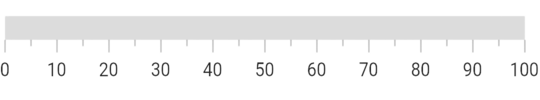
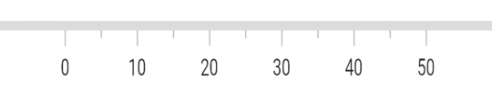

# Axis in Flutter Linear Gauge (SfLinearGauge)

The Linear Gauge axis is a scale where a set of values can be plotted. An axis can be customized by changing the thickness, color and edge styles. Axis elements such as labels and ticks can also be easily customized and you can also inverse the axis.

## Default axis

By default axis will have the [`minimum`](https://pub.dev/documentation/syncfusion_flutter_gauges/latest/gauges/SfLinearGauge/minimum.html) axis value as 0 and the [`maximum`](https://pub.dev/documentation/syncfusion_flutter_gauges/latest/gauges/SfLinearGauge/maximum.html) axis value as 100. Without any changes the default axis of the Linear Gauge will be displayed as follows. 

 

  @override
  Widget build(BuildContext context) {
    return MaterialApp(
      home: Scaffold(
        body: Center(
          child: SfLinearGauge()
        ),
      ),
    );
  }



## Customize minimum and maximum axis values

The [`minimum`](https://pub.dev/documentation/syncfusion_flutter_gauges/latest/gauges/SfLinearGauge/minimum.html) and [`maximum`](https://pub.dev/documentation/syncfusion_flutter_gauges/latest/gauges/SfLinearGauge/maximum.html) properties of a Linear Gauge can be used to customize the axis values. In the below code snippet the axis is customized to have the [`minimum`](https://pub.dev/documentation/syncfusion_flutter_gauges/latest/gauges/SfLinearGauge/minimum.html) value of -50 to [`maximum`](https://pub.dev/documentation/syncfusion_flutter_gauges/latest/gauges/SfLinearGauge/maximum.html) value of 50. The axis values are displayed by the labels. Customizing these label styles are further explained in next topics.  

 

  @override
  Widget build(BuildContext context) {
    return MaterialApp(
      home: Scaffold(
        body: Center(
          child: SfLinearGauge(minimum: -50, maximum: 50)
        ),
      ),
    );
  }
  


## Customize axis track style

The linear axis track can be customized using the [`axisTrackStyle`](https://pub.dev/documentation/syncfusion_flutter_gauges/latest/gauges/SfLinearGauge/axisTrackStyle.html) property. The [`axisTrackStyle`](https://pub.dev/documentation/syncfusion_flutter_gauges/latest/gauges/SfLinearGauge/axisTrackStyle.html) has the following properties.

* [`thickness`](https://pub.dev/documentation/syncfusion_flutter_gauges/latest/gauges/LinearAxisTrackStyle/thickness.html) – Customizes the thickness of the axis track.
* [`color`](https://pub.dev/documentation/syncfusion_flutter_gauges/latest/gauges/LinearAxisTrackStyle/color.html) – Customizes the color of the axis track with a solid color.
* [`gradient`](https://pub.dev/documentation/syncfusion_flutter_gauges/latest/gauges/LinearAxisTrackStyle/gradient.html) - Customizes the color of the axis track with a gradient.
* [`borderWidth`](https://pub.dev/documentation/syncfusion_flutter_gauges/latest/gauges/LinearAxisTrackStyle/borderWidth.html) - Customizes the border width of the axis track.
* [`borderColor`](https://pub.dev/documentation/syncfusion_flutter_gauges/latest/gauges/LinearAxisTrackStyle/borderColor.html) - Customizes the border color of the axis track.

The following code sample demonstrates how to customize the [`thickness`](https://pub.dev/documentation/syncfusion_flutter_gauges/latest/gauges/LinearAxisTrackStyle/thickness.html) and [`color`](https://pub.dev/documentation/syncfusion_flutter_gauges/latest/gauges/LinearAxisTrackStyle/color.html) properties.

 

  @override
  Widget build(BuildContext context) {
    return MaterialApp(
      home: Scaffold(
        body: Center(
            child: SfLinearGauge(
                axisTrackStyle: LinearAxisTrackStyle(thickness: 15)
            ),
          ),
        ),
    );
  }



## Apply solid color

The below code snippet sets solid colors to the axis track.

 

  @override
  Widget build(BuildContext context) {
    return MaterialApp(
      home: Scaffold(
        body: Center(
            child: SfLinearGauge(
                axisTrackStyle: LinearAxisTrackStyle(color: Colors.blue))
        ),
      ),
    );
  }



## Apply gradient

The [`color`](https://pub.dev/documentation/syncfusion_flutter_gauges/latest/gauges/LinearAxisTrackStyle/color.html) property of [`axisTrackStyle`](https://pub.dev/documentation/syncfusion_flutter_gauges/latest/gauges/LinearAxisTrackStyle/LinearAxisTrackStyle.html) allows to set a solid color, while the [`gradient`](https://pub.dev/documentation/syncfusion_flutter_gauges/latest/gauges/LinearAxisTrackStyle/gradient.html) property of [`axisTrackStyle`](https://pub.dev/documentation/syncfusion_flutter_gauges/latest/gauges/LinearAxisTrackStyle/LinearAxisTrackStyle.html) allows to apply linear-gradient to axis track.

The following code sample sets solid colors to the axis track.

 

  @override
  Widget build(BuildContext context) {
    return MaterialApp(
      home: Scaffold(
        body: Center(
          child: Container(
            child: SfLinearGauge(
                axisTrackStyle: LinearAxisTrackStyle(
                  gradient: LinearGradient(
                        colors: [Colors.purple, Colors.blue],
                        begin: Alignment.centerLeft,
                        end: Alignment.centerRight,
                        stops: [0.1, 0.5],
                        tileMode: TileMode.clamp
                  )
                )
              ),
            ),
          ),
      ),
    );
  }



## Customize borders

The [`borderColor`](https://pub.dev/documentation/syncfusion_flutter_gauges/latest/gauges/LinearAxisTrackStyle/borderColor.html) and [`borderWidth`](https://pub.dev/documentation/syncfusion_flutter_gauges/latest/gauges/LinearAxisTrackStyle/borderWidth.html) properties of [`axisTrackStyle`](https://pub.dev/documentation/syncfusion_flutter_gauges/latest/gauges/LinearAxisTrackStyle/LinearAxisTrackStyle.html) allow you to set a border to the axis track.

The below code snippet sets a border to the axis track.

 

   @override
  Widget build(BuildContext context) {
    return MaterialApp(
      home: Scaffold(
        body: Center(
          child: SfLinearGauge(
              axisTrackStyle: LinearAxisTrackStyle(
                  // Sets axis thickness for the better visibility of border
                  thickness: 15,
                  // Hides axis axis color for the better visibility of border
                  color: Colors.transparent,
                  //Sets the border color
                  borderColor: Colors.blueGrey,
                  //Sets the border width
                  borderWidth: 2))
        ),
      ),
    );
  }



## Customize corners

The [`edgeStyle`](https://pub.dev/documentation/syncfusion_flutter_gauges/latest/gauges/LinearAxisTrackStyle/edgeStyle.html) property of [`axisTrackStyle`](https://pub.dev/documentation/syncfusion_flutter_gauges/latest/gauges/LinearAxisTrackStyle/LinearAxisTrackStyle.html) specifies the corner type for the axis track. The corners can be customized with `bothFlat`, `bothCurve`, `startCurve`, and `endCurve` options. The default value of this property is `bothFlat`.

 

  @override
  Widget build(BuildContext context) {
    return MaterialApp(
      home: Scaffold(
        body: Center(
            child: SfLinearGauge(
                axisTrackStyle: LinearAxisTrackStyle(
                    thickness: 20, edgeStyle: LinearEdgeStyle.bothCurve))         
        ),
      ),
    );
  }



## Inverse the axis

The direction of linear gauge axis can be customized by the [`isAxisInversed`](https://pub.dev/documentation/syncfusion_flutter_gauges/latest/gauges/SfLinearGauge/isAxisInversed.html) property.
When the [`isAxisInversed`](https://pub.dev/documentation/syncfusion_flutter_gauges/latest/gauges/SfLinearGauge/isAxisInversed.html) property is true, the axis can be placed in an inverse direction. The default value of the [`isAxisInversed`](https://pub.dev/documentation/syncfusion_flutter_gauges/latest/gauges/SfLinearGauge/isAxisInversed.html) property is false.

 

  @override
  Widget build(BuildContext context) {
    return MaterialApp(
      home: Scaffold(
        body: Center(
            child: SfLinearGauge(isAxisInversed: true)         
        ),
      ),
    );
  }



You can see that the axis values are displayed from 100 to 0 as the axis track is inversed.

## Extend the axis

The axis track can be extended by the [`axisTrackExtent`](https://pub.dev/documentation/syncfusion_flutter_gauges/latest/gauges/SfLinearGauge/axisTrackExtent.html) property. This will extend the axis track in both ends. The following code sample demonstrates this. 

 

  @override
  Widget build(BuildContext context) {
    return MaterialApp(
      color: Colors.white,
      home: Scaffold(
        body: Center(
          child: child: SfLinearGauge(maximum: 50, axisTrackExtent: 50),
        ),
      ),
    );
  }



## Change axis track visibility

You can hide the axis track by setting the [`showAxisTrack`](https://pub.dev/documentation/syncfusion_flutter_gauges/latest/gauges/SfLinearGauge/showAxisTrack.html) property to false. The default value of this property is true.

 

  @override
  Widget build(BuildContext context) {
    return MaterialApp(
      home: Scaffold(
        body: Center(
            child: SfLinearGauge(showAxisTrack: false)
        ),
      ),
    );
  }



## Customize axis values

Linear gauge allows you to display a set of values along with a custom axis based on your business logic by using the [`onGenerateLabels`](https://pub.dev/documentation/syncfusion_flutter_gauges/latest/gauges/SfLinearGauge/onGenerateLabels.html) and [`valueToFactorCallback`](https://pub.dev/documentation/syncfusion_flutter_gauges/latest/gauges/SfLinearGauge/valueToFactorCallback.html) callbacks.

 

double pointerValue = 50.0;

// To return the label value based on interval
double _calculateLabelValue(num value) {
  if (value == 0) {
    return 0;
  } else if (value == 1) {
    return 2;
  } else if (value == 2) {
    return 5;
  } else if (value == 3) {
    return 10;
  } else if (value == 4) {
    return 20;
  } else if (value == 5) {
    return 30;
  } else if (value == 6) {
    return 50;
  } else if (value == 7) {
    return 100;
  } else {
    return 150;
  }
}

Widget _getLinearGauge() {
  return Container(
      child: SfLinearGauge(
        minimum: 0,
        maximum: 150.0,
        interval: 18.75,
        animateAxis: true,
        animateRange: true,
        labelPosition: LinearLabelPosition.outside,
        tickPosition: LinearElementPosition.outside,
        valueToFactorCallback: (value) {
          if (value >= 0 && value <= 2) {
            return (value * 0.125) / 2;
          } else if (value > 2 && value <= 5) {
            return (((value - 2) * 0.125) / (5 - 2)) + (1 * 0.125);
          } else if (value > 5 && value <= 10) {
            return (((value - 5) * 0.125) / (10 - 5)) + (2 * 0.125);
          } else if (value > 10 && value <= 20) {
            return (((value - 10) * 0.125) / (20 - 10)) + (3 * 0.125);
          } else if (value > 20 && value <= 30) {
            return (((value - 20) * 0.125) / (30 - 20)) + (4 * 0.125);
          } else if (value > 30 && value <= 50) {
            return (((value - 30) * 0.125) / (50 - 30)) + (5 * 0.125);
          } else if (value > 50 && value <= 100) {
            return (((value - 50) * 0.125) / (100 - 50)) + (6 * 0.125);
          } else if (value > 100 && value <= 150) {
            return (((value - 100) * 0.125) / (150 - 100)) + (7 * 0.125);
          } else {
            return 1;
          }
        },
        onGenerateLabels: () {
          final List<LinearAxisLabel> _visibleLabels = <LinearAxisLabel>[];
          for (num i = 0; i < 9; i++) {
            final double _value = _calculateLabelValue(i);
            final LinearAxisLabel label = LinearAxisLabel(
                text: _value.toInt().toString(),
                value: (i * 18.75).toDouble());
            _visibleLabels.add(label);
          }

          return _visibleLabels;
        },
        markerPointers: [
          LinearShapePointer(
              value: pointerValue,
              onChanged: (value) =>
              {
                setState(() => {pointerValue = value})
              },
              color: Color(0xff06589C),
              width: 24,
              position: LinearElementPosition.cross,
              shapeType: LinearShapePointerType.triangle,
              height: 16)
        ],
      ),
      margin: EdgeInsets.all(10));
}



