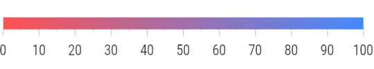

# Linear Gauge bar pointer

A bar pointer is an accenting line or shaded background that can be placed on a linear gauge to mark any current value in the axis track. The bar pointers always starts from the minimum value of the axis and ends in the specified value. So the [`value`](https://pub.dev/documentation/syncfusion_flutter_gauges/latest/gauges/LinearBarPointer/value.html) property is a required parameter for creating a bar pointer.

## Default Linear Gauge bar pointer

The code snippet creates a default bar pointer with the value 50. 

 

  @override
  Widget build(BuildContext context) {
    return MaterialApp(
      home: Scaffold(
        body: Center(
          child: SfLinearGauge(
            barPointers: [
              LinearBarPointer(
                value: 50
              )
            ],
          ),
        ),
      ),
    );
  }
  


## Change the bar pointer thickness

The thickness can be changed by the [`thickness`](https://pub.dev/documentation/syncfusion_flutter_gauges/latest/gauges/LinearBarPointer/thickness.html) property of the bar pointer. The below code snippet demonstrates the same. 

 

  @override
  Widget build(BuildContext context) {
    return MaterialApp(
      color: Colors.white,
      home: Scaffold(
        body: Center(
          child: SfLinearGauge(
            barPointers: [
              LinearBarPointer(
                value: 50,
                thickness: 10
              )
            ],
          ),
        ),
      ),
    );
  }
  


## Change the edge style

The edge style can be changed with the [`edgeStyle`](https://pub.dev/documentation/syncfusion_flutter_gauges/latest/gauges/LinearBarPointer/edgeStyle.html) property of bar pointer. The edge style can be any of the `startCurve`, `endCurve`, `bothCurve`, and `bothFlat` options.The default value is `bothFlat`.

 

  @override
  Widget build(BuildContext context) {
    return MaterialApp(
      color: Colors.white,
      home: Scaffold(
        body: Center(
          child: SfLinearGauge(
            barPointers: [
              LinearBarPointer(
                value: 50,
                // Changed the thickness to make the curve visible
                thickness: 10,
                //Updated the edge style as curve at end position
                edgeStyle: LinearEdgeStyle.endCurve
              )
            ],
          ),
        ),
      ),
    );
  }
  


## Change the position

By default, the bar pointer is positioned cross to the axis. This position can be changed by the [`position`](https://pub.dev/documentation/syncfusion_flutter_gauges/latest/gauges/LinearBarPointer/position.html) property of a bar pointer. It is possible to position the bar pointer 'inside', 'cross', and 'outside' the axis. The below code snippet demonstrates changing the bar pointer position to inside the axis. 

 

  @override
  Widget build(BuildContext context) {
    return MaterialApp(
      home: Scaffold(
        body: Center(
          child: SfLinearGauge(
            barPointers: [
              LinearBarPointer(
                value: 50,
                position: LinearElementPosition.inside
              )
            ],
          ),
        ),
      ),
    );
  }
  


## Change the offset

In addition to position the bar pointer, it is also possible to change the offset of the bar pointer. The [`offset`](https://pub.dev/documentation/syncfusion_flutter_gauges/latest/gauges/LinearBarPointer/offset.html) is the distance from the axis. The [`offset`](https://pub.dev/documentation/syncfusion_flutter_gauges/latest/gauges/LinearBarPointer/offset.html) cannot be negative and the cross positioned elements will not get affected by the [`offset`](https://pub.dev/documentation/syncfusion_flutter_gauges/latest/gauges/LinearBarPointer/offset.html) value. The below code snippet demonstrates changing the offset value of the bar pointer. 

 

  @override
  Widget build(BuildContext context) {
    return MaterialApp(
      color: Colors.white,
      home: Scaffold(
        body: Center(
          child: SfLinearGauge(
            barPointers: [
              LinearBarPointer(
                value: 50,
                position: LinearElementPosition.outside,
                offset: 5
              )
            ],
          ),
        ),
      ),
    );
  }
  


## Apply color to bar pointer

The color of the bar pointer can be changed by the [`color`](https://pub.dev/documentation/syncfusion_flutter_gauges/latest/gauges/LinearBarPointer/color.html) property. The below code snippet demonstrates the same. 

 

  @override
  Widget build(BuildContext context) {
    return MaterialApp(
      color: Colors.white,
      home: Scaffold(
        body: Center(
          child: SfLinearGauge(
            barPointers: [
              LinearBarPointer(
                value: 50,
                //Change the color
                color: Colors.redAccent
              )
            ],
          ),
        ),
      ),
    );
  }
  


## Apply radial gradient

The gradient can be applied by using the [`shaderCallback`](https://pub.dev/documentation/syncfusion_flutter_gauges/latest/gauges/LinearBarPointer/shaderCallback.html) property of bar pointer. The below code snippet demonstrates applying a radial gradient to the bar pointer.

 

   @override
  Widget build(BuildContext context) {
    return MaterialApp(
      color: Colors.white,
      home: Scaffold(
        body: Center(
          child: SfLinearGauge(
            barPointers: [
              LinearBarPointer(
                  value: 100,
                  //Apply radial gradient
                  shaderCallback: (bounds) => RadialGradient(
                        radius: 30,
                        colors: [
                          Colors.redAccent,
                          Colors.blueAccent,
                          Colors.greenAccent,
                        ],
                      ).createShader(bounds))
            ],
          ),
        ),
      ),
    );
  }
  


## Apply linear gradient

The gradient can be applied by using the [`shaderCallback`](https://pub.dev/documentation/syncfusion_flutter_gauges/latest/gauges/LinearBarPointer/shaderCallback.html) property of bar pointer. The below code snippet demonstrates applying a linear gradient to the bar pointer.

 

  @override
  Widget build(BuildContext context) {
    return MaterialApp(
      color: Colors.white,
      home: Scaffold(
        body: Center(
          child: SfLinearGauge(
            barPointers: [
              LinearBarPointer(
                value: 100,
                thickness: 10,
                //Apply linear gradient
                shaderCallback: (bounds) => LinearGradient(
                        begin: Alignment.centerLeft,
                        end: Alignment.centerRight,
                        colors: [Colors.redAccent, Colors.blueAccent])
                    .createShader(bounds)
              ),
            ],
          ),
        ),
      ),
    );
  }
  


## Apply sweep gradient

The gradient can be applied by using the [`shaderCallback`](https://pub.dev/documentation/syncfusion_flutter_gauges/latest/gauges/LinearBarPointer/shaderCallback.html) property of bar pointer. The below code snippet demonstrates applying a sweep gradient to the bar pointer.

 

   @override
  Widget build(BuildContext context) {
    return MaterialApp(
      color: Colors.white,
      home: Scaffold(
        body: Center(
          child: SfLinearGauge(
            barPointers: [
              LinearBarPointer(
                  value: 100,
                  thickness: 10,
                  //Apply linear gradient
                  shaderCallback: (bounds) => SweepGradient(
                  startAngle: 0.1,
                  endAngle: 0.2,
                  colors: [
                    Colors.blueAccent,
                    Colors.greenAccent,
                    Colors.orangeAccent,
                  ],
                  tileMode: TileMode.mirror,
                  center: Alignment.bottomRight,
                ).createShader(bounds))
            ],
          ),
        ),
      ),
    );
  }
  


## Customize the border

The border can be customized with [`borderWidth`](https://pub.dev/documentation/syncfusion_flutter_gauges/latest/gauges/LinearBarPointer/borderWidth.html) and [`borderColor`](https://pub.dev/documentation/syncfusion_flutter_gauges/latest/gauges/LinearBarPointer/borderColor.html) properties of bar pointer. The below code examples demonstrates the same.

 

  @override
  Widget build(BuildContext context) {
    return MaterialApp(
      home: Scaffold(
        body: Center(
          child: SfLinearGauge(
            barPointers: [
              LinearBarPointer(
                  value: 80,
                  thickness: 10,
                  borderWidth: 3,
                  borderColor: Colors.cyanAccent)
            ],
          ),
        ),
      ),
    );
  }
  


