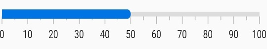
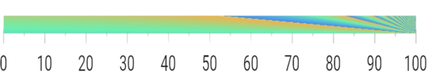
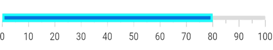

# Bar Pointer in Flutter Linear Gauge (SfLinearGauge)

A bar pointer is an accenting line or shaded background that can be placed on a Linear Gauge to mark any current value in the axis track. The bar pointers always start from the minimum value of the axis and end with the specified value. The [`value`](https://pub.dev/documentation/syncfusion_flutter_gauges/latest/gauges/LinearBarPointer/value.html) property is a required parameter for creating a bar pointer.

## Default bar pointer

The following code sample creates a default bar pointer with the value 50. 

 

  @override
  Widget build(BuildContext context) {
    return MaterialApp(
      home: Scaffold(
        body: Center(
          child: SfLinearGauge(
            barPointers: [
              LinearBarPointer(
                value: 50
              )
            ],
          ),
        ),
      ),
    );
  }
  


## Customize bar pointer thickness

The thickness can be changed by the [`thickness`](https://pub.dev/documentation/syncfusion_flutter_gauges/latest/gauges/LinearBarPointer/thickness.html) property of the bar pointer. The following code sample demonstrates the same. 

 

  @override
  Widget build(BuildContext context) {
    return MaterialApp(
      color: Colors.white,
      home: Scaffold(
        body: Center(
          child: SfLinearGauge(
            barPointers: [
              LinearBarPointer(
                value: 50,
                thickness: 10,
              )
            ],
          ),
        ),
      ),
    );
  }
  


## Customize edge style

The edge style can be changed with the [`edgeStyle`](https://pub.dev/documentation/syncfusion_flutter_gauges/latest/gauges/LinearBarPointer/edgeStyle.html) property of the bar pointer. The edge style can be any of the `startCurve`, `endCurve`, `bothCurve`, and `bothFlat` options.The default value is `bothFlat`.

 

  @override
  Widget build(BuildContext context) {
    return MaterialApp(
      color: Colors.white,
      home: Scaffold(
        body: Center(
          child: SfLinearGauge(
            barPointers: [
              LinearBarPointer(
                value: 50,
                // Changed the thickness to make the curve visible
                thickness: 10,
                //Updated the edge style as curve at end position
                edgeStyle: LinearEdgeStyle.endCurve
              )
            ],
          ),
        ),
      ),
    );
  }
  


## Customize the position

By default, the bar pointer is positioned cross to the axis. This position can be changed by the [`position`](https://pub.dev/documentation/syncfusion_flutter_gauges/latest/gauges/LinearBarPointer/position.html) property of a bar pointer. It is possible to position the bar pointer `inside`, `cross`, or `outside` the axis. The following code sample demonstrates how to change the bar pointer position to inside the axis.

 

  @override
  Widget build(BuildContext context) {
    return MaterialApp(
      home: Scaffold(
        body: Center(
          child: SfLinearGauge(
            barPointers: [
              LinearBarPointer(
                value: 50,
                position: LinearElementPosition.inside
              )
            ],
          ),
        ),
      ),
    );
  }
  


## Customize the offset

In addition to positioning the bar pointer, it is also possible to change the offset of the bar pointer. The [`offset`](https://pub.dev/documentation/syncfusion_flutter_gauges/latest/gauges/LinearBarPointer/offset.html) is the distance from the axis and it cannot be negative. Cross-positioned elements will not be affected by the [`offset`](https://pub.dev/documentation/syncfusion_flutter_gauges/latest/gauges/LinearBarPointer/offset.html) value. The following code sample demonstrates how to change the offset value of the bar pointer. 

 

  @override
  Widget build(BuildContext context) {
    return MaterialApp(
      color: Colors.white,
      home: Scaffold(
        body: Center(
          child: SfLinearGauge(
            barPointers: [
              LinearBarPointer(
                value: 50,
                position: LinearElementPosition.outside,
                offset: 5
              )
            ],
          ),
        ),
      ),
    );
  }
  


## Change the color of bar pointer 

The color of the bar pointer can be changed by the [`color`](https://pub.dev/documentation/syncfusion_flutter_gauges/latest/gauges/LinearBarPointer/color.html) property. The following code sample demonstrates the same. 

 

  @override
  Widget build(BuildContext context) {
    return MaterialApp(
      color: Colors.white,
      home: Scaffold(
        body: Center(
          child: SfLinearGauge(
            barPointers: [
              LinearBarPointer(
                value: 50,
                //Change the color
                color: Colors.redAccent
              )
            ],
          ),
        ),
      ),
    );
  }
  


## Apply radial gradient

The gradient can be applied by using the [`shaderCallback`](https://pub.dev/documentation/syncfusion_flutter_gauges/latest/gauges/LinearBarPointer/shaderCallback.html) property of bar pointer. The following code sample demonstrates how to apply a radial gradient to the bar pointer.

 

  @override
  Widget build(BuildContext context) {
    return MaterialApp(
      color: Colors.white,
      home: Scaffold(
        body: Center(
          child: SfLinearGauge(
            barPointers: [
              LinearBarPointer(
                value: 100,
                //Apply radial gradient
                shaderCallback: (bounds) => RadialGradient(
                radius: 30,
                colors: [
                  Colors.redAccent,
                  Colors.blueAccent,
                  Colors.greenAccent,
                ],
              ).createShader(bounds))
            ],
          ),
        ),
      ),
    );
  }
  


## Apply linear gradient

The gradient can be applied by using the [`shaderCallback`](https://pub.dev/documentation/syncfusion_flutter_gauges/latest/gauges/LinearBarPointer/shaderCallback.html) property of bar pointer. The following code sample demonstrates how to apply a linear gradient to the bar pointer.

 

  @override
  Widget build(BuildContext context) {
    return MaterialApp(
      color: Colors.white,
      home: Scaffold(
        body: Center(
          child: SfLinearGauge(
            barPointers: [
              LinearBarPointer(
                value: 100,
                thickness: 10,
                //Apply linear gradient
                shaderCallback: (bounds) => LinearGradient(
                    begin: Alignment.centerLeft,
                    end: Alignment.centerRight,
                    colors: [Colors.redAccent, Colors.blueAccent]
                ).createShader(bounds)
              ),
            ],
          ),
        ),
      ),
    );
  }
  


## Apply sweep gradient

The gradient can be applied by using the [`shaderCallback`](https://pub.dev/documentation/syncfusion_flutter_gauges/latest/gauges/LinearBarPointer/shaderCallback.html) property of the bar pointer. The following code sample demonstrates how to apply a sweep gradient to the bar pointer.

 

  @override
  Widget build(BuildContext context) {
    return MaterialApp(
      color: Colors.white,
      home: Scaffold(
        body: Center(
          child: SfLinearGauge(
            barPointers: [
              LinearBarPointer(
                value: 100,
                thickness: 10,
                //Apply linear gradient
                shaderCallback: (bounds) => SweepGradient(
                startAngle: 0.1,
                endAngle: 0.2,
                colors: [
                  Colors.blueAccent,
                  Colors.greenAccent,
                  Colors.orangeAccent,
                ],
                tileMode: TileMode.mirror,
                center: Alignment.bottomRight,
              ).createShader(bounds))
            ],
          ),
        ),
      ),
    );
  }
  


## Customize border

The border can be customized with [`borderWidth`](https://pub.dev/documentation/syncfusion_flutter_gauges/latest/gauges/LinearBarPointer/borderWidth.html) and [`borderColor`](https://pub.dev/documentation/syncfusion_flutter_gauges/latest/gauges/LinearBarPointer/borderColor.html) properties of the bar pointer. The following code examples demonstrates the same.

 

  @override
  Widget build(BuildContext context) {
    return MaterialApp(
      home: Scaffold(
        body: Center(
          child: SfLinearGauge(
            barPointers: [
              LinearBarPointer(
                value: 80,
                thickness: 10,
                borderWidth: 3,
                borderColor: Colors.cyanAccent,
              ),
            ],
          ),
        ),
      ),
    );
  }
  


## Add multiple bar pointers

You can add multiple bar pointers in a [`LinearGauge`](https://pub.dev/documentation/syncfusion_flutter_gauges/latest/gauges/SfLinearGauge-class.html). The bar pointers by default will overlap each other. So while adding a bar pointer, offset value is needed to be specified. The below code example demonstrates adding two bar pointer with different offsets:

 

@override
  Widget build(BuildContext context) {
    return MaterialApp(
      home: Scaffold(
        body: Center(
          child: SfLinearGauge(
            barPointers: [
              LinearBarPointer(
                value: 20, 
                position: LinearElementPosition.outside
              ),
              LinearBarPointer(
                value: 40,
                // Setting offset to move the bar from previos one
                offset: 10,
                position: LinearElementPosition.outside
              ),
            ],
          ),
        ),
      ),
    );
  }



## Animation completed callback

The [`onAnimationCompleted`](https://pub.dev/documentation/syncfusion_flutter_gauges/latest/gauges/LinearBarPointer/onAnimationCompleted.html) callback in the [`LinearBarPointer`](https://pub.dev/documentation/syncfusion_flutter_gauges/latest/gauges/LinearBarPointer-class.html) will be triggered when the bar pointer animation is completed. The default value of the [onAnimationCompleted](https://pub.dev/documentation/syncfusion_flutter_gauges/latest/gauges/LinearBarPointer/onAnimationCompleted.html) callback is `null`.



  @override
  Widget build(BuildContext context) {
    return MaterialApp(
      home: Scaffold(
        body: Center(
          child: SfLinearGauge(
            barPointers:[
              LinearBarPointer(
                onAnimationCompleted: () {
                  print("Bar Pointer animation is completed");
                },
              ),
            ],
          ),
        ),
      ),
    );
  }


