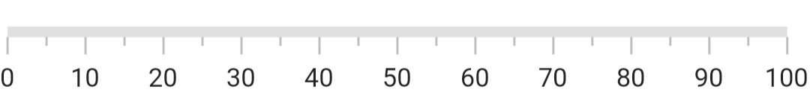
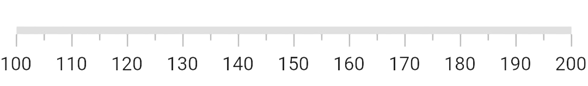
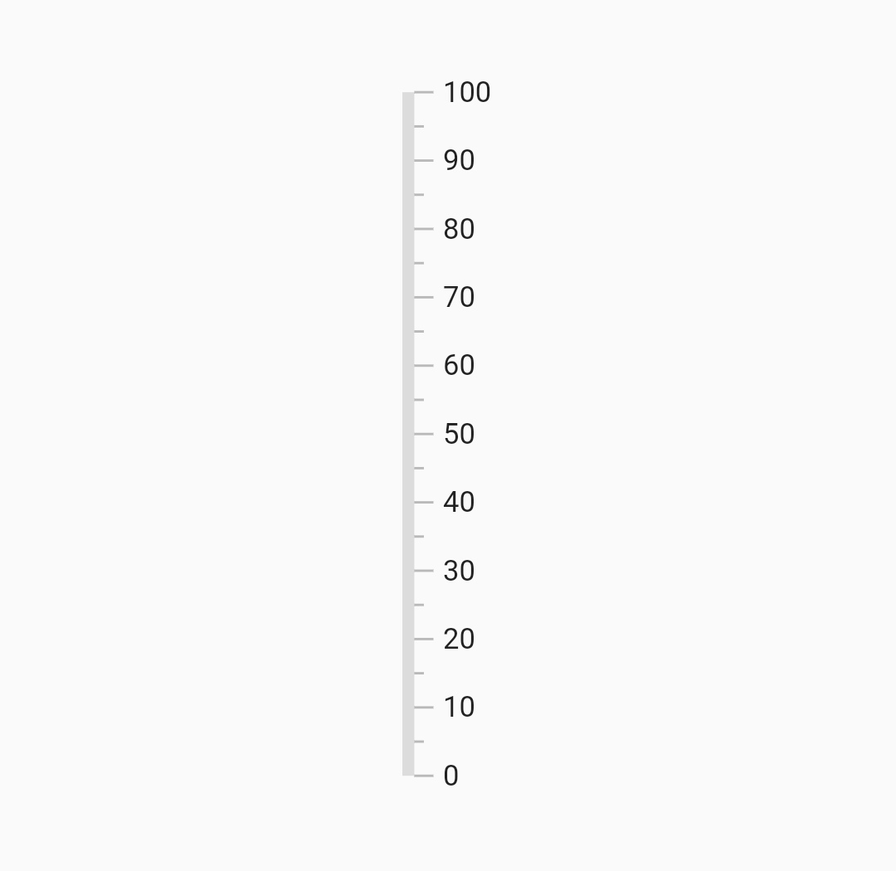
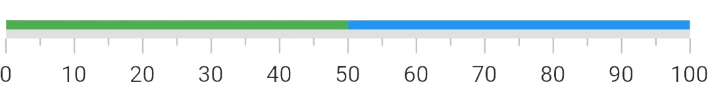
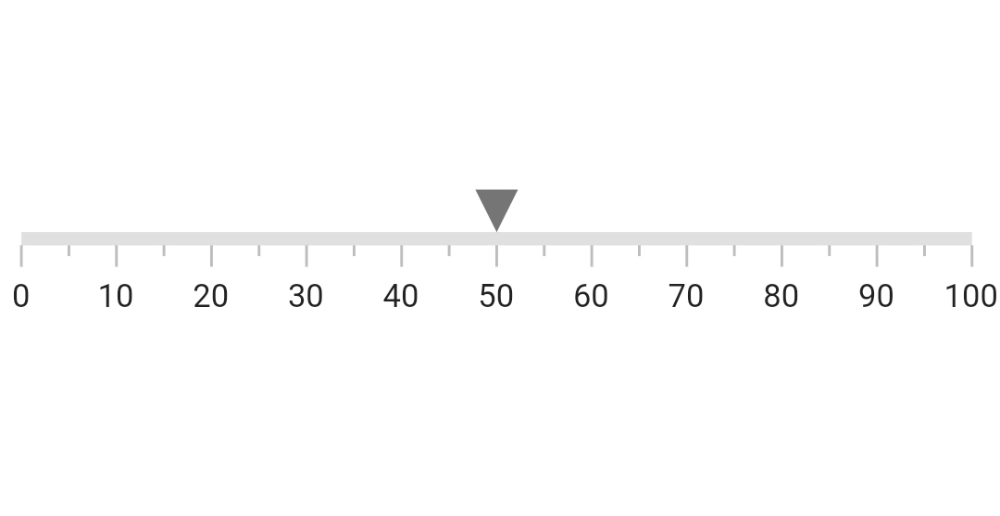
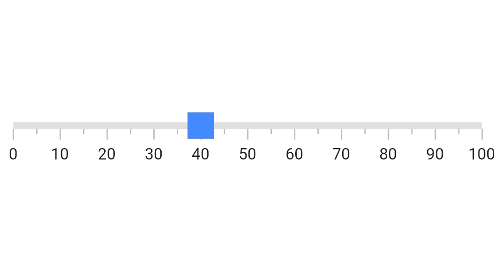
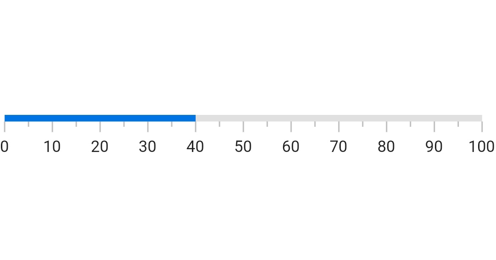
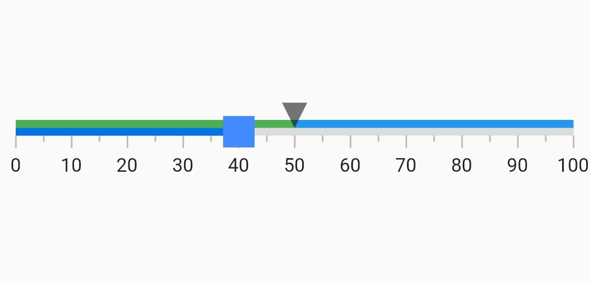

# Flutter Linear Gauge Getting Started (SfLinearGauge)

This section explains the steps required to add the Linear Gauge and its elements such as axis, range, and pointer. It also covers the basic features needed to get started with the Linear Gauge widget.

To get started quickly with our Flutter Linear Gauge widget, you can check out this video:

<iframe id='FlutterLinearGaugeVideoTutorial' src='https://www.youtube.com/embed/8NmzRA-kM5Y'></iframe>

## Add Linear Gauge to an application

Create a simple project using the instructions given in the [Getting Started with your first Flutter app](https://docs.flutter.dev/get-started/test-drive#choose-your-ide) documentation.

**Add dependency**

Add the Syncfusion&reg; Flutter Gauge dependency to your pubspec.yaml file.


 

dependencies:
  syncfusion_flutter_gauges: ^xx.x.xx




N> Here **xx.x.xx** denotes the current version of the [`Syncfusion Flutter Gauge`](https://pub.dev/packages/syncfusion_flutter_gauges/versions) package.

**Get packages**

Run the following command to get the required packages.


 

flutter pub get




**Import package**

Import the following package in your Dart code.


 

import 'package:syncfusion_flutter_gauges/gauges.dart';




## Initialize the Linear Gauge

After the package has been imported, initialize the [`SfLinearGauge`](https://pub.dev/documentation/syncfusion_flutter_gauges/latest/gauges/SfLinearGauge/SfLinearGauge.html) as a child of any widget such as a container widget.


 

import 'package:flutter/material.dart';
import 'package:syncfusion_flutter_gauges/gauges.dart';

void main() => runApp(const LinearGaugeDemo());

class LinearGaugeDemo extends StatelessWidget {
  const LinearGaugeDemo({Key? key}) : super(key: key);

  @override
  Widget build(BuildContext context) {
    return MaterialApp(
      home: Scaffold(
        body: Center(
          child: SfLinearGauge()
        )
      )      
    );
  }
}




## Add axis

The Linear Gauge axis is a scale where a set of values can be plotted. You can specify the minimum and maximum values of the axis using the [`minimum`](https://pub.dev/documentation/syncfusion_flutter_gauges/latest/gauges/SfLinearGauge/minimum.html) and [`maximum`](https://pub.dev/documentation/syncfusion_flutter_gauges/latest/gauges/SfLinearGauge/maximum.html) properties as demonstrated in the following code sample.


 

import 'package:flutter/material.dart';
import 'package:syncfusion_flutter_gauges/gauges.dart';

void main() => runApp(const LinearGaugeDemo());

class LinearGaugeDemo extends StatelessWidget {
  const LinearGaugeDemo({Key? key}) : super(key: key);

  @override
  Widget build(BuildContext context) {
    return MaterialApp(
      home: Scaffold(
        body: Center(
          child: SfLinearGauge(minimum: 100, maximum: 200)
        )
      )      
    );
  }
}




## Update orientation

As you can see in the above image, the default orientation of the Linear Gauge is horizontal. You can change it with the [`orientation`](https://pub.dev/documentation/syncfusion_flutter_gauges/latest/gauges/SfLinearGauge/orientation.html) property of the Linear Gauge widget.


 

import 'package:flutter/material.dart';
import 'package:syncfusion_flutter_gauges/gauges.dart';

void main() => runApp(const LinearGaugeDemo());

class LinearGaugeDemo extends StatelessWidget {
  const LinearGaugeDemo({Key? key}) : super(key: key);

  @override
  Widget build(BuildContext context) {
    return MaterialApp(
      home: Scaffold(
        body: Center(
          child: SfLinearGauge(
            orientation: LinearGaugeOrientation.vertical
          )
        )
      )      
    );
  }
}




## Add range

A range is a visual element that helps you to quickly see where a value falls on the axis track. Multiple ranges with different styles can be added to a Linear gauge. You can also specify the start value, end value, and color for a range as demonstrated in the following code sample.


 

import 'package:flutter/material.dart';
import 'package:syncfusion_flutter_gauges/gauges.dart';

void main() => runApp(const LinearGaugeDemo());

class LinearGaugeDemo extends StatelessWidget {
  const LinearGaugeDemo({Key? key}) : super(key: key);

  @override
  Widget build(BuildContext context) {
    return MaterialApp(
      home: Scaffold(
        body: Center(
          child: SfLinearGauge(
            ranges: <LinearGaugeRange>[
              //First range
              LinearGaugeRange(startValue: 0, endValue: 50, color: Colors.green),
              //Second range
              LinearGaugeRange(startValue: 50, endValue: 100, color: Colors.blue)
            ]
          )
        )
      )      
    );
  }
}




## Add marker pointer

The Linear Gauge supports two marker pointers - shape pointer and widget pointer. The shape pointer has a default set of pre-built icons to point to a value in an axis track, while the widget pointer facilitates using any Flutter widget to point to a value in an axis track.

The following code sample demonstrates how to add a shape pointer:


 

import 'package:flutter/material.dart';
import 'package:syncfusion_flutter_gauges/gauges.dart';

void main() => runApp(const LinearGaugeDemo());

class LinearGaugeDemo extends StatelessWidget {
  const LinearGaugeDemo({Key? key}) : super(key: key);

  @override
  Widget build(BuildContext context) {
    return MaterialApp(
      home: Scaffold(
        body: Center(
          child: SfLinearGauge(
            markerPointers: [LinearShapePointer(value: 50)]
          )
        )
      )      
    );
  }
}




The following code sample demonstrates how to add a widget pointer.


 

import 'package:flutter/material.dart';
import 'package:syncfusion_flutter_gauges/gauges.dart';

void main() => runApp(const LinearGaugeDemo());

class LinearGaugeDemo extends StatelessWidget {
  const LinearGaugeDemo({Key? key}) : super(key: key);

  @override
  Widget build(BuildContext context) {
    return MaterialApp(
      home: Scaffold(
        body: Center(
          child: SfLinearGauge(
            markerPointers: [
              LinearWidgetPointer(
                value: 40,
                child: Container(
                  height: 20,
                  width: 20,
                  decoration: BoxDecoration(color: Colors.blueAccent)
                ),
              ),
            ],
          )
        )
      )      
    );
  }
}




## Add bar pointer

In a Linear Gauge, the bar pointer is used to specify a value in an axis track by drawing a track from the axis's minimum value to its specified value.


 

import 'package:flutter/material.dart';
import 'package:syncfusion_flutter_gauges/gauges.dart';

void main() => runApp(const LinearGaugeDemo());

class LinearGaugeDemo extends StatelessWidget {
  const LinearGaugeDemo({Key? key}) : super(key: key);

  @override
  Widget build(BuildContext context) {
    return MaterialApp(
      home: Scaffold(
        body: Center(
          child: SfLinearGauge(
            barPointers: [LinearBarPointer(value: 40)]
          )
        )
      )      
    );
  }
}




The following code example gives you the complete view of the above configurations:


 

import 'package:flutter/material.dart';
import 'package:syncfusion_flutter_gauges/gauges.dart';

void main() => runApp(const LinearGaugeDemo());

class LinearGaugeDemo extends StatelessWidget {
  const LinearGaugeDemo({Key? key}) : super(key: key);

  @override
  Widget build(BuildContext context) {
    return MaterialApp(
      home: Scaffold(
        body: Center(
          child: SfLinearGauge(
            ranges: <LinearGaugeRange>[
              //First range
              LinearGaugeRange(
                startValue: 0,
                endValue: 50,
                color: Colors.green
              ),
              //Second range
              LinearGaugeRange(
                startValue: 50,
                endValue: 100,
                color: Colors.blue
              ),
            ],
            markerPointers: [
              LinearShapePointer(value: 50),
              LinearWidgetPointer(
                value: 40,
                child: Container(
                  height: 20,
                  width: 20,
                  decoration: BoxDecoration(color: Colors.blueAccent)
                ),
              ),
            ],
            barPointers: [LinearBarPointer(value: 40)]
          ),
        )
      )
    );
  }
}




