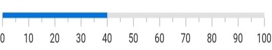

# Getting Started with Flutter Linear Gauge (SfLinearGauge)

This section explains the steps required to add the linear gauge and its elements such as axis, range and pointer. This section covers only basic features needed to know to get started with the Linear Gauge widget.

## Add Flutter Linear Gauge to an application

Create a simple project using the instructions given in the [Getting Started with your first Flutter app](https://flutter.dev/docs/get-started/test-drive?tab=vscode#create-app) documentation.

**Add dependency**

Add the Syncfusion Flutter Gauge dependency to your pubspec.yaml file.

 

    dependencies:

    syncfusion_flutter_gauges: ^xx.x.xx



N> Here **xx.x.xx** denotes the current version of [`Syncfusion Flutter Gauge`](https://pub.dev/packages/syncfusion_flutter_gauges/versions) package.

**Get packages**

Run the following command to get the required packages.

 

    $ flutter pub get



**Import package**

Import the following package in your Dart code.

 

    import 'package:syncfusion_flutter_gauges/gauges.dart';



## Initialize the Linear Gauge

After the package has been imported, initialize the [`SfLinearGauge`](https://pub.dev/documentation/syncfusion_flutter_gauges/latest/gauges/SfLinearGauge/SfLinearGauge.html) as a child of any widget such as center widget.

 

    @override
    Widget build(BuildContext context) {
        return MaterialApp(
            home: Scaffold(
                body: Center(
                        child:SfLinearGauge()
                )
              )      
            );
        }



## Add axis

The Linear Gauge axis is a scale where a set of values can be plotted. You can specify the minimum and maximum values of axis using the [`minimum`](https://pub.dev/documentation/syncfusion_flutter_gauges/latest/gauges/SfLinearGauge/minimum.html) and [`maximum`](https://pub.dev/documentation/syncfusion_flutter_gauges/latest/gauges/SfLinearGauge/maximum.html) properties as demonstrated in the following code snippet.

 

    @override
    Widget build(BuildContext context) {
        return MaterialApp(
            home: Scaffold(
                body: Center(
                   child: SfLinearGauge(minimum: 100, maximum: 200)
                )
            )      
        );
    }



## Update orientation

As you could see in the above image, the default orientation of the Linear gauge is horizontal. But you can change it with the [`orientation`](https://pub.dev/documentation/syncfusion_flutter_gauges/latest/gauges/SfLinearGauge/orientation.html) property of [`SfLinearGauge`](https://pub.dev/documentation/syncfusion_flutter_gauges/latest/gauges/SfLinearGauge/SfLinearGauge.html) widget.

 

SfLinearGauge(
              orientation: LinearGaugeOrientation.vertical
            ),



## Add range

A range is a visual element that helps you quickly visualize where a range falls on the axis track. In [`SfLinearGauge`](https://pub.dev/documentation/syncfusion_flutter_gauges/latest/gauges/SfLinearGauge-class.html) the range is specified by [`LinearGaugeRange`](https://pub.dev/documentation/syncfusion_flutter_gauges/latest/gauges/LinearGaugeRange-class.html) . Multiple ranges with different styles can be added to a linear gauge. You can specify the [`startValue`](https://pub.dev/documentation/syncfusion_flutter_gauges/latest/gauges/LinearGaugeRange/startValue.html), [`endValue`](https://pub.dev/documentation/syncfusion_flutter_gauges/latest/gauges/LinearGaugeRange/endValue.html), and [`color`](https://pub.dev/documentation/syncfusion_flutter_gauges/latest/gauges/LinearGaugeRange/color.html) for a range as demonstrated in the following code.  

 

    SfLinearGauge(
        ranges: <LinearGaugeRange>[
        //First range
        LinearGaugeRange(startValue: 0, endValue: 50, color: Colors.green),
        //Second range
        LinearGaugeRange(startValue: 50, endValue: 100, color: Colors.blue)
      ]
    )



## Add marker pointer

The Linear Gauge supports two marker pointers - shape pointer and widget pointer. Shape pointer will have a default set of pre-build icons to point a value in an axis track, while the widget pointer facilitate using any Flutter widget to point a value in an axis track. The marker pointers ( [`LinearShapePointer`](https://pub.dev/documentation/syncfusion_flutter_gauges/latest/gauges/LinearShapePointer-class.html) and [`LinearWidgetPointer`](https://pub.dev/documentation/syncfusion_flutter_gauges/latest/gauges/LinearWidgetPointer-class.html) ) can be added or removed in/from [`SfLinearGauge`](https://pub.dev/documentation/syncfusion_flutter_gauges/latest/gauges/SfLinearGauge-class.html) by using the [`markerPointers`](https://pub.dev/documentation/syncfusion_flutter_gauges/latest/gauges/SfLinearGauge/markerPointers.html) property.

The below code snippet demonstrates adding a shape pointer.

 

    SfLinearGauge(
        markerPointers: [LinearShapePointer(value: 50)]
      ),



The below code snippet demonstrates adding a widget pointer.

 

    SfLinearGauge(
        markerPointers: [
          LinearWidgetPointer(
            value: 40,
              child: Container(
              height: 20,
              width: 20,
              decoration: BoxDecoration(color: Colors.blueAccent)
            ), 
          ),
        ],
      ),



## Add bar pointer

The bar pointer in a linear gauge is used specify a value in an axis track, but unlike marker pointers which denotes that particular value,  the bar pointer draws a track staring from the minimum value of the axis to that particular value. Bar pointers can be added or removed in/from a [`SfLinearGauge`](https://pub.dev/documentation/syncfusion_flutter_gauges/latest/gauges/SfLinearGauge-class.html) by using the [`barPointers`](https://pub.dev/documentation/syncfusion_flutter_gauges/latest/gauges/SfLinearGauge/barPointers.html) property. 

 

    SfLinearGauge(
        barPointers: [LinearBarPointer(value: 40)]
      ),



The following code example gives you the complete code of above configurations.

 

   import 'package:flutter/material.dart';
   import 'package:syncfusion_flutter_gauges/gauges.dart';

   void main() => runApp(ChartApp());
    class LinearGaugeDemo extends StatelessWidget {

    @override
  Widget build(BuildContext context) {
    return MaterialApp(
        home: Scaffold(
            body: Center(
              child: SfLinearGauge(
                ranges: <LinearGaugeRange>[ 
                  //First range
                 LinearGaugeRange(
                   startValue: 0,
                   endValue: 50,
                   color: Colors.green
                 ),
                 //Second range
                 LinearGaugeRange(
                   startValue: 50,
                   endValue: 100,
                   color: Colors.blue
                 ),
                ],
                markerPointers: [
                  LinearShapePointer(value: 50),
                  LinearWidgetPointer(
                    value: 40,
                    child: Container(
                      height: 20,
                      width: 20,
                      decoration: BoxDecoration(color: Colors.blueAccent)
                    ),
                  ),
                ],
                barPointers: [LinearBarPointer(value: 40)]
              ),
            )
        )
    );
  }
}



