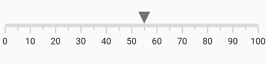

# Flutter Linear Gauge interaction

The shape and widget marker pointers in a Linear Gauge can be moved from one value to another with swipe or drag gestures.

## Interaction with marker pointers

The `onValueChanged` call back is used to change the value of the marker pointer at run-time.

The below code snippet demonstrates updating the marker pointer value based on swipe or drag gesture.



  double _pointerValue = 55;
  @override
  Widget build(BuildContext context) {
    return MaterialApp(
        home: Scaffold(
            body: Center(
                child: Container(
                  child: SfLinearGauge(
                      markerPointers: [
                        LinearShapePointer(
                          value: _pointerValue,
                          onValueChanged: (value) => {
                            setState(() => {_pointerValue = value})
                          },
                        )
                  ]),
                )
            )
        )
    );
  }
}



