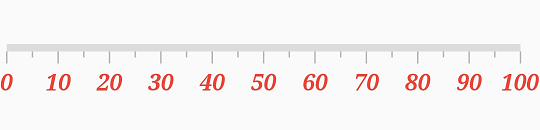
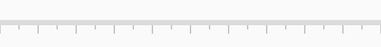
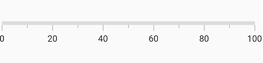
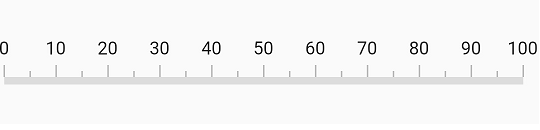
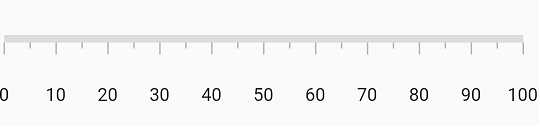
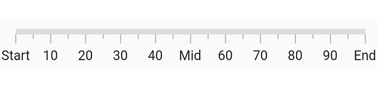
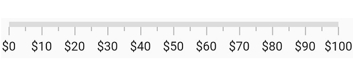

# Labels in Flutter Linear Gauge (SfLinearGauge)

The default style of axis labels is as follows.

## Customize label styles

Axis labels can be customized using the [`axisLabelStyle`](https://pub.dev/documentation/syncfusion_flutter_gauges/latest/gauges/SfLinearGauge/axisLabelStyle.html) property of [`SfLinearGauge`](https://pub.dev/documentation/syncfusion_flutter_gauges/latest/gauges/SfLinearGauge-class.html). The [`axisLabelStyle`](https://pub.dev/documentation/syncfusion_flutter_gauges/latest/gauges/SfLinearGauge/axisLabelStyle.html) property has the following properties to customize the axis labels.

* `color` – Allows you to customize the color of the labels.
* `fontFamily` – Allows you to specify the font family for labels.
* `fontStyle` – Allows you to specify the font style for labels.
* `fontWeight` – Allows you to specify the font weight for labels.
* `fontSize` – Allows you to specify the font size for labels.

 

  @override
  Widget build(BuildContext context) {
    return MaterialApp(
      home: Scaffold(
        body: Center(
          child: SfLinearGauge(
            axisLabelStyle: TextStyle(
              color: Colors.red,
              fontSize: 15,
              fontStyle: FontStyle.italic,
              fontWeight: FontWeight.bold,
              fontFamily: 'Times'
            )
          )
        )
      )
    );
  }



## Change visibility

The [`showLabels`](https://pub.dev/documentation/syncfusion_flutter_gauges/latest/gauges/SfLinearGauge/showLabels.html) property of [`SfLinearGauge`](https://pub.dev/documentation/syncfusion_flutter_gauges/latest/gauges/SfLinearGauge-class.html) allows you to show or hide the visibility of axis labels. The default value of this property is true.

 

@override
Widget build(BuildContext context) {
  return MaterialApp(
      home: Scaffold(
          body: Center( 
                  child: SfLinearGauge(showLabels: false)) 
        )
    );
}



## Customize interval between labels

The [`interval`](https://pub.dev/documentation/syncfusion_flutter_gauges/latest/gauges/SfLinearGauge/interval.html) between labels can be customized using the [`interval`](https://pub.dev/documentation/syncfusion_flutter_gauges/latest/gauges/SfLinearGauge/interval.html) property of [`SfLinearGauge`](https://pub.dev/documentation/syncfusion_flutter_gauges/latest/gauges/SfLinearGauge-class.html). The major ticks are generated based on this interval property.

 

@override
Widget build(BuildContext context) {
  return MaterialApp(
      home: Scaffold(
          body: Center( 
                  child: SfLinearGauge(
                   interval: 20 
                )
            )
        )
    );
}



## Change label position

The linear axis allows you to position the labels either `inside` or `outside` the axis track using the [`labelPosition`](https://pub.dev/documentation/syncfusion_flutter_gauges/latest/gauges/SfLinearGauge/labelPosition.html) property. By default, labels are positioned `inside` the axis track.

 

  @override
  Widget build(BuildContext context) {
    return MaterialApp(
      home: Scaffold(
        body: Center(
          child: SfLinearGauge(
            tickPosition: LinearElementPosition.outside,
            labelPosition: LinearLabelPosition.outside
          ),
        )
      )
    );
  }



## Change label offset

The [`labelOffset`](https://pub.dev/documentation/syncfusion_flutter_gauges/latest/gauges/SfLinearGauge/labelOffset.html) property allows you to adjust the distance between the tick-end and the labels. 

 

  @override
  Widget build(BuildContext context) {
    return MaterialApp(
      home: Scaffold(
        body: Center(
          child: SfLinearGauge(
            labelOffset: 20
          ),            
        )
      )
    );
  }



##  Customize maximum number of visible labels

By default, a maximum of three labels is displayed for every 100 logical pixels in an axis. The maximum number of labels that should be present within 100 logical pixels length can be customized using the [`maximumLabels`](https://pub.dev/documentation/syncfusion_flutter_gauges/latest/gauges/SfLinearGauge/maximumLabels.html) property of the axis. 

 

  @override
  Widget build(BuildContext context) {
    return MaterialApp(
      home: Scaffold(
        body: Center(
          child: SfLinearGauge(
            maximumLabels: 5
          )
        )
      )
    );
  }



## Customize label text

You can format or change the whole numeric label text using the [`labelFormatterCallback`](https://pub.dev/documentation/syncfusion_flutter_gauges/latest/gauges/SfLinearGauge/labelFormatterCallback.html).



  SfLinearGauge(
    labelFormatterCallback: (label) {
      if (label == '0') {
        return 'Start';
      }
      if (label == '50') {
        return 'Mid';
      }
      if (label == '100') {
        return 'End';
      }
      return label;
    }
  )



## Number format

The [`numberFormat`](https://pub.dev/documentation/syncfusion_flutter_gauges/latest/gauges/SfLinearGauge/numberFormat.html) property is used to format the numeric labels. The default value of this property is null.



  SfLinearGauge(
    numberFormat: NumberFormat("\$")
  ),



