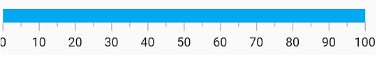

# Flutter Linear Gauge Axis

The Linear Gauge axis is a scale where a set of values can be plotted. An axis can be customized by changing the thickness, color and edge styles. Axis elements such as labels and ticks can also be easily customized. You can also inverse the axis.

## Default Axis

By default axis will have the minimum scale value as 0 and the maximum scale value as 100. Without any changes the default axis of the Linear Gauge will be displayed as below. 

 

    @override
    Widget build(BuildContext context) {
        return MaterialApp(
            home: Scaffold(
                body: Center(
                    child: Container(
                        child:SfLinearGauge()
                        )
                    )
                )      
            );
        }



## Customize the minimum and maximum scale values

The minimum and maximum properties of a Linear Gauge can be used to customize the axis scale. In the below code snippet the axis scale is customized to have the minimum value of -50 to maximum value of 50. The scale values are displayed by the axis labels. Customizing these label styles are further explained in next topics.  

 
@override
Widget build(BuildContext context) {
  return MaterialApp(
      home: Scaffold(
          body: Center(
              child: Container(
                  child: SfLinearGauge(minimum: -50, maximum: 50)))));
}


## Customize the axis track style

The linear axis track can be customized using the axisTrackStyle property. 

* thickness – Customizes the thickness of axis track.
* color – Customizes the color of the axis track with a solid color.
* gradient - Customizes the color of the axis track with a gradient color.

 

@override
Widget build(BuildContext context) {
  return MaterialApp(
      home: Scaffold(
          body: Center(
              child: Container(
                  child: SfLinearGauge(
                    axisTrackStyle: LinearAxisTrackStyle(
                        thickness: 13,
                        color: Colors.lightBlue)),
              )
          )
      )
  );
}



## Customize the corners of Axis track

The edgeStyle property of axisTrackStyle specifies the corner type for the axis track. The corners can be customized using the bothFlat, bothCurve, startCurve, and endCurve options. The default value of this property is bothFlat.

 

@override
Widget build(BuildContext context) {
  return MaterialApp(
      home: Scaffold(
          body: Center(
              child: Container(
                  child: SfLinearGauge(
                      axisTrackStyle: LinearAxisTrackStyle(thickness: 20,
                        edgeStyle: LinearEdgeStyle.bothCurve
                        )),
              )
          )
      )
  );
}



## Change the color of Axis Track

The color and gradient properties in axisTrackStyle allows to change the color of the axis track. The color property allows to set a solid color, while the gradient property allows to set linear-gradient colors to the axis track.

The below code snippet sets a set of linear gradient colors to the axis track.

 

@override
Widget build(BuildContext context) {
  return MaterialApp(
      home: Scaffold(
          body: Center(
              child: Container(
                child: SfLinearGauge(
                    axisTrackStyle: LinearAxisTrackStyle(
                        gradient: LinearGradient(
                            colors: [Colors.deepOrange, Colors.deepPurple],
                            begin: const FractionalOffset(0.0, 0.0),
                            end: const FractionalOffset(0.5, 0.0),
                            stops: [0.0, 1.0],
                            tileMode: TileMode.clamp))),
              )
          )
      )
  );
}



The below code snippet sets a solid color to the axis track.

 

@override
Widget build(BuildContext context) {
  return MaterialApp(
      home: Scaffold(
          body: Center(
              child: Container(
                child: SfLinearGauge(
                    axisTrackStyle: LinearAxisTrackStyle(
                        color:Colors.blue)),
              )
          )
      )
  );
}



## Inverse the axis track

The direction of linear gauge axis can be customized by its isAxisInversed property.
When the isAxisInversed property is true, the axis can be placed in inverse direction. The default value of the isAxisInversed property is false.

 

@override
Widget build(BuildContext context) {
  return MaterialApp(
    home: Scaffold(
      body: Center(
          child: Container(
              child: SfLinearGauge(
               isAxisInversed: true )
          )
      )
    )
  );
}



You can see that the axis values are displayed from 100 to 0 as the axis track is inversed.

## Axis track visibility

You can also hide the axis track by setting the showAxisTrack property to false. The default value of this property is true.

 

@override
Widget build(BuildContext context) {
  return MaterialApp(
      home: Scaffold(
          body: Center(
              child: Container(
                  child: SfLinearGauge(
                 showAxisTrack: false
                  )
              )
          )
      )
  );
}



