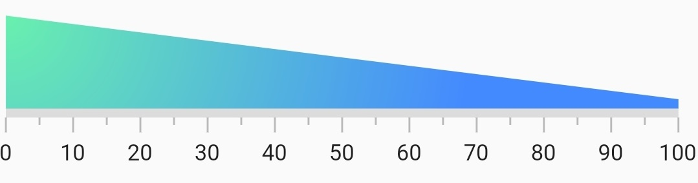

# Default Linear Gauge range

A range is a visual element that helps you quickly visualize where a range falls on the axis track. Multiple ranges with different styles can be added to a linear gauge. The default style of axis range is as below.

 

@override
  Widget build(BuildContext context) {
    return MaterialApp(
      home: Scaffold(
        body: Center(
          child: SfLinearGauge(
              ranges: [
                LinearGaugeRange(
                  startValue: 20,
                  endValue: 70,
                )
              ],
            ),
        ),
      ),
    );
  }
	


## Add multiple ranges

You can add multiple ranges for an axis. The below code sipper demonstartes adding 3 ranges in a Linear Gauge.

 

@override
  Widget build(BuildContext context) {
    return MaterialApp(
      home: Scaffold(
        body: Center(
          child: SfLinearGauge(
              ranges: [
                //First range.
                LinearGaugeRange(
                    startValue: 0, endValue: 50, color: Colors.blueAccent),
                //Second range.
                LinearGaugeRange(
                    startValue: 50, endValue: 70, color: Colors.redAccent),
                //Third range.
                LinearGaugeRange(
                    startValue: 70, endValue: 100, color: Colors.greenAccent),
              ],
            ),
        ),
      ),
    );
  }



## Customize the range shape and thickness

A Linear Gauge range has 3 values to draw a range - start value, mid value and end value.These values indicate where the range falls in the axis. In addition to this values, the range can be updated with the thickness of a range in it's individual start, mid and end positions. To draw a line or rectangle, just start value, start width, end value and end width are enough - as like the above code snippet in 'Default Linear Gauge range'. But to draw a concave, convex and exponential shapes for a range the mid value and mid width properties are needed. For this the rangeShapeType is used to bring the curve. The below code snippet demonstrates how to draw a concave shape in range using the min value.

 

  @override
  Widget build(BuildContext context) {
    return MaterialApp(
      home: Scaffold(
        body: Center(
          child: SfLinearGauge(
              ranges: [
                LinearGaugeRange(
                  startValue: 0,
                  midValue: 50,
                  endValue: 100,
                  startWidth: 70,
                  midWidth: -20,
                  endWidth: 70,
                  rangeShapeType: LinearRangeShapeType.curve,
                ),
              ],
            ),
        ),
      ),
    );
  }
	


## Change the color of a range

The color of a range can be changed by setting the color property of a range. The below code snippet demonstrates changes the color property of the range.

 

  @override
  Widget build(BuildContext context) {
    return MaterialApp(
      home: Scaffold(
        body: Center(
          child: SfLinearGauge(
            ranges: [
              //Changes the color. The start and end values are 0 to 100 by default
              LinearGaugeRange(color: Colors.blueAccent),
            ],
          ),
        ),
      ),
    );
  }


## Add radial gradient colors to a range

The gardiean colors can be applyed by using the shaderCallback property of range. The below code snippet demonstrates applying a RadialGradient color to the range.

 

  @override
  Widget build(BuildContext context) {
    return MaterialApp(
      color: Colors.white,
      home: Scaffold(
        body: Center(
          child: SfLinearGauge(
            ranges: [
              //Applies a radial gradient color. The start and end values are 0 to 100 by default
              LinearGaugeRange(
                  startWidth: 50,
                  shaderCallback: (bounds) => RadialGradient(
                          center: Alignment.topLeft,
                          radius: 5,
                          colors: [
                            Colors.greenAccent,
                            Colors.blueAccent,
                          ]).createShader(bounds)),
            ],
          ),
        ),
      ),
    );
  }
  


## Add linear gradient colors to a range

The below code snippet demonstrates applying a LinearGradient color to the range.

 

  @override
  Widget build(BuildContext context) {
    return MaterialApp(
      home: Scaffold(
        body: Center(
          child: SfLinearGauge(
            ranges: [
              //Applies radial gardient color. The start and end values are 0 to 100 by default
              LinearGaugeRange(
                  startWidth: 50,
                  shaderCallback: (bounds) => LinearGradient(
                          begin: Alignment.topCenter,
                          end: Alignment.bottomCenter,
                          colors: [Colors.greenAccent, Colors.blueAccent])
                      .createShader(bounds)),
            ],
          ),
        ),
      ),
    );
  }
  


## Add sweep gradient colors to a range

The below code snippet demonstrates applying a LinearGradient color to the range.

 

  @override
  Widget build(BuildContext context) {
    return MaterialApp(
      home: Scaffold(
        body: Center(
          child: SfLinearGauge(
            ranges: [
              //Applies sweep gardient color. The start and end values are 0 to 100 by default
              LinearGaugeRange(
                  startWidth: 50,
                  shaderCallback: (bounds) => SweepGradient(
                        startAngle: 0.1,
                        endAngle: 0.2,
                        colors: [
                          Colors.blueAccent,
                          Colors.greenAccent,
                          Colors.orangeAccent,
                        ],
                        tileMode: TileMode.mirror,
                        center: Alignment.bottomRight,
                      ).createShader(bounds)),
            ],
          ),
            ],
          ),
        ),
      ),
    );
  }
  


