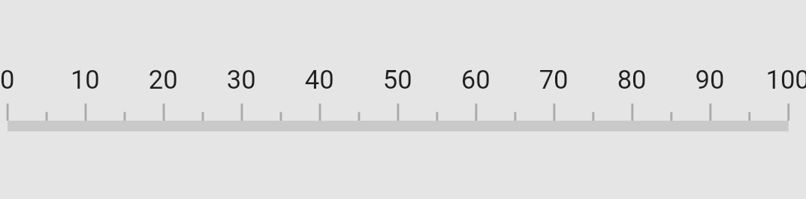

# Mirrored in Flutter Linear Gauge (SfLinearGauge)

The [`isMirrored`](https://pub.dev/documentation/syncfusion_flutter_gauges/latest/gauges/SfLinearGauge/isMirrored.html) property in [`SfLinearGauge`](https://pub.dev/documentation/syncfusion_flutter_gauges/latest/gauges/SfLinearGauge-class.html) allows you to mirror all the gauge elements. This feature is useful when you need to display the gauge in the opposite direction.



  @override
  Widget build(BuildContext context) {
    return Center(
      child: SfLinearGauge(isMirrored: true)
    );
  }



## Comparison for the mirrored and normal gauge

The following screenshot provides a visual comparison between a mirrored Linear Gauge and a normal Linear Gauge. 

