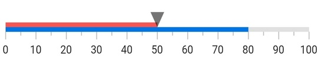

# Flutter Linear Gauge (SfLinearGauge) Overview

Syncfusion&reg; Flutter Linear Gauge is a data visualization widget to display data on a linear scale. Use this widget to craft high-quality mobile app user interfaces.

## Key Features

* **Orientation** - The Linear Gauge can be set to vertical or horizontal orientation.
* **Axis** - The axis is a scale where a set of values can be plotted. An axis can be customized by changing the thickness and edge styles and you can also inverse the axis.
* **Labels and Ticks** - The axis elements such as labels, major ticks, and minor ticks can be customized to different styles.
* **Ranges** - A range is a visual element that helps you to quickly visualize where a range falls on the axis track. Multiple ranges with different styles can be added to the Linear Gauge.
* **Pointers** - A pointer is used to indicate a specific value on an axis. The widget has three types of pointers: shape marker pointer, widget marker pointer, and bar pointer. All the pointers can be customized as needed and you can also add multiple pointers in the Linear Gauge.
* **Mirror Gauge** - The Linear Gauge can be mirrored.  When the [`isMirrored`](https://pub.dev/documentation/syncfusion_flutter_gauges/latest/gauges/SfLinearGauge/isMirrored.html) property is true, all the gauge elements will be rendered in mirror effect. 
* **Animation** - Animate the gauge elements in a visually appealing way, when they are load, or when their values are changed.
* **Interaction** - The shape and widget marker pointers in the Linear Gauge can be moved from one value to another by swiping or drag gestures.

You can get the sample in the following link: [`Flutter Linear Gauge`](https://github.com/syncfusion/flutter-examples/tree/master/lib/samples/linear_gauge).