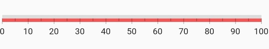

# Range in Flutter Linear Gauge (SfLinearGauge)

A range is a visual element that helps you quickly visualize where a range falls on the axis track. Multiple ranges with different styles can be added to a linear gauge. The default style of range will be as below. 

 

  @override
  Widget build(BuildContext context) {
    return MaterialApp(
      home: Scaffold(
        body: Center(
          child: SfLinearGauge(
              ranges: [
                LinearGaugeRange(
                  startValue: 20,
                  endValue: 70
                )
              ],
            ),
        ),
      ),
    );
  }
	


## Customize range shape 

A Linear Gauge range has three values to draw a range - [`startValue`](https://pub.dev/documentation/syncfusion_flutter_gauges/latest/gauges/LinearGaugeRange/startValue.html), [`midValue`](https://pub.dev/documentation/syncfusion_flutter_gauges/latest/gauges/LinearGaugeRange/midValue.html) and [`endValue`](https://pub.dev/documentation/syncfusion_flutter_gauges/latest/gauges/LinearGaugeRange/endValue.html).These values indicate where the range falls in the axis. In addition to these values, the shape of the range can be customized by [`startWidth`](https://pub.dev/documentation/syncfusion_flutter_gauges/latest/gauges/LinearGaugeRange/startWidth.html), [`midWidth`](https://pub.dev/documentation/syncfusion_flutter_gauges/latest/gauges/LinearGaugeRange/midWidth.html) and [`endWidth`](https://pub.dev/documentation/syncfusion_flutter_gauges/latest/gauges/LinearGaugeRange/endWidth.html) properties. To draw a line or rectangle, just [`startValue`](https://pub.dev/documentation/syncfusion_flutter_gauges/latest/gauges/LinearGaugeRange/startValue.html), [`startWidth`](https://pub.dev/documentation/syncfusion_flutter_gauges/latest/gauges/LinearGaugeRange/startWidth.html), [`endValue`](https://pub.dev/documentation/syncfusion_flutter_gauges/latest/gauges/LinearGaugeRange/endValue.html) and [`endWidth`](https://pub.dev/documentation/syncfusion_flutter_gauges/latest/gauges/LinearGaugeRange/endWidth.html) are enough - as shown in the above code snippet in `Default Linear Gauge Range` topic. 

However, to draw concave, convex and exponential-like shapes the [`midValue`](https://pub.dev/documentation/syncfusion_flutter_gauges/latest/gauges/LinearGaugeRange/midValue.html) and [`midWidth`](https://pub.dev/documentation/syncfusion_flutter_gauges/latest/gauges/LinearGaugeRange/midWidth.html) properties are needed. For this, the [`rangeShapeType`](https://pub.dev/documentation/syncfusion_flutter_gauges/latest/gauges/LinearGaugeRange/rangeShapeType.html) is used to create the curve. The below code snippet demonstrates how to create a concave shape for a range.

 

  @override
  Widget build(BuildContext context) {
    return MaterialApp(
      home: Scaffold(
        body: Center(
          child: SfLinearGauge(
            ranges: [
              LinearGaugeRange(
                startValue: 0,
                midValue: 50,
                endValue: 100,
                startWidth: 70,
                midWidth: 20,
                endWidth: 70,
                rangeShapeType: LinearRangeShapeType.curve
              ),
            ],
          ),
        ),
      ),
    );
  }
	


## Customize edge style

The [`edgeStyle`](https://pub.dev/documentation/syncfusion_flutter_gauges/latest/gauges/LinearGaugeRange/edgeStyle.html) property customizes how the edges of a range should be appear in linear gauge. The available options are `startCurve`, `endCurve`, `bothCurve`, and `bothFlat` options. 

The default value is `bothFlat`.

 

  @override
  Widget build(BuildContext context) {
    return MaterialApp(
      home: Scaffold(
        body: Center(
          child: Container(
            width: 400,
            height: 120,
            child: SfLinearGauge(
              ranges: [
                LinearGaugeRange(
                  startValue: 0,
                  startWidth: 20,
                  endWidth: 20,
                  endValue: 70,  
                  edgeStyle: LinearEdgeStyle.bothCurve,
                  color: Colors.blue,
                ),
              ],
            ),
          ),
        ),
      ),
    );
  }
  


## Customize color of a range

The color of a range can be changed by setting the [`color`](https://pub.dev/documentation/syncfusion_flutter_gauges/latest/gauges/LinearGaugeRange/color.html) property of a range. The below code example demonstrates changing the color property of the range.

 

  @override
  Widget build(BuildContext context) {
    return MaterialApp(
      home: Scaffold(
        body: Center(
          child: SfLinearGauge(
            ranges: [
              //Changes the color. The start and end values are 0 to 100 by default
              LinearGaugeRange(color: Colors.blueAccent)
            ],
          ),
        ),
      ),
    );
  }



## Apply radial gradient to a range

The gradient can be applied by using the [`shaderCallback`](https://pub.dev/documentation/syncfusion_flutter_gauges/latest/gauges/LinearGaugeRange/shaderCallback.html) property of a range. The below code example demonstrates applying a radial gradient to the range.

 

  @override
  Widget build(BuildContext context) {
    return MaterialApp(
      color: Colors.white,
      home: Scaffold(
        body: Center(
          child: SfLinearGauge(
            ranges: [
              //Applies a radial gradient. The start and end values are 0 to 100 by default
              LinearGaugeRange(
                startWidth: 50,
                shaderCallback: (bounds) => RadialGradient(
                  center: Alignment.topLeft,
                  radius: 5,
                  colors: [
                    Colors.greenAccent,
                    Colors.blueAccent,
                  ]).createShader(bounds)
              )
            ],
          ),
        ),
      ),
    );
  }
  


## Apply linear gradient to a range

The below code snippet demonstrates applying a linear gradient to the range.

 

  @override
  Widget build(BuildContext context) {
    return MaterialApp(
      home: Scaffold(
        body: Center(
          child: SfLinearGauge(
            ranges: [
              //Applies linear gradient. The start and end values are 0 to 100 by default
              LinearGaugeRange(
                startWidth: 50,
                shaderCallback: (bounds) => LinearGradient(
                  begin: Alignment.topCenter,
                  end: Alignment.bottomCenter,
                  colors: [Colors.greenAccent, Colors.blueAccent],
                ).createShader(bounds)
              )
            ],
          ),
        ),
      ),
    );
  }
  


## Apply sweep gradient to a range

The below code snippet demonstrates applying a sweep gradient to the range.

 

  @override
  Widget build(BuildContext context) {
    return MaterialApp(
      home: Scaffold(
        body: Center(
          child: SfLinearGauge(
            ranges: [
              //Applies sweep gradient. The start and end values are 0 to 100 by default
              LinearGaugeRange(
                startWidth: 50,
                shaderCallback: (bounds) => SweepGradient(
                  startAngle: 0.1,
                  endAngle: 0.2,
                  colors: [
                    Colors.blueAccent,
                    Colors.greenAccent,
                    Colors.orangeAccent,
                  ],
                  tileMode: TileMode.mirror,
                  center: Alignment.bottomRight,
                ).createShader(bounds)
              ),
            ],
          ),
        ),
      ),
    );
  }
  


## Customize range position

It is possible to position the ranges `inside`, `cross`, and `outside` the axis. By default, the range will be positioned `outside` the axis. The [`position`](https://pub.dev/documentation/syncfusion_flutter_gauges/latest/gauges/LinearGaugeRange/position.html) property of the range is used to position the range. The below code snippet demonstrates the same.

 

  @override
  Widget build(BuildContext context) {
    return MaterialApp(
      color: Colors.white,
      home: Scaffold(
        body: Center(
          child: SfLinearGauge(
            //Here the range is positioned inside the axis.
            ranges: [
              LinearGaugeRange(position: LinearElementPosition.inside)
            ],
          ),
        ),
      ),
    );
  }
  


## Setting range color to axis element

You can set range color to axis elements using the [`useRangeColorForAxis`](https://pub.dev/documentation/syncfusion_flutter_gauges/latest/gauges/SfLinearGauge/useRangeColorForAxis.html) property of axis.

 

  Container(
    child: SfLinearGauge(
      minorTicksPerInterval: 4,
      useRangeColorForAxis: true,
      animateAxis: true,
      axisTrackStyle: LinearAxisTrackStyle(thickness: 1),
      ranges: <LinearGaugeRange>[
        LinearGaugeRange(
          startValue: 0,
          endValue: 33,
          position: LinearElementPosition.outside,
          color: Color(0xffF45656),
        ),
        LinearGaugeRange(
          startValue: 33,
          endValue: 66,
          position: LinearElementPosition.outside,
          color: Color(0xffFFC93E),
        ),
        LinearGaugeRange(
          startValue: 66,
          endValue: 100,
          position: LinearElementPosition.outside,
          color: Color(0xff0DC9AB),
        ),
      ],
    )
  )



## Add multiple ranges

You can add multiple ranges for an axis. The below code example demonstrates adding three ranges in a Linear Gauge.

 

  @override
  Widget build(BuildContext context) {
    return MaterialApp(
      home: Scaffold(
        body: Center(
          child: SfLinearGauge(
            ranges: [
              //First range.
              LinearGaugeRange(
                startValue: 0, endValue: 50, color: Colors.blueAccent,
              ),
              //Second range.
              LinearGaugeRange(
                startValue: 50, endValue: 70, color: Colors.redAccent,
              ),
              //Third range.
              LinearGaugeRange(
                startValue: 70, endValue: 100, color: Colors.greenAccent,
              ),
            ],
          ),
        ),
      ),
    );
  }



