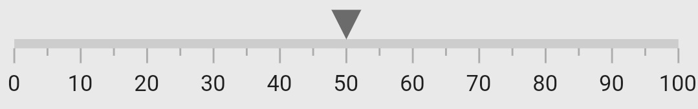
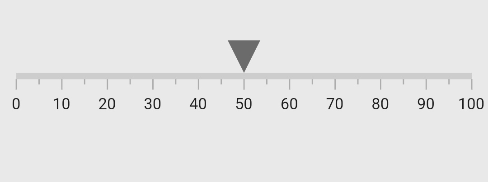
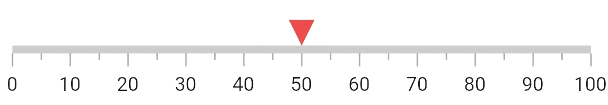
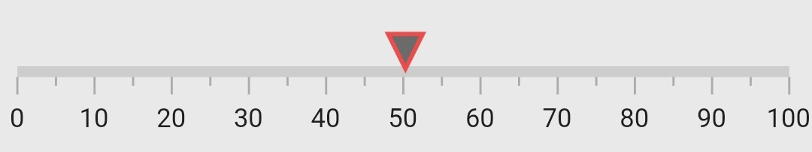
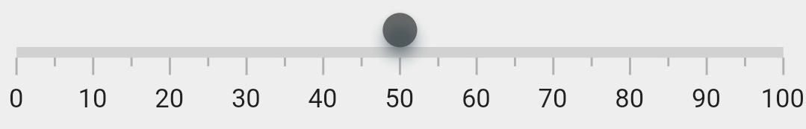
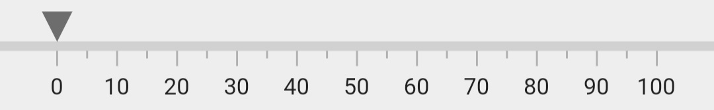
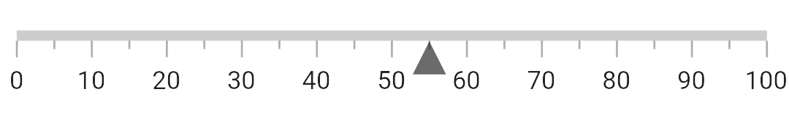
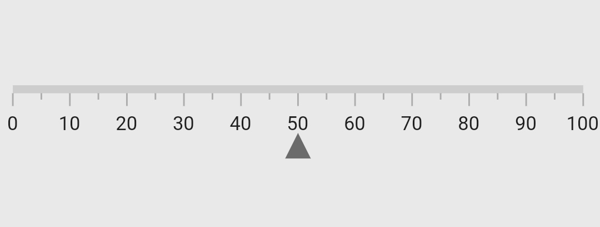
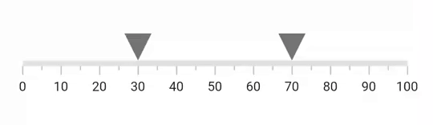
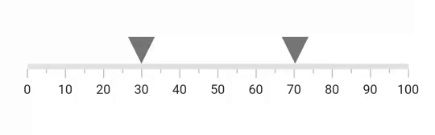

# Shape Marker Pointer in Flutter Linear Gauge (SfLinearGauge)

The [`LinearShapePointer`](https://pub.dev/documentation/syncfusion_flutter_gauges/latest/gauges/LinearShapePointer-class.html) in [`SfLinearGauge`](https://pub.dev/documentation/syncfusion_flutter_gauges/latest/gauges/SfLinearGauge-class.html) have the following pre-defined shapes to mark a specific value. The default shape pointer is `invertedTriangle`. 

1. `Triangle`
2. `Inverted Triangle`
3. `Circle`
4. `Diamond`
5. `Rectangle`

The following is the default appearance of default shape pointer.

 

 @override
  Widget build(BuildContext context) {
    return MaterialApp(
      home: Scaffold(
        body: Center(
          child: SfLinearGauge(
            markerPointers: [LinearShapePointer(value: 50)]
          ),
        ),
      ),
    );
  }
  


## Change the size

The size of the marker pointer can be changed by the [`height`](https://pub.dev/documentation/syncfusion_flutter_gauges/latest/gauges/LinearShapePointer/height.html) and [`width`](https://pub.dev/documentation/syncfusion_flutter_gauges/latest/gauges/LinearShapePointer/width.html) properties of [`LinearShapePointer`](https://pub.dev/documentation/syncfusion_flutter_gauges/latest/gauges/LinearShapePointer-class.html). The following code sample demonstrates how to change the size of a shape pointer.

 

  @override
  Widget build(BuildContext context) {
    return MaterialApp(
      color: Colors.white,
      home: Scaffold(
        body: Center(
          child: SfLinearGauge(markerPointers: [
            LinearShapePointer(value: 50, height: 25, width: 25)
          ]),
        ),
      ),
    );
  }
  


## Customize color

The color of the shape pointer can be changed by the [`color`](https://pub.dev/documentation/syncfusion_flutter_gauges/latest/gauges/LinearShapePointer/color.html) property. The following code example demonstrates the same.

 

 @override
  Widget build(BuildContext context) {
    return MaterialApp(
      color: Colors.white,
      home: Scaffold(
        body: Center(
          child: SfLinearGauge(markerPointers: [
            LinearShapePointer(value: 50, color: Colors.redAccent)
          ]),
        ),
      ),
    );
  


## Customize the border

The border can be customized by the [`borderColor`](https://pub.dev/documentation/syncfusion_flutter_gauges/latest/gauges/LinearShapePointer/borderColor.html) and [`borderWidth`](https://pub.dev/documentation/syncfusion_flutter_gauges/latest/gauges/LinearShapePointer/borderWidth.html) properties of the [`LinearShapePointer`](https://pub.dev/documentation/syncfusion_flutter_gauges/latest/gauges/LinearShapePointer-class.html).

 

  @override
  Widget build(BuildContext context) {
    return MaterialApp(
      color: Colors.white,
      home: Scaffold(
        body: Center(
          child: SfLinearGauge(markerPointers: [
            LinearShapePointer(
                value: 50, borderColor: Colors.redAccent, borderWidth: 2)
          ]),
        ),
      ),
    );
  }
  


## Customize the elevation

The elevation can be customized by the [`elevation`](https://pub.dev/documentation/syncfusion_flutter_gauges/latest/gauges/LinearShapePointer/elevation.html) and [`elevationColor`](https://pub.dev/documentation/syncfusion_flutter_gauges/latest/gauges/LinearShapePointer/elevationColor.html) properties.

 

   @override
  Widget build(BuildContext context) {
    return MaterialApp(
      color: Colors.white,
      home: Scaffold(
        body: Center(
          child: Container(
            color: Colors.white,
            child: SfLinearGauge(markerPointers: [
              LinearShapePointer(
                  value: 50,
                  shapeType: LinearShapePointerType.circle,
                  elevation: 5,
                  elevationColor: Colors.blueGrey)
            ]),
          ),
        ),
      ),
    );
  }
  


## Change marker alignment

The marker pointer alignment can be changed by the [`markerAlignment`](https://pub.dev/documentation/syncfusion_flutter_gauges/latest/gauges/LinearShapePointer/markerAlignment.html) property of [`LinearShapePointer`](https://pub.dev/documentation/syncfusion_flutter_gauges/latest/gauges/LinearShapePointer-class.html).The available marker pointer alignments are `start`, `end`, and `center`.

 

 @override
  Widget build(BuildContext context) {
    return MaterialApp(
      home: Scaffold(
        body: Center(
          child: SfLinearGauge(axisTrackExtent: 30, markerPointers: [
            LinearShapePointer(
                value: 0, markerAlignment: LinearMarkerAlignment.start)
          ]),
        ),
      ),
    );
  }
  


## Customize position

By default, the shape pointer is positioned `outside` the axis. This position can be changed by the [`position`](https://pub.dev/documentation/syncfusion_flutter_gauges/latest/gauges/LinearShapePointer/position.html) property of a [`LinearShapePointer`](https://pub.dev/documentation/syncfusion_flutter_gauges/latest/gauges/LinearShapePointer-class.html). It is possible to position the shape pointer `inside`, `cross`, or `outside` the axis. The following code sample demonstrates how to change the shape pointer position to inside the axis.  

 

  @override
  Widget build(BuildContext context) {
    return MaterialApp(
      home: Scaffold(
        body: Center(
          child: SfLinearGauge(markerPointers: [
            LinearShapePointer(
                value: 55,
                shapeType: LinearShapePointerType.triangle,
                position: LinearElementPosition.inside)
          ]),
        ),
      ),
    );
  }
  


## Customize offset

In addition to position the shape pointer, it is also possible to change the offset of the shape pointer. The [`offset`](https://pub.dev/documentation/syncfusion_flutter_gauges/latest/gauges/LinearShapePointer/offset.html) is the distance from the axis and it cannot be negative and The cross positioned elements will not get affected by the [`offset`](https://pub.dev/documentation/syncfusion_flutter_gauges/latest/gauges/LinearShapePointer/offset.html) value. The following code sample demonstrates how to change the [`offset`](https://pub.dev/documentation/syncfusion_flutter_gauges/latest/gauges/LinearShapePointer/offset.html) value of the shape pointer. 

 

  @override
  Widget build(BuildContext context) {
    return MaterialApp(
      home: Scaffold(
        body: Center(
          child: SfLinearGauge(markerPointers: [
            LinearShapePointer(
                value: 50,
                offset: 25,
                shapeType: LinearShapePointerType.triangle,
                position: LinearElementPosition.inside)
          ]),
        ),
      ),
    );
  }
  


## Drag behavior

You can drag the pointers freely to any position when adding multiple pointers by setting the `dragBehavior` property to `LinearMarkerDragBehavior.free`.

The `LinearMarkerDragBehavior.constraint` can be used to limit the active pointer dragging beyond the other pointers.

### Free



double _firstPointer = 30;
double _secondPointer = 70;

@override
Widget build(BuildContext context) {
  return Scaffold(
    body: SfLinearGauge(
      markerPointers: [
        LinearShapePointer(
          value: _firstPointer,
          height: 25,
          width: 25,
          shapeType: LinearShapePointerType.invertedTriangle,
          dragBehavior: LinearMarkerDragBehavior.free,
          onChanged: (double newValue) {
            setState(() {
              _firstPointer = newValue;
            });
          },
        ),
        LinearShapePointer(
          value: _secondPointer,
          height: 25,
          width: 25,
          shapeType: LinearShapePointerType.invertedTriangle,
          dragBehavior: LinearMarkerDragBehavior.free,
          onChanged: (double newValue) {
            setState(() {
              _secondPointer = newValue;
            });
          },
        ),
      ],
    ),
  );
}



### Constrained



double _firstPointer = 30;
double _secondPointer = 70;

@override
Widget build(BuildContext context) {
  return Scaffold(
    body: SfLinearGauge(
      markerPointers: [
        LinearShapePointer(
          value: _firstPointer,
          height: 25,
          width: 25,
          shapeType: LinearShapePointerType.invertedTriangle,
          dragBehavior: LinearMarkerDragBehavior.constraint,
          onChanged: (double newValue) {
            setState(() {
              _firstPointer = newValue;
            });
          },
        ),
        LinearShapePointer(
          value: _secondPointer,
          height: 25,
          width: 25,
          shapeType: LinearShapePointerType.invertedTriangle,
          dragBehavior: LinearMarkerDragBehavior.constraint,
          onChanged: (double newValue) {
            setState(() {
              _secondPointer = newValue;
            });
          },
        ),
      ],
    ),
  );
}



## Handle onChangeStart, onChanged, and onChangeEnd callbacks

The [`LinearShapePointer`](https://pub.dev/documentation/syncfusion_flutter_gauges/latest/gauges/LinearShapePointer-class.html) provides the `onChangeStart`, `onChanged`, and `onChangeEnd` callbacks. The `onChangeStart` callback will be called when the user start dragging the pointer, the `onChanged` callback will be called when dragging the pointer and the `onChangeEnd` callback will be called when the user stops the pointer dragging.



double _value = 50;

@override
Widget build(BuildContext context) {
  return Scaffold(
    body: SfLinearGauge(
      markerPointers: [
        LinearShapePointer(
          value: _value,
          onChangeStart: (double newValue) {
            _value = newValue;
          },
          onChanged: (double newValue) {
            setState(() {
              _value = newValue;
            });
          },
          onChangeEnd: (double newValue) {
            _value = newValue;
          },
          shapeType: LinearShapePointerType.invertedTriangle,
        ),
      ],
    ),
  );
}


