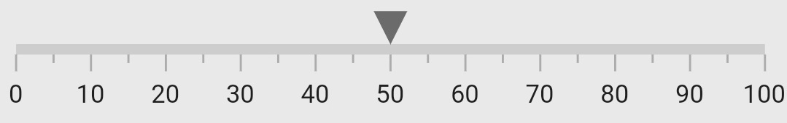
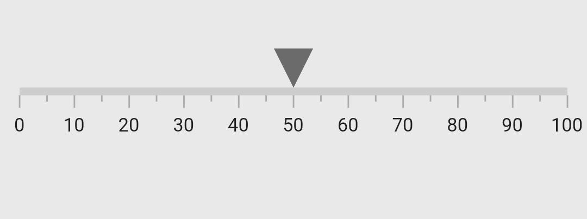
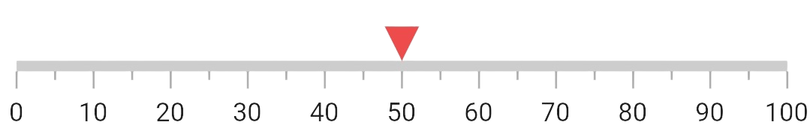
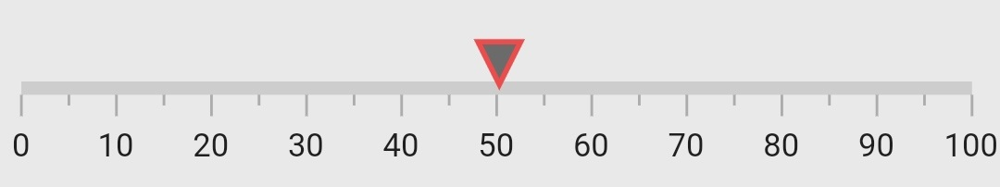
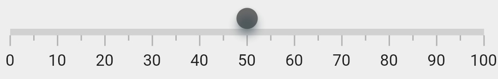
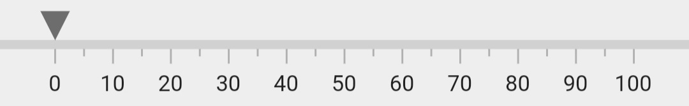
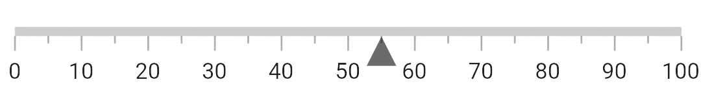
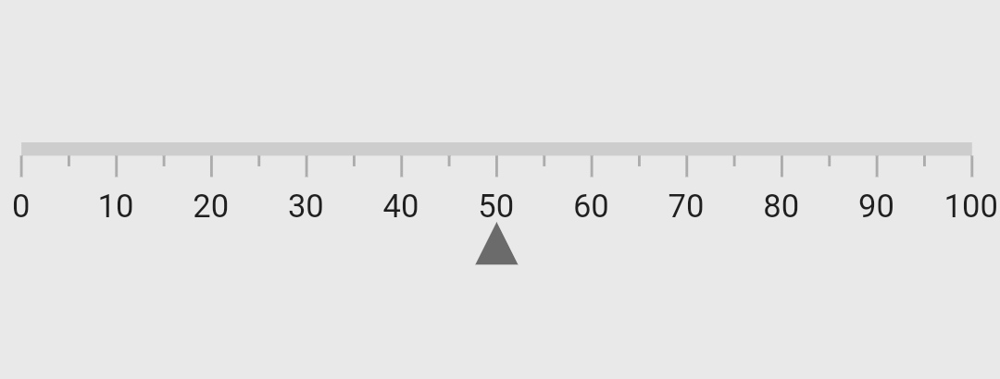
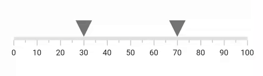
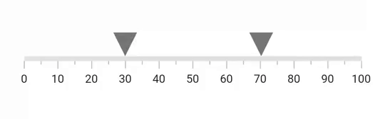

# Shape Marker Pointer in Flutter Linear Gauge (SfLinearGauge)

The [`LinearShapePointer`](https://pub.dev/documentation/syncfusion_flutter_gauges/latest/gauges/LinearShapePointer-class.html) in [`SfLinearGauge`](https://pub.dev/documentation/syncfusion_flutter_gauges/latest/gauges/SfLinearGauge-class.html) provides pre-defined shapes to mark specific values. The default shape pointer is `invertedTriangle`. 

1. `Triangle`
2. `Inverted Triangle`
3. `Circle`
4. `Diamond`
5. `Rectangle`

The following is the default appearance of the default shape pointer.




import 'package:flutter/material.dart';
import 'package:syncfusion_flutter_gauges/gauges.dart';

void main() => runApp(const LinearGaugeDemo());

class LinearGaugeDemo extends StatelessWidget {
  const LinearGaugeDemo({Key? key}) : super(key: key);

  @override
  Widget build(BuildContext context) {
    return MaterialApp(
      home: Scaffold(
        body: Center(
          child: SfLinearGauge(
            markerPointers: [LinearShapePointer(value: 50)]
          ),
        ),
      ),
    );
  }
}




## Change the size

The size of the marker pointer can be changed by the [`height`](https://pub.dev/documentation/syncfusion_flutter_gauges/latest/gauges/LinearShapePointer/height.html) and [`width`](https://pub.dev/documentation/syncfusion_flutter_gauges/latest/gauges/LinearShapePointer/width.html) properties of [`LinearShapePointer`](https://pub.dev/documentation/syncfusion_flutter_gauges/latest/gauges/LinearShapePointer-class.html). The following code sample demonstrates how to change the size of a shape pointer:




import 'package:flutter/material.dart';
import 'package:syncfusion_flutter_gauges/gauges.dart';

void main() => runApp(const LinearGaugeDemo());

class LinearGaugeDemo extends StatelessWidget {
  const LinearGaugeDemo({Key? key}) : super(key: key);

  @override
  Widget build(BuildContext context) {
    return MaterialApp(
      color: Colors.white,
      home: Scaffold(
        body: Center(
          child: SfLinearGauge(markerPointers: [
            LinearShapePointer(value: 50, height: 25, width: 25)
          ]),
        ),
      ),
    );
  }
}




## Customize color

The color of the shape pointer can be changed by the [`color`](https://pub.dev/documentation/syncfusion_flutter_gauges/latest/gauges/LinearShapePointer/color.html) property. The following code example demonstrates the same.




import 'package:flutter/material.dart';
import 'package:syncfusion_flutter_gauges/gauges.dart';

void main() => runApp(const LinearGaugeDemo());

class LinearGaugeDemo extends StatelessWidget {
  const LinearGaugeDemo({Key? key}) : super(key: key);

  @override
  Widget build(BuildContext context) {
    return MaterialApp(
      color: Colors.white,
      home: Scaffold(
        body: Center(
          child: SfLinearGauge(markerPointers: [
            LinearShapePointer(value: 50, color: Colors.redAccent)
          ]),
        ),
      ),
    );
  }
}




## Customize the border

The border can be customized by the [`borderColor`](https://pub.dev/documentation/syncfusion_flutter_gauges/latest/gauges/LinearShapePointer/borderColor.html) and [`borderWidth`](https://pub.dev/documentation/syncfusion_flutter_gauges/latest/gauges/LinearShapePointer/borderWidth.html) properties of the [`LinearShapePointer`](https://pub.dev/documentation/syncfusion_flutter_gauges/latest/gauges/LinearShapePointer-class.html).




import 'package:flutter/material.dart';
import 'package:syncfusion_flutter_gauges/gauges.dart';

void main() => runApp(const LinearGaugeDemo());

class LinearGaugeDemo extends StatelessWidget {
  const LinearGaugeDemo({Key? key}) : super(key: key);

  @override
  Widget build(BuildContext context) {
    return MaterialApp(
      color: Colors.white,
      home: Scaffold(
        body: Center(
          child: SfLinearGauge(
            markerPointers: [
              LinearShapePointer(
                value: 50, borderColor: Colors.redAccent, borderWidth: 2,
              )
            ],
          ),
        ),
      ),
    );
  }
}




## Customize the elevation

The elevation can be customized by the [`elevation`](https://pub.dev/documentation/syncfusion_flutter_gauges/latest/gauges/LinearShapePointer/elevation.html) and [`elevationColor`](https://pub.dev/documentation/syncfusion_flutter_gauges/latest/gauges/LinearShapePointer/elevationColor.html) properties.




import 'package:flutter/material.dart';
import 'package:syncfusion_flutter_gauges/gauges.dart';

void main() => runApp(const LinearGaugeDemo());

class LinearGaugeDemo extends StatelessWidget {
  const LinearGaugeDemo({Key? key}) : super(key: key);

  @override
  Widget build(BuildContext context) {
    return MaterialApp(
      color: Colors.white,
      home: Scaffold(
        body: Center(
          child: Container(
            color: Colors.white,
            child: SfLinearGauge(markerPointers: [
              LinearShapePointer(
                value: 50,
                shapeType: LinearShapePointerType.circle,
                elevation: 5,
                elevationColor: Colors.blueGrey,
              ),
            ]),
          ),
        ),
      ),
    );
  }
}




## Change marker alignment

The marker pointer alignment can be changed by the [`markerAlignment`](https://pub.dev/documentation/syncfusion_flutter_gauges/latest/gauges/LinearShapePointer/markerAlignment.html) property of [`LinearShapePointer`](https://pub.dev/documentation/syncfusion_flutter_gauges/latest/gauges/LinearShapePointer-class.html). The available marker pointer alignments are `start`, `end`, and `center`.




import 'package:flutter/material.dart';
import 'package:syncfusion_flutter_gauges/gauges.dart';

void main() => runApp(const LinearGaugeDemo());

class LinearGaugeDemo extends StatelessWidget {
  const LinearGaugeDemo({Key? key}) : super(key: key);

  @override
  Widget build(BuildContext context) {
    return MaterialApp(
      home: Scaffold(
        body: Center(
          child: SfLinearGauge(
            axisTrackExtent: 30, 
            markerPointers: [
              LinearShapePointer(
                value: 0, markerAlignment: LinearMarkerAlignment.start,
              ),
            ],
          ),
        ),
      ),
    );
  }
}




## Customize position

By default, the shape pointer is positioned `outside` the axis. This position can be changed by the [`position`](https://pub.dev/documentation/syncfusion_flutter_gauges/latest/gauges/LinearShapePointer/position.html) property of a [`LinearShapePointer`](https://pub.dev/documentation/syncfusion_flutter_gauges/latest/gauges/LinearShapePointer-class.html). It is possible to position the shape pointer `inside`, `cross`, or `outside` the axis. The following code sample demonstrates how to position the shape pointer inside the axis.




import 'package:flutter/material.dart';
import 'package:syncfusion_flutter_gauges/gauges.dart';

void main() => runApp(const LinearGaugeDemo());

class LinearGaugeDemo extends StatelessWidget {
  const LinearGaugeDemo({Key? key}) : super(key: key);

  @override
  Widget build(BuildContext context) {
    return MaterialApp(
      home: Scaffold(
        body: Center(
          child: SfLinearGauge(
            markerPointers: [
              LinearShapePointer(
                value: 55,
                shapeType: LinearShapePointerType.triangle,
                position: LinearElementPosition.inside,
              ),
            ]
          ),
        ),
      ),
    );
  }
}




## Customize offset

In addition to positioning the shape pointer, it is also possible to change the offset of the shape pointer. The [`offset`](https://pub.dev/documentation/syncfusion_flutter_gauges/latest/gauges/LinearShapePointer/offset.html) is the distance from the axis and it cannot be negative. Cross-positioned elements will not be affected by the [`offset`](https://pub.dev/documentation/syncfusion_flutter_gauges/latest/gauges/LinearShapePointer/offset.html) value. The following code sample demonstrates how to change the [`offset`](https://pub.dev/documentation/syncfusion_flutter_gauges/latest/gauges/LinearShapePointer/offset.html) value of the shape pointer.




import 'package:flutter/material.dart';
import 'package:syncfusion_flutter_gauges/gauges.dart';

void main() => runApp(const LinearGaugeDemo());

class LinearGaugeDemo extends StatelessWidget {
  const LinearGaugeDemo({Key? key}) : super(key: key);

  @override
  Widget build(BuildContext context) {
    return MaterialApp(
      home: Scaffold(
        body: Center(
          child: SfLinearGauge(
            markerPointers: [
              LinearShapePointer(
                value: 50,
                offset: 25,
                shapeType: LinearShapePointerType.triangle,
                position: LinearElementPosition.inside,
              ),
            ],
          ),
        ),
      ),
    );
  }
}




## Drag behavior

You can drag the pointers freely to any position when adding multiple pointers by setting the [`dragBehavior`](https://pub.dev/documentation/syncfusion_flutter_gauges/latest/gauges/LinearShapePointer/dragBehavior.html) property to `LinearMarkerDragBehavior.free`.

The `LinearMarkerDragBehavior.constrained` can be used to limit the active pointer dragging beyond the other pointers.

### Free




import 'package:flutter/material.dart';
import 'package:syncfusion_flutter_gauges/gauges.dart';

void main() => runApp(const LinearGaugeDemo());

class LinearGaugeDemo extends StatefulWidget {
  const LinearGaugeDemo({Key? key}) : super(key: key);

  @override
  State<LinearGaugeDemo> createState() => _LinearGaugeDemoState();
}

class _LinearGaugeDemoState extends State<LinearGaugeDemo> {
  double _firstPointer = 30;
  double _secondPointer = 70;

  @override
  Widget build(BuildContext context) {
    return Scaffold(
      body: SfLinearGauge(
        markerPointers: [
          LinearShapePointer(
            value: _firstPointer,
            height: 25,
            width: 25,
            shapeType: LinearShapePointerType.invertedTriangle,
            dragBehavior: LinearMarkerDragBehavior.free,
            onChanged: (double newValue) {
              setState(() {
                _firstPointer = newValue;
              });
            },
          ),
          LinearShapePointer(
            value: _secondPointer,
            height: 25,
            width: 25,
            shapeType: LinearShapePointerType.invertedTriangle,
            dragBehavior: LinearMarkerDragBehavior.free,
            onChanged: (double newValue) {
              setState(() {
                _secondPointer = newValue;
              });
            },
          ),
        ],
      ),
    );
  }
}




### Constrained




import 'package:flutter/material.dart';
import 'package:syncfusion_flutter_gauges/gauges.dart';

void main() => runApp(const LinearGaugeDemo());

class LinearGaugeDemo extends StatefulWidget {
  const LinearGaugeDemo({Key? key}) : super(key: key);

  @override
  State<LinearGaugeDemo> createState() => _LinearGaugeDemoState();
}

class _LinearGaugeDemoState extends State<LinearGaugeDemo> {
  double _firstPointer = 30;
  double _secondPointer = 70;

  @override
  Widget build(BuildContext context) {
    return Scaffold(
      body: SfLinearGauge(
        markerPointers: [
          LinearShapePointer(
            value: _firstPointer,
            height: 25,
            width: 25,
            shapeType: LinearShapePointerType.invertedTriangle,
            dragBehavior: LinearMarkerDragBehavior.constrained,
            onChanged: (double newValue) {
              setState(() {
                _firstPointer = newValue;
              });
            },
          ),
          LinearShapePointer(
            value: _secondPointer,
            height: 25,
            width: 25,
            shapeType: LinearShapePointerType.invertedTriangle,
            dragBehavior: LinearMarkerDragBehavior.constrained,
            onChanged: (double newValue) {
              setState(() {
                _secondPointer = newValue;
              });
            },
          ),
        ],
      ),
    );
  }
}




## Handle onChangeStart, onChanged, and onChangeEnd callbacks

The [`LinearShapePointer`](https://pub.dev/documentation/syncfusion_flutter_gauges/latest/gauges/LinearShapePointer-class.html) provides the [`onChangeStart`](https://pub.dev/documentation/syncfusion_flutter_gauges/latest/gauges/LinearShapePointer/onChangeStart.html), [`onChanged`](https://pub.dev/documentation/syncfusion_flutter_gauges/latest/gauges/LinearShapePointer/onChanged.html), and [`onChangeEnd`](https://pub.dev/documentation/syncfusion_flutter_gauges/latest/gauges/LinearShapePointer/onChangeEnd.html) callbacks. The [`onChangeStart`](https://pub.dev/documentation/syncfusion_flutter_gauges/latest/gauges/LinearShapePointer/onChangeStart.html) callback will be called when the user starts dragging the pointer. The [`onChanged`](https://pub.dev/documentation/syncfusion_flutter_gauges/latest/gauges/LinearShapePointer/onChanged.html) callback will be called when dragging the pointer. The [`onChangeEnd`](https://pub.dev/documentation/syncfusion_flutter_gauges/latest/gauges/LinearShapePointer/onChangeEnd.html) callback will be called when the user stops dragging the pointer.




import 'package:flutter/material.dart';
import 'package:syncfusion_flutter_gauges/gauges.dart';

void main() => runApp(const LinearGaugeDemo());

class LinearGaugeDemo extends StatefulWidget {
  const LinearGaugeDemo({Key? key}) : super(key: key);

  @override
  State<LinearGaugeDemo> createState() => _LinearGaugeDemoState();
}

class _LinearGaugeDemoState extends State<LinearGaugeDemo> {
  double _value = 50;

  @override
  Widget build(BuildContext context) {
    return Scaffold(
      body: SfLinearGauge(
        markerPointers: [
          LinearShapePointer(
            value: _value,
            onChangeStart: (double newValue) {
              _value = newValue;
            },
            onChanged: (double newValue) {
              setState(() {
                _value = newValue;
              });
            },
            onChangeEnd: (double newValue) {
              _value = newValue;
            },
            shapeType: LinearShapePointerType.invertedTriangle,
          ),
        ],
      ),
    );
  }
}




## Animation completed callback

The [`onAnimationCompleted`](https://pub.dev/documentation/syncfusion_flutter_gauges/latest/gauges/LinearShapePointer/onAnimationCompleted.html) callback in the [`LinearShapePointer`](https://pub.dev/documentation/syncfusion_flutter_gauges/latest/gauges/LinearShapePointer-class.html) will be triggered when the shape pointer animation is completed. The default value of the [onAnimationCompleted](https://pub.dev/documentation/syncfusion_flutter_gauges/latest/gauges/LinearShapePointer/onAnimationCompleted.html) callback is `null`.




import 'package:flutter/material.dart';
import 'package:syncfusion_flutter_gauges/gauges.dart';

void main() => runApp(const LinearGaugeDemo());

class LinearGaugeDemo extends StatelessWidget {
  const LinearGaugeDemo({Key? key}) : super(key: key);

  @override
  Widget build(BuildContext context) {
    return MaterialApp(
      home: Scaffold(
        body: Center(
          child: SfLinearGauge(
            markerPointers:[
              LinearShapePointer(
                onAnimationCompleted: () {
                  // Shape Pointer animation is completed
                  debugPrint('Shape Pointer animation is completed');
                },
              ),
            ],
          ),
        ),
      ),
    );
  }
}



