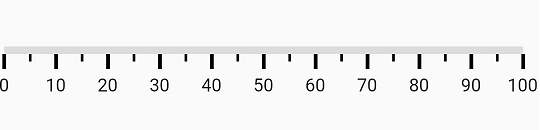
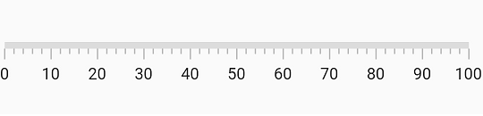
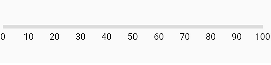
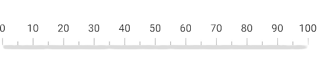
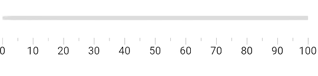

# Ticks in Flutter Linear Gauge (SfLinearGauge)

The default style of axis ticks is as follows.

## Customize tick style

There are two types of ticks in the Flutter Linear Gauge namely major and minor ticks. In the above image, the larger ticks are major ticks and the ticks between the major ticks are minor ticks. The major and minor tick of a [`SfLinearGauge`](https://pub.dev/documentation/syncfusion_flutter_gauges/latest/gauges/SfLinearGauge-class.html) can be customized using the [`majorTickStyle`](https://pub.dev/documentation/syncfusion_flutter_gauges/latest/gauges/SfLinearGauge/majorTickStyle.html) and [`minorTickStyle`](https://pub.dev/documentation/syncfusion_flutter_gauges/latest/gauges/MinorTickStyle-class.html) properties. The following properties can be customized for both the major and the minor ticks:
* [`color`](https://pub.dev/documentation/syncfusion_flutter_gauges/latest/gauges/MajorTickStyle/color.html) – Allows to customize the tick color.
* [`thickness`](https://pub.dev/documentation/syncfusion_flutter_gauges/latest/gauges/MajorTickStyle/thickness.html) – Allows to customize the thickness of ticks.
* [`length`](https://pub.dev/documentation/syncfusion_flutter_gauges/latest/gauges/MajorTickStyle/length.html) – Specifics the length of ticks.

 

@override
  Widget build(BuildContext context) {
    return MaterialApp(
        home: Scaffold(
            body: Center(
              child: SfLinearGauge(
                  majorTickStyle: LinearTickStyle(length: 10, thickness: 2.5, color: Colors.black),
                  minorTickStyle: LinearTickStyle(length: 5, thickness: 1.75, color: Colors.black))
            )
        )
    );
  }



## Customize minor tick interval

The major ticks are generated based on the [`interval`](https://pub.dev/documentation/syncfusion_flutter_gauges/latest/gauges/SfLinearGauge/interval.html) property which is documented in `Customize the interval between labels` topic. The minor ticks are calculated using the [`minorTicksPerInterval`](https://pub.dev/documentation/syncfusion_flutter_gauges/latest/gauges/SfLinearGauge/minorTicksPerInterval.html) property of [`SfLinearGauge`](https://pub.dev/documentation/syncfusion_flutter_gauges/latest/gauges/SfLinearGauge-class.html). By default, the value of this property is 1.

 

@override
Widget build(BuildContext context) {
  return MaterialApp(
      home: Scaffold(
          body: Center(             
               child: SfLinearGauge(minorTicksPerInterval: 4)         
          )
      )
  );
}



## Change tick visibility

The [`showTicks`](https://pub.dev/documentation/syncfusion_flutter_gauges/latest/gauges/SfLinearGauge/showTicks.html) property of the axis is used to enable or disable the visibility of both the major and the minor ticks. The default value of this property is true.

 

@override
Widget build(BuildContext context) {
  return MaterialApp(
      home: Scaffold(
          body: Center(
                child: SfLinearGauge(
                    showTicks: false
                ),
          )
      )
  );
}



## Customize tick position

The linear axis allows to position the ticks either inside or outside the axis track using the [`tickPosition`](https://pub.dev/documentation/syncfusion_flutter_gauges/latest/gauges/SfLinearGauge/tickPosition.html) property. By default, ticks are positioned inside the axis track.

 

@override
Widget build(BuildContext context) {
  return MaterialApp(
      home: Scaffold(
          body: Center(
                child: SfLinearGauge(
                    tickPosition: LinearElementPosition.outside,
                    labelPosition: LinearLabelPosition.outside
                ),
          )
      )
  );
}



## Customize tick offset

The ticks can be moved near or far to the axis line using the [`tickOffset`](https://pub.dev/documentation/syncfusion_flutter_gauges/latest/gauges/SfLinearGauge/tickOffset.html) property. The default value of tick offset is 0. While setting offset for the ticks, the axis labels are also moved along with the ticks.

 

@override
Widget build(BuildContext context) {
  return MaterialApp(
      home: Scaffold(
          body: Center(
                child: SfLinearGauge(tickOffset: 20),
          )
      )
    );
}



