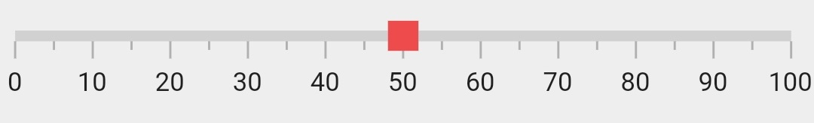
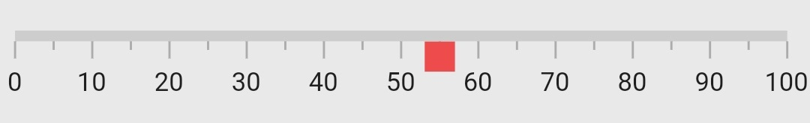
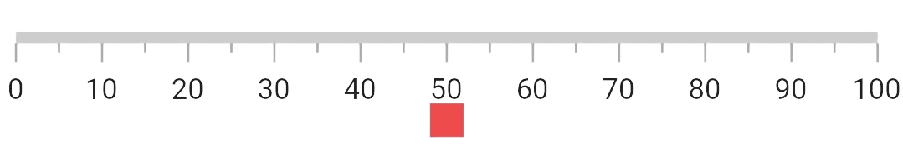

# Widget Marker Pointer in Flutter Linear Gauge (SfLinearGauge)

The [`LinearWidgetPointer`](https://pub.dev/documentation/syncfusion_flutter_gauges/latest/gauges/LinearWidgetPointer/LinearWidgetPointer.html) in [`SfLinearGauge`](https://pub.dev/documentation/syncfusion_flutter_gauges/latest/gauges/SfLinearGauge/SfLinearGauge.html) allows to use any Flutter widget as marker pointer. The following code sample uses a [`container`](https://api.flutter.dev/flutter/widgets/Container-class.html) as marker widget.

 

  @override
  Widget build(BuildContext context) {
    return MaterialApp(
      home: Scaffold(
        body: Center(
          child: SfLinearGauge(markerPointers: [
            LinearWidgetPointer(
              value: 50,
              child: Container(height: 14, width: 14, color: Colors.redAccent),
            ),
          ]),
        ),
      ),
    );
  }
  


## Change marker alignment

The widget marker pointer's alignment can be changed by the [`markerAlignment`](https://pub.dev/documentation/syncfusion_flutter_gauges/latest/gauges/LinearWidgetPointer/markerAlignment.html) property of [`LinearWidgetPointer`](https://pub.dev/documentation/syncfusion_flutter_gauges/latest/gauges/LinearWidgetPointer-class.html). The available marker positions are `start`, `end`, and `center`. 

 

  @override
  Widget build(BuildContext context) {
    return MaterialApp(
      home: Scaffold(
        body: Center(
          child: SfLinearGauge(axisTrackExtent: 30, markerPointers: [
            LinearWidgetPointer(
                value: 0,
                markerAlignment: LinearMarkerAlignment.center,
                child:
                    Container(height: 14, width: 14, color: Colors.redAccent)),
          ]),
        ),
      ),
    );
  }
  


## Change the position

By default, the shape pointer is positioned `outside` the axis. This position can be changed by the [`position`](https://pub.dev/documentation/syncfusion_flutter_gauges/latest/gauges/LinearWidgetPointer/position.html) property of a [`LinearWidgetPointer`](https://pub.dev/documentation/syncfusion_flutter_gauges/latest/gauges/LinearWidgetPointer/position.html). It is possible to position the shape pointer `inside`, `cross`, or `outside`  the axis. The following code sample demonstrates how to change the shape pointer position to `inside` the axis. 

 

 @override
  Widget build(BuildContext context) {
    return MaterialApp(
      home: Scaffold(
        body: Center(
          child: SfLinearGauge(markerPointers: [
            LinearWidgetPointer(
              value: 55,
              position: LinearElementPosition.inside,
              child: Container(height: 14, width: 14, color: Colors.redAccent),
            ),
          ]),
        ),
      ),
    );
  }
  


## Change the offset

In addition to position the widget marker pointer, it is also possible to change the offset of the shape pointer. The [`offset`](https://pub.dev/documentation/syncfusion_flutter_gauges/latest/gauges/LinearWidgetPointer/offset.html) is the distance from the axis and it cannot be negative. The cross positioned elements will not get affected by the [`offset`](https://pub.dev/documentation/syncfusion_flutter_gauges/latest/gauges/LinearWidgetPointer/offset.html) value. The following code sample demonstrates how to change the offset value of the shape pointer. 

 

  @override
  Widget build(BuildContext context) {
    return MaterialApp(
      home: Scaffold(
        body: Center(
          child: SfLinearGauge(markerPointers: [
            LinearWidgetPointer(
              value: 50,
              offset: 25,
              position: LinearElementPosition.inside,
              child: Container(
                height: 14,
                width: 14,
                color: Colors.redAccent
              ),
            ),  
          ]),
        ),
      ),
    );
  }
  


