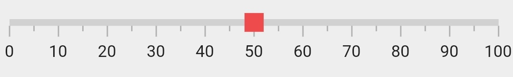
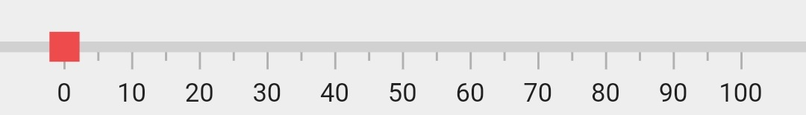
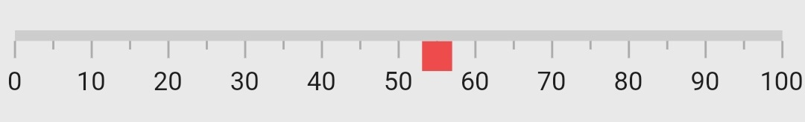
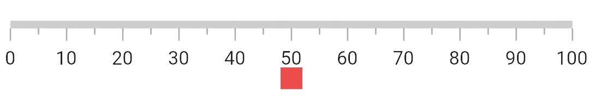
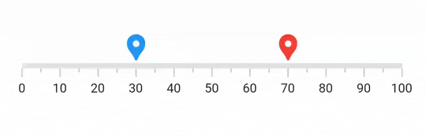
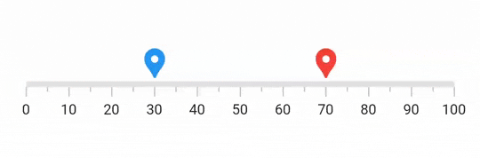

# Widget Marker Pointer in Flutter Linear Gauge (SfLinearGauge)

The [`LinearWidgetPointer`](https://pub.dev/documentation/syncfusion_flutter_gauges/latest/gauges/LinearWidgetPointer/LinearWidgetPointer.html) in [`SfLinearGauge`](https://pub.dev/documentation/syncfusion_flutter_gauges/latest/gauges/SfLinearGauge/SfLinearGauge.html) allows you to use any Flutter widget as a marker pointer. The following code sample uses a [`Container`](https://api.flutter.dev/flutter/widgets/Container-class.html) as a marker widget.




import 'package:flutter/material.dart';
import 'package:syncfusion_flutter_gauges/gauges.dart';

void main() => runApp(const LinearGaugeDemo());

class LinearGaugeDemo extends StatelessWidget {
  const LinearGaugeDemo({Key? key}) : super(key: key);

  @override
  Widget build(BuildContext context) {
    return MaterialApp(
      home: Scaffold(
        body: Center(
          child: SfLinearGauge(markerPointers: [
            LinearWidgetPointer(
              value: 50,
              child: Container(height: 14, width: 14, color: Colors.redAccent),
            ),
          ]),
        ),
      ),
    );
  }
}




## Change marker alignment

The widget marker pointer alignment can be changed by the [`markerAlignment`](https://pub.dev/documentation/syncfusion_flutter_gauges/latest/gauges/LinearWidgetPointer/markerAlignment.html) property of [`LinearWidgetPointer`](https://pub.dev/documentation/syncfusion_flutter_gauges/latest/gauges/LinearWidgetPointer-class.html). The available marker positions are `start`, `end`, and `center`.




import 'package:flutter/material.dart';
import 'package:syncfusion_flutter_gauges/gauges.dart';

void main() => runApp(const LinearGaugeDemo());

class LinearGaugeDemo extends StatelessWidget {
  const LinearGaugeDemo({Key? key}) : super(key: key);

  @override
  Widget build(BuildContext context) {
    return MaterialApp(
      home: Scaffold(
        body: Center(
          child: SfLinearGauge(
            axisTrackExtent: 30, 
            markerPointers: [
              LinearWidgetPointer(
                value: 0,
                markerAlignment: LinearMarkerAlignment.center,
                child: Container(
                  height: 14, width: 14, color: Colors.redAccent,
                ),
              ),
            ],
          ),
        ),
      ),
    );
  }
}




## Change the position

By default, the widget pointer is positioned `outside` the axis. This position can be changed by the [`position`](https://pub.dev/documentation/syncfusion_flutter_gauges/latest/gauges/LinearWidgetPointer/position.html) property of a [`LinearWidgetPointer`](https://pub.dev/documentation/syncfusion_flutter_gauges/latest/gauges/LinearWidgetPointer/position.html). It is possible to position the widget pointer `inside`, `cross`, or `outside` the axis. The following code sample demonstrates how to position the widget pointer inside the axis.




import 'package:flutter/material.dart';
import 'package:syncfusion_flutter_gauges/gauges.dart';

void main() => runApp(const LinearGaugeDemo());

class LinearGaugeDemo extends StatelessWidget {
  const LinearGaugeDemo({Key? key}) : super(key: key);

  @override
  Widget build(BuildContext context) {
    return MaterialApp(
      home: Scaffold(
        body: Center(
          child: SfLinearGauge(markerPointers: [
            LinearWidgetPointer(
              value: 55,
              position: LinearElementPosition.inside,
              child: Container(height: 14, width: 14, color: Colors.redAccent),
            ),
          ]),
        ),
      ),
    );
  }
}




## Change the offset

In addition to positioning the widget marker pointer, it is also possible to change the offset of the widget pointer. The [`offset`](https://pub.dev/documentation/syncfusion_flutter_gauges/latest/gauges/LinearWidgetPointer/offset.html) is the distance from the axis and it cannot be negative. Cross-positioned elements will not be affected by the [`offset`](https://pub.dev/documentation/syncfusion_flutter_gauges/latest/gauges/LinearWidgetPointer/offset.html) value. The following code sample demonstrates how to change the offset value of the widget pointer.




import 'package:flutter/material.dart';
import 'package:syncfusion_flutter_gauges/gauges.dart';

void main() => runApp(const LinearGaugeDemo());

class LinearGaugeDemo extends StatelessWidget {
  const LinearGaugeDemo({Key? key}) : super(key: key);

  @override
  Widget build(BuildContext context) {
    return MaterialApp(
      home: Scaffold(
        body: Center(
          child: SfLinearGauge(markerPointers: [
            LinearWidgetPointer(
              value: 50,
              offset: 25,
              position: LinearElementPosition.inside,
              child: Container(
                height: 14,
                width: 14,
                color: Colors.redAccent
              ),
            ),  
          ]),
        ),
      ),
    );
  }
}




## Drag behavior

You can drag the pointers freely to any position when adding multiple pointers by setting the [`dragBehavior`](https://pub.dev/documentation/syncfusion_flutter_gauges/latest/gauges/LinearWidgetPointer/dragBehavior.html) property to `LinearMarkerDragBehavior.free`.

The `LinearMarkerDragBehavior.constrained` can be used to limit the active pointer dragging beyond the other pointers.

### Free




import 'package:flutter/material.dart';
import 'package:syncfusion_flutter_gauges/gauges.dart';

void main() => runApp(const LinearGaugeDemo());

class LinearGaugeDemo extends StatefulWidget {
  const LinearGaugeDemo({Key? key}) : super(key: key);

  @override
  State<LinearGaugeDemo> createState() => _LinearGaugeDemoState();
}

class _LinearGaugeDemoState extends State<LinearGaugeDemo> {
  double _firstPointer = 30;
  double _secondPointer = 70;

  @override
  Widget build(BuildContext context) {
    return Scaffold(
      body: SfLinearGauge(
        markerPointers: [
          LinearWidgetPointer(
            value: _firstPointer,
            dragBehavior: LinearMarkerDragBehavior.free,
            onChanged: (double newValue) {
              setState(() {
                _firstPointer = newValue;
              });
            },
            position: LinearElementPosition.outside,
            child: Icon(Icons.location_pin, color: Colors.blue, size: 30),
          ),
          LinearWidgetPointer(
            value: _secondPointer,
            position: LinearElementPosition.outside,
            dragBehavior: LinearMarkerDragBehavior.free,
            onChanged: (double newValue) {
              setState(() {
                _secondPointer = newValue;
              });
            },
            child: Icon(Icons.location_pin, color: Colors.red, size: 30),
          ),
        ],
      ),
    );
  }
}




### Constrained




import 'package:flutter/material.dart';
import 'package:syncfusion_flutter_gauges/gauges.dart';

void main() => runApp(const LinearGaugeDemo());

class LinearGaugeDemo extends StatefulWidget {
  const LinearGaugeDemo({Key? key}) : super(key: key);

  @override
  State<LinearGaugeDemo> createState() => _LinearGaugeDemoState();
}

class _LinearGaugeDemoState extends State<LinearGaugeDemo> {
  double _firstPointer = 30;
  double _secondPointer = 70;

  @override
  Widget build(BuildContext context) {
    return Scaffold(
      body: SfLinearGauge(
        markerPointers: [
          LinearWidgetPointer(
            value: _firstPointer,
            dragBehavior: LinearMarkerDragBehavior.constrained,
            onChanged: (double newValue) {
              setState(() {
                _firstPointer = newValue;
              });
            },
            position: LinearElementPosition.outside,
            child: Icon(Icons.location_pin, color: Colors.blue, size: 30),
          ),
          LinearWidgetPointer(
            value: _secondPointer,
            position: LinearElementPosition.outside,
            dragBehavior: LinearMarkerDragBehavior.constrained,
            onChanged: (double newValue) {
              setState(() {
                _secondPointer = newValue;
              });
            },
            child: Icon(Icons.location_pin, color: Colors.red, size: 30),
          ),
        ],
      ),
    );
  }
}




## Handle onChangeStart, onChanged, and onChangeEnd callbacks

The [`LinearWidgetPointer`](https://pub.dev/documentation/syncfusion_flutter_gauges/latest/gauges/LinearWidgetPointer-class.html) provides the [`onChangeStart`](https://pub.dev/documentation/syncfusion_flutter_gauges/latest/gauges/LinearWidgetPointer/onChangeStart.html), [`onChanged`](https://pub.dev/documentation/syncfusion_flutter_gauges/latest/gauges/LinearWidgetPointer/onChanged.html), and [`onChangeEnd`](https://pub.dev/documentation/syncfusion_flutter_gauges/latest/gauges/LinearWidgetPointer/onChangeEnd.html) callbacks. The [`onChangeStart`](https://pub.dev/documentation/syncfusion_flutter_gauges/latest/gauges/LinearWidgetPointer/onChangeStart.html) callback will be called when the user starts dragging the pointer. The [`onChanged`](https://pub.dev/documentation/syncfusion_flutter_gauges/latest/gauges/LinearWidgetPointer/onChanged.html) callback will be called when dragging the pointer. The [`onChangeEnd`](https://pub.dev/documentation/syncfusion_flutter_gauges/latest/gauges/LinearWidgetPointer/onChangeEnd.html) callback will be called when the user stops dragging the pointer.




import 'package:flutter/material.dart';
import 'package:syncfusion_flutter_gauges/gauges.dart';

void main() => runApp(const LinearGaugeDemo());

class LinearGaugeDemo extends StatefulWidget {
  const LinearGaugeDemo({Key? key}) : super(key: key);

  @override
  State<LinearGaugeDemo> createState() => _LinearGaugeDemoState();
}

class _LinearGaugeDemoState extends State<LinearGaugeDemo> {
  double _value = 50;

  @override
  Widget build(BuildContext context) {
    return Scaffold(
      body: SfLinearGauge(
        markerPointers: [
          LinearWidgetPointer(
            value: _value,
            onChangeStart: (double newValue) {
              _value = newValue;
            },
            onChanged: (double newValue) {
              setState(() {
                _value = newValue;
              });
            },
            onChangeEnd: (double newValue) {
              _value = newValue;
            },
            child: Container(height: 14, width: 14, color: Colors.redAccent),
          ),
        ],
      ),
    );
  }
}




## Animation completed callback

The [`onAnimationCompleted`](https://pub.dev/documentation/syncfusion_flutter_gauges/latest/gauges/LinearWidgetPointer/onAnimationCompleted.html) callback in the [`LinearWidgetPointer`](https://pub.dev/documentation/syncfusion_flutter_gauges/latest/gauges/LinearWidgetPointer-class.html) will be triggered when the widget pointer animation is completed. The default value of the [onAnimationCompleted](https://pub.dev/documentation/syncfusion_flutter_gauges/latest/gauges/LinearWidgetPointer/onAnimationCompleted.html) callback is `null`.




import 'package:flutter/material.dart';
import 'package:syncfusion_flutter_gauges/gauges.dart';

void main() => runApp(const LinearGaugeDemo());

class LinearGaugeDemo extends StatelessWidget {
  const LinearGaugeDemo({Key? key}) : super(key: key);

  @override
  Widget build(BuildContext context) {
    return MaterialApp(
      home: Scaffold(
        body: Center(
          child: SfLinearGauge(
            markerPointers:[
              LinearWidgetPointer(
                onAnimationCompleted: () {
                  // Widget Pointer animation is completed
                  debugPrint('Widget Pointer animation is completed');
                },
              ),
            ],
          ),
        ),
      ),
    );
  }
}



