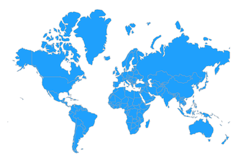
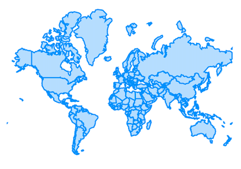
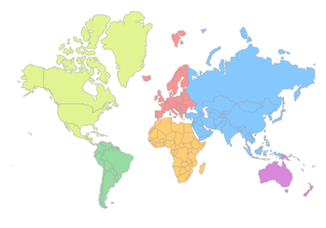

# Basic features of maps
This section explains about how to customize the appearance of the shape and the usage of loading builder.

## Shape color

You can apply color to the entire shapes using the `MapShapeLayer.color` property.




@override
Widget build(BuildContext context) {
   return Scaffold(
      body: Padding(
        padding: EdgeInsets.all(15),
        child: SfMaps(
          layers: <MapLayer>[
            MapShapeLayer(
              color: Colors.blue[400],
              delegate: MapShapeLayerDelegate(
                shapeFile: 'assets/world_map.json',
                shapeDataField: 'continent',
              ),
            ),
          ],
        ),
      ),
   );
}




## Stroke color

You can apply stroke color to the shapes using the `MapShapeLayer.strokeColor` property.




@override
Widget build(BuildContext context) {
   return Scaffold(
      body: Padding(
        padding: EdgeInsets.all(15),
        child: SfMaps(
          layers: <MapLayer>[
            MapShapeLayer(
              color: Colors.blue[100],
              strokeColor: Colors.blue,
              strokeWidth: 2,
              delegate: MapShapeLayerDelegate(
                shapeFile: 'assets/world_map.json',
                shapeDataField: 'continent',
              ),
            ),
          ],
        ),
      ),
   );
}




## Palette

You can paint the shape based on the list of color in a sequential order.

If the number of shapes exceeds the length of this collections, once the last color is used for a shape, color in the 0th index will be used for the next shape and so on.




@override
Widget build(BuildContext context) {
   return Scaffold(
      body: Padding(
        padding: EdgeInsets.all(15),
        child: SfMaps(
          layers: <MapLayer>[
            MapShapeLayer(
              delegate: MapShapeLayerDelegate(
                shapeFile: 'assets/world_map.json',
                shapeDataField: 'continent',
              ),
              palette: [
                Colors.blue[200],
                Colors.orange[200],
                Colors.red[200],
                Colors.green[200],
                Colors.purple[200],
                Colors.lime[200]
              ],
            ),
          ],
        ),
      ),
   );
}




## Loading builder

You can notify the user that the map is being loaded in the background using the `MapShapeLayer.loadingBuilder` which returns the widget responsible for loading effect.




@override
Widget build(BuildContext context) {
   return Scaffold(c
      body: Padding(
        padding: EdgeInsets.all(15),
        child: SfMaps(
          layers: <MapLayer>[
            MapShapeLayer(
              delegate: MapShapeLayerDelegate(
                shapeFile: 'assets/world_map.json',
                shapeDataField: 'continent',
              ),
              loadingBuilder: (_) {
                return Container(
                  height: 25,
                  width: 25,
                  child: const CircularProgressIndicator(
                    strokeWidth: 3,
                  ),
                );
              },
            ),
          ],
        ),
      ),
   );
}




