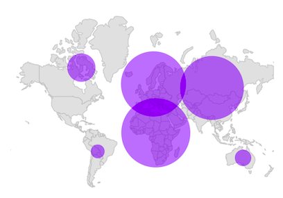
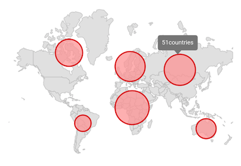
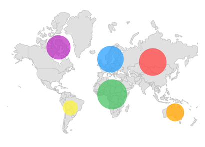
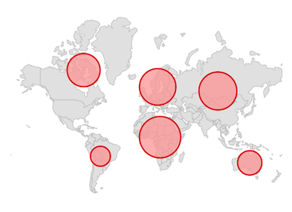

# Bubbles in the Flutter Maps

Bubbles can be rendered in different colors and sizes based on the data values of their assigned shape. You can add information to shapes such as population density, number of users, and more. 

## Show bubbles

You can show bubbles using the `MapShapeLayer.showBubbles` property. The `MapShapeLayerDelegate.bubbleSizeMapper` property is used to specify the value based on which the bubble's size has to be rendered.




List<Model> data;

@override
void initState() {
   super.initState();

   data = <Model>[
      Model('Asia', 51),
      Model('Africa', 58),
      Model('Europe', 48),
      Model('North America', 41),
      Model('South America', 14),
      Model('Australia', 23),
   ];
}

@override
Widget build(BuildContext context) {
    return Scaffold(
      body: Padding(
        padding: EdgeInsets.only(left: 15, right: 15),
        child: SfMaps(
          layers: [
            MapShapeLayer(
              delegate: MapShapeLayerDelegate(
                  shapeFile: "assets/world_map.json",
                  shapeDataField: "continent",
                  dataCount: data.length,
                  primaryValueMapper: (int index) => data[index].continent,
                  bubbleSizeMapper: (int index) => data[index].count
              ),
              showBubbles: true,
            )
          ],
        ),
      ),
   );
}

class Model {
  const Model(this.continent, this.count);

  final String continent;
  final double count;
}




## Tooltip for the bubbles

You can enable tooltip for the bubbles using the `MapShapeLayer.enableBubbleTooltip` property. It is used to indicate clearly the information on the current tapped bubble. By default, the bubble tooltip text will be `shapeDataField` values.

N> Refer the `bubbleTooltipTextMapper` for changing the default bubble tooltip text.




List<Model> data;

@override
void initState() {
  super.initState();

  data = <Model>[
    Model('Asia', 50, '44,579,000 sq. km.'),
    Model('Africa', 54, '30,370,000 sq. km.'),
    Model('Europe', 51, '10,180,000 sq. km.'),
    Model('North America', 23, '24,709,000 sq. km.'),
    Model('South America', 12, '17,840,000 sq. km.'),
    Model('Australia', 14, '8,600,000 sq. km.'),
  ];
}

@override
Widget build(BuildContext context) {
  return Scaffold(
    body: Padding(
      padding: EdgeInsets.only(left: 15, right: 15),
      child: SfMaps(
        layers: [
          MapShapeLayer(
            delegate: MapShapeLayerDelegate(
              shapeFile: "assets/world_map.json",
              shapeDataField: "continent",
              dataCount: data.length,
              primaryValueMapper: (int index) => data[index].continent,
              bubbleSizeMapper: (int index) => data[index].countriesCount,
              bubbleTooltipTextMapper: (int index) =>
                  'Continent : ' +
                  data[index].continent +
                  '\nTotal Countries : ' +
                  data[index].countriesCount.toStringAsFixed(0),
            ),
            showBubbles: true,
            enableBubbleTooltip: true,
          ),
        ],
      ),
    ),
  );
}

class Model {
  const Model(this.continent, this.countriesCount, this.area);

  final String continent;
  final double countriesCount;
  final String area;
}

## Color

You can customize the bubble color based on the value returned from the `MapShapeLayerDelegate.bubbleColorValueMapper` property. You can either return a value or a color from the `bubbleColorValueMapper`.

If `bubbleColorValueMapper` returns a color, then the color will be applied to the bubble straightaway.

If `bubbleColorValueMapper` returns a value other than the color, then you must set the `MapShapeLayer.bubbleColorMappers` property. The value returned from the `bubbleColorValueMapper` will be used for the comparison in the `MapColorMapper.value` or `MapColorMapper.from` and `MapColorMapper.to`. Then, the `MapColorMapper.color` will be applied to the respective bubble.




 List<Model> data;

  @override
  void initState() {
    super.initState();

    data = <Model>[
      Model('Asia', 51, Colors.red[400]),
      Model('Africa', 58, Colors.green[400]),
      Model('Europe', 48, Colors.blue[400]),
      Model('North America', 41, Colors.purple[400]),
      Model('South America', 14, Colors.yellow[400]),
      Model('Australia', 23, Colors.orange[400]),
    ];
  }

  @override
  Widget build(BuildContext context) {
    return Scaffold(
      body: Padding(
        padding: EdgeInsets.only(left: 15, right: 15),
        child: SfMaps(
          layers: [
            MapShapeLayer(
              delegate: MapShapeLayerDelegate(
                shapeFile: "assets/world_map.json",
                shapeDataField: "continent",
                dataCount: data.length,
                primaryValueMapper: (int index) => data[index].continent,
                bubbleSizeMapper: (int index) => data[index].count,
                bubbleColorValueMapper: (int index) => data[index].bubbleColor,
              ),
              showBubbles: true,
              bubbleSettings: MapBubbleSettings(
                maxRadius: 30,
                minRadius: 15,
              ),
            ),
          ],
        ),
      ),
    );
  }
}

class Model {
   Model(this.continent, this.count, this.bubbleColor);

  final String continent;
  final double count;
  final Color bubbleColor;
}




## Appearance customization

You can customize the below appearance of the bubbles.

* **MinRadius** - Change the minimum radius of the bubbles using the `MapBubbleSettings.minRadius` property. The default value of the `minRadius` property is `10.0`.
* **MaxRadius** - Change the maximum radius of the bubbles using the `MapBubbleSettings.maxRadius` property. The default value of the `maxRadius` property is `50.0`.
* **Opacity** - Change the opacity of the bubbles using the `MapBubbleSettings.opacity` property.  The default value of the `opacity` property is `0.75`.
* **Background color** - Change the background color of the bubbles using the `MapBubbleSettings.color` property.
* **Stroke color** - Change the stroke color of the bubbles using the `MapBubbleSettings.strokeColor` property.
* **Stroke width** - Change the stroke width of the bubbles using the `MapBubbleSettings.strokeWidth` property.




List<Model> data;

@override
void initState() {
    super.initState();

    data = <Model>[
      Model('Asia', 51),
      Model('Africa', 58),
      Model('Europe', 48),
      Model('North America', 41),
      Model('South America', 14),
      Model('Australia', 23),
    ];
}

@override
Widget build(BuildContext context) {
    return Scaffold(
      body: Padding(
        padding: EdgeInsets.only(left: 15, right: 15),
        child: SfMaps(
          layers: [
            MapShapeLayer(
              delegate: MapShapeLayerDelegate(
                  shapeFile: "assets/world_map.json",
                  shapeDataField: "continent",
                  dataCount: data.length,
                  primaryValueMapper: (int index) => data[index].continent,
                  bubbleSizeMapper: (int index) => data[index].count,
              ),
              showBubbles: true,
              bubbleSettings: MapBubbleSettings(
                maxRadius: 30,
                minRadius: 15,
                color: Colors.red[200],
                strokeWidth: 2,
                strokeColor: Colors.red[800],
              ),
            )
          ],
        ),
      ),
   );
}

class Model {
  Model(this.continent, this.count);

  final String continent;
  final double count;
}




<b>Using SfMapsTheme</b>

You can also customize the below appearance of the bubbles.

* **Background color** - Change the background color of the bubbles using the `SfMapsThemeData.bubbleColor` property.
* **Stroke color** - Change the stroke color of the bubbles using the `SfMapsThemeData.bubbleStrokeColor` property.
* **Stroke width** - Change the stroke width of the bubbles using the `SfMapsThemeData.bubbleStrokeWidth` property.

N> You must import the `theme.dart` library from the [`Core`](https://pub.dev/packages/syncfusion_flutter_core) package to use [`SfMapsTheme`](https://pub.dev/documentation/syncfusion_flutter_core/latest/theme/SfMapsTheme-class.html).




List<Model> data;

@override
void initState() {
    super.initState();

    data = <Model>[
      Model('Asia', 51),
      Model('Africa', 58),
      Model('Europe', 48),
      Model('North America', 41),
      Model('South America', 14),
      Model('Australia', 23),
   ];
}

@override
Widget build(BuildContext context) {
    return Scaffold(
      body: Padding(
        padding: EdgeInsets.only(left: 15, right: 15),
        child: SfMapsTheme(
          data: SfMapsThemeData(
            bubbleColor: Colors.red[200],
            bubbleStrokeColor: Colors.red[800],
            bubbleStrokeWidth: 2
          ),
          child: SfMaps(
            layers: [
              MapShapeLayer(
                delegate: MapShapeLayerDelegate(
                  shapeFile: "assets/world_map.json",
                  shapeDataField: "continent",
                  dataCount: data.length,
                  primaryValueMapper: (int index) => data[index].continent,
                  bubbleSizeMapper: (int index) => data[index].count,
                ),
                showBubbles: true,
                bubbleSettings: MapBubbleSettings(
                  maxRadius: 30,
                  minRadius: 15,
                ),
              )
            ],
          ),
        )
      ),
   );
}

class Model {
  Model(this.continent, this.count);

  final String continent;
  final double count;
}




