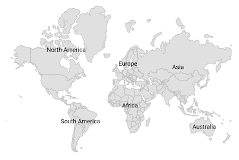
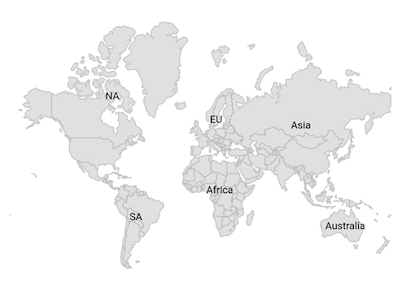
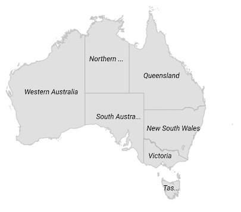
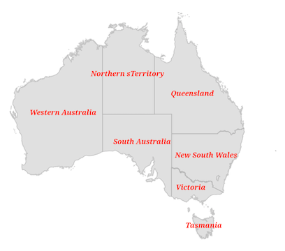

# Data Labels  in Flutter Maps (SfMaps)

Data labels provide identification for the shapes by displaying their names. You can trim or hide the labels if they exceed the shape bounds.

## Show data labels

You can show data labels on the map using the [`MapShapeLayer.showDataLabels`](https://pub.dev/documentation/syncfusion_flutter_maps/latest/maps/MapShapeLayer/showDataLabels.html) property. By default, the data labels are rendered based on the value of [`shapeDataField`](https://pub.dev/documentation/syncfusion_flutter_maps/latest/maps/MapShapeSource/shapeDataField.html) property. The default value of the [`showDataLabels`](https://pub.dev/documentation/syncfusion_flutter_maps/latest/maps/MapShapeLayer/showDataLabels.html) property is `false`.




late MapShapeSource dataSource;

@override
void initState() {
   dataSource = MapShapeSource.asset(
     "assets/world_map.json",
      shapeDataField: "continent",
   );
   super.initState();
}

@override
  Widget build(BuildContext context) {
    return Scaffold(
      body: Center(
        child: Padding(
          padding: EdgeInsets.only(left: 15, right: 15),
          child: SfMaps(
            layers: [
              MapShapeLayer(
                source: dataSource,
                showDataLabels: true,
              ),
            ],
        ),
      ),
    ),
  );
}




## Text customization

You can customize text of the data labels using the [`MapShapeSource.dataLabelMapper`](https://pub.dev/documentation/syncfusion_flutter_maps/latest/maps/MapShapeSource/dataLabelMapper.html) property.




late List<Model> data;
late MapShapeSource dataSource;

@override
void initState() {
    super.initState();
    data = const <Model>[
      Model('Asia', 'Asia'),
      Model('Europe', 'EU'),
      Model('North America', 'NA'),
      Model('South America', 'SA'),
      Model('Australia', 'Australia'),
      Model('Africa', 'Africa')
    ];

    dataSource = MapShapeSource.asset(
       "assets/world_map.json",
       shapeDataField: "continent",
       dataCount: data.length,
       primaryValueMapper: (int index) => data[index].continent,
       dataLabelMapper: (int index) => data[index].code,
    );
}

@override
Widget build(BuildContext context) {
  return Scaffold(
    body: Center(
      child: Padding(
        padding: EdgeInsets.only(left: 15, right: 15),
        child: SfMaps(
          layers: [
            MapShapeLayer(
              source: dataSource,
              showDataLabels: true,
            ),
          ],
        ),
      ),
    ),
  );
}

class Model {
  const Model(this.continent, this.code);

  final String continent;
  final String code;
}




## Overflow mode

You can trim or remove the data label when it is overflowed from the shape using the [`MapDataLabelSettings.overflowMode`](https://pub.dev/documentation/syncfusion_flutter_maps/latest/maps/MapDataLabelSettings/overflowMode.html) property. The possible values are `visible`, `ellipsis`, and `hide`. The default value of the [`overflowMode`](https://pub.dev/documentation/syncfusion_flutter_maps/latest/maps/MapDataLabelSettings/overflowMode.html) property is `MapLabelOverflow.visible`.

By default, the data labels will render even if they overflows from the shape. 




late List<Model> data;
late MapShapeSource dataSource;

@override
void initState() {
    data = <Model>[
      Model('New South Wales', 'New South Wales'),
      Model('Queensland', 'Queensland'),
      Model('Northern Territory', 'Northern sTerritory'),
      Model('Victoria', 'Victoria'),
      Model('South Australia', 'South Australia'),
      Model('Western Australia', 'Western Australia'),
      Model('Tasmania', 'Tasmania'),
    ];

    dataSource = MapShapeSource.asset(
      'assets/australia.json',
       shapeDataField: 'STATE_NAME',
       dataCount: data.length,
       primaryValueMapper: (int index) => data[index].state,
       dataLabelMapper: (int index) => data[index].dataLabel,
    );
    super.initState();
}

@override
Widget build(BuildContext context) {
  return Scaffold(
    body: Center(
      child: Padding(
        padding: EdgeInsets.only(left: 15, right: 15),
        child: SfMaps(
          layers: [
            MapShapeLayer(
              source: dataSource,
              showDataLabels: true,
              dataLabelSettings: MapDataLabelSettings(
                overflowMode: MapLabelOverflow.ellipsis,
              ),
            ),
          ],
        ),
      ),
    ),
  );
}

class Model {
  Model(this.state, this.dataLabel);

  String state;
  String dataLabel;
}




## Appearance customization

You can customize the data labels using the [`MapDataLabelSettings.textStyle`](https://pub.dev/documentation/syncfusion_flutter_maps/latest/maps/MapDataLabelSettings/textStyle.html) property.




late List<Model> data;
late MapShapeSource dataSource;

@override
void initState() {
    data = <Model>[
      Model('New South Wales', 'New South Wales'),
      Model('Queensland', 'Queensland'),
      Model('Northern Territory', 'Northern sTerritory'),
      Model('Victoria', 'Victoria'),
      Model('South Australia', 'South Australia'),
      Model('Western Australia', 'Western Australia'),
      Model('Tasmania', 'Tasmania'),
    ];

    dataSource = MapShapeSource.asset(
       'assets/australia.json',
       shapeDataField: 'STATE_NAME',
       dataCount: data.length,
       primaryValueMapper: (int index) => data[index].state,
       dataLabelMapper: (int index) => data[index].dataLabel,
    );
    super.initState();
}

@override
Widget build(BuildContext context) {
  return Scaffold(
    body: Center(
      child: Padding(
        padding: EdgeInsets.only(left: 15, right: 15),
        child: SfMaps(
          layers: [
            MapShapeLayer(
              source: dataSource,
              showDataLabels: true,
              dataLabelSettings: MapDataLabelSettings(
                textStyle: const TextStyle(
                    color: Colors.red,
                    fontSize: 12,
                    fontWeight: FontWeight.bold,
                    fontStyle: FontStyle.italic,
                    fontFamily: 'Times'),
              ),
            ),
          ],
        ),
      ),
    ),
  );
}

class Model {
  Model(this.state, this.dataLabel);

  String state;
  String dataLabel;
}




<b>Using SfMapsTheme</b>

You can also customize the data labels using the [`SfMapsThemeData.dataLabelTextStyle`](https://pub.dev/documentation/syncfusion_flutter_core/latest/theme/SfMapsThemeData/dataLabelTextStyle.html) property in [`SfMapsTheme`](https://pub.dev/documentation/syncfusion_flutter_core/latest/theme/SfMapsTheme-class.html).

N> You must import the `theme.dart` library from the [`Core`](https://pub.dev/packages/syncfusion_flutter_core) package to use [`SfMapsTheme`](https://pub.dev/documentation/syncfusion_flutter_core/latest/theme/SfMapsTheme-class.html).




late List<Model> data;
late MapShapeSource dataSource;

@override
void initState() {
    data = <Model>[
      Model('New South Wales', 'New South Wales'),
      Model('Queensland', 'Queensland'),
      Model('Northern Territory', 'Northern sTerritory'),
      Model('Victoria', 'Victoria'),
      Model('South Australia', 'South Australia'),
      Model('Western Australia', 'Western Australia'),
      Model('Tasmania', 'Tasmania'),
    ];

    dataSource = MapShapeSource.asset(
       'assets/australia.json',
       shapeDataField: 'STATE_NAME',
       dataCount: data.length,
       primaryValueMapper: (int index) => data[index].state,
       dataLabelMapper: (int index) => data[index].dataLabel,
    );
    super.initState();
}

@override
Widget build(BuildContext context) {
  return Scaffold(
    body: Center(
      child: Padding(
        padding: EdgeInsets.only(left: 15, right: 15),
        child: SfMapsTheme(
          data: SfMapsThemeData(
            dataLabelTextStyle: TextStyle(
                color: Colors.red,
                fontSize: 12,
                fontWeight: FontWeight.bold,
                fontStyle: FontStyle.italic,
                fontFamily: 'Times'),
          ),
          child: SfMaps(
            layers: [
              MapShapeLayer(
                source: dataSource,
                showDataLabels: true,
              ),
            ],
          ),
        ),
      ),
    ),
  );
}

class Model {
   Model(this.state, this.dataLabel);

   String state;
   String dataLabel;
}




