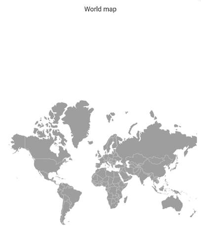
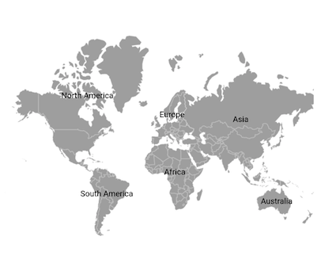
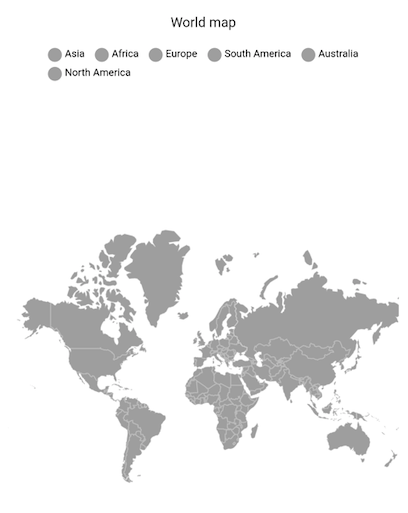
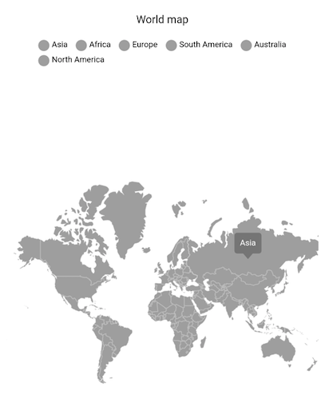

# Getting Started with Flutter Maps (SfMaps)
This section explains the steps required to add the maps widget and its elements such as data labels, selection, markers, bubbles, assignable colors based on region, and legends. This section covers only basic features needed to know to get started with Syncfusion maps.

## Add Flutter maps to an application
Create a simple project using the instructions given in the [Getting Started with your first Flutter app](https://flutter.dev/docs/get-started/test-drive?tab=vscode#create-app) documentation.

**Add dependency**

Add the Syncfusion Flutter maps dependency to your pubspec.yaml file.



dependencies:

syncfusion_flutter_maps: ^xx.x.xx



N> Here **xx.x.xx** denotes the current version of [`Syncfusion Flutter Maps`](https://pub.dev/packages/syncfusion_flutter_maps/versions) package.

**Get packages**

Run the following command to get the required packages.



$ flutter pub get



**Import package**

Import the following package in your Dart code.




import 'package:syncfusion_flutter_maps/maps.dart';




## Initialize maps

After importing the package, initialize the maps widget as a child of any widget and you must add the GeoJson file to the `assets` folder for representing the geographic data. Refer the GeoJson file to the [`shapeFile`] property and set the shape category to the [`shapeDataField`] property in the [`MapShapeLayerDelegate`] class.

N> Refer the asset’s path in the assets section of pubspec.yaml file.




flutter:
  assets:
    - world_map.json







MapShapeLayerDelegate mapDelegate;

@override
void initState() {
  mapDelegate = MapShapeLayerDelegate(
      shapeFile: 'assets/world_map.json',
      shapeDataField: 'continent');
  super.initState();
}

@override
Widget build(BuildContext context) {
  return Scaffold(
    body: Center(
      child: SfMaps(
        layers: <MapLayer>[
          MapShapeLayer(delegate: mapDelegate),
        ],
      ),
    ),
  );
}




## Map title

You can add a title to the map to provide quick information to users about the data plotted in the map using the [`title`] property in the [`SfMaps`] class. The default value of the [`title`] property is `null`.




 MapShapeLayerDelegate mapDelegate;

  @override
  void initState() {
    mapDelegate = MapShapeLayerDelegate(
        shapeFile: 'assets/world_map.json',
        shapeDataField: 'continent');
    super.initState();
  }

  @override
  Widget build(BuildContext context) {
    return Scaffold(
      body: Center(
        child: SfMaps(
          title: MapTitle(text: 'World map'),
          layers: <MapLayer>[
            MapShapeLayer(delegate: mapDelegate),
          ],
        ),
      ),
    );
  }




## Enable data labels

You can show the name of the shape using the [`showDataLabels`] property in the [`MapShapeLayerDelegate`] class. The default value of the [`showDataLabels`] property is `false`.




MapShapeLayerDelegate mapDelegate;

@override
void initState() {
  mapDelegate = MapShapeLayerDelegate(
      shapeFile: 'assets/world_map.json',
      shapeDataField: 'continent',
      showDataLabels: true);
  super.initState();
}

@override
Widget build(BuildContext context) {
  return Scaffold(
    body: Center(
      child: SfMaps(
        layers: <MapLayer>[
          MapShapeLayer(delegate: mapDelegate),
        ],
      ),
    ),
  );
}




## Enable legend

The legend provides information about the data rendered in the maps. You can enable this feature using the [`showLegend`] property in the [`MapShapeLayer`] class. The default value of the [`showLegend`] property is `false`.




MapShapeLayerDelegate mapDelegate;

@override
void initState() {
  mapDelegate = MapShapeLayerDelegate(
      shapeFile: 'assets/world_map.json',
      shapeDataField: 'continent');
  super.initState();
}

@override
Widget build(BuildContext context) {
  return Scaffold(
    body: Center(
      child: SfMaps(
        title: MapTitle(text: 'World map'),
        layers: <MapLayer>[
          MapShapeLayer(
              delegate: mapDelegate,
              showLegend: true),
        ],
      ),
    ),
  );
}




## Enable tooltip

You can show the information about the shape using the [`enableShapeTooltip`] property in the [`MapShapeLayer`] class. The default value of the [`enableShapeTooltip`] property is `false`.




MapShapeLayerDelegate mapDelegate;

@override
void initState() {
  mapDelegate = MapShapeLayerDelegate(
      shapeFile: 'assets/world_map.json',
      shapeDataField: 'continent');
  super.initState();
}

@override
Widget build(BuildContext context) {
  return Scaffold(
    body: Center(
      child: SfMaps(
        title: MapTitle(text: 'World map'),
        layers: <MapLayer>[
          MapShapeLayer(
              delegate: mapDelegate,
              showLegend: true,
              enableShapeTooltip: true),
        ],
      ),
    ),
  );
}




