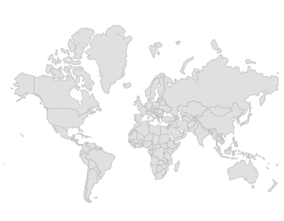
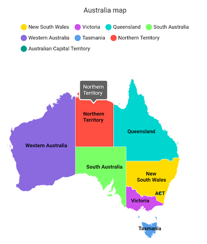
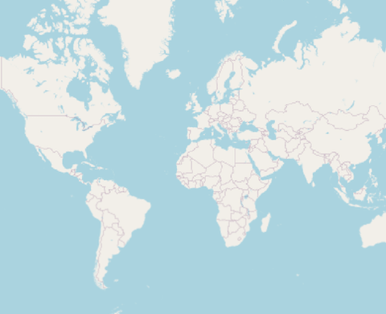

# Getting started with Flutter Maps (SfMaps)

This section explains the steps required to add the maps widget with shape layer and its elements such as data labels, tooltip, assignable colors based on region, and legends. It also explains about adding tile layer with OpenStreetMap. This section covers only basic features needed to know to get started with Syncfusion&reg; maps.

To get start quickly with our Flutter Maps widget, you can check on this video.

<iframe id='flutterMapsVideoTutorial' src='https://www.youtube.com/embed/TNnAHfXXTFM'></iframe>

## Add Flutter maps to an application

Create a simple project using the instructions given in the [Getting Started with your first Flutter app](https://docs.flutter.dev/get-started/test-drive#choose-your-ide) documentation.

**Add dependency**

Add the Syncfusion&reg; Flutter maps dependency to your pubspec.yaml file.



dependencies:

syncfusion_flutter_maps: ^xx.x.xx



N> Here **xx.x.xx** denotes the current version of [`Syncfusion Flutter Maps`](https://pub.dev/packages/syncfusion_flutter_maps/versions) package.

**Get packages**

Run the following command to get the required packages.



$ flutter pub get



**Import package**

Import the following package in your Dart code.




import 'package:syncfusion_flutter_maps/maps.dart';




## Initialize maps

After importing the package, initialize the maps widget as a child of any widget.




@override
Widget build(BuildContext context) {
  return Scaffold(
    body: Center(
      child: SfMaps(),
    ),
  );
}




## Set GeoJSON data for shape layer from various source

The [`layers`](https://pub.dev/documentation/syncfusion_flutter_maps/latest/maps/SfMaps/layers.html) in [`SfMaps`](https://pub.dev/documentation/syncfusion_flutter_maps/latest/maps/SfMaps-class.html) contains collection of either [`MapShapeLayer`](https://pub.dev/documentation/syncfusion_flutter_maps/latest/maps/MapShapeLayer-class.html) or [`MapTileLayer`](https://pub.dev/documentation/syncfusion_flutter_maps/latest/maps/MapTileLayer-class.html). The actual geographical rendering is done in each [`MapShapeLayer`](https://pub.dev/documentation/syncfusion_flutter_maps/latest/maps/MapShapeLayer-class.html). The [`source`](https://pub.dev/documentation/syncfusion_flutter_maps/latest/maps/MapShapeLayer/source.html) property of the [`MapShapeLayer`](https://pub.dev/documentation/syncfusion_flutter_maps/latest/maps/MapShapeLayer-class.html) is of type [`MapShapeSource`](https://pub.dev/documentation/syncfusion_flutter_maps/latest/maps/MapShapeSource-class.html). The [`source`](https://pub.dev/documentation/syncfusion_flutter_maps/latest/maps/MapShapeLayer/source.html) can be set as the .json source from an asset bundle, from network or from Uint8List as bytes. Use the respective constructor depends on the type of the source.

The [`shapeDataField`](https://pub.dev/documentation/syncfusion_flutter_maps/latest/maps/MapShapeSource/shapeDataField.html) property of the [`MapShapeSource`](https://pub.dev/documentation/syncfusion_flutter_maps/latest/maps/MapShapeSource-class.html) is used to refer the unique field name in the .json source to identify each shapes. In [`Mapping the data source`](https://help.syncfusion.com/flutter/maps/getting-started#mapping-the-data-source-for-shape-layer) section of this document, this [`shapeDataField`](https://pub.dev/documentation/syncfusion_flutter_maps/latest/maps/MapShapeSource/shapeDataField.html) will be used to map with the respective value returned in [`primaryValueMapper`](https://pub.dev/documentation/syncfusion_flutter_maps/latest/maps/MapShapeSource/primaryValueMapper.html) from the data source.

I> The Mercator projection is the default projection in the maps.

### From asset bundle

Load .json data from an asset bundle.

N> If you are using the [`MapShapeSource.asset`](https://pub.dev/documentation/syncfusion_flutter_maps/latest/maps/MapShapeSource/MapShapeSource.asset.html) constructor, you must add the .json file to the assets folder of your root directory and refer the json file path in the `pubspec.yaml` file as shown in the code snippet below. You can get the [`australia.json`](https://www.syncfusion.com/downloads/support/directtrac/general/ze/australia-json-910278184.zip) file here.




flutter:
  uses-material-design: true
  assets:
    - australia.json







late MapShapeSource _dataSource;

@override
void initState() {
  _dataSource = MapShapeSource.asset(
    'assets/australia.json',
    shapeDataField: 'STATE_NAME',
  );
  super.initState();
}

@override
Widget build(BuildContext context) {
  return Scaffold(
    body: Padding(
      padding: EdgeInsets.all(15),
      child: SfMaps(
        layers: [
          MapShapeLayer(source: _dataSource),
        ],
      ),
    ),
  );
}




### From network

Load .json data from the network.




late MapShapeSource _dataSource;

@override
void initState() {
  _dataSource = MapShapeSource.network(
    'http://www.json-generator.com/api/json/get/bVqXoJvfjC?indent=2',
     shapeDataField: 'name',
  );
  super.initState();
}

@override
Widget build(BuildContext context) {
  return Scaffold(
    body: Padding(
      padding: EdgeInsets.all(15),
      child: SfMaps(
        layers: [
          MapShapeLayer(source: _dataSource),
        ],
      ),
    ),
  );
}




### From memory

Load .json data as bytes from `Uint8List`.




@override
Widget build(BuildContext context) {
  return Scaffold(
    body: FutureBuilder(
      future: _fetchJsonData(),
      builder: (BuildContext context, snapshot) {
        if (snapshot.hasData) {
          Uint8List bytesData = snapshot.data as Uint8List;
          return SfMaps(
            layers: [
              MapShapeLayer(
                source: MapShapeSource.memory(
                  bytesData,
                  shapeDataField: 'STATE_NAME',
                ),
              ),
            ],
          );
        } else {
          return CircularProgressIndicator();
        }
      },
    ),
  );
}

Future<Uint8List> _fetchJsonData() async {
  return (await rootBundle.load('assets/australia.json')).buffer.asUint8List();
}




## Mapping the data source for shape layer

By default, the value specified for the [`shapeDataField`](https://pub.dev/documentation/syncfusion_flutter_maps/latest/maps/MapShapeSource/shapeDataField.html) in the GeoJSON source will be used in the elements like data labels, tooltip, and legend for their respective shapes. However, it is possible to keep a data source and customize these elements based on the requirement. As mentioned above, [`shapeDataField`](https://pub.dev/documentation/syncfusion_flutter_maps/latest/maps/MapShapeSource/shapeDataField.html) will be used to map with the respective value returned in [`primaryValueMapper`](https://pub.dev/documentation/syncfusion_flutter_maps/latest/maps/MapShapeSource/primaryValueMapper.html) from the data source.




late List<Model> data;

@override
void initState() {
  data = <Model>[
    Model('New South Wales',
     '       New\nSouth Wales'),
    Model('Queensland', 'Queensland'),
    Model('Northern Territory', 'Northern\nTerritory'),
    Model('Victoria', 'Victoria'),
    Model('South Australia', 'South Australia'),
    Model('Western Australia', 'Western Australia'),
    Model('Tasmania', 'Tasmania'),
    Model('Australian Capital Territory', 'ACT')
  ];

  super.initState();
}

@override
Widget build(BuildContext context) {
  return Scaffold(
    body: SfMaps(
       layers: <MapShapeLayer>[
         MapShapeLayer(
           source: MapShapeSource.asset(
             'assets/australia.json',
             shapeDataField: 'STATE_NAME',
             dataCount: data.length,
             primaryValueMapper: (int index) => data[index].state,
           ),
         ),
       ],
     ),
   );
}

class Model {
  Model(this.state, this.stateCode);

  String state;
  String stateCode;
}




N>
* Refer the [`MapShapeSource.primaryValueMapper`](https://pub.dev/documentation/syncfusion_flutter_maps/latest/maps/MapShapeSource/primaryValueMapper.html), for mapping the data of the data source collection with the respective [`MapShapeSource.shapeDataField`](https://pub.dev/documentation/syncfusion_flutter_maps/latest/maps/MapShapeSource/shapeDataField.html) in .json source.
* Refer the [`MapShapeSource.bubbleSizeMapper`](https://pub.dev/documentation/syncfusion_flutter_maps/latest/maps/MapShapeSource/bubbleSizeMapper.html), for customizing the bubble size.
* Refer the [`MapShapeSource.bubbleColorValueMapper`](https://pub.dev/documentation/syncfusion_flutter_maps/latest/maps/MapShapeSource/bubbleColorValueMapper.html), for customizing the bubble colors.
* Refer the [`MapShapeSource.dataLabelMapper`](https://pub.dev/documentation/syncfusion_flutter_maps/latest/maps/MapShapeSource/dataLabelMapper.html), for customizing the data label text.
* Refer the [`MapShapeSource.shapeColorValueMapper`](https://pub.dev/documentation/syncfusion_flutter_maps/latest/maps/MapShapeSource/shapeColorValueMapper.html), for customizing the shape colors.

## Add shape layer maps elements

Add the basic maps elements such as data labels, legend, and tooltip as shown in the code snippet below.

* **Data labels** - You can show data labels using the [`MapShapeLayer.showDataLabels`](https://pub.dev/documentation/syncfusion_flutter_maps/latest/maps/MapShapeLayer/showDataLabels.html) property. it is also possible to show data labels only for the particular shapes or show custom text using the [`MapShapeSource.dataLabelMapper`](https://pub.dev/documentation/syncfusion_flutter_maps/latest/maps/MapShapeSource/dataLabelMapper.html) property.

* **Legend** - You can enable legend using the [`MapShapeLayer.legend`](https://pub.dev/documentation/syncfusion_flutter_maps/latest/maps/MapShapeLayer/legend.html) property. The icons color of the legend is applied based on the colors returned in the [`MapShapeSource.shapeColorValueMapper`](https://pub.dev/documentation/syncfusion_flutter_maps/latest/maps/MapShapeSource/shapeColorValueMapper.html) property. It is possible to customize the legend icons color and texts using the [`MapShapeSource.shapeColorMappers`](https://pub.dev/documentation/syncfusion_flutter_maps/latest/maps/MapShapeSource/shapeColorMappers.html) property.

* **Tooltip** - You can enable tooltip for the shapes using the [`MapShapeLayer.shapeTooltipBuilder`](https://pub.dev/documentation/syncfusion_flutter_maps/latest/maps/MapShapeLayer/shapeTooltipBuilder.html) property. It will be called with the corresponding index every time when you interact with the shapes i.e., while tapping in touch devices and hover enter in  mouse enabled devices.




late List<Model> data;
late MapShapeSource dataSource;

@override
void initState() {
  data = <Model>[
    Model('New South Wales', Color.fromRGBO(255, 215, 0, 1.0),
        '       New\nSouth Wales'),
    Model('Queensland', Color.fromRGBO(72, 209, 204, 1.0), 'Queensland'),
    Model('Northern Territory', Colors.red.withOpacity(0.85),
        'Northern\nTerritory'),
    Model('Victoria', Color.fromRGBO(171, 56, 224, 0.75), 'Victoria'),
    Model('South Australia', Color.fromRGBO(126, 247, 74, 0.75),
        'South Australia'),
    Model('Western Australia', Color.fromRGBO(79, 60, 201, 0.7),
        'Western Australia'),
    Model('Tasmania', Color.fromRGBO(99, 164, 230, 1), 'Tasmania'),
    Model('Australian Capital Territory', Colors.teal, 'ACT')
  ];

  dataSource = MapShapeSource.asset(
    'assets/australia.json',
    shapeDataField: 'STATE_NAME',
    dataCount: data.length,
    primaryValueMapper: (int index) => data[index].state,
    dataLabelMapper: (int index) => data[index].stateCode,
    shapeColorValueMapper: (int index) => data[index].color,
  );
  super.initState();
}

@override
Widget build(BuildContext context) {
  final ThemeData themeData = Theme.of(context);
  return Scaffold(
    body: Center(
      child: SizedBox(
        height: MediaQuery.of(context).size.height * 0.55,
        child: SfMaps(
          layers: <MapShapeLayer>[
            MapShapeLayer(
              source: dataSource,
              showDataLabels: true,
              legend: MapLegend(MapElement.shape),
              shapeTooltipBuilder: (BuildContext context, int index) {
                return Padding(
                  padding: const EdgeInsets.all(7),
                  child: Text(data[index].stateCode,
                      style: themeData.textTheme.caption!
                          .copyWith(color: themeData.colorScheme.surface)),
                );
              },
              tooltipSettings: MapTooltipSettings(
                  color: Colors.grey[700],
                  strokeColor: Colors.white,
                  strokeWidth: 2),
              strokeColor: Colors.white,
              strokeWidth: 0.5,
              dataLabelSettings: MapDataLabelSettings(
                  textStyle: TextStyle(
                      color: Colors.black,
                      fontWeight: FontWeight.bold,
                      fontSize: themeData.textTheme.caption!.fontSize)),
            ),
          ],
        ),
      ),
    ),
  );
}

class Model {
  Model(this.state, this.color, this.stateCode);

  String state;
  Color color;
  String stateCode;
}




## Add tile layer

The [`MapTileLayer`](https://pub.dev/documentation/syncfusion_flutter_maps/latest/maps/MapTileLayer-class.html) needs to be added in the [`layers`](https://pub.dev/documentation/syncfusion_flutter_maps/latest/maps/SfMaps/layers.html) collection in [`SfMaps`](https://pub.dev/documentation/syncfusion_flutter_maps/latest/maps/SfMaps-class.html). The URL of the providers must be set in the [`MapTileLayer.urlTemplate`](https://pub.dev/documentation/syncfusion_flutter_maps/latest/maps/MapTileLayer/urlTemplate.html) property.

Refer to the [tile layer](https://help.syncfusion.com/flutter/maps/tile-layer#setting-url-template) section for more information.




@override
Widget build(BuildContext context) {
  return SfMaps(
    layers: [
      MapTileLayer(
        urlTemplate: 'https://tile.openstreetmap.org/{z}/{x}/{y}.png',
      ),
    ],
  );
}
 



N> You can refer to our [Flutter Maps](https://www.syncfusion.com/flutter-widgets/flutter-maps) feature tour page for its groundbreaking feature representations. You can also explore our [Flutter Maps example](https://flutter.syncfusion.com/#/maps/shape-layer/range-color-mapping) that shows how to configure a Maps in Flutter.
