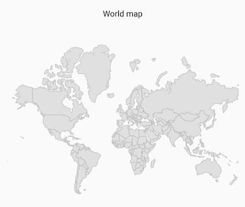
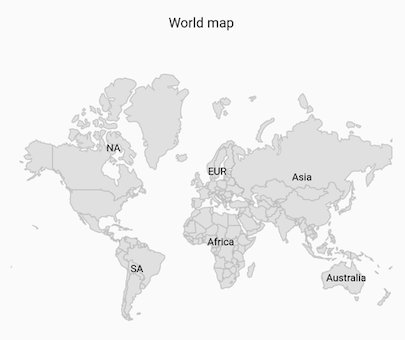
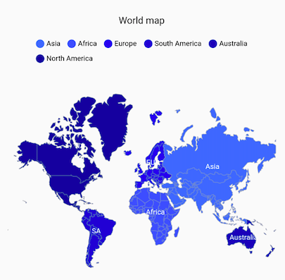
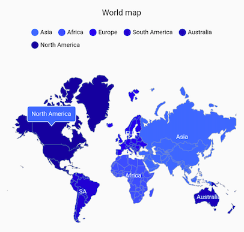

# Getting Started with Flutter Maps (SfMaps)
This section explains the steps required to add the maps widget and its elements such as data labels, selection, markers, bubbles, assignable colors based on region, and legends. This section covers only basic features needed to know to get started with Syncfusion maps.

## Add Flutter maps to an application
Create a simple project using the instructions given in the [Getting Started with your first Flutter app](https://flutter.dev/docs/get-started/test-drive?tab=vscode#create-app) documentation.

**Add dependency**

Add the Syncfusion Flutter maps dependency to your pubspec.yaml file.



dependencies:

syncfusion_flutter_maps: ^xx.x.xx



N> Here **xx.x.xx** denotes the current version of [`Syncfusion Flutter Maps`](https://pub.dev/packages/syncfusion_flutter_maps/versions) package.

**Get packages**

Run the following command to get the required packages.



$ flutter pub get



**Import package**

Import the following package in your Dart code.




import 'package:syncfusion_flutter_maps/maps.dart';




## Initialize maps

After importing the package, initialize the maps widget as a child of any widget.

```dart
@override
Widget build(BuildContext context) {
  return Scaffold(
    body: Center(
      child: SfMaps(),
    ),
  );
}
```

## Adding a GeoJSON file

The [layers] in [SfMaps] contains collection of [MapShapeLayer]. The actual geographical rendering is done in the each [MapShapeLayer]. The [delegate] property of the [MapShapeLayer] is of type [MapShapeLayerDelegate]. The path of the .json file which contains the GeoJSON data has to be set to the [shapeFile] property of the [MapShapeLayerDelegate].

The [shapeDataField] property of the [MapShapeLayerDelegate] is used to refer the unique field name in the .json file to identify each shapes. In 'Adding a data source' section of this document, this [shapeDataField] will be used to map with respective value returned in [primaryValueMapper] from the data source.

```dart
@override
Widget build(BuildContext context) {
  return Scaffold(
    body: Center(
      child: SfMaps(
        layers: <MapLayer>[
          MapShapeLayer(
          delegate: const MapShapeLayerDelegate(
             shapeFile: 'assets/world_map.json',
             shapeDataField: 'continent')
          ),
        ],
      ),
    ),
  );
}
```


## Adding a data source

By default, the value specified for the [shapeDataField] in the GeoJSON file will be used in the elements like data labels, tooltip, and legend for their respective shapes. However, it is possible to keep a data source and customize these elements based on the requirement. As mentioned above, [shapeDataField] will be used to map with respective value returned in [primaryValueMapper] from the data source.

```dart
List<Model> data;

@override
void initState() {
  data = const <Model>[
    Model('Asia', 'Asia'),
    Model('Europe', 'Europe'),
    Model('North America', 'NA'),
    Model('South America', 'SA'),
    Model('Australia', 'Australia'),
    Model('Africa', 'Africa')
  ];
  super.initState();
}

@override
Widget build(BuildContext context) {
  return Scaffold(
    body: Center(
      child: SfMaps(
        layers: <MapLayer>[
          MapShapeLayer(
              delegate: MapShapeLayerDelegate(
                shapeFile: 'assets/world_map.json',
                shapeDataField: 'continent',
                dataCount: data.length,
                primaryValueMapper: (index) => data[index].country,
              ),
          ),
        ],
      ),
    ),
  );
}

class Model {
  const Model(this.country, this.code);
  final String country;
  final String code;
}
```

## Add title

You can add a title to the maps to provide a quick information about the data plotted in the map using the [title] property in the [SfMaps].

```dart
@override
Widget build(BuildContext context) {
  return Scaffold(
    body: Center(
      child: SfMaps(
        title: MapTitle(text:'World map'),
        layers: <MapLayer>[
          MapShapeLayer(
          delegate: const MapShapeLayerDelegate(
             shapeFile: 'assets/world_map.json',
             shapeDataField: 'continent')
          ),
        ],
      ),
    ),
  );
}
```


## Add data label

You can show data labels using the [showDataLabels] property in the [MapShapeLayer] and also, it is possible to show data labels only for the particular shapes/or show custom text using the [dataLabelMapper] property in the [MapShapeLayerDelegate].

```dart
List<Model> data;

@override
void initState() {
    data = const <Model>[
      Model('Asia', 'Asia', Color.fromRGBO(60, 120, 255, 1)),
      Model('Africa', 'Africa', Color.fromRGBO(51, 102, 255, 1)),
      Model('Europe', 'EUR', Color.fromRGBO(0, 57, 230, 1)),
      Model('South America', 'SA', Color.fromRGBO(0, 51, 204, 1)),
      Model('Australia', 'Australia', Color.fromRGBO(0, 45, 179, 1)),
      Model('North America', 'NA', Color.fromRGBO(0, 38, 153, 1))
    ];
    super.initState();
}

@override
Widget build(BuildContext context) {
    return Scaffold(
      body: Center(
          child: Container(
            height: 400,
            child: Padding(
              padding: EdgeInsets.only(left: 15, right: 15),
              child: SfMaps(
                title: MapTitle(text: 'World map'),
                layers: <MapLayer>[
                  MapShapeLayer(
                    delegate: MapShapeLayerDelegate(
                      shapeFile: 'assets/world_map.json',
                      shapeDataField: 'continent',
                      dataCount: data.length,
                      primaryValueMapper: (index) => data[index].country,
                      dataLabelMapper: (index) => data[index].code,
                    ),
                    showDataLabels: true,
                  ),
                ],
              ),
            ),
          )
      ),
    );
}

class Model {
  const Model(this.country, this.code, this.color);

  final String country;
  final String code;
  final Color color;
}
```



## Add legend

You can show legend using the [showLegend] property in the [MapShapeLayer]. The icon color of the legend is applied based on the color returned in the [shapeColorValueMapper] property in the [MapShapeLayerDelegate]. It is possible to customize the legend item's color and text using the [shapeColorMappers] property in the [MapShapeLayerDelegate].

```dart
List<Model> data;

@override
void initState() {
    data = const <Model>[
      Model('Asia', 'Asia', Color.fromRGBO(60, 120, 255, 1)),
      Model('Africa', 'Africa', Color.fromRGBO(51, 102, 255, 1)),
      Model('Europe', 'EUR', Color.fromRGBO(0, 57, 230, 1)),
      Model('South America', 'SA', Color.fromRGBO(0, 51, 204, 1)),
      Model('Australia', 'Australia', Color.fromRGBO(0, 45, 179, 1)),
      Model('North America', 'NA', Color.fromRGBO(0, 38, 153, 1))
    ];
    super.initState();
}

@override
Widget build(BuildContext context) {
    return Scaffold(
      body: Center(
          child: Container(
            height: 400,
            child: Padding(
              padding: EdgeInsets.only(left: 15, right: 15),
              child: SfMaps(
                title: MapTitle(text: 'World map'),
                layers: <MapLayer>[
                  MapShapeLayer(
                    delegate: MapShapeLayerDelegate(
                      shapeFile: 'assets/world_map.json',
                      shapeDataField: 'continent',
                      dataCount: data.length,
                      primaryValueMapper: (index) => data[index].country,
                      dataLabelMapper: (index) => data[index].code,
                      shapeColorValueMapper: (index) => data[index].color,
                    ),
                    showDataLabels: true,
                    showLegend: true,
                  ),
                ],
              ),
            ),
          )
      ),
    );
}

class Model {
  const Model(this.country, this.code, this.color);

  final String country;
  final String code;
  final Color color;
}
```



## Add tooltip

You can enable tooltip for the shapes using the [enableShapeTooltip] property in the [MapShapeLayer] and also, it is possible to enable tooltip only for the particular shapes/or show custom text using the [shapeTooltipTextMapper] property in the [MapShapeLayerDelegate].

```dart

List<Model> data;

@override
void initState() {
    data = const <Model>[
      Model('Asia', 'Asia', Color.fromRGBO(60, 120, 255, 1)),
      Model('Africa', 'Africa', Color.fromRGBO(51, 102, 255, 1)),
      Model('Europe', 'EUR', Color.fromRGBO(0, 57, 230, 1)),
      Model('South America', 'SA', Color.fromRGBO(0, 51, 204, 1)),
      Model('Australia', 'Australia', Color.fromRGBO(0, 45, 179, 1)),
      Model('North America', 'NA', Color.fromRGBO(0, 38, 153, 1))
    ];
  super.initState();
}

@override
Widget build(BuildContext context) {
    return Scaffold(
      body: Center(
          child: Container(
            height: 400,
            child: Padding(
              padding: EdgeInsets.only(left: 15, right: 15),
              child: SfMaps(
                title: MapTitle(text: 'World map'),
                layers: <MapLayer>[
                  MapShapeLayer(
                    delegate: MapShapeLayerDelegate(
                      shapeFile: 'assets/world_map.json',
                      shapeDataField: 'continent',
                      dataCount: data.length,
                      primaryValueMapper: (index) => data[index].country,
                      dataLabelMapper: (index) => data[index].code,
                      shapeColorValueMapper: (index) => data[index].color,
                      shapeTooltipTextMapper: (index) => data[index].country,
                    ),
                    showDataLabels: true,
                    showLegend: true,
                    enableShapeTooltip: true,
                    tooltipSettings: MapTooltipSettings(
                        color: const Color.fromRGBO(60, 120, 255, 1),
                        strokeColor: Colors.white),
                  ),
                ],
              ),
            ),
          )
      ),
   );
}

class Model {
  const Model(this.country, this.code, this.color);

  final String country;
  final String code;
  final Color color;
}
```


