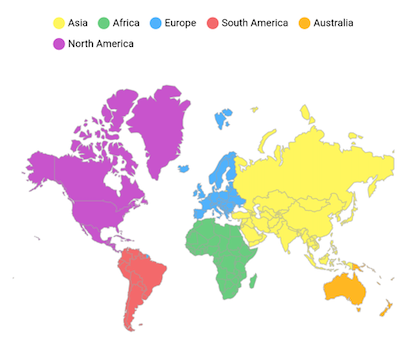

# Legend in the Flutter Maps

You can provide clear information on the data plotted in the map. You can use the legend toggling feature to visualize only the shapes to which the legend applies.

## Show legend

You can show legend using the `showLegend` property in the `MapShapeLayer`. The legend text is rendered based on the value of `shapeDataField` property.

```dart
@override
Widget build(BuildContext context) {
    return Scaffold(
      body: Center(
        child: Container(
          height: 350,
          child: Padding(
            padding: EdgeInsets.only(left: 15, right: 15),
            child: SfMaps(
              layers: [
                MapShapeLayer(
                  delegate: MapShapeLayerDelegate(
                    shapeFile: "assets/world_map.json",
                    shapeDataField: "continent",
                  ),
                  showLegend: true,
                ),
              ],
            ),
          ),
        ),
      ),
   );
}
```


## Icon color

The icon color of the legend is applied based on the color returned in the `shapeColorValueMapper` property in the `MapShapeLayerDelegate` and the text will be taken from `primaryValueMapper`. It is possible to customize the legend item's color and text using the `shapeColorMappers` property in the `MapShapeLayerDelegate`.

```dart
List<Model> data;

@override
void initState() {
    super.initState();

    data = <Model>[
      Model('Asia', Colors.yellow[300]),
      Model('Africa', Colors.green[300]),
      Model('Europe', Colors.blue[300]),
      Model('North America', Colors.purple[300]),
      Model('South America', Colors.red[300]),
      Model('Australia', Colors.orange[300]),
    ];
}

@override
Widget build(BuildContext context) {
    return Scaffold(
      backgroundColor: Colors.white,
      body: Center(
        child: Container(
          height: 350,
          child: Padding(
            padding: EdgeInsets.only(left: 15, right: 15),
            child: SfMaps(
              layers: [
                MapShapeLayer(
                  delegate: MapShapeLayerDelegate(
                    shapeFile: "assets/world_map.json",
                    shapeDataField: "continent",
                    dataCount: data.length,
                    primaryValueMapper: (int index) => data[index].continent,
                    shapeColorValueMapper: (int index) => data[index].color,
                  ),
                  showLegend: true,
                ),
              ],
            ),
          ),
        ),
      ),
   );
}

class Model {
  const Model(this.continent, this.color);

  final String continent;
  final Color color;
}
```


