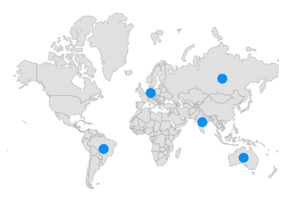
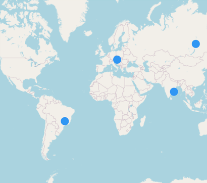
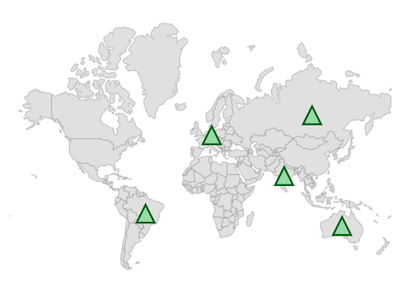
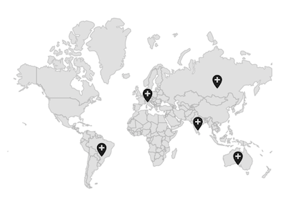
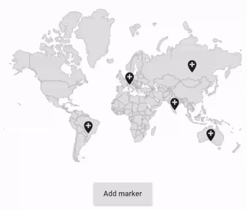
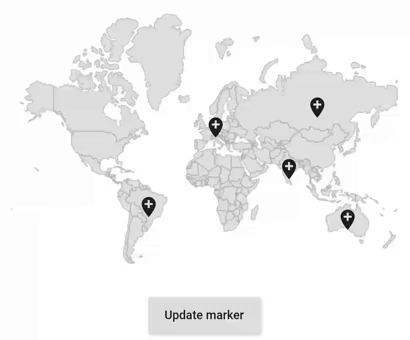
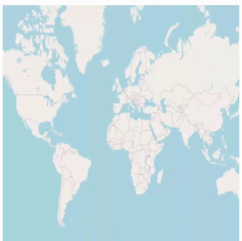
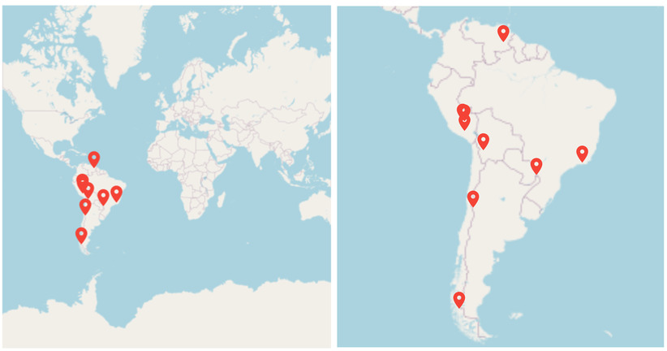

# Markers in Flutter Maps (SfMaps)

Markers can be used to denote specific locations on a map. You can use built-in symbols or display custom widgets at specific latitude and longitude coordinates on the map.

## Adding markers

### Shape layer

You can show markers at any position on the map by providing latitude and longitude coordinates to the [`MapMarker`](https://pub.dev/documentation/syncfusion_flutter_maps/latest/maps/MapMarker-class.html), which is returned from the [`markerBuilder`](https://pub.dev/documentation/syncfusion_flutter_maps/latest/maps/MapLayer/markerBuilder.html) property.

The [`markerBuilder`](https://pub.dev/documentation/syncfusion_flutter_maps/latest/maps/MapLayer/markerBuilder.html) callback will be called a number of times equal to the value specified in the [`initialMarkersCount`](https://pub.dev/documentation/syncfusion_flutter_maps/latest/maps/MapLayer/initialMarkersCount.html) property. The default value of the [`initialMarkersCount`](https://pub.dev/documentation/syncfusion_flutter_maps/latest/maps/MapLayer/initialMarkersCount.html) property is `null`.




late List<Model> _data;
late MapShapeSource _dataSource;

@override
void initState() {
  _data = const <Model>[
    Model('Brazil', -14.235004, -51.92528),
    Model('Germany', 51.16569, 10.451526),
    Model('Australia', -25.274398, 133.775136),
    Model('India', 20.593684, 78.96288),
    Model('Russia', 61.52401, 105.318756)
  ];

  _dataSource = MapShapeSource.asset(
    'assets/world_map.json',
    shapeDataField: 'name',
    dataCount: _data.length,
    primaryValueMapper: (index) => _data[index].country,
  );
  super.initState();
}

@override
Widget build(BuildContext context) {
  return Scaffold(
    body: Center(
        child: Padding(
      padding: EdgeInsets.only(left: 15, right: 15),
      child: SfMaps(
        layers: <MapLayer>[
          MapShapeLayer(
            source: _dataSource,
            initialMarkersCount: 5,
            markerBuilder: (BuildContext context, int index) {
              return MapMarker(
                latitude: _data[index].latitude,
                longitude: _data[index].longitude,
                iconColor: Colors.blue,
              );
            },
          ),
        ],
      ),
    )),
  );
}

class Model {
  const Model(this.country, this.latitude, this.longitude);

  final String country;
  final double latitude;
  final double longitude;
}




N>
* Refer to the [`markerBuilder`](https://pub.dev/documentation/syncfusion_flutter_maps/latest/maps/MapLayer/markerBuilder.html) documentation for returning the [`MapMarker`](https://pub.dev/documentation/syncfusion_flutter_maps/latest/maps/MapMarker-class.html).
* Refer to the [`controller`](https://pub.dev/documentation/syncfusion_flutter_maps/latest/maps/MapShapeLayer/controller.html) documentation for dynamically updating the markers.

### Tile layer

You can show markers at any position on the map by providing latitude and longitude coordinates to the [`MapMarker`](https://pub.dev/documentation/syncfusion_flutter_maps/latest/maps/MapMarker-class.html), which is returned from the [`MapTileLayer.markerBuilder`](https://pub.dev/documentation/syncfusion_flutter_maps/latest/maps/MapLayer/markerBuilder.html) property.

The [`markerBuilder`](https://pub.dev/documentation/syncfusion_flutter_maps/latest/maps/MapLayer/markerBuilder.html) callback will be called a number of times equal to the value specified in the [`initialMarkersCount`](https://pub.dev/documentation/syncfusion_flutter_maps/latest/maps/MapLayer/initialMarkersCount.html) property. The default value of the [`initialMarkersCount`](https://pub.dev/documentation/syncfusion_flutter_maps/latest/maps/MapLayer/initialMarkersCount.html) property is `null`.




late List<Model> _data;

@override
void initState() {
  _data = const <Model>[
    Model('Brazil', -14.235004, -51.92528),
    Model('Germany', 51.16569, 10.451526),
    Model('Australia', -25.274398, 133.775136),
    Model('India', 20.593684, 78.96288),
    Model('Russia', 61.52401, 105.318756)
  ];

  super.initState();
}

@override
Widget build(BuildContext context) {
  return Scaffold(
    body: Center(
      child: SfMaps(
        layers: <MapLayer>[
          MapTileLayer(
            urlTemplate: 'https://tile.openstreetmap.org/{z}/{x}/{y}.png',
            initialMarkersCount: 5,
            markerBuilder: (BuildContext context, int index) {
              return MapMarker(
                latitude: _data[index].latitude,
                longitude: _data[index].longitude,
                iconColor: Colors.blue,
              );
            },
          ),
        ],
      ),
    ),
  );
}

class Model {
  const Model(this.country, this.latitude, this.longitude);

  final String country;
  final double latitude;
  final double longitude;
}




N>
* Refer to the [`markerBuilder`](https://pub.dev/documentation/syncfusion_flutter_maps/latest/maps/MapLayer/markerBuilder.html) documentation for returning the [`MapMarker`](https://pub.dev/documentation/syncfusion_flutter_maps/latest/maps/MapMarker-class.html).
* Refer to the [`controller`](https://pub.dev/documentation/syncfusion_flutter_maps/latest/maps/MapTileLayer/controller.html) documentation for dynamically updating the markers.

## Appearance customization

You can customize the built-in markers appearance using the [`iconType`](https://pub.dev/documentation/syncfusion_flutter_maps/latest/maps/MapMarker/iconType.html), [`iconColor`](https://pub.dev/documentation/syncfusion_flutter_maps/latest/maps/MapMarker/iconColor.html), [`iconStrokeColor`](https://pub.dev/documentation/syncfusion_flutter_maps/latest/maps/MapMarker/iconStrokeColor.html), [`iconStrokeWidth`](https://pub.dev/documentation/syncfusion_flutter_maps/latest/maps/MapMarker/iconStrokeWidth.html), and [`size`](https://pub.dev/documentation/syncfusion_flutter_maps/latest/maps/MapMarker/size.html) properties of the [`MapMarker`](https://pub.dev/documentation/syncfusion_flutter_maps/latest/maps/MapMarker-class.html).

* **Alignment** - You can change the position of the marker from the given coordinate using the `alignment` property. The default value is `Alignment.center`. The available alignment options are `topLeft`, `topRight`, `topCenter`, `centerLeft`, `center`, `centerRight`, `bottomLeft`, `bottomCenter`, `bottomRight`.

* **Offset** - You can adjust the marker position from the given coordinate using the `offset` property. The default value of the `offset` property is `Offset.zero`.

N>
* The default value of the [`iconType`](https://pub.dev/documentation/syncfusion_flutter_maps/latest/maps/MapMarker/iconType.html) is `MapIconType.circle`.
* The default value of the [`iconStrokeWidth`](https://pub.dev/documentation/syncfusion_flutter_maps/latest/maps/MapMarker/iconStrokeWidth.html) is `1.0`.
* The default value of the [`iconColor`](https://pub.dev/documentation/syncfusion_flutter_maps/latest/maps/MapMarker/iconColor.html) is `Colors.blue`.
* The default value of the [`size`](https://pub.dev/documentation/syncfusion_flutter_maps/latest/maps/MapMarker/size.html) is `Size(14.0, 14.0)`.




late List<Model> _data;
late MapShapeSource _dataSource;

@override
void initState() {
  _data = <Model>[
    Model(-14.235004, -51.92528),
    Model(51.16569, 10.451526),
    Model(-25.274398, 133.775136),
    Model(20.593684, 78.96288),
    Model(61.52401, 105.318756)
  ];

  _dataSource = MapShapeSource.asset(
    'assets/world_map.json',
    shapeDataField: 'name',
  );
  super.initState();
}

@override
Widget build(BuildContext context) {
  return Scaffold(
    body: Center(
        child: Padding(
      padding: EdgeInsets.only(left: 15, right: 15),
      child: SfMaps(
        layers: <MapLayer>[
          MapShapeLayer(
            source: _dataSource,
            initialMarkersCount: 5,
            markerBuilder: (BuildContext context, int index) {
              return MapMarker(
                latitude: _data[index].latitude,
                longitude: _data[index].longitude,
                iconType: MapIconType.triangle,
                size: Size(18, 18),
                alignment: Alignment.center,
                offset: Offset(0, 9),
                iconColor: Colors.green[200],
                iconStrokeColor: Colors.green[900],
                iconStrokeWidth: 2,
              );
            },
          ),
        ],
      ),
    )),
  );
}

class Model {
  Model(this.latitude, this.longitude);

  final double latitude;
  final double longitude;
}




## Adding custom markers

You can show custom markers using the `child` property of the [`MapMarker`](https://pub.dev/documentation/syncfusion_flutter_maps/latest/maps/MapMarker-class.html) which is returned from the [`markerBuilder`](https://pub.dev/documentation/syncfusion_flutter_maps/latest/maps/MapLayer/markerBuilder.html).




late List<Model> _data;
late List<Widget> _iconsList;
late MapShapeSource _dataSource;

@override
void initState() {
  _data = <Model>[
    Model(-14.235004, -51.92528),
    Model(51.16569, 10.451526),
    Model(-25.274398, 133.775136),
    Model(20.593684, 78.96288),
    Model(61.52401, 105.318756)
  ];

  _iconsList = <Widget>[
    Icon(Icons.add_location),
    Icon(Icons.airplanemode_active),
    Icon(Icons.add_alarm),
    Icon(Icons.accessibility_new),
    Icon(Icons.account_balance)
  ];

  _dataSource = MapShapeSource.asset(
    'assets/world_map.json',
    shapeDataField: 'name',
  );
  super.initState();
}

@override
Widget build(BuildContext context) {
  return Scaffold(
    body: Center(
        child: Padding(
      padding: EdgeInsets.only(left: 15, right: 15),
      child: SfMaps(
        layers: <MapLayer>[
          MapShapeLayer(
            source: _dataSource,
            initialMarkersCount: 5,
            markerBuilder: (BuildContext context, int index) {
              return MapMarker(
                latitude: _data[index].latitude,
                longitude: _data[index].longitude,
                child: _iconsList[index],
              );
            },
          ),
        ],
      ),
    )),
  );
}

class Model {
  Model(this.latitude, this.longitude);

  final double latitude;
  final double longitude;
}




## Adding markers dynamically

You can add markers dynamically using the [`insertMarker`](https://pub.dev/documentation/syncfusion_flutter_maps/latest/maps/MapShapeLayerController/insertMarker.html) method. The [`markerBuilder`](https://pub.dev/documentation/syncfusion_flutter_maps/latest/maps/MapLayer/markerBuilder.html) will be called for the respective index once the [`insertMarker`](https://pub.dev/documentation/syncfusion_flutter_maps/latest/maps/MapShapeLayerController/insertMarker.html) method is called. The [`controller`](https://pub.dev/documentation/syncfusion_flutter_maps/latest/maps/MapShapeLayer/controller.html) property of [`MapShapeLayer`](https://pub.dev/documentation/syncfusion_flutter_maps/latest/maps/MapShapeLayer-class.html) must be set with a new instance of [`MapShapeLayerController`](https://pub.dev/documentation/syncfusion_flutter_maps/latest/maps/MapShapeLayerController-class.html).

A marker will be inserted at the given index if the index value is less than or equal to the current available index. The marker will be added as the last item if the index value is greater than the current available index.

N> You can get the current markers count from [`MapShapeLayerController.markersCount`](https://pub.dev/documentation/syncfusion_flutter_maps/latest/maps/MapShapeLayerController/markersCount.html).

### For shape layer




late List<Model> _data;
late MapShapeLayerController _controller;
late MapShapeSource _dataSource;
late Random random;

@override
void initState() {
  _data = <Model>[
    Model(-14.235004, -51.92528),
    Model(51.16569, 10.451526),
    Model(-25.274398, 133.775136),
    Model(20.593684, 78.96288),
    Model(61.52401, 105.318756)
  ];

  _dataSource = MapShapeSource.asset(
    'assets/world_map.json',
    shapeDataField: 'name',
  );
  _controller = MapShapeLayerController();
  random = Random();
  super.initState();
}

@override
Widget build(BuildContext context) {
  return Scaffold(
    body: Center(
        child: Container(
      height: 350,
      child: Padding(
        padding: EdgeInsets.only(left: 15, right: 15),
        child: Column(
          children: [
            SfMaps(
              layers: <MapLayer>[
                MapShapeLayer(
                  source: _dataSource,
                  initialMarkersCount: 5,
                  markerBuilder: (BuildContext context, int index) {
                    return MapMarker(
                      latitude: _data[index].latitude,
                      longitude: _data[index].longitude,
                      child: Icon(Icons.add_location),
                    );
                  },
                  controller: _controller,
                ),
              ],
            ),
            ElevatedButton(
              child: Text('Add marker'),
              onPressed: () {
                _data.add(Model(-180 + random.nextInt(360).toDouble(),
                    -55 + random.nextInt(139).toDouble()));
                _controller.insertMarker(5);
              },
            ),
          ],
        ),
      ),
    )),
  );
}

class Model {
  Model(this.latitude, this.longitude);

  final double latitude;
  final double longitude;
}




### For Tile layer




late List<Model> _data;
late MapTileLayerController _controller;
late Random random;

@override
void initState() {
  _data = <Model>[
    Model(-14.235004, -51.92528),
    Model(51.16569, 10.451526),
    Model(-25.274398, 133.775136),
    Model(20.593684, 78.96288),
    Model(61.52401, 105.318756)
  ];
  _controller = MapTileLayerController();
  random = Random();
  super.initState();
}

@override
Widget build(BuildContext context) {
  return Scaffold(
    body: Center(
        child: Container(
      height: 350,
      child: Padding(
        padding: EdgeInsets.only(left: 15, right: 15),
        child: Column(
          children: [
            SfMaps(
              layers: <MapLayer>[
                MapTileLayer(
                  urlTemplate: 'https://tile.openstreetmap.org/{z}/{x}/{y}.png',
                  initialMarkersCount: 5,
                  markerBuilder: (BuildContext context, int index) {
                    return MapMarker(
                      latitude: _data[index].latitude,
                      longitude: _data[index].longitude,
                      child: Icon(Icons.add_location),
                    );
                  },
                  controller: _controller,
                ),
              ],
            ),
            ElevatedButton(
              child: Text('Add marker'),
              onPressed: () {
                _data.add(Model(-180 + random.nextInt(360).toDouble(),
                    -55 + random.nextInt(139).toDouble()));
                _controller.insertMarker(5);
              },
            ),
          ],
        ),
      ),
    )),
  );
}

class Model {
  Model(this.latitude, this.longitude);

  final double latitude;
  final double longitude;
}




## Updating the existing markers

You can update multiple markers at the same time by passing indices to the [`updateMarkers`](https://pub.dev/documentation/syncfusion_flutter_maps/latest/maps/MapShapeLayerController/updateMarkers.html) method in the [`MapShapeLayerController`](https://pub.dev/documentation/syncfusion_flutter_maps/latest/maps/MapShapeLayerController-class.html). The [`markerBuilder`](https://pub.dev/documentation/syncfusion_flutter_maps/latest/maps/MapLayer/markerBuilder.html) will be called again for the respective indices once the [`updateMarkers`](https://pub.dev/documentation/syncfusion_flutter_maps/latest/maps/MapShapeLayerController/updateMarkers.html) method is called.

N>
* You can get the current markers count from [`MapShapeLayerController.markersCount`](https://pub.dev/documentation/syncfusion_flutter_maps/latest/maps/MapShapeLayerController/markersCount.html).
* You can refer to this [`snippet`](https://help.syncfusion.com/flutter/maps/markers#for-tile-layer) to update the markers dynamically for tile layer.




late List<Model> _data;
late MapShapeLayerController _controller;
late Widget _markerWidget;
late MapShapeSource _dataSource;

@override
void initState() {
    _data = <Model>[
      Model(-14.235004, -51.92528),
      Model(51.16569, 10.451526),
      Model(-25.274398, 133.775136),
      Model(20.593684, 78.96288),
      Model(61.52401, 105.318756)
    ];

    _dataSource = MapShapeSource.asset(
       'assets/world_map.json',
        shapeDataField: 'name',
    );

    _controller = MapShapeLayerController();
    _markerWidget =  Icon(Icons.add_location);
    super.initState();
}

@override
Widget build(BuildContext context) {
    return Scaffold(
      body: Center(
          child: Container(
            height: 350,
            child: Padding(
              padding: EdgeInsets.only(left: 15, right: 15),
              child: Column(
                children: [
                  SfMaps(
                    layers: <MapLayer>[
                      MapShapeLayer(
                        source: _dataSource,
                        initialMarkersCount: 5,
                        markerBuilder: (BuildContext context, int index){
                          return MapMarker(
                            latitude: _data[index].latitude,
                            longitude: _data[index].longitude,
                            child: _markerWidget,
                          );
                        },
                        controller: _controller,
                      ),
                    ],
                  ),
                  ElevatedButton(
                    child: Text('Update marker'),
                    onPressed: () {
                      List<int> updateList = <int>[1, 2];
                      _markerWidget = Icon(Icons.people);
                      _controller.updateMarkers(updateList);
                    },
                  ),
                ],
              ),
            ),
          )
      ),
   );
}

class Model {
  Model(this.latitude, this.longitude);

  final double latitude;
  final double longitude;
}




## Deleting a marker

You can remove a marker at any index using the [`removeMarkerAt`](https://pub.dev/documentation/syncfusion_flutter_maps/latest/maps/MapShapeLayerController/removeMarkerAt.html) method.

N>
* You can get the current markers count from [`MapShapeLayerController.markersCount`](https://pub.dev/documentation/syncfusion_flutter_maps/latest/maps/MapShapeLayerController/markersCount.html).
* You can refer to this [`snippet`](https://help.syncfusion.com/flutter/maps/markers#for-tile-layer) to update the markers dynamically for tile layer.




late List<Model> _data;
late MapShapeLayerController _controller;
late MapShapeSource _dataSource;

@override
void initState() {
    _data = <Model>[
      Model(-14.235004, -51.92528),
      Model(51.16569, 10.451526),
      Model(-25.274398, 133.775136),
      Model(20.593684, 78.96288),
      Model(61.52401, 105.318756)
    ];

    _dataSource = MapShapeSource.asset(
       'assets/world_map.json',
       shapeDataField: 'name',
    );
    _controller = MapShapeLayerController();
    super.initState();
}

@override
Widget build(BuildContext context) {
    return Scaffold(
      body: Center(
          child: Container(
            height: 350,
            child: Padding(
              padding: EdgeInsets.only(left: 15, right: 15),
              child: Column(
                children: [
                  SfMaps(
                    layers: <MapLayer>[
                      MapShapeLayer(
                        source: _dataSource,
                        initialMarkersCount: 5,
                        markerBuilder: (BuildContext context, int index){
                          return MapMarker(
                            latitude: _data[index].latitude,
                            longitude: _data[index].longitude,
                            child: Icon(Icons.add_location),
                          );
                        },
                        controller: _controller,
                      ),
                    ],
                  ),
                  ElevatedButton(
                    child: Text('Remove marker'),
                    onPressed: () {
                      _controller.removeMarkerAt(4);
                    },
                  ),
                ],
              ),
            ),
          )
      ),
   );
}

class Model {
  Model(this.latitude, this.longitude);

  final double latitude;
  final double longitude;
}




## Clearing the markers

You can clear all markers using the [`clearMarkers`](https://pub.dev/documentation/syncfusion_flutter_maps/latest/maps/MapShapeLayerController/clearMarkers.html) method.

N>
* You can get the current markers count from [`MapShapeLayerController.markersCount`](https://pub.dev/documentation/syncfusion_flutter_maps/latest/maps/MapShapeLayerController/markersCount.html).
* You can refer to this [`snippet`](https://help.syncfusion.com/flutter/maps/markers#for-tile-layer) to update the markers dynamically for tile layer.




late List<Model> _data;
late MapShapeLayerController _controller;
late MapShapeSource _dataSource;

@override
void initState() {
    _data = <Model>[
      Model(-14.235004, -51.92528),
      Model(51.16569, 10.451526),
      Model(-25.274398, 133.775136),
      Model(20.593684, 78.96288),
      Model(61.52401, 105.318756)
    ];

    _dataSource = MapShapeSource.asset(
       'assets/world_map.json',
        shapeDataField: 'name',
    );
    _controller = MapShapeLayerController();
    super.initState();
}

@override
Widget build(BuildContext context) {
    return Scaffold(
      body: Center(
          child: Container(
            height: 350,
            child: Padding(
              padding: EdgeInsets.only(left: 15, right: 15),
              child: Column(
                children: [
                  SfMaps(
                    layers: <MapLayer>[
                      MapShapeLayer(
                        source: _dataSource,
                        initialMarkersCount: 5,
                        markerBuilder: (BuildContext context, int index){
                          return MapMarker(
                            latitude: _data[index].latitude,
                            longitude: _data[index].longitude,
                            child: Icon(Icons.add_location),
                          );
                        },
                        controller: _controller,
                      ),
                    ],
                  ),
                  ElevatedButton(
                    child: Text('Clear marker'),
                    onPressed: () {
                      _controller.clearMarkers();
                    },
                  ),
                ],
              ),
            ),
          )
      ),
   );
}

class Model {
  Model(this.latitude, this.longitude);

  final double latitude;
  final double longitude;
}




## Marker controller

You can position a marker at the tapped position by converting the touch pixel point into coordinates using the [`pixelToLatLng`](https://pub.dev/documentation/syncfusion_flutter_maps/latest/maps/MapTileLayerController/pixelToLatLng.html) method of [`MapTileLayerController`](https://pub.dev/documentation/syncfusion_flutter_maps/latest/maps/MapTileLayerController-class.html) in the [`MapTileLayer`](https://pub.dev/documentation/syncfusion_flutter_maps/latest/maps/MapTileLayer-class.html) and the [`MapShapeLayerController`](https://pub.dev/documentation/syncfusion_flutter_maps/latest/maps/MapShapeLayerController-class.html) in the [`MapShapeLayer`](https://pub.dev/documentation/syncfusion_flutter_maps/latest/maps/MapShapeLayer-class.html).

N> This is applicable for both tile layer and shape layer.

### Shape layer




late MapLatLng _markerPosition;
late _CustomZoomPanBehavior _mapZoomPanBehavior;
late MapShapeLayerController _controller;
late MapShapeSource _mapSource;

@override
void initState() {
   _controller = MapShapeLayerController();
   _mapZoomPanBehavior = _CustomZoomPanBehavior()
      ..zoomLevel = 1
      ..onTap = updateMarkerChange;
   _mapSource = MapShapeSource.asset(
      'assets/world_map.json',
      shapeDataField: 'continent',
   );
   super.initState();
}

void updateMarkerChange(Offset position) {
  _markerPosition = _controller.pixelToLatLng(position);

  /// Removed [MapShapeLayer.initialMarkersCount] property and updated
  /// markers only when the user taps.
  if (_controller.markersCount > 0) {
    _controller.clearMarkers();
   }
  _controller.insertMarker(0);
}

@override
Widget build(BuildContext context) {
  return Scaffold(
     body: Center(
        child: Container(
          height: 400,
          width: 400,
          child: MapShapeLayer(
            source: _mapSource,
            zoomPanBehavior: _mapZoomPanBehavior,
            controller: _controller,
            markerBuilder: (BuildContext context, int index) {
              return MapMarker(
                latitude: _markerPosition.latitude,
                longitude: _markerPosition.longitude,
                child: Icon(
                  Icons.location_on,
                  color: Colors.red,
                  size: 20,
                ),
              );
            },
          ),
        ),
      ),
   );
}

class _CustomZoomPanBehavior extends MapZoomPanBehavior {
  _CustomZoomPanBehavior();
  late MapTapCallback onTap;

  @override
  void handleEvent(PointerEvent event) {
    if (event is PointerUpEvent) {
      onTap(event.localPosition);
    }
    super.handleEvent(event);
  }
}

typedef MapTapCallback = void Function(Offset position);




### Tile layer




late MapLatLng _markerPosition;
late _CustomZoomPanBehavior _mapZoomPanBehavior;
late MapTileLayerController _controller;

@override
void initState() {
   _controller = MapTileLayerController();
   _mapZoomPanBehavior = _CustomZoomPanBehavior()
      ..onTap = updateMarkerChange;
   super.initState();
}

void updateMarkerChange(Offset position) {
  _markerPosition = _controller.pixelToLatLng(position);

  /// Removed [MapTileLayer.initialMarkersCount] property and updated
  /// markers only when the user taps.
  if (_controller.markersCount > 0) {
    _controller.clearMarkers();
  }
  _controller.insertMarker(0);
}

@override
Widget build(BuildContext context) {
  return Scaffold(
     body: Center(
        child: Container(
          height: 400,
          width: 400,
          child: MapTileLayer(
            urlTemplate: 'https://tile.openstreetmap.org/{z}/{x}/{y}.png',
            zoomPanBehavior: _mapZoomPanBehavior,
            controller: _controller,
            markerBuilder: (BuildContext context, int index) {
              return MapMarker(
                  latitude: _markerPosition.latitude,
                  longitude: _markerPosition.longitude,
                  child: Icon(
                    Icons.location_on,
                    color: Colors.red,
                    size: 20,
                  ));
            },
          ),
        ),
      ),
   );
}

class _CustomZoomPanBehavior extends MapZoomPanBehavior {
  _CustomZoomPanBehavior();
  late MapTapCallback onTap;

  @override
  void handleEvent(PointerEvent event) {
    if (event is PointerUpEvent) {
      onTap(event.localPosition);
    }
    super.handleEvent(event);
  }
}

typedef MapTapCallback = void Function(Offset position);




## Zoom markers to fit bounds

You can visualize a specific area on the map by specifying the northeast and southwest coordinate points to the `initialLatLngBounds` property in the `MapTileLayer` and `MapShapeLayer`. It renders the map by calculating the center coordinate and zoom level depending on the `initialLatLngBounds` value.

The `initialLatLngBounds` property can be set at load time alone. You can use the `latLngBounds` property of [`MapZoomPanBehavior`](https://pub.dev/documentation/syncfusion_flutter_maps/latest/maps/MapZoomPanBehavior-class.html) to dynamically update the map bounds.




late List<_TouristPlaceDetails> _touristPlaces;
late MapZoomPanBehavior _zoomPanBehavior;
bool _canFitMarkers = false;

@override
void initState() {
  _zoomPanBehavior = MapZoomPanBehavior();
  _touristPlaces = <_TouristPlaceDetails>[
    const _TouristPlaceDetails(
        MapLatLng(-25.6953, -54.4367), 'Iguazu Falls, Argentina'),
    const _TouristPlaceDetails(MapLatLng(-50.9423, -73.4068),
        'Torres del Paine National Park, Patagonia, Chile'),
    const _TouristPlaceDetails(
        MapLatLng(-15.9254, -69.3354), 'Lake Titicaca, Bolivia'),
    const _TouristPlaceDetails(
        MapLatLng(-13.1631, -72.5450), 'Machu Picchu, Peru'),
    const _TouristPlaceDetails(
        MapLatLng(-0.1862504, -78.5706247), 'The Amazon via Quito, Ecuador'),
    const _TouristPlaceDetails(
        MapLatLng(5.9701, -62.5362), 'Angel Falls, Venezuela'),
    const _TouristPlaceDetails(
        MapLatLng(-14.0875, -75.7626), 'Huacachina, Peru'),
    const _TouristPlaceDetails(
        MapLatLng(-22.7953, -67.8361), 'Laguna Verde, Bolivia'),
    const _TouristPlaceDetails(
        MapLatLng(-50.5025092, -73.1997346), 'Perito Moreno, Venezuela'),
    const _TouristPlaceDetails(
        MapLatLng(-22.9068, -43.1729), 'Rio de Janeiro, Brazil'),
    const _TouristPlaceDetails(
        MapLatLng(5.1765, -59.4808), 'Kaieteur Falls, Guyana'),
    const _TouristPlaceDetails(
        MapLatLng(-33.4489, -70.6693), 'Santiago, Chile'),
    const _TouristPlaceDetails(
        MapLatLng(4.7110, -74.0721), 'Bogota, Colombia'),
    const _TouristPlaceDetails(
        MapLatLng(-1.3928, -78.4269), 'Banos, Ecuador'),
  ];
  super.initState();
}

@override
Widget build(BuildContext context) {
  return Scaffold(
    body: Column(
      children: [
        SfMaps(
          layers: <MapLayer>[
            MapTileLayer(
              urlTemplate: 'https://tile.openstreetmap.org/{z}/{x}/{y}.png',
              zoomPanBehavior: _zoomPanBehavior,
              initialMarkersCount: _touristPlaces.length,
              markerBuilder: (BuildContext context, int index) {
                return MapMarker(
                  latitude: _touristPlaces[index].latLng.latitude,
                  longitude: _touristPlaces[index].latLng.longitude,
                  child: const Icon(
                    Icons.location_on,
                    color: Colors.red,
                    size: 20,
                  ),
                );
              },
            ),
          ],
        ),
        SizedBox(height: 10),
        Container(
          width: 300,
          padding: EdgeInsets.zero,
          child: CheckboxListTile(
            activeColor: Colors.blue,
            value: _canFitMarkers,
            title: Text('Zoom marker to fit bounds'),
            onChanged: (bool? value) {
              _canFitMarkers = value!;
              setState(() {
                if (_canFitMarkers) {
                  // South America bounds.
                  _zoomPanBehavior.latLngBounds = const MapLatLngBounds(
                      MapLatLng(12.434375, -34.80546874999999),
                      MapLatLng(-55.891699218750006, -91.654150390625));
                } else {
                  // World bounds.
                  _zoomPanBehavior.latLngBounds = const MapLatLngBounds(
                      MapLatLng(-90.0, -180.0), MapLatLng(90.0, 180.0));
                }
              });
            },
          ),
        ),
      ],
    ),
  );
}

class _TouristPlaceDetails {
  const _TouristPlaceDetails(this.latLng, this.place);
  final MapLatLng latLng;
  final String place;
}




N> You can refer to our [Flutter Maps](https://www.syncfusion.com/flutter-widgets/flutter-maps) feature tour page for its groundbreaking feature representations. You can also explore our [Flutter Maps Markers example](https://flutter.syncfusion.com/#/maps/shape-layer/marker) that shows how to configure a Maps in Flutter.