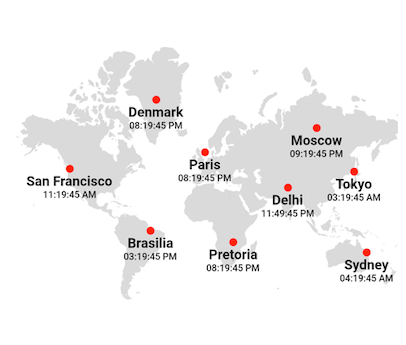
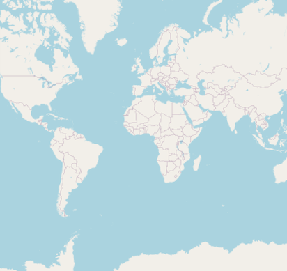

# Flutter Maps (SfMaps) Overview

[Flutter Maps](https://www.syncfusion.com/flutter-widgets/flutter-maps) is a powerful data visualization component that displays statistical information for a geographical area. Its rich feature set includes tile rendering from OpenStreetMap, Bing Maps, and other tile providers with marker support and shape layer with features like selection, legends, labels, markers, tooltips, bubbles, color mapping, and much more.

## Shape layer

Render GeoJSON data as geographical shapes or any custom shape on a shape layer for powerful data visualization. Customize it to the desired look using built-in options. For example, you can render a map of the world or any particular country.

### Features

* **Data labels** - Provides identification for the shapes by displaying their names. Trim or hide the labels if they exceed shape bounds.

* **Markers** - Denote a location with built-in symbols or display a custom widget at a specific latitude and longitude on a map.

* **Bubbles** - Add information to shapes such as population density, number of users, and more. Bubbles can be rendered in different colors and sizes based on the data values of their assigned shape.

* **Shape selection** - Select a shape in order to highlight that area on a map. You can use the callback for performing any action during shape selection.

* **Legend** - Use legends to provide clear information on the data plotted in the map. You can use the legend toggling feature to visualize only the shapes to which the legend applies.

* **Colors** - Categorize the shapes on a map by customizing their color based on the underlying value. It is possible to set the shape color for a specific value or for a range of values.

* **Tooltip** - Display additional information about shapes and bubbles using the customizable tooltip on a map.

* **Zooming and panning** - Zoom in the shape layer for a closer look at a specific region by pinching the map, scrolling the mouse wheel or track pad, or using the toolbar on the web. Pan the map to navigate across the regions. You can also customize the zoom level and the center point of the initial rendering.

## Tile layer

An interactive tile layer allows you to load map tiles from web map tile services such as Bing Maps, OpenStreetMaps, Google Maps, TomTom, etc. Use markers to denote the specific latitude and longitude in the tile layer as required. Zoom and pan the tile layer to navigate across the regions and take a closer look.

### Features

* **Markers** - Denote a location with built-in symbols or display a custom widget at a specific latitude and longitude on a map.

* **Zooming and panning** - Zoom in the tile layer for a closer look at a specific region by pinching the map, scrolling the mouse wheel or track pad, or using the toolbar on the web. Pan the map to navigate across the regions. You can also customize the zoom level and the center point of the initial rendering.

N> You can also explore our [Flutter Maps example](https://flutter.syncfusion.com/#/maps/shape-layer/range-color-mapping) that shows how to configure a Maps in Flutter.