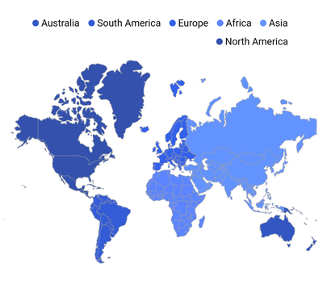
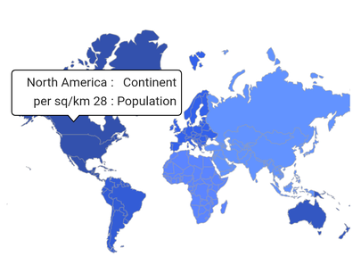

# Right To Left (RTL) in Flutter Maps (SfMaps)

## RTL rendering ways

Right to left rendering can be switched in the following ways:

### Wrapping the SfMaps with Directionality widget

The Maps supports changing the layout direction of the widget elements in the right-to-left direction by setting the [`textDirection`](https://api.flutter.dev/flutter/widgets/Directionality/textDirection.html) property to `rtl` in the [`Directionality`](https://api.flutter.dev/flutter/widgets/Directionality-class.html) widget.




@override
Widget build(BuildContext context) {
  return MaterialApp(
      home: Scaffold(
          body: Directionality(
              textDirection: TextDirection.rtl,
              child: Center(
                child: SfMaps(
                  layers: [
                    MapShapeLayer(
                      source: const MapShapeSource.asset(
                          "assets/world_map.json",
                          shapeDataField: "continent"),
                    ),
                  ],
                ),
              )
          ),
       ),
   );
}




### Changing the locale to RTL languages

To change the maps elements rendering direction from right to left, you can change the locale to any of the RTL languages such as Arabic, Persian, Hebrew, Pashto, and Urdu.




dependencies:
  flutter_localizations:
    sdk: flutter







@override
Widget build(BuildContext context) {
   return MaterialApp(
      localizationsDelegates: [
        GlobalMaterialLocalizations.delegate,
        GlobalWidgetsLocalizations.delegate,
      ],
      supportedLocales: [
        Locale("fa", "IR"),
      ],
      locale: Locale("fa", "IR"),
      home: Scaffold(
        backgroundColor: Colors.white,
        body: SfMaps(
          layers: [
            MapShapeLayer(
              source: const MapShapeSource.asset(
                  "assets/world_map.json",
                  shapeDataField: "continent"),
            ),
          ],
        ),
      ),
   );
}




## RTL supported maps elements

### Legend

Legend items will be rendered from right to left direction. It is applicable for both shape and bubble legend with solid and bar type legend.




late List<PopulationModel> _data;
late MapShapeSource _mapSource;

@override
void initState() {
  super.initState();
   _data = <PopulationModel>[
      PopulationModel('Asia', 150, Color.fromRGBO(60, 120, 255, 0.8)),
      PopulationModel('Africa', 45, Color.fromRGBO(51, 102, 255, 0.8)),
      PopulationModel('Europe', 34, Color.fromRGBO(0, 57, 230, 0.8)),
      PopulationModel('South America', 25, Color.fromRGBO(0, 51, 204, 0.8)),
      PopulationModel('North America', 28, Color.fromRGBO(0, 38, 153, 0.8)),
      PopulationModel('Australia', 5, Color.fromRGBO(0, 45, 179, 0.8)),
   ];

   _mapSource = MapShapeSource.asset(
      "assets/world_map.json",
      shapeDataField: "continent",
      dataCount: _data.length,
      primaryValueMapper: (int index) => _data[index].continent,
      shapeColorValueMapper: (int index) => _data[index].color,
   );
}

@override
Widget build(BuildContext context) {
  return Scaffold(
     body: Center(
        child: Container(
          padding: const EdgeInsets.only(left: 10, right: 15, top: 30),
          height: 350,
          child: Directionality(
            textDirection: TextDirection.rtl,
            child: SfMaps(
              layers: [
                MapShapeLayer(
                  source: _mapSource,
                  legend: MapLegend(MapElement.shape),
                )
              ],
            ),
          ),
        ),
      ),
   );
}

class PopulationModel {
  const PopulationModel(
      this.continent, this.populationDensityPerSqKm, this.color);

  final String continent;
  final double populationDensityPerSqKm;
  final Color color;
}




### Tooltip

Tooltip text will be rendered from right to left direction. It is applicable for shape tooltip, bubble tooltip, and marker tooltip.




late List<PopulationModel> _data;
late MapShapeSource _mapSource;

@override
void initState() {
   super.initState();
    _data = <PopulationModel>[
      PopulationModel('Asia', 150, Color.fromRGBO(60, 120, 255, 0.8)),
      PopulationModel('Africa', 45, Color.fromRGBO(51, 102, 255, 0.8)),
      PopulationModel('Europe', 34, Color.fromRGBO(0, 57, 230, 0.8)),
      PopulationModel('South America', 25, Color.fromRGBO(0, 51, 204, 0.8)),
      PopulationModel('North America', 28, Color.fromRGBO(0, 38, 153, 0.8)),
      PopulationModel('Australia', 5, Color.fromRGBO(0, 45, 179, 0.8)),
    ];

    _mapSource = MapShapeSource.asset(
      "assets/world_map.json",
      shapeDataField: "continent",
      dataCount: _data.length,
      primaryValueMapper: (int index) => _data[index].continent,
      shapeColorValueMapper: (int index) => _data[index].color,
    );
}

@override
Widget build(BuildContext context) {
  return Scaffold(
     body: Center(
        child: Container(
          padding: const EdgeInsets.only(left: 10, right: 15, top: 30),
          height: 350,
          child: Directionality(
            textDirection: TextDirection.rtl,
            child: SfMaps(
              layers: [
                MapShapeLayer(
                  source: _mapSource,
                  shapeTooltipBuilder: (BuildContext context, int index) {
                    return Container(
                      height: 50,
                      width: 190,
                      child: Column(
                        children: [
                          Padding(
                            padding: EdgeInsets.all(5),
                            child: Row(
                              children: [
                                Text('Continent   : '),
                                Text(_data[index].continent),
                              ],
                            ),
                          ),
                          Padding(
                            padding:
                                EdgeInsets.only(left: 5, right: 5, bottom: 5),
                            child: Row(
                              children: [
                                Text('Population : '),
                                Text(_data[index]
                                        .populationDensityPerSqKm
                                        .toStringAsFixed(0) +
                                    ' per sq/km'),
                              ],
                            ),
                          ),
                        ],
                      ),
                    );
                  },
                  tooltipSettings: const MapTooltipSettings(
                    color: Colors.white,
                    strokeColor: Colors.black,
                  ),
                )
              ],
            ),
          ),
        ),
     ),
  );
}

class PopulationModel {
  const PopulationModel(
      this.continent, this.populationDensityPerSqKm, this.color);

  final String continent;
  final double populationDensityPerSqKm;
  final Color color;
}




