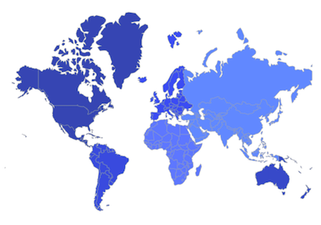
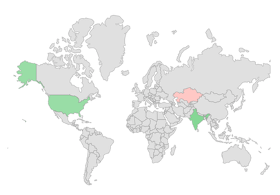

# Shapes in Flutter Maps (SfMaps)

This section explains about shapes and how to apply colors to the shapes based on specific values in the Flutter maps.

## Loading progress indicator

You can notify the user that the map is being loaded using the [`MapShapeLayer.loadingBuilder`](https://pub.dev/documentation/syncfusion_flutter_maps/latest/maps/MapShapeLayer/loadingBuilder.html). It returns the widget which will be visible till the maps is loaded.




late MapShapeSource dataSource;

@override
void initState() {
  dataSource = MapShapeSource.asset(
    'assets/world_map.json',
    shapeDataField: 'continent',
  );
  super.initState();
}

@override
Widget build(BuildContext context) {
    return Scaffold(
      body: Padding(
        padding: EdgeInsets.all(15),
        child: SfMaps(
          layers: <MapLayer>[
            MapShapeLayer(
              source: dataSource,
              loadingBuilder: (BuildContext context) {
                return Container(
                  height: 25,
                  width: 25,
                  child: const CircularProgressIndicator(
                    strokeWidth: 3,
                  ),
                );
              },
            ),
          ],
        ),
      ),
   );
}




## Shape color

You can apply color, stroke color and stroke width to the shapes using the [`MapShapeLayer.color`](https://pub.dev/documentation/syncfusion_flutter_maps/latest/maps/MapShapeLayer/color.html), [`MapShapeLayer.strokeColor`](https://pub.dev/documentation/syncfusion_flutter_maps/latest/maps/MapShapeLayer/strokeColor.html) and [`MapShapeLayer.strokeWidth`](https://pub.dev/documentation/syncfusion_flutter_maps/latest/maps/MapShapeLayer/strokeWidth.html) properties respectively.




late MapShapeSource dataSource;

@override
void initState() {
  dataSource = MapShapeSource.asset(
    'assets/world_map.json',
    shapeDataField: 'continent',
  );
  super.initState();
}

@override
Widget build(BuildContext context) {
    return Scaffold(
      body: Padding(
        padding: EdgeInsets.all(15),
        child: SfMaps(
          layers: <MapLayer>[
            MapShapeLayer(
              source: dataSource,
               color: Colors.blue[100],
               strokeColor: Colors.blue,
               strokeWidth: 2,
            ),
          ],
        ),
      ),
   );
}




<b>Using SfMapsTheme</b>

You can also customize the below appearance of the shape using [`SfMapsTheme`](https://pub.dev/documentation/syncfusion_flutter_core/latest/theme/SfMapsTheme-class.html).

* **Color** - Change the color of the shapes using the [`SfMapsThemeData.layerColor`](https://pub.dev/documentation/syncfusion_flutter_core/latest/theme/SfMapsThemeData/layerColor.html) property.
* **Stroke color** - Change the stroke color of the shapes using the [`SfMapsThemeData.layerStrokeColor`](https://pub.dev/documentation/syncfusion_flutter_core/latest/theme/SfMapsThemeData/layerStrokeColor.html) property.
* **Stroke width** - Change the stroke width of the shapes using the [`SfMapsThemeData.layerStrokeWidth`](https://pub.dev/documentation/syncfusion_flutter_core/latest/theme/SfMapsThemeData/layerStrokeWidth.html) property.

N> You must import the `theme.dart` library from the [`Core`](https://pub.dev/packages/syncfusion_flutter_core) package to use [`SfMapsTheme`](https://pub.dev/documentation/syncfusion_flutter_core/latest/theme/SfMapsTheme-class.html).




late MapShapeSource dataSource;

@override
void initState() {
  dataSource = MapShapeSource.asset(
    'assets/world_map.json',
    shapeDataField: 'continent',
  );
  super.initState();
}

@override
Widget build(BuildContext context) {
  return Scaffold(
    body: Padding(
      padding: EdgeInsets.all(15),
      child: SfMapsTheme(
        data: SfMapsThemeData(
          layerColor: Colors.blue[100],
          layerStrokeColor: Colors.blue,
          layerStrokeWidth: 2,
        ),
        child: SfMaps(
          layers: <MapLayer>[
            MapShapeLayer(
              source: dataSource,
            ),
          ],
        ),
      ),
    ),
  );
}




## Hover color

You can apply hover color, stroke color and stroke width to the shapes in the web platform using the [`SfMapsThemeData.shapeHoverColor`](https://pub.dev/documentation/syncfusion_flutter_core/latest/theme/SfMapsThemeData/shapeHoverColor.html), [`SfMapsThemeData.shapeHoverStrokeColor`](https://pub.dev/documentation/syncfusion_flutter_core/latest/theme/SfMapsThemeData/shapeHoverStrokeColor.html) and [`SfMapsThemeData.shapeHoverStrokeWidth`](https://pub.dev/documentation/syncfusion_flutter_core/latest/theme/SfMapsThemeData/shapeHoverStrokeWidth.html) properties respectively.

N> You must import the `theme.dart` library from the [`Core`](https://pub.dev/packages/syncfusion_flutter_core) package to use [`SfMapsTheme`](https://pub.dev/documentation/syncfusion_flutter_core/latest/theme/SfMapsTheme-class.html).




late MapShapeSource dataSource;

@override
void initState() {
  dataSource = MapShapeSource.asset(
    'assets/world_map.json',
    shapeDataField: 'continent',
  );
  super.initState();
}

@override
Widget build(BuildContext context) {
  return Scaffold(
    body: Padding(
      padding: EdgeInsets.all(15),
      child: SfMapsTheme(
        data: SfMapsThemeData(
           shapeHoverColor: Colors.red[800],
           shapeHoverStrokeColor: Colors.black,
           shapeHoverStrokeWidth: 2,
        ),
        child: SfMaps(
          layers: <MapLayer>[
            MapShapeLayer(
              source: dataSource,
            ),
          ],
        ),
      ),
    ),
  );
}




## Applying colors based on the data

To learn more about how to customize the colors in Flutter Maps, you can watch this video.

<iframe id='flutterMapsVideoTutorial' src='https://www.youtube.com/embed/cHEbMFm3TMU'></iframe>

If you return a color from the [`shapeColorValueMapper`](https://pub.dev/documentation/syncfusion_flutter_maps/latest/maps/MapShapeSource/shapeColorValueMapper.html), then the color will be applied to the respective shape straightaway.

If you return a value of different type other than the color from the [`shapeColorValueMapper`](https://pub.dev/documentation/syncfusion_flutter_maps/latest/maps/MapShapeSource/shapeColorValueMapper.html), then you must set the [`MapShapeSource.shapeColorMappers`](https://pub.dev/documentation/syncfusion_flutter_maps/latest/maps/MapShapeSource/shapeColorMappers.html) property which is a collection of [`MapColorMapper`](https://pub.dev/documentation/syncfusion_flutter_maps/latest/maps/MapColorMapper-class.html) to apply colors for the respective shapes.

N> You can show legend using the [`MapShapeLayer.legend`](https://pub.dev/documentation/syncfusion_flutter_maps/latest/maps/MapShapeLayer/legend.html) property. The icons color of the legend is applied based on the colors returned in the [`MapShapeSource.shapeColorValueMapper`](https://pub.dev/documentation/syncfusion_flutter_maps/latest/maps/MapShapeSource/shapeColorValueMapper.html) property and the text will be taken from the [`primaryValueMapper`](https://pub.dev/documentation/syncfusion_flutter_maps/latest/maps/MapShapeSource/primaryValueMapper.html). It is possible to customize the legend icons color and text using the [`MapShapeSource.shapeColorMappers`](https://pub.dev/documentation/syncfusion_flutter_maps/latest/maps/MapShapeSource/shapeColorMappers.html) property.




late List<Model> data;
late MapShapeSource dataSource;

@override
void initState() {
    data = const <Model>[
      Model('Asia', Color.fromRGBO(60, 120, 255, 0.8)),
      Model('Africa', Color.fromRGBO(51, 102, 255, 0.8)),
      Model('Europe', Color.fromRGBO(0, 57, 230, 0.8)),
      Model('South America', Color.fromRGBO(0, 51, 204, 0.8)),
      Model('Australia', Color.fromRGBO(0, 45, 179, 0.8)),
      Model('North America', Color.fromRGBO(0, 38, 153, 0.8))
    ];

    dataSource = MapShapeSource.asset(
      'assets/world_map.json',
       shapeDataField: 'continent',
       dataCount: data.length,
       primaryValueMapper: (int index) => data[index].country,
       shapeColorValueMapper: (int index) => data[index].color,
    );
    super.initState();
}

@override
Widget build(BuildContext context) {
    return Scaffold(
      body: Center(
          child: Container(
        height: 350,
        child: Padding(
          padding: EdgeInsets.only(left: 15, right: 15),
          child: SfMaps(
            layers: <MapLayer>[
              MapShapeLayer(
                source: dataSource,
              ),
            ],
          ),
        ),
      )),
   );
}

class Model {
  const Model(this.country, this.color);

  final String country;
  final Color color;
}




## Equal color mapping

You can apply color to the shape by comparing a value that returns from the [`shapeColorValueMapper`](https://pub.dev/documentation/syncfusion_flutter_maps/latest/maps/MapShapeSource/shapeColorValueMapper.html) with the [`MapColorMapper.value`](https://pub.dev/documentation/syncfusion_flutter_maps/latest/maps/MapColorMapper/value.html). For the matched values, the [`MapColorMapper.color`](https://pub.dev/documentation/syncfusion_flutter_maps/latest/maps/MapColorMapper/color.html) will be applied to the respective shapes.




late List<Model> data;
late MapShapeSource dataSource;

@override
void initState() {
  data = <Model>[
    Model('India', "Low"),
    Model('United States of America', "High"),
    Model('Pakistan', "Low"),
  ];

  dataSource = MapShapeSource.asset(
    "assets/world_map.json",
     shapeDataField: "name",
     dataCount: data.length,
     primaryValueMapper: (int index) {
       return data[index].country;
     },
     shapeColorValueMapper: (int index) {
       return data[index].storage;
     },
     shapeColorMappers: [
       MapColorMapper(value: "Low", color: Colors.red),
       MapColorMapper(value: "High", color: Colors.green)
     ],
  );
  super.initState();
}

@override
Widget build(BuildContext context) {
    return Scaffold(
      body: Padding(
        padding: EdgeInsets.only(left: 15, right: 15),
        child: SfMaps(
          layers: <MapShapeLayer>[
            MapShapeLayer(source: dataSource),
          ],
        ),
      ),
   );
}

class Model {
  const Model(this.country, this.storage);

  final String country;
  final String storage;
}




## Range color mapping

You can apply color to the shape based on whether the value returned from [`shapeColorValueMapper`](https://pub.dev/documentation/syncfusion_flutter_maps/latest/maps/MapShapeSource/shapeColorValueMapper.html) falls within the [`MapColorMapper.from`](https://pub.dev/documentation/syncfusion_flutter_maps/latest/maps/MapColorMapper/from.html) and [`MapColorMapper.to`](https://pub.dev/documentation/syncfusion_flutter_maps/latest/maps/MapColorMapper/to.html). Then, the [`MapColorMapper.color`](https://pub.dev/documentation/syncfusion_flutter_maps/latest/maps/MapColorMapper/color.html) will be applied to the respective shapes.




late List<Model> data;
late MapShapeSource dataSource;

@override
void initState() {
  data = <Model>[
    Model('India', 280),
    Model('United States of America', 190),
    Model('Kazakhstan', 37),
  ];

  dataSource = MapShapeSource.asset(
     "assets/world_map.json",
      shapeDataField: "name",
      dataCount: data.length,
      primaryValueMapper: (int index) => data[index].country,
      shapeColorValueMapper: (int index) => data[index].count,
      shapeColorMappers: [
        MapColorMapper(from: 0, to: 100, color: Colors.red),
        MapColorMapper(from: 101, to: 300, color: Colors.green)
      ],
  );
  super.initState();
}

@override
Widget build(BuildContext context) {
    return Scaffold(
      body: Padding(
        padding: EdgeInsets.only(left: 15, right: 15),
        child: SfMaps(
          layers: [
            MapShapeLayer(source: dataSource),
          ],
        ),
      ),
   );
}

class Model {
  const Model(this.country, this.count);

  final String country;
  final double count;
}




## Opacity

You can apply the maximum and minimum opacity to the shape or [`bubbles`](https://help.syncfusion.com/flutter/maps/bubble) while using [`MapColorMapper.from`](https://pub.dev/documentation/syncfusion_flutter_maps/latest/maps/MapColorMapper/from.html) and [`MapColorMapper.to`](https://pub.dev/documentation/syncfusion_flutter_maps/latest/maps/MapColorMapper/to.html) properties.

The shapes or bubbles with lowest value which is [`from`](https://pub.dev/documentation/syncfusion_flutter_maps/latest/maps/MapColorMapper/from.html) will be applied a [`minOpacity`](https://pub.dev/documentation/syncfusion_flutter_maps/latest/maps/MapColorMapper/minOpacity.html) and the shapes or bubbles with highest value which is [`to`](https://pub.dev/documentation/syncfusion_flutter_maps/latest/maps/MapColorMapper/to.html) will be applied a [`maxOpacity`](https://pub.dev/documentation/syncfusion_flutter_maps/latest/maps/MapColorMapper/maxOpacity.html). The shapes or bubbles with values in-between the range will get a opacity based on their respective value.




late List<Model> data;
late MapShapeSource dataSource;

@override
void initState() {
  data = <Model>[
    Model('India', 280),
    Model('United States of America', 190),
    Model('Kazakhstan', 37),
  ];

  dataSource = MapShapeSource.asset(
    "assets/world_map.json",
     shapeDataField: "name",
     dataCount: data.length,
     primaryValueMapper: (int index) => data[index].country,
     shapeColorValueMapper: (int index) => data[index].count,
     shapeColorMappers: [
       MapColorMapper(
          from: 0,
          to: 100,
          color: Colors.red,
          minOpacity: 0.2,
          maxOpacity: 0.4,
       ),
       MapColorMapper(
          from: 101,
          to: 300,
          color: Colors.green,
          minOpacity: 0.4,
          maxOpacity: 0.6,
       ),
     ],
  );
  super.initState();
}

@override
Widget build(BuildContext context) {
    return Scaffold(
      body: Padding(
        padding: EdgeInsets.only(left: 15, right: 15),
        child: SfMaps(
          layers: [
            MapShapeLayer(source: dataSource),
          ],
        ),
      ),
   );
}

class Model {
  const Model(this.country, this.count);

  final String country;
  final double count;
}




N>
* Refer the [`MapShapeSource.bubbleColorMappers`](https://pub.dev/documentation/syncfusion_flutter_maps/latest/maps/MapShapeSource/bubbleColorMappers.html), for setting the bubble colors based on the specific value. You can refer to our [Flutter Maps](https://www.syncfusion.com/flutter-widgets/flutter-maps) feature tour page for its groundbreaking feature representations. You can also explore our [Flutter Maps Shapes example](https://flutter.syncfusion.com/#/maps/shape-layer/range-color-mapping) that shows how to configure a Maps in Flutter.
