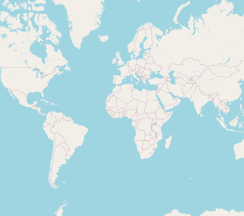
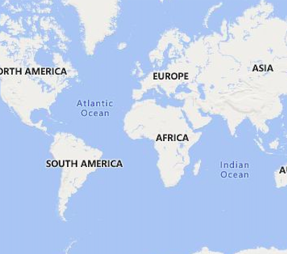
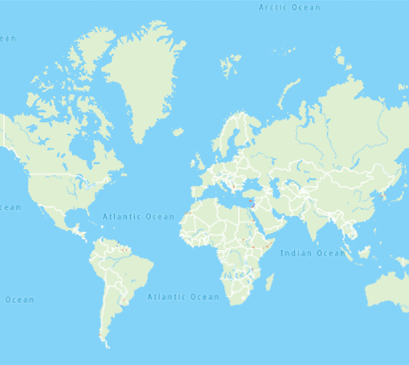
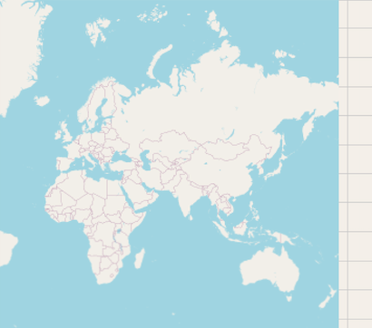
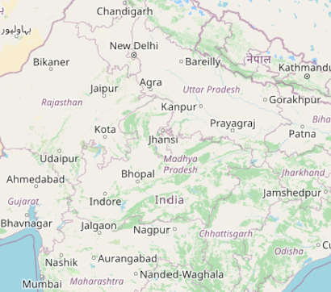

# Tile Layer in Flutter Maps (SfMaps)

The tile layer renders the tiles returned from web map tile services such as Bing Maps, OpenStreetMaps, Google Maps, TomTom, etc.

## Setting URL template

The [`MapTileLayer`](https://pub.dev/documentation/syncfusion_flutter_maps/latest/maps/MapTileLayer-class.html) needs to be added in the [layers](https://pub.dev/documentation/syncfusion_flutter_maps/latest/maps/SfMaps/layers.html) collection in [`SfMaps`](https://pub.dev/documentation/syncfusion_flutter_maps/latest/maps/SfMaps-class.html). The URL of the providers must be set in the [`MapTileLayer.urlTemplate`](https://pub.dev/documentation/syncfusion_flutter_maps/latest/maps/MapTileLayer/urlTemplate.html) property.

The [`urlTemplate`](https://pub.dev/documentation/syncfusion_flutter_maps/latest/maps/MapTileLayer/urlTemplate.html) property accepts the URL in [`WMTS`](https://en.wikipedia.org/wiki/Web_Map_Tile_Service) format i.e. {z} — zoom level, {x} and {y} — tile coordinates. This URL might vary slightly depends on the providers. The formats can be,
    https://example_provider/{z}/{x}/{y}.png,
    https://example_provider/z={z}/x={x}/y={y}.png,
    https://example_provider/z={z}/x={x}/y={y}.png?key=subscription_key, etc.

We will replace the {z}, {x}, {y} internally based on the current focal latitude and longitude and the zoom level.

N> Some of the providers may need subscription key. Please include them in the [`urlTemplate`](https://pub.dev/documentation/syncfusion_flutter_maps/latest/maps/MapTileLayer/urlTemplate.html) itself as mentioned in the above example. Please note that the format may vary between each map providers. You can check the exact URL format needed for the providers on their official websites.

## Adding OSM/OpenStreetMap

The OpenStreetMap is one of the tile/image providers which can be used free of cost. It returns map tiles for the requested coordinates for every requests. The url format of the OSM map provider as shown in the below code snippet.

N> Though the OpenStreetMap is free of cost, we recommend you check the licensing terms and conditions once before using it.




@override
Widget build(BuildContext context) {
    return SfMaps(
        layers: [
            MapTileLayer(
                urlTemplate: 'https://tile.openstreetmap.org/{z}/{x}/{y}.png',
            ),
        ],
    );
}
 



## Adding Bing maps

An additional step is required for the Bing maps. The format of the required URL varies from the other tile services. Hence, we have added a top-level [`getBingUrlTemplate`](https://pub.dev/documentation/syncfusion_flutter_maps/latest/maps/getBingUrlTemplate.html) method which returns the URL in the required format. The subscription key is needed for bing maps. You can create an API key by following the steps mentioned in this [`link`](https://learn.microsoft.com/en-us/bingmaps/getting-started/bing-maps-dev-center-help/getting-a-bing-maps-key) and append this key to the bing map url before pass it to the [`getBingUrlTemplate`](https://pub.dev/documentation/syncfusion_flutter_maps/latest/maps/getBingUrlTemplate.html) method. You can use the URL returned from this method to pass it to the [`urlTemplate`](https://pub.dev/documentation/syncfusion_flutter_maps/latest/maps/MapTileLayer/urlTemplate.html) property.

Some of the providers provide different map types. For example, Bing Maps provide map types like Road, Aerial, AerialWithLabels etc. These types too can be passed in the [`urlTemplate`](https://pub.dev/documentation/syncfusion_flutter_maps/latest/maps/MapTileLayer/urlTemplate.html) itself as shown in the below example. You can check the official websites of the tile providers to know about the available types and the code for it.




@override
Widget build(BuildContext context) {
    return FutureBuilder(
        future: getBingUrlTemplate(
            'https://dev.virtualearth.net/REST/V1/Imagery/Metadata/RoadOnDemand?output=json&uriScheme=https&include=ImageryProviders&key=YOUR_KEY'),
        builder: (context, snapshot) {
            if (snapshot.hasData) {
                return SfMaps(
                    layers: [
                        MapTileLayer(
                            urlTemplate: snapshot.data as String,
                        ),
                    ],
                );
           }
        return CircularProgressIndicator();
        }
    );
}
 



## Other map tile providers

Our tile layer is not limited or specific to any of the tile providers mentioned here. It supports requesting tiles from any of the tile providers using the unique URL for respective tile providers and renders them.

For other map providers like TomTom, MapBox etc., you can check the respective official websites and provide the url in the format mentioned in the [`Setting URL template`](https://help.syncfusion.com/flutter/maps/tile-layer#setting-url-template) section.

Below is the example of adding TomTom map. You can get the TomTom API key from this [`link`](https://developer.tomtom.com/map-display-api/documentation/product-information/introduction).




@override
Widget build(BuildContext context) {
    return SfMaps(
        layers: [
            MapTileLayer(
                urlTemplate: 'http://api.tomtom.com/map/1/tile/basic/main/{z}/{x}/{y}.png?key=subscription_key',
            ),
        ],
    );
}




## Changing the center latitude and longitude

You can set the initial focalLatLng by setting the [`MapTileLayer.initialFocalLatLng`](https://pub.dev/documentation/syncfusion_flutter_maps/latest/maps/MapTileLayer/initialFocalLatLng.html) property. It represents the initial focal latitude and longitude position of the map layer.

Based on the size of the [`SfMaps`](https://pub.dev/documentation/syncfusion_flutter_maps/latest/maps/SfMaps-class.html) widget, [`initialFocalLatLng`](https://pub.dev/documentation/syncfusion_flutter_maps/latest/maps/MapTileLayer/initialFocalLatLng.html) and [`initialZoomLevel`](https://pub.dev/documentation/syncfusion_flutter_maps/latest/maps/MapTileLayer/initialZoomLevel.html) number of initial tiles needed in the view port alone will be rendered. Refer this section for enabling [zooming and panning](https://help.syncfusion.com/flutter/maps/zoom-pan).

This property cannot be changed dynamically. Defaults to `MapLatLng(0.0, 0.0)`.




@override
Widget build(BuildContext context) {
    return SfMaps(
        layers: [
            MapTileLayer(
                urlTemplate: 'https://tile.openstreetmap.org/{z}/{x}/{y}.png',
                initialFocalLatLng: MapLatLng(27.1751, 50.0421),
            ),
        ],
    );
}
 



## Changing the initial zoom level

You can set the initial zoom level by setting the [`MapTileLayer.initialZoomLevel`](https://pub.dev/documentation/syncfusion_flutter_maps/latest/maps/MapTileLayer/initialZoomLevel.html) property. By default, it will be 1. The current zoom level can be obtained from the [MapZoomPanBehavior.zoomLevel](https://pub.dev/documentation/syncfusion_flutter_maps/latest/maps/MapZoomPanBehavior/zoomLevel.html).

This property cannot be changed dynamically.




@override
Widget build(BuildContext context) {
    return SfMaps(
        layers: [
            MapTileLayer(
                urlTemplate: 'https://tile.openstreetmap.org/{z}/{x}/{y}.png',
                initialFocalLatLng: MapLatLng(27.1751, 78.0421),
                initialZoomLevel: 5,
            ),
        ],
    );
}
 



## Markers

You can add markers in the tile layer. The procedure is very similar to the shape layer. Kindly refer the [markers](https://help.syncfusion.com/flutter/maps/markers#adding-markers) section.

N> You can refer to our [Flutter Maps](https://www.syncfusion.com/flutter-widgets/flutter-maps) feature tour page for its groundbreaking feature representations. You can also explore our [Flutter Maps TileLayer example](https://flutter.syncfusion.com/#/maps/tile-layer/openstreetmap) that shows how to configure a Maps in Flutter.