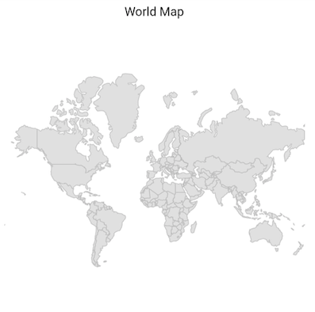
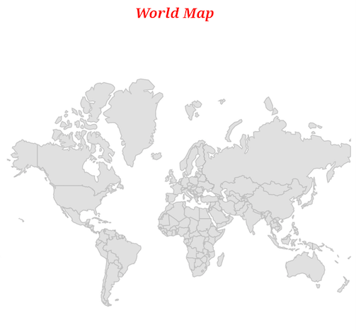
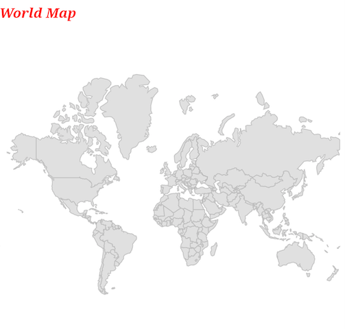
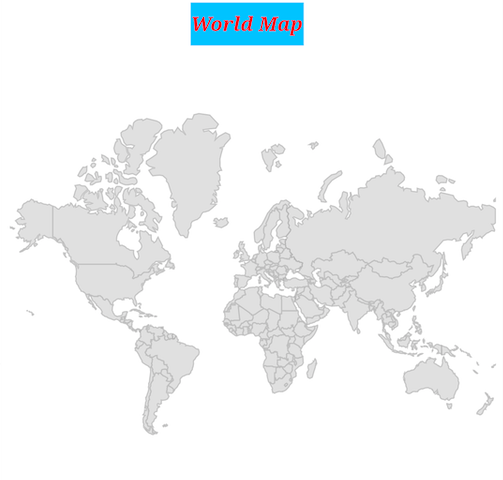
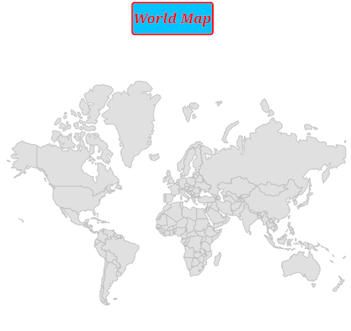
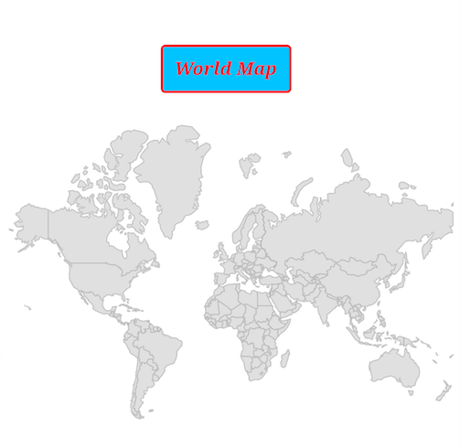
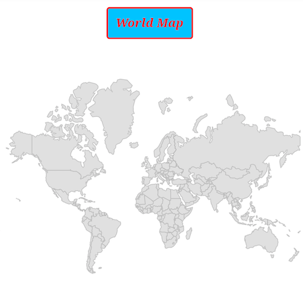

# Title features in Flutter maps

This section helps to learn about how to add title in the maps and customize them.

## Title text

You can define the maps title using [`SfMaps.title`](https://pub.dev/documentation/syncfusion_flutter_maps/latest/maps/SfMaps/title.html) property. You can set the text for the title using the [`MapsTitle.text`](https://pub.dev/documentation/syncfusion_flutter_maps/latest/maps/MapTitle/text.html) property.




MapShapeSource dataSource;

@override
void initState() {
  dataSource = MapShapeSource.asset(
    "assets/world_map.json",
    shapeDataField: "continent",
  );
  super.initState();
}

@override
Widget build(BuildContext context) {
  return Scaffold(
     body: Center(
       child: Container(
         height: 350,
         child: Padding(
           padding: EdgeInsets.only(left: 15, right: 15),
           child: SfMaps(
             title: MapTitle('World Map'),
             layers: [
               MapShapeLayer(
                 source: dataSource,
               ),
             ],
           ),
         ),
       ),
     )
   );
}




## Text style

You can change the style of the title text in the maps using the [`MapsTitle.textStyle`](https://pub.dev/documentation/syncfusion_flutter_maps/latest/maps/MapTitle/textStyle.html) property.




MapShapeSource dataSource;

@override
void initState() {
  dataSource = MapShapeSource.asset(
    "assets/world_map.json",
    shapeDataField: "continent",
  );
  super.initState();
}

@override
Widget build(BuildContext context) {
  return Scaffold(
     body: Center(
       child: Container(
         height: 350,
         child: Padding(
           padding: EdgeInsets.only(left: 15, right: 15),
           child: SfMaps(
             title: MapTitle(
               'World Map',
               textStyle: const TextStyle(
                  color: Colors.red,
                  fontSize: 16,
                  fontWeight: FontWeight.bold,
                  fontStyle: FontStyle.italic,
                  fontFamily: 'Times',
               ),
             ),
             layers: [
               MapShapeLayer(
                 source: dataSource,
               ),
             ],
           ),
         ),
       ),
     )
   );
}




<b>Using SfMapsTheme</b>

You can also change the style of the title text in the maps using the [`SfMapsThemeData.titleTextStyle`](https://pub.dev/documentation/syncfusion_flutter_core/latest/theme/SfMapsThemeData/titleTextStyle.html) property.

N> You must import the `theme.dart` library from the [`Core`](https://pub.dev/packages/syncfusion_flutter_core) package to use [`SfMapsTheme`](https://pub.dev/documentation/syncfusion_flutter_core/latest/theme/SfMapsTheme-class.html).




MapShapeSource dataSource;

@override
void initState() {
  dataSource = MapShapeSource.asset(
    "assets/world_map.json",
    shapeDataField: "continent",
  );
  super.initState();
}

@override
Widget build(BuildContext context) {
  return Scaffold(
    body: Center(
      child: Container(
        height: 350,
        child: Padding(
          padding: EdgeInsets.only(left: 15, right: 15),
          child: SfMapsTheme(
            data: SfMapsThemeData(
              titleTextStyle: const TextStyle(
                color: Colors.red,
                fontSize: 16,
                fontWeight: FontWeight.bold,
                fontStyle: FontStyle.italic,
                fontFamily: 'Times'),
              ),
            child: SfMaps(
              title: MapTitle('World Map'),
              layers: [
                 MapShapeLayer(source: dataSource),
               ],
            ),
          ),
        ),
      ),
    ),
  );
}




## Text alignment

You can align the title text in the maps using the [`MapsTitle.alignment`](https://pub.dev/documentation/syncfusion_flutter_maps/latest/maps/MapTitle/alignment.html) property. By default, the alignment will be center. You can also align the text in the available alignment options in [`Alignment`](https://api.flutter.dev/flutter/painting/Alignment-class.html).




MapShapeSource dataSource;

@override
void initState() {
  dataSource = MapShapeSource.asset(
    "assets/world_map.json",
    shapeDataField: "continent",
  );
  super.initState();
}

@override
Widget build(BuildContext context) {
  return Scaffold(
     body: Center(
       child: Container(
         height: 350,
         child: Padding(
           padding: EdgeInsets.only(left: 15, right: 15),
           child: SfMaps(
             title: MapTitle(
               'World Map',
               textStyle: const TextStyle(
                  color: Colors.red,
                  fontSize: 16,
                  fontWeight: FontWeight.bold,
                  fontStyle: FontStyle.italic,
                  fontFamily: 'Times',
               ),
               alignment: Alignment.centerLeft,
             ),
             layers: [
               MapShapeLayer(
                 source: dataSource,
               ),
             ],
           ),
         ),
       ),
     )
   );
}




## Background color

You can change the background color of the title in the maps using the [`MapsTitle.color`](https://pub.dev/documentation/syncfusion_flutter_maps/latest/maps/MapTitle/color.html).




MapShapeSource dataSource;

@override
void initState() {
  dataSource = MapShapeSource.asset(
    "assets/world_map.json",
    shapeDataField: "continent",
  );
  super.initState();
}

@override
Widget build(BuildContext context) {
  return Scaffold(
     body: Center(
       child: Container(
         height: 350,
         child: Padding(
           padding: EdgeInsets.only(left: 15, right: 15),
           child: SfMaps(
             title: MapTitle(
               'World Map',
               textStyle: const TextStyle(
                  color: Colors.red,
                  fontSize: 16,
                  fontWeight: FontWeight.bold,
                  fontStyle: FontStyle.italic,
                  fontFamily: 'Times',
               ),
               color: Colors.lightBlueAccent,
             ),
             layers: [
               MapShapeLayer(
                 source: dataSource,
               ),
             ],
           ),
         ),
       ),
     )
   );
}




## Decoration

You can decorate the title of maps using the [`MapsTitle.decoration`](https://pub.dev/documentation/syncfusion_flutter_maps/latest/maps/MapTitle/decoration.html) property. You can use [`BoxDecoration`](https://api.flutter.dev/flutter/painting/BoxDecoration-class.html), [`ShapeDecoration`](https://api.flutter.dev/flutter/painting/ShapeDecoration-class.html) or create a custom [`Decoration`](https://api.flutter.dev/flutter/painting/Decoration-class.html).




MapShapeSource dataSource;

@override
void initState() {
  dataSource = MapShapeSource.asset(
    "assets/world_map.json",
    shapeDataField: "continent",
  );
  super.initState();
}

@override
Widget build(BuildContext context) {
    return Scaffold(
      body: Center(
        child: Container(
          height: 350,
          child: Padding(
            padding: EdgeInsets.only(left: 15, right: 15),
            child: SfMaps(
              title: MapTitle(
                'World Map',
                textStyle: const TextStyle(
                    color: Colors.red,
                    fontSize: 16,
                    fontWeight: FontWeight.bold,
                    fontStyle: FontStyle.italic,
                    fontFamily: 'Times'
                ),
                decoration: BoxDecoration(
                  color: Colors.lightBlueAccent,
                  border: Border.all(color: Colors.red, width: 2),
                  borderRadius: const BorderRadius.all(Radius.circular(4)),
                  shape: BoxShape.rectangle,
                ),
              ),
              layers: [
                MapShapeLayer(
                  source: dataSource,
                ),
              ],
            ),
          ),
        ),
      ),
   );
}




## Margin

You can add margin to the maps title using the `MapsTitle.margin` property.




MapShapeSource dataSource;

@override
void initState() {
  dataSource = MapShapeSource.asset(
    "assets/world_map.json",
    shapeDataField: "continent",
  );
  super.initState();
}

@override
Widget build(BuildContext context) {
    return Scaffold(
      body: Center(
        child: Container(
          height: 350,
          child: Padding(
            padding: EdgeInsets.only(left: 15, right: 15),
            child: SfMaps(
              title: MapTitle(
                'World Map',
                textStyle: const TextStyle(
                    color: Colors.red,
                    fontSize: 16,
                    fontWeight: FontWeight.bold,
                    fontStyle: FontStyle.italic,
                    fontFamily: 'Times'
                ),
                margin: const EdgeInsets.only(top: 50),
                decoration: BoxDecoration(
                  color: Colors.lightBlueAccent,
                  border: Border.all(color: Colors.red, width: 2),
                  borderRadius: const BorderRadius.all(Radius.circular(4)),
                  shape: BoxShape.rectangle,
                ),
              ),
              layers: [
                MapShapeLayer(
                  source: dataSource,
                ),
              ],
            ),
          ),
        ),
      ),
   );
}




## Padding

You can add padding to the maps title using the [`MapsTitle.padding`](https://pub.dev/documentation/syncfusion_flutter_maps/latest/maps/MapTitle/padding.html) property.




MapShapeSource dataSource;

@override
void initState() {
  dataSource = MapShapeSource.asset(
    "assets/world_map.json",
    shapeDataField: "continent",
  );
  super.initState();
}

@override
Widget build(BuildContext context) {
    return Scaffold(
      body: Center(
        child: Container(
          height: 350,
          child: Padding(
            padding: EdgeInsets.only(left: 15, right: 15),
            child: SfMaps(
              title: MapTitle(
                'World Map',
                textStyle: const TextStyle(
                    color: Colors.red,
                    fontSize: 16,
                    fontWeight: FontWeight.bold,
                    fontStyle: FontStyle.italic,
                    fontFamily: 'Times'
                ),
                margin: const EdgeInsets.all(10),
                padding: const EdgeInsets.all(10),
                decoration: BoxDecoration(
                  color: Colors.lightBlueAccent,
                  border: Border.all(color: Colors.red, width: 2),
                  borderRadius: const BorderRadius.all(Radius.circular(4)),
                  shape: BoxShape.rectangle,
                ),
              ),
              layers: [
                MapShapeLayer(
                  source: dataSource,
                ),
              ],
            ),
          ),
        ),
      ),
   );
}




